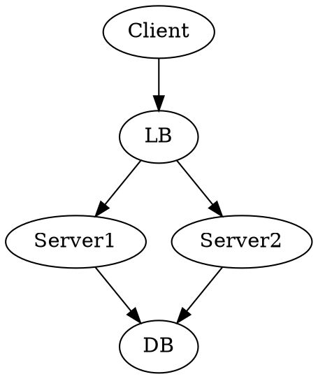
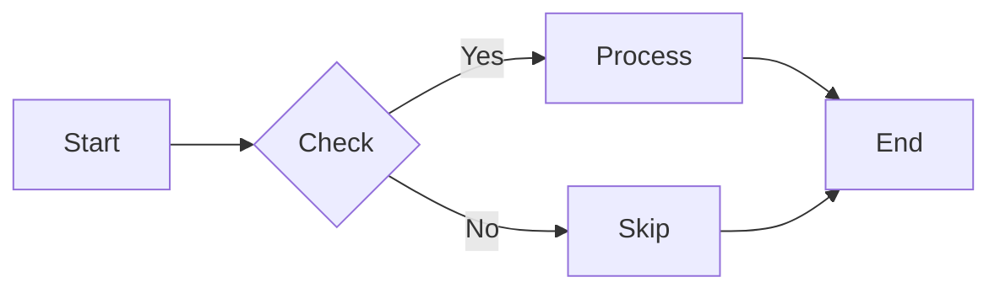

# ASCII Diagrams in Karl

> "A picture is worth a thousand tokens" - Karl, probably

Karl can generate beautiful ASCII diagrams to explain code, architecture, and flows. Because sometimes you need to *see* the ace before you serve it.

## When Diagrams Help

### Perfect Use Cases
- **Architecture Overview**: System components and their relationships
- **Data Flow**: How information moves through your system
- **Dependencies**: Package/module relationships and dependency graphs
- **State Machines**: State transitions and business logic
- **API Flows**: Request/response patterns and authentication flows
- **Database Schemas**: Table relationships and ER diagrams
- **Network Topology**: Service communication patterns
- **Call Hierarchies**: Function call trees and execution paths
- **Decision Trees**: Conditional logic and branching
- **Timeline/Sequence**: Step-by-step interactions between components

### When NOT to Use Diagrams
- Simple linear lists (just use bullets)
- Single relationships (prose is clearer)
- Highly complex graphs (too messy in ASCII)
- When you need exact measurements or scale

## Box Drawing Characters

### Unicode Box Drawing Set
```
┌─┬─┐  ╔═╦═╗  ╭─┬─╮  ┏━┳━┓
├─┼─┤  ╠═╬═╣  ├─┼─┤  ┡━╇━┩
└─┴─┘  ╚═╩═╝  ╰─┴─╯  └─┴─┘

│ ║ ┃  Vertical lines
─ ═ ━  Horizontal lines
┼ ╬ ╋  Intersections

Single: ─ │ ┌ ┐ └ ┘ ├ ┤ ┬ ┴ ┼
Double: ═ ║ ╔ ╗ ╚ ╝ ╠ ╣ ╦ ╩ ╬
Heavy:  ━ ┃ ┏ ┓ ┗ ┛ ┣ ┫ ┳ ┻ ╋
Rounded: ─ │ ╭ ╮ ╰ ╯
```

### Arrows and Connectors
```
→ ← ↑ ↓ ↔ ↕ ↖ ↗ ↘ ↙
⇒ ⇐ ⇑ ⇓ ⇔ ⇕
⟶ ⟵ ⟷
➜ ➔ ➙ ➛ ➞
▲ ▼ ◀ ▶ ◆ ●
```

### Special Characters
```
┊ ┆ ┋ ╎  Dashed lines
╌ ╍ ┄ ┅ ┈ ┉  Dashed horizontal
─ ╴ ╶ ╸  Line fragments
```

## ASCII Diagram Libraries & Tools

### Graph-viz Style (DOT-like)
Karl can understand DOT-like syntax and render it as ASCII:



Renders as:
```
┌────────┐
│ Client │
└───┬────┘
    │
    ↓
┌───┴────┐
│   LB   │
└─┬────┬─┘
  │    │
  ↓    ↓
┌─┴──┐ ┌┴───┐
│ S1 │ │ S2 │
└─┬──┘ └┬───┘
  │     │
  └─┬───┘
    ↓
  ┌──┴─┐
  │ DB │
  └────┘
```

### Mermaid-Inspired Syntax


### PlantUML-Style Sequence
```
@startuml
Client -> API: POST /auth
API -> DB: Validate
DB -> API: OK
API -> Client: Token
@enduml
```

## Flow Charts

### Simple Flow
```
                 ┌─────────┐
                 │  Start  │
                 └────┬────┘
                      │
                      ↓
              ┌───────┴────────┐
              │ Initialize App │
              └───────┬────────┘
                      │
                      ↓
              ┌───────┴────────┐
         ┌────┤  Auth Check?   │
         │    └────────────────┘
         │No           │ Yes
         ↓             ↓
    ┌────┴─────┐  ┌───┴──────┐
    │  Login   │  │  Dashboard│
    └────┬─────┘  └───┬──────┘
         │            │
         └─────┬──────┘
               ↓
          ┌────┴────┐
          │   End   │
          └─────────┘
```

### Decision Tree
```
                    ┌──────────────┐
                    │ HTTP Request │
                    └──────┬───────┘
                           │
              ┌────────────┼────────────┐
              │            │            │
         ┌────┴───┐   ┌────┴───┐  ┌────┴───┐
         │  GET   │   │  POST  │  │ DELETE │
         └────┬───┘   └────┬───┘  └────┬───┘
              │            │            │
         ┌────┴───┐   ┌────┴───┐  ┌────┴───┐
         │ Fetch  │   │ Create │  │ Remove │
         └────┬───┘   └────┬───┘  └────┬───┘
              │            │            │
              └────────────┼────────────┘
                           │
                      ┌────┴────┐
                      │ Response│
                      └─────────┘
```

### State Machine
```
              ┌──────────┐
         ┌───→│   Idle   │←──────┐
         │    └────┬─────┘       │
         │         │ start       │
         │         ↓             │
         │    ┌────┴──────┐      │
    done │    │  Running  │      │ cancel
         │    └────┬──────┘      │
         │         │ pause       │
         │         ↓             │
         │    ┌────┴──────┐      │
         └────│  Paused   │──────┘
              └───────────┘
```

## Sequence Diagrams

### Basic Sequence
```
  Client          API           Database        Cache
    │              │                │             │
    │─── POST ────→│                │             │
    │              │                │             │
    │              │─── SELECT ────→│             │
    │              │←─── NULL ──────│             │
    │              │                │             │
    │              │─────── GET ───────────────→  │
    │              │←────── MISS ─────────────────│
    │              │                │             │
    │              │─── INSERT ────→│             │
    │              │←─── OK ────────│             │
    │              │                │             │
    │              │─────── SET ───────────────→  │
    │              │                │             │
    │←─── 201 ─────│                │             │
    │              │                │             │
```

### Authentication Flow
```
 Browser      Frontend       API Gateway      Auth Service      Database
    │             │               │                 │              │
    │── Login ───→│               │                 │              │
    │             │               │                 │              │
    │             │─ POST /auth ─→│                 │              │
    │             │               │                 │              │
    │             │               │─ Validate ─────→│              │
    │             │               │                 │              │
    │             │               │                 │─ Query ─────→│
    │             │               │                 │←── User ─────│
    │             │               │                 │              │
    │             │               │                 │─ bcrypt ─┐   │
    │             │               │                 │          │   │
    │             │               │                 │←─────────┘   │
    │             │               │                 │              │
    │             │               │← JWT Token ─────│              │
    │             │               │                 │              │
    │             │←─── 200 ──────│                 │              │
    │             │   + token     │                 │              │
    │             │               │                 │              │
    │←── Cookie ──│               │                 │              │
    │             │               │                 │              │
```

### Error Handling
```
  Service A     Service B     Circuit Breaker
      │             │                │
      │─── Call ───→│                │
      │             ×                │  (timeout)
      │             │                │
      │←─ Error ────│                │
      │             │                │
      │─── Call ───────────────────→ │
      │             │                │
      │             │                │  [record failure]
      │←────────── Error ────────────│
      │             │                │
      │─── Call ───────────────────→ │
      │             │                │  [threshold reached]
      │←────────── OPEN ─────────────│
      │             │                │
      │             │                │  [wait timeout]
      │             │                │
      │─── Call ───────────────────→ │
      │             │                │  [half-open: try]
      │             │                │
      │             │←───────────────│
      │             │                │
      │             │─── Success ───→│
      │             │                │  [close circuit]
      │←─────────── OK ──────────────│
      │             │                │
```

## Architecture Diagrams

### Microservices Architecture
```
┌─────────────────────────────────────────────────────────────┐
│                         Frontend                            │
│  ┌──────────┐  ┌──────────┐  ┌──────────┐                  │
│  │   React  │  │   Vue    │  │  Mobile  │                  │
│  └─────┬────┘  └─────┬────┘  └─────┬────┘                  │
└────────┼─────────────┼─────────────┼────────────────────────┘
         │             │             │
         └─────────────┼─────────────┘
                       │
         ┌─────────────┴─────────────┐
         │      API Gateway          │
         │    (Kong/Ambassador)      │
         └─────────────┬─────────────┘
                       │
         ┌─────────────┼─────────────┬─────────────┐
         │             │             │             │
    ┌────┴────┐   ┌────┴────┐   ┌────┴────┐  ┌────┴────┐
    │  Auth   │   │  Users  │   │ Orders  │  │Payments │
    │ Service │   │ Service │   │ Service │  │ Service │
    └────┬────┘   └────┬────┘   └────┬────┘  └────┬────┘
         │             │             │             │
    ┌────┴────┐   ┌────┴────┐   ┌────┴────┐  ┌────┴────┐
    │  Auth   │   │  Users  │   │ Orders  │  │Payments │
    │   DB    │   │   DB    │   │   DB    │  │   DB    │
    └─────────┘   └─────────┘   └─────────┘  └─────────┘
         │             │             │             │
         └─────────────┼─────────────┼─────────────┘
                       │             │
                  ┌────┴────┐   ┌────┴────┐
                  │  Redis  │   │ RabbitMQ│
                  │  Cache  │   │  Queue  │
                  └─────────┘   └─────────┘
```

### Three-Tier Architecture
```
╔═══════════════════════════════════════════════════════════╗
║                    Presentation Layer                     ║
║  ┌─────────────┐  ┌─────────────┐  ┌─────────────┐       ║
║  │  Web Client │  │   Mobile    │  │     API     │       ║
║  └─────────────┘  └─────────────┘  └─────────────┘       ║
╚════════════════════════════┬══════════════════════════════╝
                             │
╔════════════════════════════┴══════════════════════════════╗
║                     Business Layer                        ║
║  ┌──────────────────────────────────────────────────┐     ║
║  │              Application Server                  │     ║
║  │  ┌─────────┐  ┌─────────┐  ┌─────────┐          │     ║
║  │  │Business │  │  Rules  │  │  Logic  │          │     ║
║  │  │ Service │  │ Engine  │  │ Handlers│          │     ║
║  │  └─────────┘  └─────────┘  └─────────┘          │     ║
║  └──────────────────────────────────────────────────┘     ║
╚════════════════════════════┬══════════════════════════════╝
                             │
╔════════════════════════════┴══════════════════════════════╗
║                      Data Layer                           ║
║  ┌──────────────┐  ┌──────────────┐  ┌──────────────┐    ║
║  │   PostgreSQL │  │    Redis     │  │  S3 Storage  │    ║
║  │   (Primary)  │  │   (Cache)    │  │   (Files)    │    ║
║  └──────────────┘  └──────────────┘  └──────────────┘    ║
╚═══════════════════════════════════════════════════════════╝
```

### Event-Driven Architecture
```
                    ┌─────────────────┐
                    │  Event Producer │
                    │   (API/Service) │
                    └────────┬────────┘
                             │ publish
                             ↓
         ┌───────────────────┴───────────────────┐
         │         Event Bus (Kafka/NATS)        │
         │  Topics: [user.*, order.*, payment.*] │
         └───────────────────┬───────────────────┘
                             │ subscribe
              ┌──────────────┼──────────────┐
              │              │              │
         ┌────┴────┐    ┌────┴────┐    ┌────┴────┐
         │Consumer │    │Consumer │    │Consumer │
         │   #1    │    │   #2    │    │   #3    │
         └────┬────┘    └────┬────┘    └────┬────┘
              │              │              │
         ┌────┴────┐    ┌────┴────┐    ┌────┴────┐
         │Analytics│    │  Email  │    │ Webhook │
         │ Service │    │ Service │    │ Service │
         └─────────┘    └─────────┘    └─────────┘
```

## Directory Trees

### Project Structure
```
my-app/
├── src/
│   ├── components/
│   │   ├── Button.tsx
│   │   ├── Card.tsx
│   │   └── Layout/
│   │       ├── Header.tsx
│   │       └── Footer.tsx
│   ├── pages/
│   │   ├── index.tsx
│   │   ├── about.tsx
│   │   └── api/
│   │       └── users.ts
│   ├── lib/
│   │   ├── db.ts
│   │   └── utils.ts
│   └── styles/
│       └── globals.css
├── public/
│   ├── images/
│   └── favicon.ico
├── tests/
│   ├── unit/
│   └── e2e/
├── .env.local
├── package.json
├── tsconfig.json
└── README.md
```

### Monorepo Structure
```
workspace/
├── packages/
│   ├── @company/ui/
│   │   ├── src/
│   │   ├── package.json
│   │   └── tsconfig.json
│   ├── @company/api/
│   │   ├── src/
│   │   ├── package.json
│   │   └── tsconfig.json
│   └── @company/shared/
│       ├── src/
│       ├── package.json
│       └── tsconfig.json
├── apps/
│   ├── web/
│   │   └── (Next.js app)
│   └── mobile/
│       └── (React Native)
├── tools/
│   └── scripts/
├── package.json
├── turbo.json
└── pnpm-workspace.yaml
```

### Dependency Tree
```
app
├─┬ express@4.18.2
│ ├─┬ body-parser@1.20.1
│ │ └── raw-body@2.5.1
│ ├─┬ accepts@1.3.8
│ │ ├── mime-types@2.1.35
│ │ └── negotiator@0.6.3
│ └── cookie@0.5.0
├─┬ prisma@5.0.0
│ └── @prisma/client@5.0.0
└─┬ react@18.2.0
  └── loose-envify@1.4.0
```

## Network Diagrams

### Network Topology
```
                        Internet
                           │
                           │
                    ┌──────┴──────┐
                    │   Firewall  │
                    └──────┬──────┘
                           │
              ┌────────────┴────────────┐
              │     Load Balancer       │
              │    (10.0.1.10)          │
              └────────────┬────────────┘
                           │
         ┌─────────────────┼─────────────────┐
         │                 │                 │
    ┌────┴────┐       ┌────┴────┐      ┌────┴────┐
    │  Web1   │       │  Web2   │      │  Web3   │
    │10.0.2.1 │       │10.0.2.2 │      │10.0.2.3 │
    └────┬────┘       └────┬────┘      └────┬────┘
         │                 │                 │
         └─────────────────┼─────────────────┘
                           │
                      ┌────┴────┐
                      │   DB    │
                      │10.0.3.1 │
                      └─────────┘
```

### Kubernetes Cluster
```
┌─────────────────── Kubernetes Cluster ────────────────────┐
│                                                            │
│  ┌──────────────────── Namespace: prod ────────────────┐  │
│  │                                                      │  │
│  │  ┌─────────── Deployment: api ──────────┐           │  │
│  │  │                                       │           │  │
│  │  │  ┌─────┐  ┌─────┐  ┌─────┐           │           │  │
│  │  │  │ Pod │  │ Pod │  │ Pod │           │           │  │
│  │  │  └──┬──┘  └──┬──┘  └──┬──┘           │           │  │
│  │  └─────┼────────┼────────┼──────────────┘           │  │
│  │        │        │        │                           │  │
│  │        └────────┼────────┘                           │  │
│  │                 │                                    │  │
│  │          ┌──────┴──────┐                             │  │
│  │          │   Service   │                             │  │
│  │          │ (ClusterIP) │                             │  │
│  │          └──────┬──────┘                             │  │
│  │                 │                                    │  │
│  └─────────────────┼────────────────────────────────────┘  │
│                    │                                       │
│            ┌───────┴────────┐                              │
│            │    Ingress     │                              │
│            │  (nginx/kong)  │                              │
│            └───────┬────────┘                              │
└────────────────────┼───────────────────────────────────────┘
                     │
                  External
```

## Data Structure Diagrams

### Class/Entity Relationship
```
┌─────────────────────┐
│       User          │
├─────────────────────┤
│ - id: string        │
│ - email: string     │
│ - name: string      │
│ - createdAt: Date   │
├─────────────────────┤
│ + login()           │
│ + logout()          │
│ + updateProfile()   │
└──────────┬──────────┘
           │ 1
           │
           │ has many
           │
           │ *
┌──────────┴──────────┐
│       Post          │
├─────────────────────┤
│ - id: string        │
│ - title: string     │
│ - content: string   │
│ - userId: string    │───────┐
│ - published: bool   │       │ belongs to
├─────────────────────┤       │
│ + publish()         │       │
│ + delete()          │       │
└──────────┬──────────┘       │
           │ *                │
           │                  │
           │ has many         │
           │                  │
           │ *                │ 1
┌──────────┴──────────┐       │
│      Comment        │       │
├─────────────────────┤       │
│ - id: string        │       │
│ - text: string      │       │
│ - postId: string    │───────┘
│ - userId: string    │───────┐
├─────────────────────┤       │ belongs to
│ + edit()            │       │
│ + delete()          │       │
└─────────────────────┘       │ 1
                              │
           ┌──────────────────┘
           │
```

### Database Schema
```
┌─────────────────────────────────────────────────────────────┐
│                         Database                            │
├─────────────────────────────────────────────────────────────┤
│                                                             │
│  ╔═══════════════╗           ╔═══════════════╗             │
│  ║    users      ║           ║    posts      ║             │
│  ╠═══════════════╣           ╠═══════════════╣             │
│  ║ 🔑 id         ║           ║ 🔑 id         ║             │
│  ║   email       ║──────┐    ║ 🔗 user_id    ║             │
│  ║   password    ║      │    ║   title       ║             │
│  ║   created_at  ║      │    ║   content     ║             │
│  ╚═══════════════╝      │    ║   created_at  ║             │
│                         │    ╚═══════════════╝             │
│                         │            │                     │
│                         └────────────┤                     │
│                                      │                     │
│  ╔═══════════════╗                   │                     │
│  ║   profiles    ║                   │                     │
│  ╠═══════════════╣                   │                     │
│  ║ 🔑 id         ║                   │                     │
│  ║ 🔗 user_id    ║                   │                     │
│  ║   avatar      ║                   │                     │
│  ║   bio         ║                   │                     │
│  ╚═══════════════╝                   │                     │
│                                      │                     │
│  ╔═══════════════╗                   │                     │
│  ║   comments    ║                   │                     │
│  ╠═══════════════╣                   │                     │
│  ║ 🔑 id         ║                   │                     │
│  ║ 🔗 post_id    ║───────────────────┘                     │
│  ║ 🔗 user_id    ║───────────────────────────┐             │
│  ║   text        ║                           │             │
│  ║   created_at  ║                           │             │
│  ╚═══════════════╝                           │             │
│                                              │             │
└──────────────────────────────────────────────┼─────────────┘
                                               │
                      ┌────────────────────────┘
                      │
       Legend:  🔑 Primary Key    🔗 Foreign Key
```

## Integration: `karl diagram` Command

### Command Interface
```bash
# Generate diagram from description
karl diagram "show auth flow"

# Generate from file
karl diagram --input flow.txt --type sequence

# Interactive mode
karl diagram --interactive

# Pipe to file
karl diagram "microservices architecture" > arch.txt

# Combine with other commands
karl explain api.ts | karl diagram --extract-flow

# Different formats
karl diagram "user flow" --style boxes    # Default
karl diagram "user flow" --style minimal  # ASCII only
karl diagram "user flow" --style unicode  # Full unicode
```

### Example Usage

```bash
$ karl diagram "show JWT authentication flow"
```

Output:
```
  Client          API           Auth Service      Database
    │              │                 │              │
    │─ POST ──────→│                 │              │
    │  /login      │                 │              │
    │              │                 │              │
    │              │─ Validate ─────→│              │
    │              │                 │              │
    │              │                 │─ Query ─────→│
    │              │                 │←─ User ──────│
    │              │                 │              │
    │              │                 │─ Compare ─┐  │
    │              │                 │  password │  │
    │              │                 │←──────────┘  │
    │              │                 │              │
    │              │                 │─ Generate ─┐ │
    │              │                 │  JWT token │ │
    │              │                 │←───────────┘ │
    │              │                 │              │
    │              │←─ Token ────────│              │
    │              │                 │              │
    │← 200 ────────│                 │              │
    │  + JWT       │                 │              │
    │              │                 │              │
```

### Skill-Based Diagram Generation

Karl could have diagram-specific skills:

```bash
# Load architecture diagram skill
karl --skill diagrams/architecture explain "our microservices setup"

# Load sequence diagram skill  
karl --skill diagrams/sequence explain "how oauth works"

# Load ERD skill
karl --skill diagrams/database show schema.sql
```

## Piping Diagrams

### To Documentation
```bash
# Add to markdown
karl diagram "api flow" >> docs/architecture.md

# Convert to image (via external tool)
karl diagram "system architecture" | graph-easy --as=boxart

# Send to clipboard (macOS)
karl diagram "database schema" | pbcopy

# Preview in browser
karl diagram "flow" | markdown-preview
```

### From Other Tools
```bash
# From dependency tree
npm ls --all | karl "convert to dependency diagram"

# From git log
git log --graph --oneline | karl "visualize as timeline"

# From netstat
netstat -an | karl "show network connections as diagram"

# From process tree
ps auxf | karl "diagram process hierarchy"
```

### Chain with Other Commands
```bash
# Analyze then diagram
karl analyze app/ --dependencies | karl diagram --type graph

# Explain then visualize
karl explain auth.ts | karl diagram --extract-sequence

# Test flow visualization
karl test --trace | karl diagram --type flow
```

## Beautiful ASCII Diagram Examples

### The Tennis Court (Karl's Signature)
```
                    ╔═══════════════════════════╗
                    ║     The Karl Court        ║
                    ╠═══════════════════════════╣
                    ║                           ║
   ┌────────────────╬─────── Net ───────────────╬────────────────┐
   │  User Input    ║           │               ║   AI Response  │
   │                ║           │               ║                │
   │   ╭─────╮      ║           │               ║      ╭─────╮   │
   │   │ 🎾  │ ───→ ║           │               ║  ←── │ 🎾  │   │
   │   ╰─────╯      ║    Serve  │  Ace!         ║      ╰─────╯   │
   │                ║           │               ║                │
   │  [Baseline]    ║           │               ║    [Baseline]  │
   └────────────────╬───────────┼───────────────╬────────────────┘
                    ║                           ║
                    ║   One-shot completion     ║
                    ╚═══════════════════════════╝
```

### Pipeline Flow (Unix Philosophy)
```
                  ╔══════════════════════════════╗
                  ║   Unix Pipeline Philosophy   ║
                  ╚══════════════════════════════╝

┌──────────┐      ┌──────────┐      ┌──────────┐      ┌──────────┐
│  Input   │─────→│  Filter  │─────→│Transform │─────→│  Output  │
│  Stream  │ data │  (grep)  │ data │  (awk)   │ data │  Stream  │
└──────────┘      └──────────┘      └──────────┘      └──────────┘
     ↓                 ↓                 ↓                 ↓
  stdin            process          process            stdout
                      │                 │
                      ↓                 ↓
                 [Transform]       [Aggregate]
```

### Layered Architecture (Beautiful Boxes)
```
╔═════════════════════════════════════════════════════════════════╗
║                      🌐 Presentation Layer                      ║
║  ┏━━━━━━━━━━━━━━┓  ┏━━━━━━━━━━━━━━┓  ┏━━━━━━━━━━━━━━┓          ║
║  ┃  React SPA   ┃  ┃  Mobile App  ┃  ┃   REST API   ┃          ║
║  ┗━━━━━━━━━━━━━━┛  ┗━━━━━━━━━━━━━━┛  ┗━━━━━━━━━━━━━━┛          ║
╚═══════════════════════════════════╦═════════════════════════════╝
                                    ║
╔═══════════════════════════════════╩═════════════════════════════╗
║                      ⚙️  Business Logic Layer                    ║
║  ┌──────────────────────────────────────────────────────────┐   ║
║  │  Domain Models  │  Services  │  Validators  │  Rules    │   ║
║  └──────────────────────────────────────────────────────────┘   ║
╚═══════════════════════════════════╦═════════════════════════════╝
                                    ║
╔═══════════════════════════════════╩═════════════════════════════╗
║                      💾 Data Access Layer                       ║
║  ┌──────────────┐  ┌──────────────┐  ┌──────────────┐          ║
║  │ Repositories │  │     ORM      │  │    Caching   │          ║
║  └──────────────┘  └──────────────┘  └──────────────┘          ║
╚═══════════════════════════════════╦═════════════════════════════╝
                                    ║
╔═══════════════════════════════════╩═════════════════════════════╗
║                      🗄️  Infrastructure Layer                    ║
║  [ PostgreSQL ]  [ Redis ]  [ S3 ]  [ Message Queue ]          ║
╚═════════════════════════════════════════════════════════════════╝
```

### Git Branch Flow
```
                    Feature Development Flow

master    ●─────●─────────────●─────────●────────→
           ╲     ╲             ↑         ↑
            ╲     ╲            │         │
             ╲     ╲         merge     merge
              ╲     ╲          │         │
develop        ●─────●────●────●────●────●────●──→
                ╲         ↑         ╲
                 ╲        │          ╲
               feature   merge      feature
                  ╲       │           ╲
feature/A          ●──●───●            ╲
                                       ╲
feature/B                               ●──●───●
                                              ↑
                                           merge
                                         (pending)
```

### Circuit Breaker States
```
        ┌─────────────────────────────────────────┐
        │         Circuit Breaker States          │
        └─────────────────────────────────────────┘

                    ┏━━━━━━━━━━┓
               ┌───→┃  CLOSED  ┃←──────────┐
               │    ┗━━━━━━━━━━┛           │
               │         │                 │
               │         │ failures        │
         reset │         │ exceed          │ success
      (manual) │         │ threshold       │  count
               │         ↓                 │ exceeds
               │    ┏━━━━━━━━━━┓           │ threshold
               │    ┃   OPEN   ┃           │
               │    ┗━━━━━━━━━━┛           │
               │         │                 │
               │         │ timeout         │
               │         │ expires         │
               │         ↓                 │
               │    ┏━━━━━━━━━━┓           │
               └────┃ HALF_OPEN┃───────────┘
                    ┗━━━━━━━━━━┛
                         │
                         │ failures
                         │ occur
                         ↓
                    ┏━━━━━━━━━━┓
                    ┃   OPEN   ┃
                    ┗━━━━━━━━━━┛
```

### Request/Response Lifecycle
```
┏━━━━━━━━━━━━━━━━━━━━━━━━━━━━━━━━━━━━━━━━━━━━━━━━━━━━━━━━━━━━┓
┃  HTTP Request Lifecycle                                    ┃
┗━━━━━━━━━━━━━━━━━━━━━━━━━━━━━━━━━━━━━━━━━━━━━━━━━━━━━━━━━━━━┛

┌─────────┐
│ Request │  GET /api/users/123
└────┬────┘
     │
     ↓
╔════╧════════════════════════╗
║    Middleware Pipeline      ║
╟─────────────────────────────╢
║  1. ✓ CORS                  ║
║  2. ✓ Authentication        ║
║  3. ✓ Rate Limiting         ║
║  4. ✓ Body Parsing          ║
║  5. ✓ Validation            ║
╚════╤════════════════════════╝
     │
     ↓
┌────┴─────┐
│ Router   │  Match route → /api/users/:id
└────┬─────┘
     │
     ↓
┌────┴──────────┐
│  Controller   │  getUserById(id: 123)
└────┬──────────┘
     │
     ↓
┌────┴──────┐
│  Service  │  userService.findOne(123)
└────┬──────┘
     │
     ↓
┌────┴────────┐
│ Repository  │  SELECT * FROM users WHERE id=123
└────┬────────┘
     │
     ↓
┌────┴─────┐
│ Database │  ████████ Query
└────┬─────┘
     │
     ↓
┌────┴────────┐
│ Transform   │  DTO → JSON
└────┬────────┘
     │
     ↓
┌────┴────┐
│Response │  200 OK { "user": {...} }
└─────────┘
```

### Dependency Graph
```
                    ┌──────────────┐
                    │     App      │
                    └───────┬──────┘
                            │
              ┌─────────────┼─────────────┐
              │             │             │
         ┌────┴────┐   ┌────┴────┐   ┌────┴────┐
         │  Auth   │   │   API   │   │   UI    │
         └────┬────┘   └────┬────┘   └────┬────┘
              │             │             │
         ┌────┴────┐   ┌────┴────┐   ┌────┴────┐
         │  JWT    │   │ Express │   │  React  │
         └─────────┘   └────┬────┘   └────┬────┘
                            │             │
                       ┌────┴────┐   ┌────┴────┐
                       │BodyPrsr │   │ ReactDOM│
                       └─────────┘   └─────────┘

         Legend:  ─┬─  depends on
                   │
                   ↓   imports
```

### Cache Hierarchy
```
                      ┌─────────────┐
                      │   Request   │
                      └──────┬──────┘
                             │
                    ┌────────▼────────┐
                    │  L1: Browser    │  〈 ~10ms 〉
                    │  Cache          │
                    └────────┬────────┘
                             │ miss
                    ┌────────▼────────┐
                    │  L2: CDN        │  〈 ~50ms 〉
                    │  Edge Cache     │
                    └────────┬────────┘
                             │ miss
                    ┌────────▼────────┐
                    │  L3: Redis      │  〈 ~5ms  〉
                    │  Cache          │
                    └────────┬────────┘
                             │ miss
                    ┌────────▼────────┐
                    │  L4: Database   │  〈 ~20ms 〉
                    │  Query          │
                    └────────┬────────┘
                             │
                      ┌──────▼──────┐
                      │   Response  │
                      └─────────────┘

        ● Hit Rate:  L1: 60%  L2: 30%  L3: 8%  L4: 2%
```

## Practical Tips for Code Explanation

### When to Use Each Diagram Type

| Scenario | Diagram Type | Why |
|----------|-------------|-----|
| "How does auth work?" | Sequence | Shows step-by-step interaction |
| "What's the architecture?" | Architecture | Shows components & relationships |
| "How do these modules relate?" | Dependency Graph | Shows import/require relationships |
| "What are the state transitions?" | State Machine | Shows lifecycle and transitions |
| "How does data flow?" | Flow Chart | Shows data movement and transforms |
| "What's the folder structure?" | Tree | Shows file organization |
| "How do services communicate?" | Network | Shows service topology |
| "What's in the database?" | ERD | Shows table relationships |

### Diagram Best Practices

1. **Keep it Simple**: Max 7-10 boxes per diagram
2. **Use Consistent Symbols**: Pick a style and stick to it
3. **Label Everything**: Arrows, boxes, connections
4. **Show Direction**: Use arrows to indicate flow
5. **Group Related Items**: Use boxes/regions
6. **Add Legend**: If using symbols, explain them
7. **Consider Orientation**: Vertical for hierarchy, horizontal for sequence
8. **Use Whitespace**: Don't cram everything together
9. **Highlight Critical Paths**: Use different line styles
10. **Add Timing/Metrics**: When relevant (response times, etc.)

### ASCII vs Unicode

**ASCII Only** (for maximum compatibility):
```
+--------+      +--------+
| Client |----->| Server |
+--------+      +--------+
    |               |
    v               v
+--------+      +--------+
|  Cache |      |   DB   |
+--------+      +--------+
```

**Unicode** (for beauty):
```
┌────────┐      ┌────────┐
│ Client │─────→│ Server │
└────────┘      └────────┘
    │               │
    ↓               ↓
┌────────┐      ┌────────┐
│  Cache │      │   DB   │
└────────┘      └────────┘
```

**Choose based on**:
- Terminal support
- Copy-paste destination (docs, chat, terminal)
- Personal preference
- Team standards

## Future Enhancements

### Interactive Diagrams
```bash
# Zoom in/out
karl diagram --interactive --zoom

# Click to expand
karl diagram --expandable

# Live updates
karl diagram --watch src/
```

### Diagram Validation
```bash
# Check if diagram matches code
karl diagram --validate architecture.txt

# Generate tests from sequence diagram
karl diagram auth-flow.txt --generate-tests
```

### AI-Enhanced Diagrams
```bash
# Automatically optimize layout
karl diagram --auto-layout

# Suggest improvements
karl diagram arch.txt --suggest

# Convert between types
karl diagram flow.txt --convert-to sequence
```

### Export Formats
```bash
# Export to different formats
karl diagram --export png
karl diagram --export svg
karl diagram --export mermaid
karl diagram --export plantuml
```

---

*"In tennis, you serve to win. In diagrams, you draw to explain. Karl does both."* 🎾
