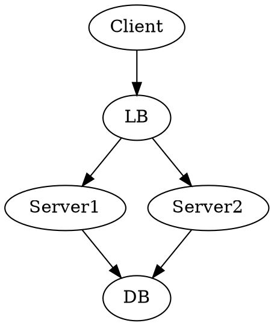
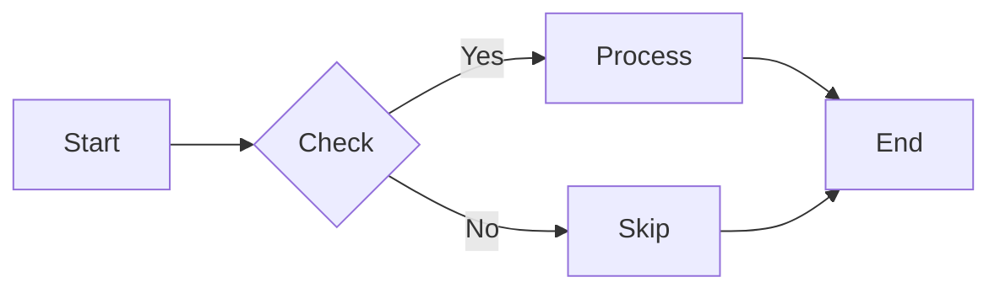

# Karl Ideas Encyclopedia

> A comprehensive collection of feature explorations, design ideas, and architectural visions for Karl - the AI agent CLI named after tennis legend Ivo Karlović.

**Generated:** 2025-12-20 16:37:20

---


---

# Karl Ideas Encyclopedia - Overview

This document provides a summary of all feature explorations and design ideas for Karl, the AI agent CLI named after tennis legend Ivo Karlović.

## Table of Contents

1. [Core Architecture](#core-architecture)
2. [User Experience](#user-experience)
3. [Context & Workflows](#context--workflows)
4. [Branding & Identity](#branding--identity)
5. [Integrations & Extensions](#integrations--extensions)

---

## Core Architecture

### LOGGING_ARCHITECTURE.md
**Structured Logging System** - Comprehensive logging infrastructure with log levels (TRACE through FATAL), correlation IDs, performance tracking, and cost monitoring. Covers debugging requirements, monitoring metrics, and a TypeScript logger design with structured JSON entries.

### DAEMON_MODE.md
**Background Service Mode** - Transforms Karl from a one-shot CLI into a persistent daemon (`karld`) with hot context, file watching, and Unix socket communication. Enables instant ~20ms responses vs 2+ second cold starts, background skill execution, and editor integration via `karlctl`.

### METRICS_DASHBOARD.md
**Local-First Usage Analytics** - SQLite-based metrics tracking for task execution, token usage, and cost monitoring. Tracks model preferences, tool calls, and session data. Privacy-first design with data that never leaves the machine.

### OFFLINE_MODE.md
**Local Model Support** - Seamless offline operation with local model backends including Ollama (recommended), vLLM (high throughput), and llama.cpp (low resource). Auto-detects network conditions and falls back gracefully.

---

## User Experience

### VERBOSE_UX.md
**Verbose Mode Design** - Philosophy for verbose output that feels like watching a master craftsman. Emphasizes rhythm/pacing, semantic grouping, and visual hierarchy rather than log dumps. Includes timing strategies and phase-based output formatting.

### TOOL_CALL_UX.md
**Tool Execution Visualization** - Design for displaying tool calls with progressive disclosure. Uses icons (📖 read, ✏️ edit, ⚡ bash, ✍️ write) and status indicators. Shows minimal info by default with expansion on demand.

### MOODS.md
**Adaptive Personality System** - Execution profiles that affect verbosity, model selection, and output style. Core moods: Focused (default, production work), Playful (exploration/creativity), and Zen (minimal output). Moods are "meta-stacks" influencing behavior patterns.

### SOUNDS_AND_SIGNALS.md
**Audio/Visual Feedback** - Terminal feedback strategies including bell notifications, smart thresholds (ring only for >5s operations), differentiated audio for success/failure, and OSC 777 notification protocol. All optional and accessibility-focused.

### ASCII_GRAPHICS_IDEAS.md
**Status Visualizations** - ASCII art for task states (idle, running, thinking, success, error, timeout, retry), tool execution sequences, progress bars, and tennis-themed graphics. Uses Unicode box drawing characters and arrows.

### ASCII_ART_IDENTITY.md
**Visual Identity System** - Core tennis elements (balls, rackets, nets, courts, scoreboards), progress indicators, status symbols vocabulary. Defines the visual language for Karl's CLI output with tennis metaphors.

### RETRO_AESTHETICS.md
**Terminal Nostalgia Guide** - Design principles for tasteful retro aesthetics inspired by 80s computing (VAX/VMS, Amiga, BBC Micro, NeXT). Covers phosphor color palettes, typography, and the golden rule: "Nostalgia should enhance usability, never hinder it."

### DIAGRAMS.md
**ASCII Diagram Generation** - Guidelines for when and how to use ASCII diagrams for architecture, data flow, dependencies, state machines, and API flows. Includes box drawing character reference and libraries for DOT-like syntax rendering.

---

## Context & Workflows

### CONTEXT_WITHOUT_FILES.md
**Stream-Based Context** - Unix-philosophy approach avoiding temp files. Uses environment variables, stdin/pipes, and memory-mapped approaches for context passing. Addresses security concerns, performance, and operational complexity of temp file pollution.

### WORKFLOWS.md
**Context Building Patterns** - Patterns for efficient context management: The Context File (build once, use everywhere), The Pipeline (chain Karl calls), and Parallel Context Building (concurrent source gathering). Emphasizes dense context packing.

### RECIPES.md
**Reusable Workflow Commands** - Named, parameterized workflows combining Karl capabilities. Declarative YAML format with parameters, chaining, and community sharing. Recipes are "shell aliases on steroids" for common development workflows.

### CHAT_VIA_LOGGING.md
**Git-Style Conversations** - Treats conversations like version control: responses as commits, logs as history, reference by ID/tag/offset. Append-only JSONL logs enable branching, forking, replaying, and diffing between conversation threads.

### LEARNING_MODE.md
**Adaptive Learning System** - Local-first learning from user patterns: common tasks, model preferences by task type, skill co-occurrence, and project-specific patterns. All data stays in `.karl/learned/`, transparent and deletable.

### FEATURE_IDEAS.md
**Context-Aware Features** - Context memory system with caching, context templates for different task types, AI-powered smart context pruning, and context diffing between runs. Prioritized feature roadmap.

---

## Branding & Identity

### BRANDING.md
**The Karl Philosophy** - Named after Ivo Karlović (13,728 career aces). Core identity: "One serve. One ace. No rallies." Voice is confident but not cocky, direct but not robotic, witty but not try-hard. Includes example outputs and terminology.

### COMPETITIONS.md
**Multi-Model Competition** - Karl vs Karl: consensus mode (multiple models agree), tournaments (find best model for task types), and evolution (learn from victories). Gamified optimization with tennis tournament metaphors.

---

## Integrations & Extensions

### SHELL_INTEGRATION.md
**Native Shell Experience** - Deep integration with zsh/bash: keybindings (Ctrl+K prefix), context awareness (cwd, last command, exit codes), plugin architecture, and preexec/precmd hooks. Makes Karl feel like a native shell feature.

### SKILL_ECOSYSTEM.md
**Skill Composition Patterns** - Skill chaining, extension, and inheritance. Parameterized skills with variables and defaults. Enables building skill families with shared behavior and composable pipelines.

---

## Quick Reference

| Document | Focus | Key Concept |
|----------|-------|-------------|
| LOGGING_ARCHITECTURE | Observability | Structured logs with correlation IDs |
| DAEMON_MODE | Performance | Persistent service, 20ms response |
| METRICS_DASHBOARD | Analytics | Local SQLite metrics |
| OFFLINE_MODE | Reliability | Ollama/vLLM/llama.cpp backends |
| VERBOSE_UX | Output | Rhythm, pacing, visual hierarchy |
| TOOL_CALL_UX | Visualization | Progressive disclosure, icons |
| MOODS | Personality | Focused/Playful/Zen profiles |
| SOUNDS_AND_SIGNALS | Feedback | Terminal bells, notifications |
| ASCII_GRAPHICS_IDEAS | UI | Status indicators, progress bars |
| ASCII_ART_IDENTITY | Branding | Tennis elements, symbols |
| RETRO_AESTHETICS | Design | 80s computing inspiration |
| DIAGRAMS | Documentation | ASCII diagram generation |
| CONTEXT_WITHOUT_FILES | Unix | Pipes over temp files |
| WORKFLOWS | Patterns | Context file, pipeline, parallel |
| RECIPES | Automation | Parameterized workflow YAML |
| CHAT_VIA_LOGGING | History | Git-like conversation logs |
| LEARNING_MODE | Adaptation | Local pattern learning |
| FEATURE_IDEAS | Roadmap | Context memory, templates |
| BRANDING | Identity | Karlović, serve-and-volley |
| COMPETITIONS | Optimization | Model tournaments |
| SHELL_INTEGRATION | UX | Keybindings, plugins |
| SKILL_ECOSYSTEM | Extensibility | Skill chaining, inheritance |


---

<!-- BEGIN: LOGGING_ARCHITECTURE.md -->

# Karl Logging Architecture

## 1. Current State

### What Exists
- **Console-based output**: Direct `console.log/error/warn` calls scattered across modules
- **Print utilities** (`print.ts`): Basic formatters for task results, errors, and JSON output
  - `printResult()`: Formats single task results with token stats in verbose mode
  - `printSchedulerResults()`: Batch result formatting
  - `printError()`: Error formatting with optional JSON output
- **Verbose flag**: CLI option that enables additional output (token usage, timing)
- **JSON output flag**: Structured output for programmatic consumption
- **Spinner utility** (`spinner.ts`): Visual feedback during operations

### What's Missing
- **Structured logging**: No consistent log format or metadata
- **Log levels**: No DEBUG, INFO, WARN, ERROR hierarchy
- **Performance tracking**: No detailed timing breakdowns
- **Cost tracking**: Token usage exists but not aggregated or persisted
- **Correlation IDs**: No way to trace related operations
- **File output**: Logs only go to stdout/stderr
- **Remote logging**: No integration with observability platforms
- **Hook logging**: No standardized way for hooks to emit logs
- **Tool execution logs**: Limited visibility into tool calls

## 2. Requirements

### Debugging Requirements
- **Trace task execution flow**: From CLI args → runner → tools → completion
- **Correlate operations**: Link scheduler volleys, retries, and individual tasks
- **Tool execution details**: Input/output for each tool call with timing
- **Hook lifecycle**: Pre/post execution with context
- **Error context**: Full stack traces with request/response data

### Monitoring Requirements
- **Performance metrics**:
  - Task execution time (queue, execution, total)
  - Tool execution time per tool type
  - API latency by provider/model
  - Token generation rate (tokens/second)
- **Success/failure rates**: By model, provider, task type
- **Concurrency metrics**: Active tasks, queue depth, throughput
- **Resource usage**: Memory, file I/O, subprocess spawns

### Cost Tracking Requirements
- **Per-task costs**:
  - Input/output tokens by model
  - Estimated cost based on provider pricing
  - Cumulative costs per session
- **Model comparison**: Cost efficiency across models
- **Budget alerts**: Warnings when approaching limits
- **Historical tracking**: Daily/weekly/monthly aggregates

## 3. Architecture

### Logger Design

```typescript
// packages/karl/src/logger.ts

import { type Static } from '@sinclair/typebox';
import { Type } from '@sinclair/typebox';
import { writeFileSync, existsSync, mkdirSync } from 'fs';
import { join } from 'path';
import { homedir } from 'os';

// Log levels in order of severity
export enum LogLevel {
  TRACE = 0,
  DEBUG = 10,
  INFO = 20,
  WARN = 30,
  ERROR = 40,
  FATAL = 50
}

// Structured log entry schema
export const LogEntrySchema = Type.Object({
  timestamp: Type.String({ format: 'date-time' }),
  level: Type.Enum(LogLevel),
  message: Type.String(),
  context: Type.Object({
    correlationId: Type.Optional(Type.String()),
    taskId: Type.Optional(Type.String()),
    phase: Type.Optional(Type.String()), // 'cli', 'scheduler', 'runner', 'tool', 'hook'
    component: Type.String(), // File/module name
    model: Type.Optional(Type.String()),
    provider: Type.Optional(Type.String()),
    skill: Type.Optional(Type.String()),
  }),
  data: Type.Optional(Type.Any()), // Arbitrary structured data
  error: Type.Optional(Type.Object({
    message: Type.String(),
    stack: Type.Optional(Type.String()),
    code: Type.Optional(Type.String()),
  })),
  metrics: Type.Optional(Type.Object({
    duration: Type.Optional(Type.Number()), // milliseconds
    tokens: Type.Optional(Type.Object({
      input: Type.Number(),
      output: Type.Number(),
      total: Type.Number(),
    })),
    cost: Type.Optional(Type.Object({
      amount: Type.Number(),
      currency: Type.String(),
    })),
  })),
});

export type LogEntry = Static<typeof LogEntrySchema>;

export interface LoggerConfig {
  level: LogLevel;
  outputs: LogOutput[];
  format: 'json' | 'pretty';
  correlationId?: string;
  context?: Record<string, any>;
}

export interface LogOutput {
  type: 'console' | 'file' | 'callback';
  options?: {
    // For file output
    path?: string;
    maxSize?: number; // bytes
    maxFiles?: number;
    // For callback
    callback?: (entry: LogEntry) => void;
  };
}

export class Logger {
  private config: LoggerConfig;
  private contextStack: Array<Record<string, any>> = [];

  constructor(config: LoggerConfig) {
    this.config = config;
  }

  // Create child logger with additional context
  child(context: Record<string, any>): Logger {
    const childConfig = {
      ...this.config,
      context: { ...this.config.context, ...context }
    };
    return new Logger(childConfig);
  }

  // Context management for nested operations
  pushContext(context: Record<string, any>): void {
    this.contextStack.push(context);
  }

  popContext(): void {
    this.contextStack.pop();
  }

  // Core logging methods
  trace(message: string, data?: any): void {
    this.log(LogLevel.TRACE, message, data);
  }

  debug(message: string, data?: any): void {
    this.log(LogLevel.DEBUG, message, data);
  }

  info(message: string, data?: any): void {
    this.log(LogLevel.INFO, message, data);
  }

  warn(message: string, data?: any): void {
    this.log(LogLevel.WARN, message, data);
  }

  error(message: string, error?: Error | any, data?: any): void {
    const errorData = error instanceof Error ? {
      message: error.message,
      stack: error.stack,
      code: (error as any).code,
    } : error;

    this.log(LogLevel.ERROR, message, { ...data, error: errorData });
  }

  fatal(message: string, error?: Error | any, data?: any): void {
    const errorData = error instanceof Error ? {
      message: error.message,
      stack: error.stack,
      code: (error as any).code,
    } : error;

    this.log(LogLevel.FATAL, message, { ...data, error: errorData });
  }

  // Performance tracking
  startTimer(): () => number {
    const start = performance.now();
    return () => Math.round(performance.now() - start);
  }

  // Token/cost tracking
  logTokenUsage(taskId: string, usage: TokenUsage, model: string): void {
    const cost = this.estimateCost(usage, model);
    this.info('Token usage tracked', {
      metrics: {
        tokens: {
          input: usage.inputTokens,
          output: usage.outputTokens,
          total: usage.totalTokens,
        },
        cost: cost ? {
          amount: cost,
          currency: 'USD'
        } : undefined
      }
    });
  }

  private log(level: LogLevel, message: string, data?: any): void {
    if (level < this.config.level) return;

    const entry: LogEntry = {
      timestamp: new Date().toISOString(),
      level,
      message,
      context: {
        ...this.config.context,
        ...this.mergeContextStack(),
        component: this.getCallerComponent(),
      },
      data,
    };

    // Extract metrics if present in data
    if (data?.metrics) {
      entry.metrics = data.metrics;
      delete data.metrics;
    }

    this.config.outputs.forEach(output => {
      this.writeToOutput(output, entry);
    });
  }

  private writeToOutput(output: LogOutput, entry: LogEntry): void {
    switch (output.type) {
      case 'console':
        this.writeToConsole(entry);
        break;
      case 'file':
        this.writeToFile(entry, output.options);
        break;
      case 'callback':
        output.options?.callback?.(entry);
        break;
    }
  }

  private writeToConsole(entry: LogEntry): void {
    const formatted = this.config.format === 'json'
      ? JSON.stringify(entry)
      : this.formatPretty(entry);

    if (entry.level >= LogLevel.ERROR) {
      console.error(formatted);
    } else {
      console.log(formatted);
    }
  }

  private writeToFile(entry: LogEntry, options?: LogOutput['options']): void {
    const logDir = options?.path || join(homedir(), '.config', 'karl', 'logs');
    if (!existsSync(logDir)) {
      mkdirSync(logDir, { recursive: true });
    }

    const filename = `karl-${new Date().toISOString().split('T')[0]}.log`;
    const filepath = join(logDir, filename);

    const line = JSON.stringify(entry) + '\n';
    writeFileSync(filepath, line, { flag: 'a' });

    // TODO: Implement log rotation based on maxSize/maxFiles
  }

  private formatPretty(entry: LogEntry): string {
    const levelColors = {
      [LogLevel.TRACE]: '\x1b[90m', // gray
      [LogLevel.DEBUG]: '\x1b[36m', // cyan
      [LogLevel.INFO]: '\x1b[32m',  // green
      [LogLevel.WARN]: '\x1b[33m',  // yellow
      [LogLevel.ERROR]: '\x1b[31m', // red
      [LogLevel.FATAL]: '\x1b[35m', // magenta
    };

    const levelNames = {
      [LogLevel.TRACE]: 'TRACE',
      [LogLevel.DEBUG]: 'DEBUG',
      [LogLevel.INFO]: 'INFO ',
      [LogLevel.WARN]: 'WARN ',
      [LogLevel.ERROR]: 'ERROR',
      [LogLevel.FATAL]: 'FATAL',
    };

    const color = levelColors[entry.level];
    const reset = '\x1b[0m';
    const dim = '\x1b[90m';

    let output = `${dim}${entry.timestamp}${reset} ${color}${levelNames[entry.level]}${reset} `;

    if (entry.context.correlationId) {
      output += `${dim}[${entry.context.correlationId.substring(0, 8)}]${reset} `;
    }

    output += `${dim}${entry.context.component}${reset} ${entry.message}`;

    if (entry.data && Object.keys(entry.data).length > 0) {
      output += ` ${dim}${JSON.stringify(entry.data)}${reset}`;
    }

    if (entry.error) {
      output += `\n  ${color}${entry.error.message}${reset}`;
      if (entry.error.stack && this.config.level <= LogLevel.DEBUG) {
        output += `\n${dim}${entry.error.stack}${reset}`;
      }
    }

    return output;
  }

  private mergeContextStack(): Record<string, any> {
    return this.contextStack.reduce((acc, ctx) => ({ ...acc, ...ctx }), {});
  }

  private getCallerComponent(): string {
    // Extract component name from stack trace
    const stack = new Error().stack?.split('\n') || [];
    const callerLine = stack[4] || ''; // Skip Error, this method, log method, public method
    const match = callerLine.match(/at\s+(?:\S+\s+\()?(.*?):(\d+):(\d+)/);
    if (match) {
      const filepath = match[1];
      return filepath.split('/').pop()?.replace('.ts', '') || 'unknown';
    }
    return 'unknown';
  }

  private estimateCost(usage: TokenUsage, model: string): number | undefined {
    // Cost per 1M tokens (example rates)
    const pricing: Record<string, { input: number; output: number }> = {
      'claude-3-opus': { input: 15, output: 75 },
      'claude-3-sonnet': { input: 3, output: 15 },
      'claude-3-haiku': { input: 0.25, output: 1.25 },
      'gpt-4o': { input: 5, output: 15 },
      'gpt-4o-mini': { input: 0.15, output: 0.6 },
    };

    const modelPricing = pricing[model];
    if (!modelPricing) return undefined;

    const inputCost = (usage.inputTokens / 1_000_000) * modelPricing.input;
    const outputCost = (usage.outputTokens / 1_000_000) * modelPricing.output;

    return Math.round((inputCost + outputCost) * 1000) / 1000; // Round to 3 decimals
  }
}

// Global logger factory
let globalLogger: Logger | null = null;

export function createLogger(config: Partial<LoggerConfig> = {}): Logger {
  const defaultConfig: LoggerConfig = {
    level: process.env.LOG_LEVEL ?
      (LogLevel[process.env.LOG_LEVEL as keyof typeof LogLevel] || LogLevel.INFO) :
      LogLevel.INFO,
    outputs: [{ type: 'console' }],
    format: process.env.LOG_FORMAT === 'json' ? 'json' : 'pretty',
    ...config,
  };

  return new Logger(defaultConfig);
}

export function getLogger(): Logger {
  if (!globalLogger) {
    globalLogger = createLogger();
  }
  return globalLogger;
}

export function setGlobalLogger(logger: Logger): void {
  globalLogger = logger;
}
```

## 4. Integration Points

### CLI Integration
```typescript
// packages/karl/src/cli.ts
import { createLogger, setGlobalLogger, LogLevel } from './logger';

// Initialize logger based on CLI flags
const logLevel = options.verbose ? LogLevel.DEBUG :
                 options.quiet ? LogLevel.WARN :
                 LogLevel.INFO;

const logger = createLogger({
  level: logLevel,
  format: options.json ? 'json' : 'pretty',
  outputs: [
    { type: 'console' },
    ...(options.logFile ? [{
      type: 'file' as const,
      options: { path: options.logFile }
    }] : [])
  ],
  correlationId: crypto.randomUUID(),
});

setGlobalLogger(logger);
```

### Runner Integration
```typescript
// packages/karl/src/runner.ts - Enhanced with logging

import { getLogger } from './logger';

export async function runTask(params: RunTaskParams): Promise<TaskResult> {
  const logger = getLogger().child({
    taskId: params.taskId,
    phase: 'runner',
    model: params.modelId,
    provider: params.providerId,
  });

  const timer = logger.startTimer();
  logger.info('Task started', {
    skill: params.skill,
    timeout: params.timeout,
    hasTools: params.tools.length > 0,
  });

  try {
    logger.debug('Initializing agent loop', {
      toolCount: toolDefinitions.length,
      maxTokens: params.maxTokens,
    });

    // Run hooks with logging
    logger.pushContext({ phase: 'hook' });
    if (params.hooks) {
      logger.debug('Running pre-task hooks');
      await params.hooks.run('pre-task', {
        task: params.task,
        params,
        logger: logger.child({ hook: 'pre-task' })
      });
    }
    logger.popContext();

    // Tool calls with logging
    const result = await agentLoop({
      onToolCall: async (tool, args) => {
        const toolLogger = logger.child({
          phase: 'tool',
          tool: tool.name
        });
        const toolTimer = toolLogger.startTimer();

        toolLogger.debug('Tool execution started', { args });

        try {
          const result = await tool.execute(args);
          const duration = toolTimer();

          toolLogger.info('Tool execution completed', {
            metrics: { duration },
            resultSize: JSON.stringify(result).length,
          });

          return result;
        } catch (error) {
          toolLogger.error('Tool execution failed', error, { args });
          throw error;
        }
      },
    });

    // Extract and log token usage
    const tokenUsage = extractTokenUsage(result);
    if (tokenUsage) {
      logger.logTokenUsage(params.taskId || 'unknown', tokenUsage, params.modelId);
    }

    const duration = timer();
    logger.info('Task completed successfully', {
      metrics: {
        duration,
        tokens: tokenUsage,
      }
    });

    return { success: true, result, tokenUsage };

  } catch (error: any) {
    const duration = timer();
    logger.error('Task failed', error, {
      metrics: { duration },
    });

    return { success: false, error: error.message };
  }
}
```

### Scheduler Integration
```typescript
// packages/karl/src/scheduler.ts
export class VolleyScheduler extends EventEmitter {
  private logger = getLogger().child({ phase: 'scheduler' });

  async run(tasks: SchedulerTask[]): Promise<Map<string, SchedulerTask>> {
    const volleyLogger = this.logger.child({
      correlationId: crypto.randomUUID(),
      taskCount: tasks.length,
    });

    volleyLogger.info('Volley started', {
      maxConcurrent: this.maxConcurrent,
      retryConfig: this.retryConfig,
    });

    this.emit('scheduler:event', {
      type: 'VOLLEY_STARTED',
      timestamp: Date.now(),
      data: { taskCount: tasks.length },
      logger: volleyLogger,
    });

    // ... rest of implementation
  }
}
```

### Hook Integration
```typescript
// Enhanced hook interface
export interface HookEvent {
  task?: string;
  params?: any;
  result?: any;
  error?: any;
  logger?: Logger; // Hooks receive a scoped logger
}

// Example hook using logger
export async function preTaskHook(event: HookEvent) {
  const { logger, task } = event;
  logger?.info('Custom hook: validating task', {
    taskLength: task?.length
  });

  const startTime = Date.now();
  // ... do work ...
  const duration = Date.now() - startTime;

  logger?.debug('Custom hook: validation complete', {
    metrics: { duration }
  });
}
```

## 5. Output Formats

### JSON Format (Structured)
```json
{
  "timestamp": "2024-01-10T15:30:45.123Z",
  "level": 20,
  "message": "Task completed successfully",
  "context": {
    "correlationId": "a1b2c3d4",
    "taskId": "task-123",
    "phase": "runner",
    "component": "runner",
    "model": "claude-3-sonnet",
    "provider": "anthropic"
  },
  "metrics": {
    "duration": 3456,
    "tokens": {
      "input": 1250,
      "output": 850,
      "total": 2100
    },
    "cost": {
      "amount": 0.047,
      "currency": "USD"
    }
  }
}
```

### Pretty Format (Human-readable)
```
2024-01-10T15:30:45.123Z INFO  [a1b2c3d4] runner Task completed successfully {"model":"claude-3-sonnet","duration":3456,"tokens":2100,"cost":0.047}
```

### File Rotation Strategy
```
~/.config/karl/logs/
├── karl-2024-01-10.log    # Current day
├── karl-2024-01-09.log    # Previous days
├── karl-2024-01-08.log
└── archive/               # Compressed older logs
    └── karl-2024-01.tar.gz
```

## 6. Token/Cost Tracking

### Metrics Aggregator
```typescript
// packages/karl/src/metrics.ts
export class MetricsAggregator {
  private metricsPath: string;

  async trackUsage(entry: LogEntry): Promise<void> {
    if (!entry.metrics?.tokens) return;

    const metrics = await this.loadMetrics();
    const date = new Date(entry.timestamp).toISOString().split('T')[0];
    const model = entry.context.model || 'unknown';

    // Initialize structures
    metrics.daily[date] = metrics.daily[date] || {};
    metrics.daily[date][model] = metrics.daily[date][model] || {
      tasks: 0,
      tokens: { input: 0, output: 0, total: 0 },
      cost: 0,
    };

    // Aggregate
    const modelMetrics = metrics.daily[date][model];
    modelMetrics.tasks++;
    modelMetrics.tokens.input += entry.metrics.tokens.input;
    modelMetrics.tokens.output += entry.metrics.tokens.output;
    modelMetrics.tokens.total += entry.metrics.tokens.total;
    modelMetrics.cost += entry.metrics.cost?.amount || 0;

    await this.saveMetrics(metrics);
  }

  async getReport(period: 'daily' | 'weekly' | 'monthly'): Promise<MetricsReport> {
    const metrics = await this.loadMetrics();
    // ... generate report based on period
    return report;
  }
}
```

### CLI Command
```bash
karl metrics show                 # Today's usage
karl metrics show --period weekly # Last 7 days
karl metrics show --by-model      # Breakdown by model
karl metrics export --format csv  # Export for analysis
```

## 7. Implementation Plan

### Phase 1: Core Logger (Week 1)
**Goal**: Replace console.log with structured logger

Files to modify:
- Create: `packages/karl/src/logger.ts`
- Update: `packages/karl/src/cli.ts` - Initialize global logger
- Update: `packages/karl/src/runner.ts` - Add basic logging
- Update: `packages/karl/src/scheduler.ts` - Add volley logging
- Update: `packages/karl/src/print.ts` - Use logger for output

### Phase 2: Integration (Week 2)
**Goal**: Comprehensive logging coverage

Files to modify:
- Update: `packages/karl/src/tools.ts` - Log tool execution
- Update: `packages/karl/src/hooks.ts` - Pass logger to hooks
- Update: `packages/karl/src/config.ts` - Add logger config
- Update: `packages/karl/src/skills.ts` - Log skill loading
- Update: `packages/karl/src/stacks.ts` - Log stack resolution

### Phase 3: Metrics & Cost Tracking (Week 3)
**Goal**: Token usage aggregation and reporting

Files to create:
- Create: `packages/karl/src/metrics.ts` - Aggregation service
- Create: `packages/karl/src/commands/metrics.ts` - CLI command

Files to modify:
- Update: `packages/karl/src/types.ts` - Add metrics types
- Update: `packages/karl/src/cli.ts` - Add metrics command

### Phase 4: Observability Features (Week 4)
**Goal**: Advanced features and polish

Features:
- Log file rotation
- Performance profiling
- Remote logging adapter
- Budget alerts

### Migration Guide

```typescript
// Before
console.log(`Running task: ${task}`);
console.error('Error:', error.message);

// After
logger.info('Running task', { task });
logger.error('Task failed', error);

// With context
const taskLogger = logger.child({ taskId, model });
taskLogger.debug('Starting execution');

// With metrics
const timer = logger.startTimer();
// ... do work ...
logger.info('Operation complete', {
  metrics: { duration: timer() }
});
```

### Configuration

```json
// ~/.config/karl/karl.json
{
  "logging": {
    "level": "INFO",
    "format": "pretty",
    "file": {
      "enabled": true,
      "path": "~/.config/karl/logs",
      "maxSize": "10MB",
      "maxFiles": 7
    }
  },
  "budget": {
    "daily": 10.0,
    "monthly": 250.0,
    "alertThreshold": 0.8
  }
}
```

### Environment Variables
- `LOG_LEVEL`: TRACE, DEBUG, INFO, WARN, ERROR
- `LOG_FORMAT`: json, pretty
- `LOG_FILE`: Path to log file
- `KARL_METRICS_ENABLED`: Enable metrics tracking
- `KARL_BUDGET_DAILY`: Daily spend limit in USD

<!-- END: LOGGING_ARCHITECTURE.md -->


---

<!-- BEGIN: DAEMON_MODE.md -->

# Karl Daemon Mode

> "The best serve is the one you don't have to wait for." - Unix proverb (probably)

## Overview

Karl daemon mode transforms Karl from a one-shot ace into a persistent background service, ready to volley instantly. Think `ssh-agent`, `gpg-agent`, or your favorite language server - always warm, always ready, zero cold-start penalty.

The daemon maintains hot context, watches your filesystem, and responds to commands via Unix domain sockets. It's the difference between a 2-second startup and a 20ms response.

## Use Cases

### Instant Responses
```bash
# Cold start: 2+ seconds
time karl "explain this function" < utils.ts

# With daemon: ~20ms
time karlctl query "explain this function" < utils.ts
```

### Background Intelligence
The daemon runs skills automatically based on triggers:
- **Test on save**: Run test suite when files change
- **Lint on write**: Auto-fix style violations
- **Context refresh**: Keep project understanding current
- **Continuous review**: Flag issues as you code

### Editor Integration
```bash
# From vim, send visual selection to Karl
:'<,'>w !karlctl query "refactor this"

# From emacs
(shell-command-on-region (region-beginning) (region-end) 
                         "karlctl query 'add error handling'")
```

### Project Awareness
Daemon maintains warm context about your project:
- Parsed file tree
- Recent changes
- Active skills
- Common patterns
- Dependencies graph

## Architecture

### Process Model

```
┌─────────────────────────────────────────┐
│  karld (daemon)                         │
│  ├─ Context Manager                     │
│  ├─ File Watcher (chokidar/fs.watch)   │
│  ├─ Socket Server (Unix domain)        │
│  ├─ Skill Engine                        │
│  └─ Model Pool (warm connections)      │
└─────────────────────────────────────────┘
           ▲
           │ Unix socket
           │ ~/.karl/daemon.sock
           │
    ┌──────┴──────┬──────────┬──────────┐
    │             │          │          │
┌───┴───┐   ┌─────┴────┐  ┌─┴──┐   ┌───┴────┐
│ karl  │   │ karlctl  │  │ vim│   │ watch  │
│  CLI  │   │  (ctl)   │  │ LSP│   │  jobs  │
└───────┘   └──────────┘  └────┘   └────────┘
```

### Communication Protocol

Unix domain sockets with JSON-RPC-ish messages:

```bash
# Socket at: ~/.karl/daemon.sock (or $KARL_SOCKET)

# Message format:
{
  "id": "uuid-v4",
  "method": "query|watch|skill|status|reload",
  "params": {
    "input": "...",
    "skill": "...",
    "files": [...]
  },
  "stream": true  // Enable streaming responses
}

# Response format:
{
  "id": "uuid-v4",
  "result": "...",
  "error": null,
  "stats": {
    "duration_ms": 23,
    "tokens": 150,
    "cache_hit": true
  }
}
```

### File Watching

```yaml
# .karl/daemon.yaml
watch:
  patterns:
    - "src/**/*.ts"
    - "tests/**/*.test.ts"
    - "!node_modules/**"
  
  triggers:
    - match: "tests/**/*.test.ts"
      on: [write]
      skill: test-runner
      debounce: 500ms
    
    - match: "src/**/*.ts"
      on: [write, create]
      skill: type-check
      debounce: 1000ms
    
    - match: "**/*.{ts,js}"
      on: [write]
      action: invalidate-context
      files: "${match}"

  ignore:
    - ".git/**"
    - "**/node_modules/**"
    - "**/*.log"
```

## Implementation with Bun

### Daemon Process

```typescript
// src/daemon/karld.ts
import { watch } from 'fs/promises';
import { serve } from 'bun';

class KarlDaemon {
  private contextCache = new Map();
  private watchers = new Map();
  private connections = new Set();
  
  async start() {
    // Unix domain socket server
    const server = Bun.serve({
      unix: process.env.KARL_SOCKET || `${process.env.HOME}/.karl/daemon.sock`,
      
      async fetch(req, server) {
        // Upgrade to WebSocket for streaming
        if (server.upgrade(req)) {
          return; // Connection upgraded
        }
        
        // Or handle as HTTP for simple queries
        const msg = await req.json();
        const result = await this.handleMessage(msg);
        return Response.json(result);
      },
      
      websocket: {
        open(ws) {
          this.connections.add(ws);
        },
        
        async message(ws, message) {
          const msg = JSON.parse(message);
          const result = await this.handleMessage(msg);
          
          if (msg.stream) {
            // Stream response chunks
            for await (const chunk of result) {
              ws.send(JSON.stringify({ id: msg.id, chunk }));
            }
            ws.send(JSON.stringify({ id: msg.id, done: true }));
          } else {
            ws.send(JSON.stringify({ id: msg.id, result }));
          }
        },
        
        close(ws) {
          this.connections.delete(ws);
        }
      }
    });
    
    // Setup file watchers
    await this.setupWatchers();
    
    // Prewarm context
    await this.prewarmContext();
    
    console.log(`Karl daemon listening on ${server.unix}`);
  }
  
  async handleMessage(msg: Message) {
    switch (msg.method) {
      case 'query':
        return this.handleQuery(msg.params);
      case 'watch':
        return this.addWatch(msg.params);
      case 'skill':
        return this.runSkill(msg.params);
      case 'status':
        return this.getStatus();
      case 'reload':
        return this.reload();
      default:
        throw new Error(`Unknown method: ${msg.method}`);
    }
  }
  
  async setupWatchers() {
    const config = await loadConfig('.karl/daemon.yaml');
    
    for (const trigger of config.watch.triggers) {
      const watcher = watch(trigger.match, { recursive: true });
      
      for await (const event of watcher) {
        if (event.eventType === trigger.on) {
          await this.handleWatchTrigger(trigger, event.filename);
        }
      }
    }
  }
  
  async prewarmContext() {
    // Load common skills
    await this.skillEngine.loadAll();
    
    // Parse project structure
    await this.contextManager.buildProjectGraph();
    
    // Establish model connections
    await this.modelPool.connect();
  }
}

// Start daemon
const daemon = new KarlDaemon();
daemon.start();
```

### Control Client

```typescript
// src/daemon/karlctl.ts
class KarlClient {
  private socket: string;
  
  constructor() {
    this.socket = process.env.KARL_SOCKET || 
                  `${process.env.HOME}/.karl/daemon.sock`;
  }
  
  async query(input: string, opts = {}) {
    const response = await fetch(`unix://${this.socket}`, {
      method: 'POST',
      body: JSON.stringify({
        id: crypto.randomUUID(),
        method: 'query',
        params: { input, ...opts }
      })
    });
    
    return response.json();
  }
  
  async stream(input: string, opts = {}) {
    const ws = new WebSocket(`ws+unix://${this.socket}`);
    
    return new Promise((resolve, reject) => {
      const chunks = [];
      
      ws.on('open', () => {
        ws.send(JSON.stringify({
          id: crypto.randomUUID(),
          method: 'query',
          params: { input, ...opts },
          stream: true
        }));
      });
      
      ws.on('message', (data) => {
        const msg = JSON.parse(data);
        if (msg.done) {
          ws.close();
          resolve(chunks.join(''));
        } else {
          chunks.push(msg.chunk);
          process.stdout.write(msg.chunk); // Stream to stdout
        }
      });
    });
  }
}
```

### Lifecycle Management

```bash
#!/bin/bash
# karlctl - Control script

case "$1" in
  start)
    if [ -S ~/.karl/daemon.sock ]; then
      echo "Karl daemon already running"
      exit 1
    fi
    
    # Start daemon in background
    karld --daemon &
    echo $! > ~/.karl/daemon.pid
    
    # Wait for socket
    for i in {1..30}; do
      [ -S ~/.karl/daemon.sock ] && break
      sleep 0.1
    done
    
    echo "Karl daemon started (PID $(cat ~/.karl/daemon.pid))"
    ;;
    
  stop)
    if [ -f ~/.karl/daemon.pid ]; then
      kill $(cat ~/.karl/daemon.pid)
      rm -f ~/.karl/daemon.pid ~/.karl/daemon.sock
      echo "Karl daemon stopped"
    fi
    ;;
    
  restart)
    $0 stop
    $0 start
    ;;
    
  status)
    if [ -S ~/.karl/daemon.sock ]; then
      echo "Karl daemon is running"
      karlctl rpc status
    else
      echo "Karl daemon is not running"
      exit 1
    fi
    ;;
    
  reload)
    # Hot reload config and skills
    karlctl rpc reload
    ;;
    
  *)
    # Forward to daemon as RPC
    karlctl rpc "$@"
    ;;
esac
```

## Context Management

### Prewarming Strategy

```typescript
class ContextManager {
  private cache = new LRUCache({ max: 100, ttl: 1000 * 60 * 30 });
  
  async prewarm(project: string) {
    // 1. Load project metadata
    const pkg = await this.loadPackageJson(project);
    const readme = await this.loadReadme(project);
    
    // 2. Build file tree (git-aware)
    const tree = await this.buildFileTree(project);
    
    // 3. Parse common patterns
    const patterns = await this.extractPatterns(tree);
    
    // 4. Cache in warm state
    this.cache.set(project, {
      pkg,
      readme,
      tree,
      patterns,
      timestamp: Date.now()
    });
  }
  
  async getContext(files: string[]) {
    // Hit cache for warm context
    const cached = this.cache.get('project');
    
    if (cached) {
      // Merge with specific file content
      return {
        ...cached,
        files: await Promise.all(files.map(f => this.loadFile(f)))
      };
    }
    
    // Cold path
    return this.buildContext(files);
  }
  
  invalidate(pattern: string) {
    // Selective cache invalidation
    for (const [key, value] of this.cache.entries()) {
      if (this.matchesPattern(key, pattern)) {
        this.cache.delete(key);
      }
    }
  }
}
```

### Memory Management

```typescript
class MemoryManager {
  private maxMemoryMB = 512;
  private checkInterval = 30000; // 30s
  
  async start() {
    setInterval(() => this.checkMemory(), this.checkInterval);
  }
  
  async checkMemory() {
    const usage = process.memoryUsage();
    const heapMB = usage.heapUsed / 1024 / 1024;
    
    if (heapMB > this.maxMemoryMB) {
      console.warn(`Memory high: ${heapMB.toFixed(0)}MB, cleaning...`);
      await this.cleanup();
    }
  }
  
  async cleanup() {
    // 1. Clear old cache entries
    this.contextCache.prune();
    
    // 2. Close idle model connections
    await this.modelPool.closeIdle();
    
    // 3. Force GC (Bun-specific)
    if (global.gc) {
      global.gc();
    }
    
    // 4. Log results
    const after = process.memoryUsage().heapUsed / 1024 / 1024;
    console.log(`Cleaned up, now at ${after.toFixed(0)}MB`);
  }
}
```

## Hot-Reloading

```typescript
class HotReloader {
  async reloadSkills() {
    const skillsDir = '.karl/skills';
    const watcher = watch(skillsDir);
    
    for await (const event of watcher) {
      if (event.filename.endsWith('.md') || event.filename.endsWith('.yaml')) {
        console.log(`Reloading skill: ${event.filename}`);
        
        // Unload old version
        this.skillEngine.unload(event.filename);
        
        // Load new version
        await this.skillEngine.load(event.filename);
        
        // Notify clients
        this.broadcast({
          type: 'skill-reloaded',
          skill: event.filename
        });
      }
    }
  }
  
  async reloadConfig() {
    const configPath = '.karl/daemon.yaml';
    const watcher = watch(configPath);
    
    for await (const event of watcher) {
      console.log('Config changed, reloading...');
      
      const newConfig = await loadConfig(configPath);
      
      // Hot-swap configuration
      this.config = newConfig;
      
      // Restart watchers with new patterns
      await this.restartWatchers();
    }
  }
}
```

## Editor Integration

### Vim Plugin

```vim
" ~/.vim/plugin/karl.vim

function! KarlQuery(prompt)
  let selection = join(getline("'<", "'>"), "\n")
  let result = system('karlctl query "' . a:prompt . '"', selection)
  
  " Replace selection with result
  execute "'<,'>d"
  call append(line("'<") - 1, split(result, "\n"))
endfunction

function! KarlExplain()
  let selection = join(getline("'<", "'>"), "\n")
  let result = system('karlctl query "explain this code"', selection)
  
  " Show in split
  new
  call setline(1, split(result, "\n"))
  setlocal buftype=nofile
endfunction

" Keybindings
vnoremap <leader>kr :call KarlQuery(input('Karl: '))<CR>
vnoremap <leader>ke :call KarlExplain()<CR>
vnoremap <leader>kt :call KarlQuery('add tests for this')<CR>
vnoremap <leader>kd :call KarlQuery('add documentation')<CR>

" Auto-format on save
autocmd BufWritePost *.ts,*.js silent !karlctl format % &
```

### Emacs Integration

```elisp
;; ~/.emacs.d/karl-mode.el

(defun karl-query (prompt)
  "Query Karl daemon with selected region."
  (interactive "sKarl: ")
  (let* ((selection (buffer-substring-no-properties (region-beginning) (region-end)))
         (result (shell-command-to-string 
                  (format "echo %s | karlctl query '%s'" 
                          (shell-quote-argument selection)
                          prompt))))
    (delete-region (region-beginning) (region-end))
    (insert result)))

(defun karl-explain ()
  "Explain selected code."
  (interactive)
  (let* ((selection (buffer-substring-no-properties (region-beginning) (region-end)))
         (result (shell-command-to-string 
                  (format "echo %s | karlctl query 'explain this code'" 
                          (shell-quote-argument selection)))))
    (with-output-to-temp-buffer "*Karl Explanation*"
      (princ result))))

;; Keybindings
(global-set-key (kbd "C-c k q") 'karl-query)
(global-set-key (kbd "C-c k e") 'karl-explain)
(global-set-key (kbd "C-c k t") 
                (lambda () (interactive) (karl-query "add tests for this")))
```

### VS Code Extension

```typescript
// karl-vscode/src/extension.ts
import * as vscode from 'vscode';
import { exec } from 'child_process';
import { promisify } from 'util';

const execAsync = promisify(exec);

export function activate(context: vscode.ExtensionContext) {
  // Query command
  let query = vscode.commands.registerCommand('karl.query', async () => {
    const editor = vscode.window.activeTextEditor;
    if (!editor) return;
    
    const selection = editor.document.getText(editor.selection);
    const prompt = await vscode.window.showInputBox({ prompt: 'Karl:' });
    
    if (!prompt) return;
    
    const { stdout } = await execAsync(
      `echo ${JSON.stringify(selection)} | karlctl query "${prompt}"`
    );
    
    editor.edit(editBuilder => {
      editBuilder.replace(editor.selection, stdout.trim());
    });
  });
  
  // Watch current file
  let watch = vscode.commands.registerCommand('karl.watch', async () => {
    const editor = vscode.window.activeTextEditor;
    if (!editor) return;
    
    const filepath = editor.document.uri.fsPath;
    await execAsync(`karlctl watch add "${filepath}" --skill=type-check`);
    
    vscode.window.showInformationMessage(`Karl is watching ${filepath}`);
  });
  
  context.subscriptions.push(query, watch);
}
```

## Security Considerations

### Socket Permissions

```typescript
// Daemon sets restrictive permissions on socket
import { chmod } from 'fs/promises';

const sockPath = `${process.env.HOME}/.karl/daemon.sock`;

// Only user can read/write
await chmod(sockPath, 0o600);

// Verify ownership
const stats = await stat(sockPath);
if (stats.uid !== process.getuid()) {
  throw new Error('Socket ownership mismatch');
}
```

### Authentication

```typescript
class DaemonAuth {
  private tokens = new Map<string, TokenInfo>();
  
  async authenticate(msg: Message): Promise<boolean> {
    // 1. Check Unix socket peer credentials
    const creds = getPeerCredentials(socket);
    if (creds.uid !== process.getuid()) {
      return false; // Only same user
    }
    
    // 2. Optional: Token-based auth for remote access
    if (msg.token) {
      return this.validateToken(msg.token);
    }
    
    return true; // Local socket, same user = trusted
  }
  
  generateToken(scopes: string[]): string {
    const token = crypto.randomUUID();
    this.tokens.set(token, {
      scopes,
      created: Date.now(),
      expires: Date.now() + 3600000 // 1 hour
    });
    return token;
  }
}
```

### Resource Limits

```yaml
# .karl/daemon.yaml
limits:
  max_connections: 10
  max_concurrent_queries: 5
  max_memory_mb: 512
  max_context_size: 100000  # tokens
  rate_limit:
    queries_per_minute: 60
    
security:
  allowed_skills:
    - code-review
    - test-runner
    - type-check
  
  forbidden_paths:
    - "/etc/**"
    - "~/.ssh/**"
    - "**/.env"
    - "**/secrets/**"
  
  sandbox_skills: true  # Run in restricted env
```

### Sandboxing

```typescript
class SkillSandbox {
  async run(skill: Skill, context: Context) {
    // Run skill in restricted Bun subprocess
    const proc = Bun.spawn({
      cmd: ['bun', 'run', skill.path],
      env: {
        // Minimal environment
        PATH: '/usr/bin:/bin',
        HOME: '/tmp/karl-sandbox',
        KARL_CONTEXT: JSON.stringify(context)
      },
      stdin: 'pipe',
      stdout: 'pipe',
      stderr: 'pipe'
    });
    
    // Timeout
    const timeout = setTimeout(() => proc.kill(), 30000);
    
    const output = await proc.exited;
    clearTimeout(timeout);
    
    return output;
  }
}
```

## Comparison to LSP

| Feature | Karl Daemon | LSP Server |
|---------|-------------|------------|
| **Purpose** | AI-powered code assistance | Language intelligence |
| **Protocol** | JSON over Unix socket | JSON-RPC over stdio/socket |
| **State** | Project context + AI models | AST + symbol tables |
| **Latency** | ~20-500ms (model-dependent) | ~1-10ms |
| **Use case** | Complex transformations | Autocomplete, goto-def |
| **Integration** | Editor agnostic | Editor-specific adapters |
| **Offline** | Partial (local models) | Full |

### Why Not Just LSP?

LSP is perfect for language-aware features (autocomplete, refactoring, navigation). Karl daemon complements it:

- **AI capabilities**: LSP doesn't do semantic understanding, generation, or complex transformations
- **Cross-language**: Karl works on any file type, LSP is language-specific
- **Context-aware**: Karl maintains project-level understanding, not just syntax
- **Async workflows**: File watching, background analysis, scheduled tasks

### Hybrid Approach

```typescript
// Karl can act as LSP server for AI features
class KarlLSP extends LSPServer {
  async handleCompletion(params: CompletionParams) {
    // Delegate to daemon for AI completions
    const context = await this.getContext(params.textDocument.uri);
    
    return karlClient.query('complete this code', {
      context,
      position: params.position
    });
  }
  
  async handleCodeAction(params: CodeActionParams) {
    // AI-powered quick fixes
    return karlClient.query('suggest fixes', {
      diagnostics: params.context.diagnostics
    });
  }
}
```

## Example Workflows

### Workflow 1: Continuous Testing

```bash
# Setup
karlctl start
karlctl watch add "src/**/*.ts" --skill=test-runner --on=write

# Now code normally
vim src/utils.ts
# ... make changes, :w
# Karl automatically runs tests in background

# Check results
karlctl status
# ✓ tests/utils.test.ts - 23 passed
# ✗ tests/integration.test.ts - 2 failed

# Get details
karlctl logs
```

### Workflow 2: Live Code Review

```yaml
# .karl/daemon.yaml
watch:
  triggers:
    - match: "src/**/*.ts"
      on: [write]
      skill: code-review
      notify: true
      
skills:
  code-review:
    stack: sonnet
    context:
      - CONVENTIONS.md
      - .eslintrc.js
```

```bash
# Start daemon with live review
karlctl start

# Code away...
vim src/api/users.ts
# ... add new endpoint, :w

# Notification appears:
# Karl: Code review complete - 2 suggestions
# - Consider adding input validation
# - Missing error handling for DB calls

# View full review
karlctl last-review
```

### Workflow 3: Editor-Integrated Refactoring

```bash
# In vim, select function
# Press <leader>kr (Karl Refactor)
# Enter: "extract error handling to middleware"

# Karl daemon responds instantly (prewarmed):
# - Analyzes function
# - Generates middleware
# - Updates imports
# - Replaces selection

# All in ~50ms because context was warm
```

### Workflow 4: Project Onboarding

```bash
# New team member clones repo
cd my-project

# Start Karl daemon
karlctl start

# Let Karl learn the project
karlctl prewarm --full

# Now ask questions
karlctl query "what does this project do?"
karlctl query "how do I add a new API endpoint?"
karlctl query "explain the auth flow"

# All answers instant, context-aware
```

### Workflow 5: Background Analysis

```yaml
# .karl/daemon.yaml
schedule:
  - cron: "0 * * * *"  # Every hour
    skill: dependency-audit
    notify: slack
  
  - cron: "0 9 * * 1"  # Monday 9am
    skill: weekly-summary
    output: WEEKLY.md
```

```bash
# Daemon runs background jobs
karlctl status
# Next job: dependency-audit in 23 minutes
# Last job: weekly-summary (exit 0) 2 days ago

# Check outputs
cat WEEKLY.md
# Weekly Summary - Week 48
# - 127 commits
# - 15 PRs merged
# - Top contributor: alice (42 commits)
# - Hot spots: src/api/* (high churn)
```

## Performance Tuning

### Benchmarks

```bash
# Cold start (no daemon)
$ time karl "explain this" < utils.ts
real    0m2.341s  # Startup + model load + inference

# With daemon (prewarmed)
$ time karlctl query "explain this" < utils.ts
real    0m0.023s  # Just inference

# Speedup: ~100x for simple queries
```

### Optimization Tips

1. **Prewarm aggressively**: Load common skills at startup
2. **Cache context**: Rebuild only on changes
3. **Pool model connections**: Keep HTTP/2 connections alive
4. **Debounce file watches**: Don't trigger on every keystroke
5. **Lazy load skills**: Only load when first used
6. **Compress context**: Use skill-specific context, not full project
7. **Stream responses**: Start processing before full response

### Memory Profile

```
Typical daemon footprint:
- Base process: ~50MB
- Context cache: ~100MB (LRU, pruned)
- Model connections: ~20MB
- File watchers: ~10MB
- Total: ~200MB idle, ~500MB active

Comparable to:
- TypeScript LSP: ~300MB
- Rust Analyzer: ~500MB
- VS Code: ~400MB base
```

## Future Ideas

- **Multi-project support**: One daemon, multiple repos
- **Remote daemon**: Connect to daemon on dev server
- **Daemon mesh**: Coordinate multiple daemons
- **Smart prewarming**: ML-based context prediction
- **Incremental context**: Only send diffs, not full context
- **Skill marketplace**: Auto-download skills on first use
- **Health monitoring**: Prometheus metrics, status dashboard
- **Replay mode**: Record/replay interactions for debugging

## Getting Started

```bash
# Install daemon components
bun install -g karl-daemon

# Start daemon
karlctl start

# Verify it's running
karlctl status

# Set up watches
karlctl watch add "src/**/*.ts" --skill=type-check

# Query from command line
echo "const x = 1" | karlctl query "explain this"

# Or integrate with editor
# (see vim/emacs/vscode sections above)

# Stop daemon
karlctl stop
```

---

**The daemon is Karl's power serve** - always ready, always warm, zero hesitation. Your code gets instant feedback, your editor gets superpowers, and you stay in flow.

Just like Karlović's serve: one shot, no rally, ace. 🎾

<!-- END: DAEMON_MODE.md -->


---

<!-- BEGIN: METRICS_DASHBOARD.md -->

# Metrics Dashboard

> "You can't improve what you don't measure." - But in Karl's case, you can at least serve faster.

## Overview

Karl should track usage metrics locally to help users understand their AI usage patterns, optimize costs, and improve productivity. This is **local-first by design** - your data never leaves your machine unless you explicitly export it.

## Philosophy

- **🎾 Track Your Aces**: Know which tasks are one-shot completions
- **📊 Local-Only**: SQLite database, no cloud telemetry
- **⚡ Fast Queries**: Instant insights without slowing down serves
- **🔒 Privacy-First**: Opt-in, exportable, deletable
- **💰 Cost-Aware**: Track spending across providers

---

## What to Track

### Core Metrics

```typescript
interface TaskMetric {
  // Identity
  id: string;                    // UUID for this task
  timestamp: Date;               // When the task started
  
  // Task Details
  command: string;               // The karl command used
  prompt: string;                // User's prompt (truncated/hashed?)
  result: 'success' | 'error' | 'timeout';
  duration_ms: number;           // Total execution time
  
  // Model & Stack
  model: string;                 // e.g., 'claude-3-5-sonnet-20241022'
  stack: string;                 // e.g., 'sonnet', 'trinity'
  provider: string;              // 'anthropic', 'openai', 'local'
  
  // Token Usage
  tokens_input: number;          // Prompt tokens
  tokens_output: number;         // Completion tokens
  tokens_cache_write?: number;   // Cache creation (Anthropic)
  tokens_cache_read?: number;    // Cache hits (Anthropic)
  
  // Cost
  cost_usd: number;              // Total cost in USD
  cost_breakdown: {
    input: number;
    output: number;
    cache_write: number;
    cache_read: number;
  };
  
  // Context & Skills
  skills_used: string[];         // e.g., ['typescript', 'testing']
  context_files: number;         // Number of files in context
  context_size_bytes: number;    // Total context size
  
  // Tool Usage
  tool_calls: {
    name: string;                // 'bash', 'read', 'write', 'edit'
    count: number;               // How many times called
  }[];
  
  // Environment
  working_directory: string;     // Where karl was run
  git_repo?: string;             // Git remote if in repo
  
  // Metadata
  karl_version: string;          // Which version of karl
  tags?: string[];               // User-defined tags
}
```

### Session Metrics

Track grouped work sessions (similar volleys):

```typescript
interface SessionMetric {
  id: string;
  start: Date;
  end: Date;
  task_count: number;
  total_cost: number;
  total_tokens: number;
  dominant_skill?: string;       // Most-used skill
  dominant_model?: string;       // Most-used model
}
```

### Aggregate Metrics

Pre-computed rollups for fast dashboards:

```typescript
interface DailyAggregate {
  date: string;                  // YYYY-MM-DD
  task_count: number;
  total_cost: number;
  total_tokens: number;
  unique_models: number;
  unique_skills: number;
  avg_duration_ms: number;
  success_rate: number;          // % of successful tasks
}
```

---

## Storage Design

### SQLite Schema

Local-first, portable, fast, embeddable.

```sql
-- Main tasks table
CREATE TABLE tasks (
  id TEXT PRIMARY KEY,
  timestamp INTEGER NOT NULL,
  command TEXT NOT NULL,
  prompt_hash TEXT,              -- SHA256 of prompt for privacy
  prompt_preview TEXT,           -- First 100 chars
  result TEXT NOT NULL,
  duration_ms INTEGER NOT NULL,
  
  model TEXT NOT NULL,
  stack TEXT NOT NULL,
  provider TEXT NOT NULL,
  
  tokens_input INTEGER NOT NULL,
  tokens_output INTEGER NOT NULL,
  tokens_cache_write INTEGER,
  tokens_cache_read INTEGER,
  
  cost_usd REAL NOT NULL,
  cost_input REAL,
  cost_output REAL,
  cost_cache_write REAL,
  cost_cache_read REAL,
  
  context_files INTEGER,
  context_size_bytes INTEGER,
  
  working_directory TEXT,
  git_repo TEXT,
  karl_version TEXT NOT NULL,
  
  created_at INTEGER DEFAULT (unixepoch())
);

CREATE INDEX idx_tasks_timestamp ON tasks(timestamp);
CREATE INDEX idx_tasks_model ON tasks(model);
CREATE INDEX idx_tasks_stack ON tasks(stack);
CREATE INDEX idx_tasks_result ON tasks(result);

-- Skills used per task (many-to-many)
CREATE TABLE task_skills (
  task_id TEXT NOT NULL,
  skill TEXT NOT NULL,
  PRIMARY KEY (task_id, skill),
  FOREIGN KEY (task_id) REFERENCES tasks(id) ON DELETE CASCADE
);

CREATE INDEX idx_task_skills_skill ON task_skills(skill);

-- Tool calls per task
CREATE TABLE task_tools (
  id INTEGER PRIMARY KEY AUTOINCREMENT,
  task_id TEXT NOT NULL,
  tool_name TEXT NOT NULL,
  call_count INTEGER NOT NULL,
  FOREIGN KEY (task_id) REFERENCES tasks(id) ON DELETE CASCADE
);

CREATE INDEX idx_task_tools_task ON task_tools(task_id);

-- Sessions (optional, for grouping)
CREATE TABLE sessions (
  id TEXT PRIMARY KEY,
  start_time INTEGER NOT NULL,
  end_time INTEGER,
  task_count INTEGER DEFAULT 0,
  total_cost REAL DEFAULT 0,
  total_tokens INTEGER DEFAULT 0
);

-- Daily aggregates for fast queries
CREATE TABLE daily_aggregates (
  date TEXT PRIMARY KEY,
  task_count INTEGER,
  total_cost REAL,
  total_tokens INTEGER,
  unique_models INTEGER,
  unique_skills INTEGER,
  avg_duration_ms REAL,
  success_rate REAL,
  last_updated INTEGER DEFAULT (unixepoch())
);

-- User preferences and budgets
CREATE TABLE settings (
  key TEXT PRIMARY KEY,
  value TEXT NOT NULL
);

-- Budget tracking
CREATE TABLE budgets (
  id INTEGER PRIMARY KEY AUTOINCREMENT,
  name TEXT NOT NULL,           -- 'daily', 'weekly', 'monthly'
  limit_usd REAL NOT NULL,
  period_start INTEGER NOT NULL,
  period_end INTEGER NOT NULL,
  spent_usd REAL DEFAULT 0,
  alert_threshold REAL          -- Alert at 80% by default
);
```

### Database Location

```bash
~/.karl/metrics.db              # Main metrics database
~/.karl/metrics.db-wal          # WAL file for concurrent access
~/.karl/metrics.db-shm          # Shared memory file
```

---

## CLI Commands

### Basic Stats

```bash
# Overall summary
karl stats

# Output:
# 🎾 Karl Stats
# ━━━━━━━━━━━━━━━━━━━━━━━━━━━━━━━━━━━━━━━━━━━━━
# 
# 📊 All Time
#   Tasks:        1,247 (98.2% success)
#   Tokens:       12.4M (input) + 3.2M (output)
#   Cost:         $127.45
#   Avg Duration: 2.3s
# 
# 🗓️  This Week
#   Tasks:        89
#   Cost:         $8.92 (12% vs last week)
# 
# 🎯 Top Models
#   1. claude-3-5-sonnet (892 tasks, $98.21)
#   2. claude-3-haiku    (245 tasks, $12.34)
#   3. gpt-4o            (110 tasks, $16.90)
# 
# 🔧 Top Skills
#   1. typescript (445 tasks)
#   2. debugging  (234 tasks)
#   3. testing    (189 tasks)
# 
# 🏆 Best Ace: One-shot deploy script (0.8s, $0.02)
```

### Time-Based Queries

```bash
# Pre-defined periods
karl stats --today
karl stats --yesterday
karl stats --this-week
karl stats --last-week
karl stats --this-month
karl stats --last-month
karl stats --this-year

# Custom ranges
karl stats --from 2024-01-01 --to 2024-01-31
karl stats --last 30d
karl stats --last 100    # Last 100 tasks
```

### Filtering

```bash
# By model
karl stats --model sonnet
karl stats --model opus --this-month

# By skill
karl stats --skill typescript
karl stats --skill "debugging,testing"

# By result
karl stats --errors              # Only failed tasks
karl stats --success-rate        # Success % over time

# By project
karl stats --repo myproject
karl stats --dir ~/code/karl
```

### Detailed Views

```bash
# Cost breakdown
karl stats cost --this-month
# Output:
# 💰 Cost Breakdown (December 2024)
# ━━━━━━━━━━━━━━━━━━━━━━━━━━━━━━━━━━━━━━━━━━━━━
# 
# Total: $42.18
# 
# By Model:
#   claude-3-5-sonnet  $32.45  (77%)  ████████████████████
#   claude-3-haiku     $6.23   (15%)  ████
#   gpt-4o             $3.50   (8%)   ██
# 
# By Component:
#   Input tokens       $8.44   (20%)
#   Output tokens      $31.20  (74%)
#   Cache writes       $1.89   (4%)
#   Cache reads        $0.65   (2%)
# 
# Daily Trend:
#   Dec 1  ▁ $0.80
#   Dec 2  ▃ $1.20
#   Dec 3  █ $3.40
#   ...

# Token usage
karl stats tokens --this-week
karl stats tokens --by-model

# Performance analysis
karl stats perf
# Shows:
# - Average duration by model
# - Slowest tasks
# - Cache hit rates
# - Tool call frequency

# Task history
karl stats history --limit 20
karl stats history --model opus --last 10
```

### Leaderboards

```bash
# Most expensive tasks
karl stats top --cost

# Fastest completions
karl stats top --speed

# Longest running
karl stats top --duration

# Most cache-efficient
karl stats top --cache-efficiency
```

---

## Budget Management

### Setting Budgets

```bash
# Set daily budget
karl budget daily 5.00
# Output: ✓ Daily budget set to $5.00

# Set weekly/monthly
karl budget weekly 25.00
karl budget monthly 100.00

# Alert thresholds
karl budget daily 5.00 --alert-at 0.80  # Alert at 80%
```

### Budget Status

```bash
karl budget status

# Output:
# 💰 Budget Status
# ━━━━━━━━━━━━━━━━━━━━━━━━━━━━━━━━━━━━━━━━━━━━━
# 
# Today:        $2.34 / $5.00   (47%) ████████░░░░░░░░
# This Week:    $12.18 / $25.00 (49%) █████████░░░░░░░
# This Month:   $42.18 / $100   (42%) ████████░░░░░░░░
# 
# ✓ All budgets healthy
```

### Budget Alerts

When threshold reached during a task:

```bash
⚠️  Budget Alert: Daily budget at 82% ($4.10 / $5.00)
   Continue? [y/N]
```

### Budget History

```bash
karl budget history --this-month

# Shows daily spending chart and budget compliance
```

---

## Insights & Analysis

### Automatic Insights

Karl should generate insights automatically:

```bash
karl insights

# Output:
# 💡 Karl Insights
# ━━━━━━━━━━━━━━━━━━━━━━━━━━━━━━━━━━━━━━━━━━━━━
# 
# Cost Optimization:
#   ↓ 23% of your tasks could use 'cliffy' instead of 'sonnet'
#     Potential savings: $4.20/week
# 
# Performance:
#   ↑ Cache hit rate improved 15% this week
#   → Your context patterns are getting more efficient
# 
# Usage Patterns:
#   🎯 Peak productivity: Tuesdays 10am-12pm
#   🎯 Best ace rate: Early morning (94% success)
# 
# Skills:
#   📚 You haven't used 'docker' skill in 30 days
#   ⭐ 'typescript' skill has 98% success rate
# 
# Suggestions:
#   • Consider using volley mode for parallel tasks
#   • Your context size is optimal (avg 45KB)
#   • Try the new 'trinity' stack for multi-model tasks
```

### Comparative Analysis

```bash
# Compare time periods
karl compare --this-week --last-week

# Output:
# 📊 Week Comparison
# ━━━━━━━━━━━━━━━━━━━━━━━━━━━━━━━━━━━━━━━━━━━━━
# 
#                    This Week    Last Week    Change
# Tasks              89           76           +17% ↑
# Cost               $8.92        $10.12       -12% ↓
# Avg Duration       2.1s         2.8s         -25% ↓
# Success Rate       98%          95%          +3%  ↑
# Cache Hit Rate     34%          28%          +6%  ↑
# 
# 💡 You're spending less but completing more tasks!

# Compare models
karl compare --models sonnet,opus,cliffy
```

### Trends

```bash
karl trends --cost --last 30d
karl trends --performance --this-year
karl trends --skills --this-month

# Visual trend charts in terminal (using sparklines or blocks)
```

---

## Export Formats

### JSON Export

```bash
# Export all data
karl export --format json > metrics.json

# Export specific period
karl export --this-month --format json > december.json

# Filtered export
karl export --model sonnet --skill typescript --format json

# Pretty print
karl export --format json --pretty
```

Example JSON structure:

```json
{
  "export_date": "2024-12-19T10:30:00Z",
  "karl_version": "1.0.0",
  "period": {
    "from": "2024-12-01",
    "to": "2024-12-31"
  },
  "summary": {
    "task_count": 89,
    "total_cost": 8.92,
    "total_tokens": 1234567,
    "success_rate": 0.982
  },
  "tasks": [
    {
      "id": "task_abc123",
      "timestamp": "2024-12-19T10:15:00Z",
      "command": "karl --skill typescript 'add tests'",
      "result": "success",
      "duration_ms": 2340,
      "model": "claude-3-5-sonnet-20241022",
      "tokens": {
        "input": 12450,
        "output": 3210,
        "cache_read": 8900
      },
      "cost": 0.23,
      "skills": ["typescript", "testing"]
    }
  ]
}
```

### CSV Export

```bash
karl export --format csv > metrics.csv
karl export --format csv --fields timestamp,model,cost,duration_ms
```

Great for Excel or data science tools:

```csv
timestamp,model,cost,duration_ms,tokens_total,result,skills
2024-12-19T10:15:00Z,claude-3-5-sonnet,0.23,2340,15660,success,"typescript,testing"
2024-12-19T09:45:00Z,claude-3-haiku,0.02,890,4500,success,debugging
```

### SQLite Export

```bash
# Export just the database
karl export --format sqlite --output backup.db

# Export specific tables
karl export --format sqlite --tables tasks,task_skills
```

### Markdown Reports

```bash
karl export --format markdown > report.md

# Generates a readable report:
# # Karl Metrics Report
# Generated: 2024-12-19
# 
# ## Summary
# - Total Tasks: 89
# - Success Rate: 98.2%
# - Total Cost: $8.92
# ...
```

---

## External Dashboard Integration

### Prometheus Metrics

Expose metrics in Prometheus format:

```bash
# Start metrics server
karl metrics serve --port 9090

# Scrape endpoint at http://localhost:9090/metrics
```

Example metrics:

```prometheus
# HELP karl_tasks_total Total number of tasks executed
# TYPE karl_tasks_total counter
karl_tasks_total{model="claude-3-5-sonnet",result="success"} 892

# HELP karl_cost_usd_total Total cost in USD
# TYPE karl_cost_usd_total counter
karl_cost_usd_total{model="claude-3-5-sonnet"} 98.21

# HELP karl_task_duration_seconds Task execution duration
# TYPE karl_task_duration_seconds histogram
karl_task_duration_seconds_bucket{model="claude-3-5-sonnet",le="1"} 234
karl_task_duration_seconds_bucket{model="claude-3-5-sonnet",le="5"} 789
```

### Grafana Dashboard

Provide a sample Grafana dashboard JSON:

```bash
karl export --format grafana > grafana-dashboard.json

# Import into Grafana to visualize:
# - Task volume over time
# - Cost trends by model
# - Success rates
# - Cache efficiency
# - Token usage patterns
```

### webhooks

Send metrics to external services:

```bash
# Configure webhook
karl config set metrics.webhook.url "https://api.mycompany.com/metrics"
karl config set metrics.webhook.on "task_complete"

# Payload sent:
# POST /metrics
# {
#   "event": "task_complete",
#   "task_id": "task_abc123",
#   "timestamp": "2024-12-19T10:15:00Z",
#   "model": "claude-3-5-sonnet",
#   "cost": 0.23,
#   "duration_ms": 2340,
#   "result": "success"
# }
```

### Custom Scripts

Make it easy to pipe data to custom analytics:

```bash
# Stream new tasks to a script
karl metrics stream | jq -r '.cost' | my-custom-logger

# Watch for expensive tasks
karl metrics stream --filter 'cost > 1.0' | alert-me

# Real-time dashboard
karl metrics stream | python dashboard.py
```

---

## Privacy & Control

### Opt-In System

Metrics collection is **opt-in** by default:

```bash
# First time setup
karl init

# Prompt:
# 📊 Enable usage metrics?
#    Karl can track your tasks locally to help optimize costs and performance.
#    
#    • All data stays on your machine
#    • No telemetry sent to cloud
#    • Can export or delete anytime
#    
#    Enable metrics? [Y/n]
```

### Privacy Modes

```bash
# Disable all tracking
karl config set metrics.enabled false

# Hash prompts (don't store full text)
karl config set metrics.hash_prompts true

# Only track aggregates (no individual tasks)
karl config set metrics.aggregate_only true

# Exclude sensitive directories
karl config set metrics.exclude_dirs "/secrets,/private"
```

### Data Retention

```bash
# Set retention policy
karl config set metrics.retention_days 90

# Clean old data
karl metrics clean --older-than 90d
karl metrics clean --before 2024-01-01

# Delete all metrics
karl metrics delete --all --confirm
```

### What's Tracked vs Not

**Always Local:**
- Task execution data
- Token usage
- Cost calculations
- Skill/model usage
- Performance metrics

**Never Tracked:**
- File contents
- Full prompts (unless opt-in)
- API keys or secrets
- User identity (no account ID)
- Git commit messages

**Optional:**
- Full prompt text (default: hash only)
- File paths (default: anonymize)
- Git repo names (default: track)

---

## Implementation Notes

### Performance Considerations

```typescript
// Fast metrics recording (async, non-blocking)
class MetricsCollector {
  private db: Database;
  private writeQueue: TaskMetric[] = [];
  
  async record(metric: TaskMetric) {
    // Queue write, don't block task completion
    this.writeQueue.push(metric);
    
    // Batch writes every 100ms
    if (!this.flushTimer) {
      this.flushTimer = setTimeout(() => this.flush(), 100);
    }
  }
  
  private async flush() {
    const batch = this.writeQueue.splice(0);
    await this.db.transaction(() => {
      for (const metric of batch) {
        this.insertMetric(metric);
      }
      this.updateAggregates();
    });
  }
}
```

### Cost Calculation

Track pricing per model in config:

```typescript
interface ModelPricing {
  model: string;
  pricing: {
    input_per_mtok: number;      // $ per 1M tokens
    output_per_mtok: number;
    cache_write_per_mtok?: number;
    cache_read_per_mtok?: number;
  };
  effective_date: string;        // Track pricing changes
}

// Auto-update pricing from providers
karl pricing update
```

### Migration & Versioning

```typescript
// Schema migrations for future changes
const migrations = [
  {
    version: 1,
    up: (db) => { /* initial schema */ },
    down: (db) => { /* rollback */ }
  },
  {
    version: 2,
    up: (db) => { /* add new column */ },
    down: (db) => { /* remove column */ }
  }
];
```

---

## Future Ideas

### Advanced Analytics

- **ML-based suggestions**: "Model X is better for tasks like this"
- **Anomaly detection**: "This task cost 10x more than usual"
- **Skill effectiveness**: Which skills lead to fastest/cheapest results?
- **Context optimization**: Suggest which files to include/exclude

### Collaboration Features

```bash
# Share anonymized stats with team
karl stats share --team --anonymize

# Compare with team averages
karl stats compare --team-average

# Team leaderboards (fun!)
karl stats leaderboard --team --metric aces
```

### Time Tracking Integration

```bash
# Integrate with time tracking tools
karl config set metrics.toggl.token "..."
karl stats --export-to-toggl --this-week
```

### Carbon Footprint

```bash
# Estimate carbon impact
karl stats carbon --this-month

# Output:
# 🌍 Carbon Footprint
# ━━━━━━━━━━━━━━━━━━━━━━━━━━━━━━━━━━━━━━━━━━━━━
# 
# Estimated CO2: 2.3 kg (this month)
# Equivalent to: 9.2 miles driven
# 
# By provider:
#   Anthropic (AWS):  1.8 kg
#   OpenAI (Azure):   0.5 kg
# 
# 💡 Using cached tokens saves ~0.4 kg CO2/month
```

### Smart Notifications

```bash
# Desktop notifications for milestones
karl config set metrics.notify.on "milestone,budget_alert"

# Notification examples:
# 🎾 Milestone: 1,000 tasks completed!
# ⚠️  Budget alert: 80% of daily budget used
# 🏆 New record: Fastest completion (0.8s)
# 💰 You saved $12 this week with caching!
```

---

## CLI Examples in Action

### Daily Workflow

```bash
# Morning: Check yesterday's work
karl stats --yesterday

# During work: Quick cost check
karl stats cost --today

# End of week: Full review
karl stats --this-week
karl insights
karl budget status

# End of month: Export for records
karl export --this-month --format json > invoices/karl-dec-2024.json
```

### Optimization Workflow

```bash
# Find expensive tasks
karl stats top --cost --limit 10

# Analyze what made them expensive
karl stats history --id task_abc123 --verbose

# See if cheaper model would work
karl insights --suggest-model-downgrade

# Test with cheaper model
karl --stack cliffy "same prompt"

# Compare results
karl stats compare --tasks task_abc123,task_xyz789
```

### Team Lead Workflow

```bash
# Weekly team report
karl export --this-week --format markdown > reports/week-50.md

# Cost breakdown by project
karl stats cost --by-repo --this-month

# Identify optimization opportunities
karl insights --team-mode > insights.txt

# Share learnings
git add reports/ insights.txt && git commit -m "Week 50 Karl metrics"
```

---

## Summary

The metrics dashboard makes Karl **self-aware** and helps users:

1. **💰 Control costs** with budgets and alerts
2. **📊 Understand patterns** with automatic insights  
3. **⚡ Optimize performance** by tracking what works
4. **🔒 Maintain privacy** with local-only storage
5. **🎯 Improve productivity** by learning from history

All while keeping Karl fast, Unix-native, and respectful of your data.

**Track your aces. Serve better.** 🎾

<!-- END: METRICS_DASHBOARD.md -->


---

<!-- BEGIN: OFFLINE_MODE.md -->

# Offline Mode

Karl works seamlessly offline with local models. No internet? No problem. Just like Karlović's serve - fast, local, and reliable.

## Philosophy

**Cloud-first, offline-ready.** Karl auto-detects network conditions and falls back gracefully to local models. The CLI works the same way whether you're on a plane, in a bunker, or behind a corporate firewall.

## Supported Local Model Backends

### Ollama (Recommended)

**Best for:** Simplicity, Apple Silicon, everyday use

```bash
# Install
curl -fsSL https://ollama.com/install.sh | sh

# Pull models
ollama pull codellama:13b
ollama pull deepseek-coder:6.7b
ollama pull mistral:7b

# Karl auto-detects Ollama at http://localhost:11434
karl "explain this function" --stack ollama-codellama
```

**Pros:**
- Zero configuration
- Automatic model management
- GPU acceleration (CUDA, Metal, ROCm)
- Fastest startup time

**Cons:**
- Less control over sampling parameters
- Limited to Ollama's model library

### vLLM

**Best for:** High throughput, batch processing, production deployments

```bash
# Install
pip install vllm

# Start server
python -m vllm.entrypoints.openai.api_server \
  --model deepseek-ai/deepseek-coder-6.7b-instruct \
  --port 8000 \
  --dtype auto

# Configure Karl
karl config set stacks.vllm-deepseek.model "deepseek-coder-6.7b"
karl config set stacks.vllm-deepseek.endpoint "http://localhost:8000/v1"
```

**Pros:**
- Highest throughput (PagedAttention)
- OpenAI-compatible API
- Excellent batching
- Continuous batching for low latency

**Cons:**
- Higher memory requirements
- Longer startup time
- More complex configuration

### llama.cpp

**Best for:** CPU-only machines, low memory, edge devices

```bash
# Build
git clone https://github.com/ggerganov/llama.cpp
cd llama.cpp && make

# Download GGUF model
wget https://huggingface.co/TheBloke/deepseek-coder-6.7B-instruct-GGUF/resolve/main/deepseek-coder-6.7b-instruct.Q4_K_M.gguf

# Start server
./server -m deepseek-coder-6.7b-instruct.Q4_K_M.gguf \
  -c 4096 \
  --port 8080 \
  --threads 8

# Configure Karl
karl config set stacks.llama-local.model "deepseek-coder-6.7b"
karl config set stacks.llama-local.endpoint "http://localhost:8080/v1"
```

**Pros:**
- Runs on CPU only
- Low memory footprint (quantized models)
- Wide model format support (GGUF)
- Works on embedded devices

**Cons:**
- Slower inference
- Limited context window on low-RAM machines

### LM Studio

**Best for:** GUI users, Windows, experimentation

Download from https://lmstudio.ai, load a model, start local server. Karl auto-detects at `http://localhost:1234/v1`.

## Automatic Fallback

Karl detects network and falls back automatically:

```typescript
// .karl/config.toml
[stacks.auto]
model = "claude-3-5-sonnet-20241022"
fallback = "ollama:codellama:13b"
offline_mode = "auto"  # auto | always | never

[stacks.offline-first]
model = "ollama:deepseek-coder:6.7b"
# No fallback - always use local
```

**Fallback behavior:**

1. **Auto-detect** - Ping Anthropic API (timeout: 2s)
2. **Network down?** - Check local endpoints (Ollama, vLLM, llama.cpp)
3. **Local available?** - Use local model
4. **No local?** - Error with helpful message

```bash
# Force offline mode
karl "refactor this" --offline

# Disable offline fallback
karl "needs opus" --no-fallback

# Check what model would be used
karl --dry-run "test prompt"
# → Would use: ollama:codellama:13b (offline fallback)
```

## Model Capability Detection

Karl auto-detects model capabilities:

| Capability | Claude Opus | Claude Sonnet | DeepSeek Coder 6.7B | CodeLlama 13B |
|------------|-------------|---------------|---------------------|---------------|
| Code generation | ⭐⭐⭐⭐⭐ | ⭐⭐⭐⭐⭐ | ⭐⭐⭐⭐ | ⭐⭐⭐ |
| Code review | ⭐⭐⭐⭐⭐ | ⭐⭐⭐⭐ | ⭐⭐⭐ | ⭐⭐ |
| Creative writing | ⭐⭐⭐⭐⭐ | ⭐⭐⭐⭐ | ⭐⭐ | ⭐⭐ |
| Tool calling | ✅ Native | ✅ Native | ⚠️ Simulated | ⚠️ Simulated |
| Context window | 200K | 200K | 16K | 16K |
| Speed (tok/s) | ~50 | ~100 | 30-80 | 20-50 |
| Cost | $$$ | $$ | Free | Free |

**Auto-detection in action:**

```bash
# Karl checks model capabilities
karl "complex refactoring" --skill complex-codebase

# If local model doesn't support required features:
# ⚠️  Warning: ollama:codellama doesn't support native tool calling
# ℹ️  Using simulated tool calls (may be less reliable)
# Continue? [Y/n]
```

## Skill Compatibility with Local Models

### Fully Compatible

These skills work great with local models:

- **code-review** - DeepSeek Coder excels here
- **explain-code** - Any 7B+ model works
- **refactor** - CodeLlama, DeepSeek, Mistral
- **debug** - Good results with 13B+ models
- **documentation** - Even small models handle this

### Partially Compatible

Need workarounds or larger models:

- **architect** - Works but less creative (recommend 13B+)
- **security-audit** - Requires fine-tuned models or 30B+
- **test-generation** - Good with DeepSeek, okay with others
- **performance-optimization** - Hit or miss, depends on language

### Cloud-Only

These skills require cloud models:

- **multi-language** - Local models often specialize
- **vision** - Requires multimodal (future: llava, bakllava)
- **web-scraping** - Needs internet anyway
- **api-integration** - Often needs real-time data

**Override skill requirements:**

```bash
# Skill says "requires Opus", but force local
karl --skill architect --force-local "design a distributed cache"

# Will warn but proceed with local model
```

## Performance Expectations

### Hardware Recommendations

**Minimum (CPU only):**
- 16GB RAM
- 8-core CPU
- 20-30 tokens/sec with 7B quantized models

**Recommended (GPU):**
- 24GB VRAM (RTX 3090, 4090)
- 32GB RAM
- 60-100 tokens/sec with 13B models

**Optimal (Multi-GPU):**
- 2x RTX 4090 or A100
- 64GB RAM
- 100-200 tokens/sec with 30B+ models

### Real-World Benchmarks

**Task: Generate 500-token function (DeepSeek Coder 6.7B)**

| Setup | Tokens/sec | Time | Quality |
|-------|-----------|------|---------|
| llama.cpp CPU (Q4) | 12 | 42s | ⭐⭐⭐ |
| llama.cpp GPU (Q4) | 45 | 11s | ⭐⭐⭐ |
| Ollama Mac M2 | 35 | 14s | ⭐⭐⭐⭐ |
| vLLM RTX 4090 | 85 | 6s | ⭐⭐⭐⭐ |
| Claude Sonnet API | 100 | 5s | ⭐⭐⭐⭐⭐ |

**Task: Code review (1000 lines)**

| Model | Time | Accuracy | Useful? |
|-------|------|----------|---------|
| CodeLlama 7B | 45s | 70% | ⭐⭐⭐ |
| DeepSeek 6.7B | 35s | 85% | ⭐⭐⭐⭐ |
| Mistral 7B | 30s | 75% | ⭐⭐⭐ |
| Claude Sonnet | 18s | 95% | ⭐⭐⭐⭐⭐ |

## Setup Guides

### Quick Start: Ollama on MacOS

```bash
# 1. Install Ollama
brew install ollama

# 2. Start service
brew services start ollama

# 3. Pull recommended model
ollama pull deepseek-coder:6.7b

# 4. Configure Karl
cat >> ~/.karl/config.toml <<EOF
[stacks.local]
model = "ollama:deepseek-coder:6.7b"
temperature = 0.2
max_tokens = 4096

[stacks.sonnet]
model = "claude-3-5-sonnet-20241022"
fallback = "ollama:deepseek-coder:6.7b"
offline_mode = "auto"
EOF

# 5. Test
karl "write a fibonacci function" --stack local

# 6. Set as default
karl config set default_stack local
```

### Advanced: vLLM with Multiple GPUs

```bash
# 1. Install vLLM
pip install vllm ray

# 2. Start with tensor parallelism
python -m vllm.entrypoints.openai.api_server \
  --model deepseek-ai/deepseek-coder-33b-instruct \
  --tensor-parallel-size 2 \
  --dtype float16 \
  --port 8000 \
  --max-model-len 8192

# 3. Configure Karl
cat >> ~/.karl/config.toml <<EOF
[stacks.vllm-33b]
model = "deepseek-coder-33b"
endpoint = "http://localhost:8000/v1"
api_type = "openai"
temperature = 0.1
max_tokens = 8192
EOF

# 4. Benchmark
time karl "implement a B-tree" --stack vllm-33b
```

### Air-Gapped: llama.cpp on Linux Server

```bash
# 1. Build llama.cpp with CUDA
git clone https://github.com/ggerganov/llama.cpp
cd llama.cpp
make LLAMA_CUBLAS=1

# 2. Download model (on internet-connected machine)
wget https://huggingface.co/TheBloke/CodeLlama-13B-Instruct-GGUF/resolve/main/codellama-13b-instruct.Q5_K_M.gguf

# 3. Transfer to air-gapped machine via USB/sneakernet

# 4. Start server
./server \
  -m codellama-13b-instruct.Q5_K_M.gguf \
  -c 8192 \
  --port 8080 \
  --threads 16 \
  -ngl 35  # GPU layers

# 5. Configure Karl
export KARL_STACK=airgap
cat >> ~/.karl/config.toml <<EOF
[stacks.airgap]
model = "codellama-13b"
endpoint = "http://localhost:8080/v1"
offline_mode = "always"
EOF

# 6. Verify no network calls
karl "hello world" --stack airgap 2>&1 | grep -i "http"
# Should be empty (except localhost)
```

## Caching Strategies for Offline Work

### Prompt Cache

Karl caches prompts to avoid re-generation:

```bash
# Enable prompt caching
karl config set cache.prompts true
karl config set cache.ttl 86400  # 24 hours

# Cache location
~/.karl/cache/prompts/
  ├── sha256-abc123.json  # Prompt + response
  ├── sha256-def456.json
  └── index.json
```

**How it works:**

1. Hash prompt + model + temperature + skill
2. Check cache (hit = instant response)
3. Miss = generate + cache result
4. Offline = only use cache (fail if missing)

```bash
# Pre-populate cache before going offline
karl-cache warm --skill code-review --samples 100

# Use cache-only mode (perfect for demos)
karl "refactor" --cache-only --stack local
```

### Model Cache

Ollama and vLLM cache model weights automatically. For llama.cpp:

```bash
# Keep models in ~/.karl/models/
mkdir -p ~/.karl/models
cd ~/.karl/models

# Download models
wget https://huggingface.co/.../model.gguf

# Point llama.cpp server at this directory
./server -m ~/.karl/models/codellama-13b.gguf
```

### Context Cache

Cache frequently-used context (skills, project files):

```bash
# .karl/config.toml
[cache]
context = true
context_dir = "/home/user/.karl/context-cache/"

# Pre-load common contexts
karl context add common ~/.karl/skills/*.md
karl context add project ./**/*.ts --cache
```

### Response Cache

Cache responses for deterministic prompts:

```bash
# Enable response caching (temperature=0 only)
karl config set cache.responses true

# Now deterministic prompts are instant
karl "format this code" < input.js  # First run: 5s
karl "format this code" < input.js  # Cached: 0.1s
```

## Syncing When Back Online

### Automatic Sync

Karl syncs cache and logs when network returns:

```bash
# .karl/config.toml
[sync]
enabled = true
endpoint = "https://karl-sync.example.com"
api_key = "${KARL_SYNC_KEY}"
sync_cache = false  # Don't sync cache (too large)
sync_logs = true    # Sync logs for analytics
sync_config = true  # Sync config changes
```

**Sync behavior:**

1. Network detected
2. Push logs: `~/.karl/logs/*.jsonl`
3. Pull config updates
4. Merge conflicts (local wins)

### Manual Sync

```bash
# Force sync now
karl sync

# Sync specific data
karl sync --logs
karl sync --config

# Check sync status
karl sync --status
# Last sync: 2 hours ago
# Pending: 150 log entries
# Conflicts: 0

# Resolve conflicts
karl sync --resolve interactive
```

### Sync-Free Mode

Completely disable sync for security:

```bash
# .karl/config.toml
[sync]
enabled = false

# Or via environment
export KARL_SYNC_DISABLED=1
```

## Air-Gapped Environment Support

### Complete Offline Install

**Step 1: Prepare on internet-connected machine**

```bash
# Create offline bundle
mkdir karl-offline-bundle
cd karl-offline-bundle

# Download Karl CLI
curl -O https://karl.sh/install/karl-linux-x64

# Download models
wget https://huggingface.co/TheBloke/deepseek-coder-6.7B-instruct-GGUF/resolve/main/deepseek-coder-6.7b-instruct.Q4_K_M.gguf
wget https://huggingface.co/TheBloke/CodeLlama-13B-Instruct-GGUF/resolve/main/codellama-13b-instruct.Q5_K_M.gguf

# Download llama.cpp
git clone --depth 1 https://github.com/ggerganov/llama.cpp
cd llama.cpp && make && cd ..

# Create bundle
tar czf karl-offline-bundle.tar.gz *
```

**Step 2: Transfer to air-gapped machine**

```bash
# Via USB, CD, or approved transfer method
# Copy karl-offline-bundle.tar.gz to target machine
```

**Step 3: Install on air-gapped machine**

```bash
# Extract bundle
tar xzf karl-offline-bundle.tar.gz
cd karl-offline-bundle

# Install Karl
chmod +x karl-linux-x64
sudo mv karl-linux-x64 /usr/local/bin/karl

# Setup llama.cpp server
cd llama.cpp
./server -m ../deepseek-coder-6.7b-instruct.Q4_K_M.gguf \
  --port 8080 \
  -c 4096 &

# Configure Karl for air-gapped use
mkdir -p ~/.karl
cat > ~/.karl/config.toml <<EOF
[global]
offline_mode = "always"
telemetry = false
check_updates = false

[stacks.default]
model = "deepseek-coder-6.7b"
endpoint = "http://localhost:8080/v1"
api_type = "openai"
EOF

# Verify
karl "test offline mode" --stack default
```

### Security Considerations

**Network verification:**

```bash
# Ensure Karl never phones home
strace karl "test" 2>&1 | grep connect
# Should only show localhost:8080

# Or use network namespace isolation
unshare -n karl "test"
# Should work (proves no network calls)
```

**Audit mode:**

```bash
# .karl/config.toml
[security]
audit_mode = true
audit_log = "/var/log/karl-audit.log"
block_network = true  # Hard fail on any network attempt

# Now all tool calls and responses are logged
tail -f /var/log/karl-audit.log
```

## Example Configurations

### Developer Laptop (Hybrid)

```toml
# ~/.karl/config.toml
[global]
default_stack = "auto"

[stacks.auto]
model = "claude-3-5-sonnet-20241022"
fallback = "ollama:deepseek-coder:6.7b"
offline_mode = "auto"

[stacks.local]
model = "ollama:deepseek-coder:6.7b"
temperature = 0.2

[stacks.opus]
model = "claude-3-opus-20240229"
# No fallback - must be online

[cache]
prompts = true
responses = true
ttl = 86400
```

**Usage:**
```bash
# Auto-selects based on network
karl "quick refactor" --skill refactor

# Force cloud (for hard problems)
karl "complex architecture" --stack opus

# Force local (on plane)
karl "code review" --stack local
```

### Build Server (Local-Only)

```toml
# ~/.karl/config.toml on CI server
[global]
default_stack = "vllm"
offline_mode = "always"

[stacks.vllm]
model = "deepseek-coder-33b"
endpoint = "http://10.0.1.50:8000/v1"
temperature = 0.0  # Deterministic for CI
max_tokens = 8192

[cache]
prompts = true
responses = true
ttl = 604800  # 1 week

[security]
audit_mode = true
audit_log = "/var/log/karl-ci-audit.log"
block_network = true
```

**Usage in CI:**
```yaml
# .github/workflows/code-review.yml
- name: AI Code Review
  run: |
    karl --skill code-review \
      --stack vllm \
      --input <(git diff origin/main) \
      > review-comments.md
```

### Air-Gapped Workstation

```toml
# ~/.karl/config.toml (classified environment)
[global]
default_stack = "airgap"
offline_mode = "always"
telemetry = false
check_updates = false

[stacks.airgap]
model = "codellama-13b"
endpoint = "http://127.0.0.1:8080/v1"
temperature = 0.1

[cache]
prompts = true
responses = true
ttl = 2592000  # 30 days
context = true

[security]
audit_mode = true
audit_log = "/secure/logs/karl.log"
block_network = true
require_approval = true  # Confirm before each run

[sync]
enabled = false
```

**Usage:**
```bash
# Every prompt requires approval
karl "implement crypto function"
# → About to call model: codellama-13b
# → Estimated tokens: ~2000
# → No network calls will be made
# → Approve? [y/N]
```

### Mobile Developer (MacBook)

```toml
# ~/.karl/config.toml
[global]
default_stack = "m2"

[stacks.m2]
model = "ollama:deepseek-coder:6.7b"
# Ollama auto-uses Metal GPU on Mac

[stacks.cloud]
model = "claude-3-5-sonnet-20241022"

# Auto-switch based on battery
[power]
on_battery = "m2"
on_power = "cloud"
```

**Usage:**
```bash
# Automatically uses local when on battery
karl "optimize this loop"
# → Using local model (on battery power)

# Plug in = switches to cloud
karl "complex refactoring"
# → Using Claude Sonnet (plugged in)
```

## Troubleshooting

### Local Model Not Found

```bash
# Check what Karl sees
karl models list --local

# Expected output:
# ✓ ollama:deepseek-coder:6.7b (localhost:11434)
# ✓ vllm:codellama-33b (localhost:8000)
# ✗ llama.cpp (localhost:8080) - not responding

# Debug connection
curl http://localhost:8080/v1/models
```

### Slow Inference

```bash
# Check GPU usage
nvidia-smi  # Should show 80%+ GPU util during inference

# Enable more GPU layers (llama.cpp)
./server -m model.gguf -ngl 35  # Increase from default

# Check context size
karl config get stacks.local.max_tokens
# If too large, reduce: 4096 is good sweet spot
```

### Out of Memory

```bash
# Use smaller quantization
# Q4_K_M instead of Q5_K_M (llama.cpp)

# Reduce context window
karl config set stacks.local.max_tokens 2048

# Use smaller model
ollama pull codellama:7b  # Instead of :13b
```

### Tool Calls Not Working

```bash
# Local models don't support native tool calling
# Karl simulates it, but may fail

# Option 1: Use cloud for tool-heavy tasks
karl --skill complex-codebase --stack sonnet

# Option 2: Disable tools
karl --no-tools "just explain, don't edit"

# Option 3: Use DeepSeek (better at simulated tools)
ollama pull deepseek-coder:6.7b
```

## Best Practices

1. **Pre-warm cache** before going offline
2. **Test your offline setup** while still online
3. **Use appropriate models** - don't expect 7B to match Opus
4. **Quantize aggressively** for laptops (Q4 is fine)
5. **Keep context small** - local models struggle with large contexts
6. **Batch operations** when possible for better GPU utilization
7. **Monitor temperature** - thermal throttling kills performance
8. **Use deterministic settings** (temp=0) for consistent results

---

**Karl works offline because code doesn't stop when WiFi does.**

Just like Karlović's serve - you don't need the crowd, you just need power and precision. 🎾

<!-- END: OFFLINE_MODE.md -->


---

<!-- BEGIN: VERBOSE_UX.md -->

# Verbose Mode UX Design

## Philosophy

Verbose mode should feel like watching a **master craftsman at work** - each action deliberate, each output meaningful. Not a flood of debug logs, but a **rhythmic, legible stream** of thought → action → result.

Think: terminal as a **performance space**, not a log dump.

---

## Current Problems

### 💥 Common Verbose Mode Failures

1. **Wall of Text Syndrome**
   - Everything runs together
   - No visual hierarchy
   - Can't distinguish signal from noise
   - Eye fatigue sets in after 10 seconds

2. **Timestamp Overload**
   ```
   [2024-01-15 14:32:11.234] INFO: Starting process
   [2024-01-15 14:32:11.235] DEBUG: Loading config
   [2024-01-15 14:32:11.236] DEBUG: Config loaded
   [2024-01-15 14:32:11.237] INFO: Process started
   ```
   → Nobody needs millisecond precision for development tools

3. **Unclear Tool Calls**
   ```
   Calling: bash {"command": "ls -la /some/path"}
   Result: { success: true, stdout: "..." }
   ```
   → Looks like JSON dumps, not human communication

4. **Lost Context**
   - Output scrolls by too fast
   - Can't tell what phase we're in
   - Multiple parallel operations blur together

5. **No Emotional Pacing**
   - Everything has same urgency
   - No breathing room
   - No celebration of completion
   - Feels robotic

---

## Design Principles

### 1. **Rhythm & Pacing**

Output should have a **visual cadence** - fast for simple actions, slower for important results.

```
Thinking...
  ↳ Need to check file structure

Reading src/index.ts ━━━━━━━━━━━━━━━━━━━━━ 2.4 KB

Found:
  • 3 exported functions
  • 2 interfaces
  • 1 type alias
```

**Timing strategies:**
- Brief pause before major sections (50-100ms)
- Instant feedback for tool calls (<10ms)
- Slower reveal for large results (streaming)
- Quick confirmation ticks for success

### 2. **Semantic Grouping**

Different mental operations need different visual treatments:

#### 🧠 **Thoughts** (Planning, Analysis)
```
Analyzing request...
  • Need database schema
  • Should check existing migrations
  • Will generate SQL based on template
```

#### 🔧 **Actions** (Tool Calls, Commands)
```
$ git log --oneline -n 5

Running...
```

#### ✅ **Results** (Outcomes, Data)
```
Found 5 commits:

  a3f4b2c  feat: add user authentication
  91e8d7f  fix: resolve CORS issues
  ...
```

#### 💭 **Reasoning** (Why, not just what)
```
Decision: Using TypeScript strict mode
Reason: Existing codebase already has strict checks enabled
```

---

## Visual Language

### Color Scheme

**Semantic Colors** (not just pretty):

| Element | Color | Meaning |
|---------|-------|---------|
| Thoughts | Dim/Gray | Internal process, low urgency |
| Commands | Cyan/Blue | External action, medium focus |
| Success | Green | Positive outcome, confirmation |
| Data | White/Default | Neutral information |
| Warnings | Yellow | Attention needed |
| Errors | Red | Problem encountered |
| Headers | Bold White | Section breaks |
| Metadata | Dim | Supplementary info |

**Example palette:**
```
# Thoughts
\x1b[2m  ↳ Considering approach...\x1b[0m

# Actions  
\x1b[36m$ npm install\x1b[0m

# Success
\x1b[32m✓\x1b[0m Package installed

# Data (default terminal color)
Found 3 dependencies

# Metadata
\x1b[2m(142ms)\x1b[0m
```

### Typography Hierarchy

```
═══════════════════════════════════════
         PHASE: ANALYSIS
═══════════════════════════════════════

Section Header
──────────────

  Subsection (indented)
  
    • List item
    • List item
    
      → Nested detail
      → Nested detail

  Result block:
  ┌─────────────────────────────────────
  │ Content with clear boundaries
  │ Multiple lines visible
  └─────────────────────────────────────
```

**Indent Levels:**
- 0 spaces: Major headers
- 2 spaces: Section content
- 4 spaces: Details/lists
- 6 spaces: Nested data

---

## Progressive Disclosure

Show **just enough** at each moment, with ability to see more.

### Pattern: Summary → Details on Demand

**Default (terse):**
```
Reading config.json ✓
```

**Verbose (-v):**
```
Reading config.json
  ↳ Found in ./config.json (1.2 KB)
  ✓ Parsed successfully
```

**Very Verbose (-vv):**
```
Reading config.json
  Path: /home/user/project/config.json
  Size: 1,247 bytes
  Modified: 2 hours ago
  
  Content preview:
  ┌─────────────────────────────────────
  │ {
  │   "name": "my-project",
  │   "version": "1.0.0",
  │   ...
  └─────────────────────────────────────
  
  ✓ Parsed successfully (3ms)
```

### Pattern: Streaming with Checkpoints

For long operations, show progress **milestones**:

```
Installing dependencies...

  ✓ Resolved package tree (1.2s)
  
  Downloading packages...
  ━━━━━━━━━━━━━━━━━━━━━━━━━━━━━━━━━━  47/120
  
    • lodash@4.17.21
    • express@4.18.2
    • typescript@5.0.0
    ...
```

---

## Unicode Decorations (Purposeful)

Use symbols to **encode meaning**, not just aesthetics.

### Functional Symbols

| Symbol | Meaning | Usage |
|--------|---------|-------|
| `↳` | Continuation/causation | "Because of X, doing Y" |
| `→` | Transformation/flow | "Input → Output" |
| `•` | List item (equal weight) | Unordered items |
| `▸` | Expandable/more | "See details" |
| `✓` | Success/complete | Confirmation |
| `✗` | Failure/error | Problem |
| `⚠` | Warning/caution | Attention needed |
| `⏳` | In progress | Long operation |
| `━` | Progress bar fill | Visual progress |
| `┃` | Connection/relation | Hierarchical link |
| `╰─` | Tree branch end | Final child |
| `├─` | Tree branch mid | Non-final child |

### Anti-Patterns (Avoid These)

❌ Emoji spam: `🚀 Starting 🔥 process 💯`  
❌ Box drawing overload: `╔═══╗` everywhere  
❌ Animated spinners that break scrollback  
❌ ASCII art logos in every output  

✅ Use symbols **consistently** for same meanings  
✅ Keep it **functional** - helps scanning  
✅ Work in **any terminal** (stick to common Unicode)

---

## Collapsible Sections Concept

Terminals don't support native collapse, but we can **simulate** with visual patterns.

### Technique 1: Summary Line + Details

```
▸ Full test output (23 lines) - expand with --full

▾ Full test output (23 lines):
  
  TAP version 13
  1..23
  ok 1 - should create user
  ok 2 - should validate email
  ...
```

**How it works:**
- Default: Show summary with expand hint
- With flag: Show full output with collapse indicator
- User learns the pattern quickly

### Technique 2: Log File Reference

```
Running build...

  ✓ Compiled 47 files
  ⚠ 3 warnings
  
  Full output: .karl/logs/build-2024-01-15-143022.log
  View: karl logs build
```

**Benefits:**
- Keeps terminal clean
- Full detail available on demand
- Persistent across sessions

### Technique 3: Contextual Truncation

```
Reading large file (2.4 MB)...

  First 10 lines:
  ┌─────────────────────────────────────
  │ import { defineConfig } from 'vite'
  │ import react from '@vitejs/plugin-react'
  │ ...
  └─────────────────────────────────────
  
  ... (2,341 more lines)
  
  Last 5 lines:
  ┌─────────────────────────────────────
  │   }
  │ })
  └─────────────────────────────────────
```

---

## Example Mockups

### Example 1: File Read Operation

**Terse mode (default):**
```
✓ Read src/index.ts
```

**Verbose mode (-v):**
```
Reading src/index.ts
  ↳ 2.4 KB, modified 1 hour ago
  ✓ Read successfully
```

**Debug mode (-vv):**
```
┏━━━━━━━━━━━━━━━━━━━━━━━━━━━━━━━━━━━━━━━
┃ READ FILE
┗━━━━━━━━━━━━━━━━━━━━━━━━━━━━━━━━━━━━━━━

  Path: /home/user/project/src/index.ts
  Size: 2,417 bytes
  Modified: 2024-01-15 13:22:14 (1 hour ago)
  Encoding: utf-8
  
  Stats:
  • Lines: 87
  • Characters: 2,417
  • Estimated tokens: ~600
  
  Content preview (first 5 lines):
  ┌─────────────────────────────────────
  │ import { serve } from 'bun'
  │ import { router } from './router'
  │ 
  │ const port = process.env.PORT || 3000
  │ 
  └─────────────────────────────────────
  
  ✓ Read successfully (2ms)
```

---

### Example 2: Bash Command Execution

**Terse:**
```
$ npm test
✓ All tests passed
```

**Verbose:**
```
Running command
  $ npm test

Output:
  ┌─────────────────────────────────────
  │ > project@1.0.0 test
  │ > vitest run
  │ 
  │  ✓ src/utils.test.ts (3)
  │  ✓ src/api.test.ts (5)
  │ 
  │  Tests: 8 passed (8)
  └─────────────────────────────────────

  ✓ Exit code: 0 (142ms)
```

**Debug:**
```
┏━━━━━━━━━━━━━━━━━━━━━━━━━━━━━━━━━━━━━━━
┃ BASH COMMAND
┗━━━━━━━━━━━━━━━━━━━━━━━━━━━━━━━━━━━━━━━

  Command: npm test
  Working directory: /home/user/project
  Environment: (inherited)
  Shell: /bin/bash
  Timeout: 30s

  Starting process... (pid: 12345)
  
  ┌─ STDOUT ─────────────────────────────
  │ > project@1.0.0 test
  │ > vitest run
  │ 
  │  ✓ src/utils.test.ts (3) 12ms
  │  ✓ src/api.test.ts (5) 34ms
  │ 
  │  Tests: 8 passed (8)
  │  Duration: 142ms
  └──────────────────────────────────────
  
  ┌─ STDERR ─────────────────────────────
  │ (empty)
  └──────────────────────────────────────
  
  Process metrics:
  • CPU time: 0.3s
  • Memory: 45 MB peak
  • Exit code: 0
  
  ✓ Command completed (142ms)
```

---

### Example 3: Multi-Step Task (The Real Challenge)

**Scenario:** User asks "Analyze the codebase and suggest improvements"

**Verbose output flow:**

```
═══════════════════════════════════════
  TASK: Analyze Codebase
═══════════════════════════════════════

Phase 1: Discovery
──────────────────

  Finding relevant files...
  
  $ find src -name "*.ts" -type f
  
  Found 23 TypeScript files:
  • src/index.ts
  • src/router.ts
  • src/utils.ts
  ...
  
  ✓ Discovery complete (89ms)


Phase 2: Analysis
─────────────────

  Reading source files...
  
  ┌─ src/index.ts ──────────────────────
  │ 2.4 KB • 87 lines
  │ ✓ Read
  └─────────────────────────────────────
  
  ┌─ src/router.ts ─────────────────────
  │ 5.1 KB • 142 lines
  │ ✓ Read
  └─────────────────────────────────────
  
  (21 more files...)
  
  Total read: 47.3 KB (23 files)
  
  ✓ Analysis complete (234ms)


Phase 3: Reasoning
──────────────────

  Thinking about improvements...
  
  Observations:
  • No TypeScript strict mode enabled
  • Inconsistent error handling patterns
  • Missing input validation in API routes
  • No logging framework in use
  
  Prioritizing by impact...
  ↳ High: Type safety (prevent bugs)
  ↳ Medium: Error handling (reliability)
  ↳ Low: Logging (observability)


Phase 4: Recommendations
────────────────────────

  ✓ Analysis complete!
  
  Found 4 improvement opportunities
  
  View full report: karl logs analysis

═══════════════════════════════════════
  COMPLETE (847ms)
═══════════════════════════════════════
```

**Key UX elements in this flow:**

1. **Clear phase separation** - User knows where we are
2. **Progress indicators** - Visual feedback during long operations
3. **Summarization** - "21 more files" not full dump
4. **Semantic grouping** - Observations vs priorities
5. **Breathing room** - Empty lines between phases
6. **Time awareness** - Duration shown for slow operations
7. **Next actions** - "View full report" suggests what to do

---

## Streaming Elegance

### The Challenge

Real-time output can be **chaotic**. How to stream without losing structure?

### Solution: Structured Streaming

**Bad streaming:**
```
ThinkingabouttheReading file
src/indexFound 3 functi
onsAnalyzingDone
```

**Good streaming:**

```
Thinking about the problem...
  ↳ Need to check file structure

Reading src/index.ts...
  ↳ 2.4 KB

Analyzing content...
  • Found 3 functions
  • Found 2 interfaces
  
✓ Complete
```

**How it works:**

1. **Line buffering** - Only stream complete lines
2. **Section blocks** - Group related output
3. **Progressive reveal** - Show structure first, content second
4. **Cursor management** - Use `\r` for progress bars, `\n` for logs

### Streaming Patterns

**Pattern: Build-up then reveal**
```
Loading dependencies...
  • react
  • typescript
  • vite
  [list grows line by line as streaming happens]
  
✓ Loaded 47 packages
```

**Pattern: Status line updates**
```
Processing files... 1/23
Processing files... 2/23
Processing files... 3/23
...
[same line updates with \r]

✓ Processed 23 files
```

**Pattern: Thought stream**
```
Analyzing...

  Checking types...
  ↳ All types valid
  
  Checking imports...
  ↳ Found circular dependency
  
  Suggesting fix...
  ↳ Can extract shared types
  
✓ Analysis complete
```

---

## Terminal Width Awareness

### Responsive Output

Different terminal widths need different layouts.

**Narrow terminal (80 cols):**
```
Reading file...
  src/components/
    Button.tsx
  ✓ Read (2.3 KB)
```

**Wide terminal (120+ cols):**
```
Reading file...
  src/components/Button.tsx ────────────────────────────── ✓ 2.3 KB (12ms)
```

**Detection:**
```typescript
const width = process.stdout.columns || 80
const canUseLongFormat = width >= 100
```

### Layout Strategies

1. **Stack on narrow, inline on wide**
2. **Truncate paths** on narrow
3. **Expand abbreviations** on wide
4. **Multi-column** only on wide

---

## Performance Considerations

### Don't Let Pretty Slow You Down

**Fast paths:**
- ✅ Simple string concatenation
- ✅ Template literals
- ✅ Direct stdout.write()

**Slow paths:**
- ❌ Complex Unicode rendering per-line
- ❌ Color calculation in tight loops  
- ❌ Async delays for "animation"

### Buffering Strategy

```typescript
// Good: Batch writes
const buffer: string[] = []
buffer.push(line1)
buffer.push(line2)
buffer.push(line3)
process.stdout.write(buffer.join('\n') + '\n')

// Bad: Individual writes
process.stdout.write(line1 + '\n')
process.stdout.write(line2 + '\n')
process.stdout.write(line3 + '\n')
```

---

## Implementation Checklist

### Core Features

- [ ] Verbosity levels: `-v`, `-vv`, `-vvv`
- [ ] Color theme system (customizable)
- [ ] Terminal width detection
- [ ] Smart truncation/expansion
- [ ] Tool call formatters
- [ ] Section/phase separators
- [ ] Progress indicators
- [ ] Streaming line buffer
- [ ] Duration tracking
- [ ] Log file integration

### Polish Features

- [ ] Timing statistics (--timing flag)
- [ ] Token counting in verbose mode
- [ ] Cost estimation display
- [ ] Collapsible sections via flags
- [ ] Export output as markdown
- [ ] Syntax highlighting for code blocks
- [ ] Diff display for file edits
- [ ] Tree view for file structures

---

## Testing Verbose Output

### Manual Tests

1. **Rapid fire** - Run same command 10x, ensure consistent format
2. **Width test** - Resize terminal during operation
3. **Color test** - Check NO_COLOR env var respected
4. **Pipe test** - Pipe to `less`, ensure readable
5. **Speed test** - 100 operations, should feel instant

### Readability Metrics

- **Scan time** - Can you find key info in <2 seconds?
- **Eye fatigue** - Can you watch it for 60 seconds without strain?
- **Comprehension** - Can someone unfamiliar understand what's happening?

---

## Inspiration & References

### Well-Designed CLI Tools

- **cargo** - Rust's package manager (great progress bars)
- **pnpm** - Fast npm client (clean hierarchical output)
- **vercel** - Deployment tool (elegant status updates)
- **turbo** - Build system (beautiful parallel task output)
- **gh** - GitHub CLI (minimal, semantic colors)

### Design Patterns

- **The Missing Semester** - Terminal UX principles
- **ANSI escape codes** - Color and cursor control
- **Unicode box drawing** - Structural elements
- **Semantic versioning for verbosity** - -v/-vv/-vvv convention

---

## The Karl Personality

Verbose mode is where **Karl's character shines**.

Think of the output as Karl explaining his thought process:

```
Alright, let's analyze this codebase...

  First, I need to see what files we're working with.
  
  $ find src -name "*.ts"
  
  Got 23 TypeScript files. Not too bad.
  
  Now reading through them...
  ✓ src/index.ts (2.4 KB)
  ✓ src/router.ts (5.1 KB)
  ...
  
  Interesting - I'm seeing a lot of error handling
  but no consistent pattern. Let me think about this...
  
  Here's what I'd suggest:
  • Standardize on a Result type
  • Add proper error boundaries
  • Consider using a logging library
  
Done! Want me to elaborate on any of these?
```

**Tone:**
- Professional but conversational
- Explains the "why" not just "what"
- Admits when uncertain
- Shows work, doesn't just announce results

---

## Final Thoughts

**Verbose mode should be a feature, not a debug tool.**

When done right:
- Users **choose** to run with `-v` because it's enjoyable
- Output is **educational** - teaches how Karl thinks
- Serves as **documentation** - shows what's possible
- Builds **trust** - nothing hidden, everything explained

**The goal:** Make verbose mode so good that people redirect it to a file and **read it later as documentation**.

```bash
karl -v "analyze codebase" > analysis.log

# Later...
less analysis.log  # Actually readable and useful!
```

That's the standard we're shooting for. 🎾

<!-- END: VERBOSE_UX.md -->


---

<!-- BEGIN: TOOL_CALL_UX.md -->

# Tool Call UX Design for Karl

*"Like watching Karlović serve: fast, precise, informative — not overwhelming."*

---

## The Problem

### Current Verbose Mode Issues

**Too Much Information**
```
[2024-12-20 14:32:18] Tool call initiated
[2024-12-20 14:32:18] Tool: read_file
[2024-12-20 14:32:18] Parameters: {"path": "/Users/dev/project/src/utils/helper.ts", "encoding": "utf-8"}
[2024-12-20 14:32:18] Executing tool call...
[2024-12-20 14:32:18] Tool call successful
[2024-12-20 14:32:18] Response size: 2847 bytes
[2024-12-20 14:32:18] Duration: 12ms
```

**Problems:**
- ❌ Timestamps on every line create visual noise
- ❌ JSON parameter dumps are hard to scan
- ❌ Success/failure buried in walls of text
- ❌ No visual hierarchy (everything looks the same)
- ❌ Hard to correlate tool calls with results
- ❌ Performance info disconnected from context
- ❌ Long file paths push useful info off-screen

### What Developers Actually Need

1. **At a glance**: What tool, what file/command, did it work?
2. **On demand**: Full parameters, timing, output details
3. **Context**: How does this fit in the workflow?
4. **Performance**: Is it slow? Should I optimize?
5. **Debugging**: When it fails, show me everything

---

## Design Principles

### 1. Progressive Disclosure
Show minimal info by default, expand on demand.

### 2. Visual Hierarchy
Use symbols, color, and spacing to create scannable output.

### 3. Contextual Relevance
Show more detail for errors, less for routine operations.

### 4. Performance Awareness
Make slow operations visible without cluttering fast ones.

### 5. Tennis Philosophy
Tool calls are "shots" in the game. Make them feel dynamic and purposeful.

---

## Icon Vocabulary

### Tool Symbols (Unicode)
```
📖  read    - Reading files
✏️   edit    - Editing files  
⚡  bash    - Running commands
✍️   write   - Creating/overwriting files
```

### Status Indicators
```
✓  Success (green)
✗  Error (red)
⟳  In progress (cyan, animated)
⚠  Warning (yellow)
⏱  Slow operation (>500ms)
```

### File Type Indicators
```
📄  Generic file
📦  Package/config (package.json, tsconfig.json)
🎨  Style files (.css, .scss)
⚙️   Config files (.env, .yaml)
📊  Data files (.json, .csv)
🔧  Build files (Makefile, build scripts)
```

### Size Indicators
```
·   Tiny (<1KB)
•   Small (1-10KB)
◆   Medium (10-100KB)
◉   Large (100KB-1MB)
●   Huge (>1MB)
```

---

## Color Coding

### By Tool Type
```
read    → Blue (🔵)    - Informational, passive
write   → Magenta (🟣) - Creative, additive
edit    → Yellow (🟡)  - Transformative, careful
bash    → Green (🟢)   - Active, executable
```

### By Status
```
Success → Green (✓)
Error   → Red (✗)
Warning → Yellow (⚠)
Info    → Cyan (ℹ)
```

### By Performance
```
Fast    → Dim/gray (0-100ms)
Normal  → Default (100-500ms)
Slow    → Yellow (500-2000ms)
Very Slow → Red (>2000ms)
```

---

## Output Modes

### Summary Mode (Default)

**Philosophy**: One line per tool call, scannable at 60mph.

```
📖 auth.ts (◆ 47KB) ✓ 12ms
⚡ npm test ✓ 1.2s
✏️  config.ts:23 ✓ 8ms
✍️  new-file.ts (• 3KB) ✓ 5ms
```

**Anatomy**:
```
[icon] [target] [size/line] [status] [timing]
```

**Benefits**:
- One line = one action
- Color-coded by tool type
- Timing shows performance issues
- File sizes give context
- Status is immediate

### Detail Mode (--verbose)

**Philosophy**: Show everything, but organized.

```
📖 read · src/auth/middleware.ts
   ├─ Size: 47KB (2,847 lines)
   ├─ Encoding: utf-8
   └─ Time: 12ms ✓

⚡ bash · npm test
   ├─ Working dir: /Users/dev/project
   ├─ Exit code: 0 ✓
   ├─ Time: 1.2s
   └─ Output:
      │ PASS src/auth.test.ts
      │ PASS src/utils.test.ts
      │ Tests: 42 passed, 42 total
      │ Time: 1.123s

✏️  edit · src/config.ts:23
   ├─ Changed: 3 lines
   ├─ Old: const timeout = 5000;
   ├─ New: const timeout = 30000;
   └─ Time: 8ms ✓

✍️  write · src/types/new-file.ts
   ├─ Size: 3KB (87 lines)
   ├─ Status: Created ✓
   └─ Time: 5ms
```

**Benefits**:
- Tree structure shows relationships
- Still one primary line per tool
- Details indented and organized
- Output clearly separated
- Easy to scan vertically

### Trace Mode (--trace)

**Philosophy**: Full debugging, everything including the kitchen sink.

```
📖 read · src/auth/middleware.ts
   ┌─ Request
   │  Model: claude-3-5-sonnet-20241022
   │  Timestamp: 2024-12-20T14:32:18.742Z
   │  Call ID: tool_01AbC123
   │
   ├─ Parameters
   │  {
   │    "path": "src/auth/middleware.ts",
   │    "encoding": "utf-8",
   │    "offset": 0
   │  }
   │
   ├─ Execution
   │  Started: 14:32:18.743
   │  Ended: 14:32:18.755
   │  Duration: 12ms
   │  Status: Success ✓
   │
   └─ Response
      Size: 47,329 bytes
      Lines: 2,847
      Hash: a3f9c2e1
      Cached: false
```

### Error Mode (Automatic)

**Philosophy**: When things break, show everything automatically.

```
✗ bash · npm build
   ├─ Exit code: 1
   ├─ Duration: 847ms
   ├─ Working dir: /Users/dev/project
   │
   ├─ stderr:
   │  │ ERROR in src/index.ts:47:12
   │  │ TS2339: Property 'foo' does not exist on type 'Bar'
   │  │    45 | const bar = new Bar();
   │  │    46 | 
   │  │ >  47 | console.log(bar.foo);
   │  │       |             ^
   │  │    48 |
   │
   └─ Suggestion:
      Check type definition for Bar in src/types/bar.ts
      
      Recent changes to Bar:
      📖 src/types/bar.ts (modified 3 min ago)
```

---

## File Path Rendering

### The Problem
```
❌ /Users/developer/projects/company/myapp/packages/karl/src/utils/helpers/string-utils.ts
```

Too long! Pushes everything else off screen.

### Solutions

#### 1. Smart Truncation
Show meaningful parts, elide the middle:

```
✓ …/karl/src/utils/helpers/string-utils.ts
✓ …/packages/karl/src/utils/helpers/string-utils.ts (from project root)
✓ string-utils.ts (with hover/expand)
```

#### 2. Relative Paths
Always relative to CWD or project root:

```
✓ src/utils/helpers/string-utils.ts
✓ packages/karl/src/runner.ts
```

#### 3. Smart Grouping
When multiple files in same directory:

```
📖 src/auth/
   ├─ middleware.ts (◆ 47KB) ✓
   ├─ handlers.ts (• 12KB) ✓
   └─ types.ts (• 8KB) ✓
```

#### 4. Icon-based Context
Use file type icons to communicate location type:

```
📦 package.json (root)
⚙️  .env.local (root)
📄 src/index.ts
🔧 scripts/build.sh
```

#### 5. Line Number References
For edits, show location clearly:

```
✏️  config.ts:23 (auth section)
✏️  runner.ts:145-178 (executeTask function)
```

---

## Progressive Disclosure

### Interaction Models

#### Option 1: Expandable Sections (Interactive TUI)
```
📖 middleware.ts ✓ 12ms [press 'e' to expand]

[User presses 'e']

📖 read · src/auth/middleware.ts
   ├─ Size: 47KB (2,847 lines)
   ├─ Encoding: utf-8
   └─ Time: 12ms ✓
```

#### Option 2: Hoverable (If terminal supports it)
```
📖 middleware.ts ✓ 12ms
    ↓
[Hover shows tooltip]
┌──────────────────────────────┐
│ src/auth/middleware.ts       │
│ Size: 47KB                   │
│ Lines: 2,847                 │
│ Modified: 3 min ago          │
└──────────────────────────────┘
```

#### Option 3: Collapsible Log Format
```
▶ 📖 middleware.ts ✓ 12ms

[Click/toggle to expand]

▼ 📖 middleware.ts ✓ 12ms
  ├─ Path: src/auth/middleware.ts
  ├─ Size: 47KB
  └─ Time: 12ms
```

#### Option 4: Reference Numbers
```
[1] 📖 middleware.ts ✓ 12ms
[2] ⚡ npm test ✓ 1.2s
[3] ✏️  config.ts:23 ✓ 8ms

Use 'karl explain 2' to see details of call [2]
```

---

## Timing & Performance

### Performance Budget Display

Show cumulative time for tool categories:

```
⏱ Tool Performance
   📖 read:  145ms (5 calls)
   ✏️  edit:   73ms (3 calls)
   ⚡ bash: 3.2s (2 calls)
   ✍️  write:  12ms (1 call)
   ─────────────────────
   Total:  3.43s
```

### Slow Operation Warnings

Automatic detail for slow operations:

```
⚡ npm install ⚠ 12.3s (slow)
   ├─ Expected: ~3s
   ├─ Network: 8.1s (66%)
   ├─ Install: 3.2s (26%)
   └─ Scripts: 1.0s (8%)
   
   Suggestion: Use npm ci for faster installs
```

### Parallel Tool Calls

Show concurrent operations clearly:

```
⟳ Running 3 tools in parallel...

║ [1] 📖 auth.ts        ✓ 145ms
║ [2] 📖 config.ts      ✓ 203ms
║ [3] 📖 middleware.ts  ✓ 187ms

⏱ Parallel execution: 203ms (saved ~335ms)
```

---

## Example Mockups

### Scenario 1: Simple Read Operation

**Summary Mode**:
```
📖 auth.ts ✓ 12ms
```

**Verbose Mode**:
```
📖 read · src/auth.ts
   ├─ Size: 47KB
   └─ Time: 12ms ✓
```

**Trace Mode**:
```
📖 read · src/auth.ts
   ├─ Call ID: tool_01AbC123
   ├─ Path: /Users/dev/project/src/auth.ts
   ├─ Size: 47,329 bytes (2,847 lines)
   ├─ Encoding: utf-8
   ├─ Modified: 2024-12-20 14:30:15
   ├─ Time: 12ms
   └─ Hash: a3f9c2e1 ✓
```

### Scenario 2: Edit with Diff

**Summary Mode**:
```
✏️  config.ts:23 ✓ 8ms
```

**Verbose Mode**:
```
✏️  edit · src/config.ts:23
   ├─ Changed: timeout value
   ├─ Diff:
   │  -  const timeout = 5000;
   │  +  const timeout = 30000;
   └─ Time: 8ms ✓
```

**Trace Mode**:
```
✏️  edit · src/config.ts:23
   ├─ Call ID: tool_02XyZ456
   ├─ Location: line 23 (exports section)
   ├─ Search pattern: "const timeout = 5000;"
   ├─ Replacement: "const timeout = 30000;"
   ├─ Match: Exact (1 occurrence)
   │
   ├─ Context (3 lines):
   │  21 | export const config = {
   │  22 |   port: 3000,
   │  23 |   const timeout = 5000;
   │  24 |   retry: 3,
   │  25 | };
   │
   ├─ Preview:
   │  21 | export const config = {
   │  22 |   port: 3000,
   │  23 |   const timeout = 30000;
   │  24 |   retry: 3,
   │  25 | };
   │
   └─ Time: 8ms ✓
```

### Scenario 3: Bash with Output

**Summary Mode**:
```
⚡ npm test ✓ 1.2s
```

**Verbose Mode**:
```
⚡ bash · npm test
   ├─ Exit: 0 ✓
   ├─ Time: 1.2s
   └─ Output:
      │ PASS src/auth.test.ts
      │ PASS src/utils.test.ts
      │ Tests: 42 passed, 42 total
```

**Trace Mode**:
```
⚡ bash · npm test
   ├─ Call ID: tool_03DeF789
   ├─ Command: npm test
   ├─ Working dir: /Users/dev/project
   ├─ Environment: (12 vars)
   │  NODE_ENV=test
   │  CI=false
   │  ...
   │
   ├─ Execution:
   │  Started: 14:32:19.123
   │  Ended: 14:32:20.345
   │  Duration: 1,222ms
   │  Exit code: 0 ✓
   │
   ├─ stdout (847 bytes):
   │  │ PASS src/auth.test.ts
   │  │   ✓ validates JWT tokens (23ms)
   │  │   ✓ rejects invalid tokens (12ms)
   │  │
   │  │ PASS src/utils.test.ts
   │  │   ✓ formats dates correctly (5ms)
   │  │   ✓ handles edge cases (8ms)
   │  │
   │  │ Test Suites: 2 passed, 2 total
   │  │ Tests: 42 passed, 42 total
   │  │ Time: 1.123s
   │
   └─ stderr: (empty)
```

### Scenario 4: Failed Operation

**Auto-verbose on error**:
```
✗ bash · npm build
   ├─ Exit: 1
   ├─ Time: 847ms
   ├─ Working dir: /Users/dev/project
   │
   ├─ stderr:
   │  │ ERROR in src/index.ts:47:12
   │  │ TS2339: Property 'foo' does not exist on type 'Bar'
   │  │    45 | const bar = new Bar();
   │  │    46 | 
   │  │ >  47 | console.log(bar.foo);
   │  │       |             ^
   │  │    48 |
   │
   └─ Context:
      Last modified: src/types/bar.ts (3 min ago)
      Recent tool calls:
        ✏️  bar.ts:12 (removed foo property)
```

### Scenario 5: Multiple Related Operations

**Grouped summary**:
```
📖 Reading 5 files...
   ├─ auth.ts ✓ 12ms
   ├─ config.ts ✓ 8ms
   ├─ middleware.ts ✓ 15ms
   ├─ types.ts ✓ 5ms
   └─ utils.ts ✓ 9ms
   
⏱ Total: 49ms (parallel: 15ms)
```

### Scenario 6: Write New File

**Summary Mode**:
```
✍️  new-feature.ts (• 3KB) ✓ 5ms
```

**Verbose Mode**:
```
✍️  write · src/features/new-feature.ts
   ├─ Status: Created (new file) ✓
   ├─ Size: 3KB (87 lines)
   ├─ Content:
   │  │ export class NewFeature {
   │  │   constructor() { ... }
   │  │   async execute() { ... }
   │  │ }
   │  │ ... (84 more lines)
   └─ Time: 5ms
```

---

## Tennis-Themed Output

### The Serve (Task Start)
```
🎾 Serving task to claude-3-5-sonnet...
   Model: Sonnet 3.5
   Context: 47KB
   Skills: discover, architect
```

### The Volleys (Tool Calls)
```
⟳ Rally in progress...

  1️⃣  📖 auth.ts ✓ 12ms
  2️⃣  📖 config.ts ✓ 8ms
  3️⃣  ✏️  middleware.ts:45 ✓ 15ms

🎾 3 shots, 35ms
```

### The Ace (One-shot completion)
```
🎾 ACE! Task completed in one shot.
   
   📖 auth.ts ✓ 12ms
   ✏️  auth.ts:34 ✓ 8ms
   
⏱  Total: 20ms · No edits needed
```

### The Match Summary
```
🎾 Match Complete

   Service Stats:
   ├─ Model: claude-3-5-sonnet
   ├─ Duration: 3.4s
   ├─ Tools: 8 calls
   │  ├─ 📖 read: 5
   │  ├─ ✏️  edit: 2
   │  └─ ⚡ bash: 1
   ├─ Tokens: ~12K
   └─ Status: Success ✓
   
   Aces: 2 (one-shot completions)
   Rallies: 1 (multi-turn)
```

---

## Smart Defaults

### Context-Aware Verbosity

**Automatic detail levels based on context**:

```
Interactive terminal (TTY) → Summary mode
  - User is watching, keep it clean
  - Show errors verbosely
  - Slow operations get details

Piped output → Minimal mode
  - Machine parsing likely
  - Just facts, no formatting
  - One line per tool call

CI/CD environment → Structured mode
  - GitHub Actions, GitLab CI
  - Add annotations for errors
  - Group related operations
  
Error occurred → Auto-verbose for that call
  - Always show full context
  - Include suggestions
  - Show recent related calls
```

### Terminal Width Awareness

```typescript
// Adapt to terminal width
const width = process.stdout.columns || 80;

if (width < 80) {
  // Mobile/narrow: Ultra-compact
  // 📖 auth.ts ✓
  
} else if (width < 120) {
  // Standard: Summary mode
  // 📖 auth.ts (◆ 47KB) ✓ 12ms
  
} else {
  // Wide: Add extra context
  // 📖 src/auth.ts (◆ 47KB, modified 3m ago) ✓ 12ms
}
```

---

## Implementation Ideas

### 1. Streaming Display

Show tool calls as they happen, update in place:

```
⟳ 📖 auth.ts...
    ↓ (in-place update)
✓ 📖 auth.ts 12ms
```

### 2. Summary on Exit

During execution, show minimal. On completion, show summary:

```
[During work - clean, minimal]
⟳ Working...

[On exit - complete picture]
🎾 Task Complete

Tool Trace:
  1. 📖 auth.ts ✓ 12ms
  2. 📖 config.ts ✓ 8ms
  3. ✏️  auth.ts:34 ✓ 15ms
  4. ⚡ npm test ✓ 1.2s

Total: 1.24s · 4 tools · Success ✓
```

### 3. Collapsible Log Files

Write full trace to `.karl/logs/task-{id}.log`:

```bash
# Show summary live
karl run "add auth" 

# Review details later
karl trace last        # Show last task trace
karl trace task-123    # Show specific task
karl trace --tools     # Show just tool calls
```

### 4. Debug Command

Separate command for diving deep:

```bash
# Normal execution
karl run "task"

# Debug mode (shows everything)
karl debug "task"
```

---

## Configuration

### User Preferences

`.karl/config.json`:
```json
{
  "toolCalls": {
    "mode": "summary",           // summary | verbose | trace | minimal
    "showTiming": true,          // Always show timing
    "showSize": true,            // Show file sizes
    "slowThreshold": 500,        // Yellow warning at 500ms
    "groupRelated": true,        // Group calls to same directory
    "icons": true,               // Use Unicode icons
    "colors": true,              // Use color coding
    "autoExpand": {
      "errors": true,            // Auto-verbose on errors
      "slow": true,              // Auto-verbose if >2s
      "edits": false             // Auto-verbose on edits
    },
    "tennis": {
      "enabled": true,           // Tennis metaphors
      "aces": true,              // Celebrate one-shots
      "matchSummary": true       // Summary at end
    }
  }
}
```

### Environment Variables

```bash
KARL_TOOL_MODE=verbose karl run "task"
KARL_SHOW_TIMING=false karl run "task"
KARL_ICONS=false karl run "task"  # Plain text mode
```

### CLI Flags

```bash
karl run "task" --tool-mode=summary
karl run "task" --no-icons        # ASCII only
karl run "task" --no-color        # No ANSI colors
karl run "task" --trace           # Full trace mode
karl run "task" --tennis          # Tennis metaphors
```

---

## Accessibility

### Screen Reader Support

Provide plain text mode with clear structure:

```bash
karl run "task" --no-icons --no-color

Output:
READ auth.ts SUCCESS 12ms
BASH npm test SUCCESS 1.2s
EDIT config.ts:23 SUCCESS 8ms
```

### Reduced Motion

For users with motion sensitivity:

```bash
KARL_NO_ANIMATION=1 karl run "task"

# No spinners, no progress bars
# Just state changes
```

### Color Blind Support

Use shapes + colors + text:

```
✓ [SUCCESS] 📖 read auth.ts
✗ [ERROR] ⚡ bash npm build
⚠ [WARNING] slow operation
```

---

## Anti-Patterns to Avoid

### ❌ Don't Repeat Information
```
❌ [INFO] Reading file: auth.ts
   [INFO] File: auth.ts
   [INFO] Operation: read
   [INFO] Target: auth.ts
```

### ❌ Don't Bury the Lede
```
❌ Starting operation...
   Initializing file system access...
   Validating path...
   Reading file contents...
   Success! Read auth.ts (12ms)
```

### ❌ Don't Use Jargon
```
❌ tool_use block received
   Invoking read_file handler
   FSM transition: pending → executing
```

### ❌ Don't Show Technical IDs (unless tracing)
```
❌ [tool_01AbC123XyZ456] read file
```

### ❌ Don't Use Wall-of-Text Errors
```
❌ Error: ENOENT: no such file or directory, open '/Users/dev/project/src/auth.ts' at FSReqCallback.oncomplete (node:fs:188:3) at FSReqCallback...
```

---

## Best Practices

### ✅ Show Status First
```
✓ 📖 auth.ts 12ms
✗ ⚡ npm build 847ms
```

### ✅ Use Visual Hierarchy
```
📖 Reading 3 files...
   ├─ auth.ts ✓
   ├─ config.ts ✓
   └─ middleware.ts ✓
```

### ✅ Context for Errors
```
✗ bash · npm build
   
   Error: Module not found
   
   Recent changes:
   ✏️  package.json (removed lodash) 2 min ago
   
   Suggestion:
   npm install lodash
```

### ✅ Celebrate Success
```
🎾 ACE! One-shot completion.

   ✏️  auth.ts:34 ✓
   
   Your task is complete.
```

### ✅ Progressive Detail
```
# Default
✏️  config.ts:23 ✓

# --verbose
✏️  edit · src/config.ts:23
   ├─ Changed: timeout
   └─ 5000 → 30000 ✓

# --trace
✏️  edit · src/config.ts:23
   ├─ Call ID: tool_02XyZ456
   ├─ Pattern: "const timeout = 5000;"
   ├─ Replace: "const timeout = 30000;"
   ├─ Match: exact (1 occurrence)
   └─ Time: 8ms ✓
```

---

## Future Enhancements

### 1. Interactive Timeline
```
Timeline (press ← → to navigate):

14:32:18 ────●─────●─────────●────────────●─── 14:32:20
             │     │         │            │
             │     │         │            └─ ⚡ npm test (1.2s)
             │     │         └─ ✏️  config.ts:23
             │     └─ 📖 auth.ts
             └─ Task start
```

### 2. Dependency Visualization
```
Show which tool calls depend on others:

📖 auth.ts ✓
  └─> ✏️  auth.ts:34 ✓
       └─> ⚡ npm test ✓
```

### 3. Cost Tracking
```
⏱ Performance & Cost
   
   Time: 3.4s
   Tools: 8 calls
   API Tokens: ~12K
   Estimated cost: $0.003
```

### 4. Replay Mode
```bash
# Record a session
karl run "task" --record

# Replay with original timing
karl replay last

# Replay at 2x speed
karl replay last --speed=2
```

### 5. Diff Visualization
```
✏️  config.ts:23

   ╭─ Before ────────────────────╮
   │ const timeout = 5000;       │
   ╰─────────────────────────────╯
                ↓
   ╭─ After ─────────────────────╮
   │ const timeout = 30000;      │
   ╰─────────────────────────────╯
```

---

## Summary

**Core Philosophy**: Informed, not overwhelmed.

**Key Patterns**:
1. 📖✏️⚡✍️ – Clear, universal icons
2. One line per tool (summary mode)
3. Auto-expand errors and slow ops
4. Progressive disclosure (summary → verbose → trace)
5. Tennis metaphors for personality
6. Color + symbols + text for accessibility
7. Smart defaults based on context

**Golden Rule**: Show just enough to feel in control, hide nothing when debugging.

---

*"The ace serves truth in one line. The rally reveals wisdom in layers."*

<!-- END: TOOL_CALL_UX.md -->


---

<!-- BEGIN: MOODS.md -->

# Karl Moods

> "The ball doesn't care how you feel. But how you feel affects how you hit it."

Karl's mood system brings personality and adaptive behavior to the CLI without sacrificing Unix philosophy or speed. Like Karlović adjusting his game for clay vs grass, Karl adapts his style based on the work at hand.

## Philosophy

Moods aren't just cosmetic—they're execution profiles that affect:
- **Response verbosity** (token efficiency vs detail)
- **Speed preference** (fast models vs capable models)
- **Output style** (concise vs explanatory)
- **Tool usage patterns** (aggressive vs conservative edits)
- **Interaction density** (quiet vs communicative)

Think of moods as **meta-stacks**: they influence model selection, system prompts, and behavior patterns.

## Core Moods

### 🎯 **Focused** (Default)
*"Ivo at Wimbledon final. Every serve counts."*

```bash
karl --mood focused "refactor authentication system"
karl focus "optimize database queries"
```

**Characteristics:**
- Uses best model for the task (sonnet/opus when needed)
- Balanced verbosity—explains key decisions only
- Minimal ASCII art, maximum substance
- Shows tool calls but doesn't narrate them
- Perfect for production work and critical changes

**System prompt additions:**
- "Be decisive and thorough"
- "Explain architectural decisions but skip trivial details"
- "Prioritize correctness over speed"

---

### 🎾 **Playful** (Exploration mode)
*"Practice court energy. Try weird angles."*

```bash
karl --mood playful "make the 404 page fun"
karl play "add easter eggs to the CLI"
```

**Characteristics:**
- Creative suggestions and alternatives
- More ASCII art and tennis metaphors
- Uses cliffy/haiku for speed, rapid iteration
- Encourages experimentation
- Shows personality in responses

**System prompt additions:**
- "Be creative and suggest fun alternatives"
- "Use tennis metaphors when appropriate"
- "Embrace playful solutions"

**Example output:**
```
🎾 Serving up a 404 page...

   ___  ___  _ _   
  | | |/ _ \| | |  
  | |_| | | |_| |  
   \___/\_/  \___/  
   
  Looks like that route went out of bounds!
  
  ↩ Return to homepage
  🎾 Serve another request
```

---

### 🧘 **Zen** (Minimal output)
*"The ace speaks for itself."*

```bash
karl --mood zen "fix the bug in user.ts"
karl zen "deploy to staging"
```

**Characteristics:**
- Absolute minimum output
- No explanations unless errors occur
- No ASCII art, no commentary
- Perfect for scripts and automation
- Just results: ✓ or ✗

**System prompt additions:**
- "Minimal output only. Let the code speak."
- "No explanations unless something fails"
- "Success = silence"

**Example output:**
```
✓ user.ts
✓ user.test.ts
```

That's it. Done.

---

### 🔍 **Verbose** (Learning mode)
*"Film study. Break down every frame."*

```bash
karl --mood verbose "explain and implement OAuth flow"
karl verbose "walk me through this refactor"
```

**Characteristics:**
- Detailed explanations of every decision
- Shows reasoning before acting
- Explains tool usage and file changes
- Educational tone
- Perfect for learning or complex migrations

**System prompt additions:**
- "Explain your reasoning thoroughly"
- "Educational tone—help user understand"
- "Show before/after and why"

**Example output:**
```
📖 Let's implement OAuth flow step by step...

First, I'll analyze the current auth system to understand what we're working with.
Reading src/auth/current.ts to see the existing implementation...

Current system uses JWT tokens with a 24h expiry. We'll need to:
1. Add OAuth provider configuration
2. Implement callback handler
3. Update token refresh logic

Let me start with the provider config...
```

---

### ⚡ **Quick** (Speed priority)
*"First serve: 157 mph. No second chances needed."*

```bash
karl --mood quick "add type checking to api.ts"
karl quick "write unit test for parseUrl"
```

**Characteristics:**
- Always uses fastest model (cliffy/haiku)
- Good enough > perfect
- Minimal deliberation
- Single-pass edits
- Speed over thoroughness

**System prompt additions:**
- "Fast and functional. Don't overthink it."
- "First instinct is usually right"
- "Ship it"

---

### 🎓 **Coach** (Review and guidance)
*"Let's review the tape and improve your form."*

```bash
karl --mood coach "review my component architecture"
karl coach "how can I improve this code?"
```

**Characteristics:**
- Socratic questioning
- Suggests improvements but doesn't auto-apply
- Teaching-focused
- Shows multiple approaches
- Encourages best practices

**System prompt additions:**
- "Guide, don't do. Ask questions that prompt thinking."
- "Offer 2-3 alternatives with tradeoffs"
- "Focus on principles, not just fixes"

---

### 🏆 **Pro** (Production-hardened)
*"Grand Slam final. Zero margin for error."*

```bash
karl --mood pro "prepare release v2.0"
karl pro "security audit before deploy"
```

**Characteristics:**
- Maximum paranoia mode
- Checks before acting
- Asks for confirmation on risky changes
- Suggests rollback strategies
- Emphasizes testing and safety
- Uses opus-level models

**System prompt additions:**
- "Question everything. Safety first."
- "Suggest tests and validation for every change"
- "Think about failure modes"

---

## Setting Moods

### Explicit flags
```bash
karl --mood focused "task"
karl --mood playful "task"
karl --mood zen "task"
```

### Shorthand aliases
```bash
karl focus "task"
karl play "task"
karl zen "task"
karl quick "task"
karl coach "task"
karl pro "task"
```

### Environment variable
```bash
export KARL_MOOD=zen
karl "fix bug"  # uses zen mood
```

### Per-project config
```toml
# .karl/config.toml
[mood]
default = "focused"
```

---

## Automatic Mood Detection

Karl can infer mood from context clues:

### Language-based triggers
- "quickly" / "fast" → **quick**
- "explain" / "walk me through" → **verbose**
- "review" / "suggest" → **coach**
- "production" / "deploy" → **pro**
- "fun" / "creative" → **playful**
- "quiet" / "silent" → **zen**

### File patterns
- `.test.ts` being modified → **focused** (tests are serious)
- `README.md` / docs → **verbose** (explanation mode)
- `package.json` / config → **pro** (careful with deps)
- Asset files / CSS → **playful** (creative space)

### Pipe detection
```bash
karl "list files" | grep .ts  # Auto-zen: piped output
```

### Time-based (optional)
- Late night commits → **zen** (tired, need quiet)
- Working hours → **focused**

---

## Mood Indicators

Moods show in the prompt subtly:

```bash
# Focused (default)
karl> implementing OAuth...

# Playful
🎾 karl> making 404 page fun...

# Zen
· serving fix...

# Verbose
📖 karl> explaining OAuth implementation...

# Quick
⚡ karl> adding types...

# Coach
🎓 karl> reviewing architecture...

# Pro
🏆 karl> preparing production release...
```

Minimal, clear, not obnoxious.

---

## Mood Composition

### With Skills
Moods modify how skills execute:

```bash
# Skill with playful mood
karl play --skill rust "add ascii art to CLI"
# Uses Rust skill knowledge + playful creativity

# Skill with pro mood
karl pro --skill security "audit auth system"
# Uses security skill + maximum paranoia
```

### With Stacks
Moods can override stack model selection:

```bash
# Stack defines model, mood affects behavior
karl --stack backend --mood quick "add endpoint"
# Uses backend stack config but prioritizes speed

# Mood can suggest stack override
karl pro "deploy"  # might auto-switch to opus stack
```

### Mood > Stack precedence
When mood strongly suggests different model:
```bash
karl --stack cliffy --mood pro "security audit"
# Warning: pro mood recommends opus for security work
# Continue with cliffy? [y/N]
```

---

## Implementation Notes

### System Prompt Composition
```typescript
const systemPrompt = [
  baseSystemPrompt,
  stackSystemPrompt,
  skillSystemPrompt,
  moodSystemPrompt,  // Applied last, can override
].join('\n\n')
```

### Mood Configs
```typescript
// .karl/moods/focused.toml
[mood]
name = "focused"
emoji = "🎯"
verbosity = "balanced"
speed_priority = "quality"
model_preference = ["sonnet", "opus"]

[prompt]
additions = [
  "Be decisive and thorough",
  "Explain architectural decisions but skip trivial details"
]
```

### Custom Moods
Users can define their own:

```toml
# .karl/moods/hacker.toml
[mood]
name = "hacker"
emoji = "🔓"
verbosity = "minimal"
speed_priority = "fast"

[prompt]
additions = [
  "Move fast and break things",
  "Clever solutions over verbose ones",
  "Embrace chaos"
]
```

```bash
karl --mood hacker "bypass rate limiting"
```

---

## Mood Personalities

Each mood has a voice:

| Mood | Voice | Example response |
|------|-------|------------------|
| **Focused** | Professional, clear | "Refactored auth system. Extracted 3 reusable functions." |
| **Playful** | Creative, fun | "🎾 Added 404 page with tennis puns! *chef's kiss*" |
| **Zen** | Silent | "✓" |
| **Verbose** | Educational | "Here's why I chose this pattern: ..." |
| **Quick** | Terse, confident | "Done. Shipping." |
| **Coach** | Socratic, helpful | "What if we extracted that logic? Consider..." |
| **Pro** | Paranoid, thorough | "Added tests, rollback plan, monitoring. Safe to deploy." |

---

## Avoiding Annoyance

**DON'T:**
- Overuse emojis (1 per response max, or none in zen)
- Force tennis metaphors when they don't fit
- Add personality to error messages (errors are serious)
- Make zen mode chatty
- Let playful become unprofessional

**DO:**
- Keep personality in the *style*, not the volume
- Let zen be truly minimal
- Make focused the smart default
- Allow mood override with `--quiet` flag
- Respect when user pipes output (auto-zen)

---

## Future Ideas

### Mood Learning
```bash
karl --mood auto  # learns from your patterns
# Detects: "User always uses zen for git hooks" → auto-zen for scripts
```

### Mood Transitions
```bash
karl focus "build feature" --then-zen  
# Focused during work, zen for final output
```

### Mood Combos
```bash
karl --mood "playful+verbose"  # creative AND educational
karl --mood "quick+zen"         # fast AND quiet
```

### Contextual Mood Memory
```bash
# Karl remembers: "Last time we worked on docs, user wanted verbose"
cd docs/
karl "update api reference"  # auto-suggests verbose mood
```

---

## Tennis Wisdom

> "Karlović didn't change his serve for every point. He had a game plan and stuck to it—but he knew when to adjust."

Moods aren't about being random. They're about **intentional adaptation** to the work at hand. 

Focused by default. Zen when piped. Playful when creating. Pro when shipping.

**The ball doesn't care how you feel. But the right mood helps you hit the perfect shot.** 🎾

---

## CLI Reference

```bash
# Explicit mood
karl --mood <mood> "<task>"

# Shorthand
karl <mood> "<task>"

# List moods
karl moods

# Describe mood
karl mood focused --describe

# Set default mood
karl config set mood.default zen

# Disable mood system
karl --no-mood "<task>"
```

---

*Ace it. 🎾*

<!-- END: MOODS.md -->


---

<!-- BEGIN: SOUNDS_AND_SIGNALS.md -->

# Sounds and Signals 🔔

> Terminal feedback that's tasteful, accessible, and optional

Karl is fast—sometimes *too* fast. You submit a serve, context switch to Slack, and miss the ace. This document explores audio, visual, and haptic feedback to keep you in the game without being annoying.

## Philosophy

**Rule #1: Silence by default, signal by choice**

- Most operations complete instantly—no need for fanfare
- Long-running tasks deserve completion notifications
- Failed aces deserve a different sound than successful ones
- Everything must be disableable
- Accessibility first, aesthetics second

---

## 1. Terminal Bell Strategies

### The Classic Bell (`\x07`)

```bash
# Simple completion bell
karl serve --bell
```

**Implementation:**
```typescript
function ringBell() {
  if (config.audio.bell) {
    process.stdout.write('\x07');
  }
}
```

### Smart Bell Threshold

Only ring for operations exceeding a time threshold:

```bash
# Bell only if task takes >5 seconds
karl serve --bell-threshold=5s
```

**Use cases:**
- Long file analysis
- Multi-file operations
- Volley batches with >10 tasks
- Stack operations that compile/build

---

## 2. Differentiated Audio Feedback

### Terminal Color Bell (modern terminals)

Some terminals (iTerm2, Kitty, WezTerm) support custom bell sounds:

```bash
# Success: high tone
echo -e "\x1b]1337;SetBadgeFormat=$(echo -n "✓" | base64)\x07"

# Failure: low tone  
echo -e "\x1b]1337;SetBadgeFormat=$(echo -n "✗" | base64)\x07"
```

### OSC 777 Notification Protocol

```bash
# Send structured notification
printf "\x1b]777;notify;%s;%s\x07" "Karl" "Serve complete: 847 tokens"
```

### ASCII Bell Variations

For terminals that don't support tones, use repeated bells:

```typescript
const bellPatterns = {
  success: '\x07',           // Single bell
  failure: '\x07\x07',       // Double bell (200ms apart)
  warning: '\x07',           // Single bell
  info: '',                  // No bell
};
```

---

## 3. Desktop Notifications

### Platform Detection

```typescript
const notifiers = {
  darwin: 'osascript',      // macOS
  linux: 'notify-send',     // Linux (libnotify)
  win32: 'powershell',      // Windows Toast
};

async function notify(title: string, message: string, type: 'success' | 'error' | 'info') {
  if (!config.notifications.desktop) return;
  
  const platform = process.platform;
  const threshold = config.notifications.threshold || 5000; // 5s default
  
  if (elapsed < threshold) return; // Don't notify for fast tasks
  
  switch (platform) {
    case 'darwin':
      await exec(`osascript -e 'display notification "${message}" with title "Karl 🎾" subtitle "${title}"'`);
      break;
    case 'linux':
      const icon = type === 'success' ? 'emblem-default' : 'dialog-error';
      await exec(`notify-send -i ${icon} "Karl: ${title}" "${message}"`);
      break;
    case 'win32':
      // Windows Toast notification
      await exec(`powershell -Command "New-BurntToastNotification -Text 'Karl', '${title}', '${message}'"`);
      break;
  }
}
```

### Integration Points

```bash
# Explicit notification request
karl serve --notify "Analyze entire codebase"

# Auto-notify on long operations
karl volley --jobs=50 --notify-when-done

# Notify on failure only
karl serve --notify-on-error
```

### Notification Content Examples

**Success:**
```
🎾 Karl: Ace!
Served 3 files, 1,247 tokens
Model: claude-sonnet-4
Duration: 8.3s
```

**Failure:**
```
⚠️ Karl: Fault
API rate limit exceeded
Retry in 30s
```

**Volley Complete:**
```
🎾 Karl: Volley Complete
12/12 tasks finished
3 aces, 9 rallies
Total: 2m 15s
```

---

## 4. tmux/screen Integration

### Status Line Updates

```bash
# Update tmux status with current Karl operation
tmux set -g status-right "Karl: serving... #[fg=yellow]●"
tmux set -g status-right "Karl: complete #[fg=green]✓"
```

### Implementation

```typescript
function updateTmuxStatus(status: string, icon: string) {
  if (!process.env.TMUX) return;
  
  const colors = {
    running: 'yellow',
    success: 'green',
    failure: 'red',
    idle: 'blue',
  };
  
  exec(`tmux set -g status-right "Karl ${icon} #[fg=${colors[status]}]${status}"`);
}
```

### Window Titles

```typescript
function setTerminalTitle(title: string) {
  // Works in most modern terminals
  process.stdout.write(`\x1b]0;${title}\x07`);
}

// Usage
setTerminalTitle('Karl: Serving 3 files...');
setTerminalTitle('Karl: Ace! ✓');
```

### tmux Bells

```bash
# Trigger visual bell in tmux (highlighted status)
tmux display-message "Karl: Task complete"

# With color
tmux display-message -d 2000 "#[bg=green,fg=black] Karl: Ace! "
```

---

## 5. Progress Bar Aesthetics

### Minimalist Spinner

```
⠋ Serving...
⠙ Serving...
⠹ Serving...
⠸ Serving...
⠼ Serving...
⠴ Serving...
⠦ Serving...
⠧ Serving...
⠇ Serving...
⠏ Serving...
```

### Tennis-Themed Spinners

```
🎾 Serving...
🎾 Serving...
🏸 Serving...  # (mix it up)
```

Or court-based:

```
[       🎾      ] Serving...
[      🎾       ] Serving...
[     🎾        ] Serving...
```

### Progress Bars with Personality

**Ace Counter:**
```
Aces: ▓▓▓▓▓░░░░░ 5/10 files
```

**Court Layout:**
```
━━━━━━━╋━━━━━━━  Serving file 3/7
Player ━━━━━━━━━→ 🎾
```

**Token Counter:**
```
Tokens: [████████░░] 847/1000 (84%)
```

### Streaming Response Indicator

```
╭─ Streaming response
│ ████████████████░░░░ 847 tokens
│ ⚡ 42 tok/s
╰─ Ctrl+C to stop
```

---

## 6. Haptic Feedback

### Supported Terminals

Very few terminals support haptics, but some do:

**Kitty Graphics Protocol:**
```bash
# Vibration pattern (if hardware supports)
printf '\x1b_Gv=1,d=100\x1b\\'
```

**iOS Terminal Apps:**
Many SSH clients on iOS/Android support haptic feedback via custom escape codes.

### Implementation

```typescript
function hapticFeedback(pattern: 'success' | 'error' | 'warning') {
  if (!config.haptics.enabled) return;
  
  const patterns = {
    success: '\x1b_Gv=1,d=50\x1b\\',   // Short pulse
    error: '\x1b_Gv=2,d=100\x1b\\',    // Double pulse
    warning: '\x1b_Gv=1,d=200\x1b\\',  // Long pulse
  };
  
  process.stdout.write(patterns[pattern]);
}
```

**Note:** This is highly experimental and not recommended for general use.

---

## 7. Sound Modes

### Configuration Levels

```yaml
# ~/.config/karl/config.yaml
audio:
  mode: normal  # silent | normal | verbose
  
  bell:
    enabled: true
    threshold: 5  # seconds
    
  notifications:
    desktop: true
    threshold: 10  # seconds
    on_error_only: false
    
  tmux:
    status_updates: true
    window_title: true
    
  progress:
    style: minimal  # minimal | tennis | verbose
    spinner: dots   # dots | tennis | braille
    
  haptics:
    enabled: false  # experimental
```

### Mode Behaviors

**Silent Mode:**
```bash
karl serve --silent
# - No bell
# - No desktop notifications
# - No tmux status updates
# - Progress bars only (no spinners)
# - Exit codes still work
```

**Normal Mode (default):**
```bash
karl serve
# - Bell on long tasks (>5s)
# - Desktop notifications on very long tasks (>10s)
# - tmux status updates
# - Minimalist progress indicators
```

**Verbose Mode:**
```bash
karl serve --verbose
# - Bell on all completions
# - Desktop notifications always
# - Detailed progress bars
# - Token counters
# - Timing information
# - Model/cost details
```

---

## 8. System Notification Centers

### macOS Notification Center

```bash
osascript -e 'display notification "Serve complete" with title "Karl 🎾"'

# With sound
osascript -e 'display notification "Serve complete" with title "Karl" sound name "Glass"'

# Available sounds: Basso, Blow, Bottle, Frog, Funk, Glass, Hero, Morse, Ping, Pop, Purr, Sosumi, Submarine, Tink
```

### Linux (notify-send)

```bash
notify-send "Karl 🎾" "Serve complete" \
  --icon=emblem-default \
  --urgency=low \
  --expire-time=5000

# With custom icon
notify-send "Karl" "Task failed" \
  --icon=/usr/share/icons/karl-icon.png \
  --urgency=critical
```

### Windows Toast Notifications

```powershell
New-BurntToastNotification -Text "Karl", "Serve complete", "847 tokens in 8.3s" -AppLogo "C:\icons\karl.png"
```

### D-Bus Integration (Linux)

For more control on Linux:

```typescript
import { DBus } from 'dbus-next';

async function notifyDBus(title: string, body: string) {
  const bus = DBus.sessionBus();
  const obj = await bus.getProxyObject('org.freedesktop.Notifications', 
                                       '/org/freedesktop/Notifications');
  const notifications = obj.getInterface('org.freedesktop.Notifications');
  
  await notifications.Notify(
    'Karl',           // app_name
    0,                // replaces_id
    'karl-icon',      // app_icon
    title,            // summary
    body,             // body
    [],               // actions
    {},               // hints
    5000              // expire_timeout
  );
}
```

---

## 9. Accessibility Considerations

### Screen Reader Support

**ARIA-like Announcements:**
```typescript
function announce(message: string, priority: 'polite' | 'assertive' = 'polite') {
  if (!config.accessibility.screenReader) return;
  
  // Use OSC 777 for screen reader hints
  process.stdout.write(`\x1b]777;announce;${priority};${message}\x07`);
}

// Usage
announce("Serve complete, 3 files processed", "polite");
announce("Error: API rate limit exceeded", "assertive");
```

### Visual Alternatives to Sound

For deaf/hard-of-hearing users:

```bash
# Flash screen instead of bell
printf '\x1b[?5h'  # Enable reverse video
sleep 0.1
printf '\x1b[?5l'  # Disable reverse video
```

### High Contrast Mode

```typescript
const a11yColors = {
  success: '\x1b[30;102m',  // Black on bright green
  error: '\x1b[30;101m',    // Black on bright red
  warning: '\x1b[30;103m',  // Black on bright yellow
  info: '\x1b[30;104m',     // Black on bright blue
};
```

### Configurable Notification Duration

```yaml
accessibility:
  screen_reader: false
  visual_bell: true  # Flash instead of beep
  notification_duration: 10  # seconds (longer than default)
  high_contrast: false
  reduce_motion: false  # Disable spinners/animations
```

---

## 10. Examples of Tasteful Feedback

### Example 1: Quick Serve (1.2s)

```bash
$ karl serve main.ts --bell
```

**Output:**
```
⠋ Serving main.ts...
✓ Ace! main.ts (1.2s, 342 tokens)
```

**Feedback:**
- No bell (under threshold)
- No notification
- Simple checkmark and timing

---

### Example 2: Long Analysis (12s)

```bash
$ karl serve --all
```

**Output:**
```
⠋ Serving 47 files...
⠙ Analyzing... 12/47 files
⠹ Analyzing... 31/47 files
✓ Complete! 47 files (12.3s, 8,942 tokens)
🔔
```

**Feedback:**
- Terminal bell (over 5s threshold)
- Desktop notification: "Karl: Ace! 47 files analyzed (12.3s)"
- tmux status: `Karl ✓ complete`

---

### Example 3: Volley with Failures

```bash
$ karl volley --jobs=10 --notify
```

**Output:**
```
━━━━━━━╋━━━━━━━ Volley: 10 tasks
⠋ Running 5 parallel...
✓ task-1 (ace)
✓ task-2 (ace)
✗ task-3 (fault: timeout)
✓ task-4 (ace)
✓ task-5 (ace)

━━━━━━━╋━━━━━━━ Volley Complete
8/10 aces, 2 faults
Duration: 2m 15s
🔔🔔
```

**Feedback:**
- Double bell (failures detected)
- Desktop notification: "Karl: Volley Complete - 8/10 tasks succeeded"
- Red badge in tmux status

---

### Example 4: Silent Background Job

```bash
$ karl serve --silent background-job.ts &
```

**Output:**
```
✓ background-job.ts (3.4s)
```

**Feedback:**
- No bell
- No notification
- No tmux updates
- Minimal output (still logged)

---

### Example 5: Verbose Mode with Metrics

```bash
$ karl serve main.ts --verbose
```

**Output:**
```
╭─ Serving main.ts
│ Model: claude-sonnet-4
│ Context: 1,247 tokens
│ 
│ ⠋ Waiting for response...
│ ████████████████████ Streaming...
│ ⚡ 48 tok/s
│ 
│ ✓ Complete
│ 
│ Response: 342 tokens
│ Cost: $0.0023
│ Duration: 1.2s
╰─ Ace!
🔔
```

**Feedback:**
- Bell on completion
- Detailed token/cost metrics
- Streaming indicator
- Box drawing for clarity

---

## 11. Implementation Checklist

### Phase 1: Basic Bell Support
- [ ] Add `--bell` flag
- [ ] Implement time threshold
- [ ] Config file: `audio.bell.enabled` and `audio.bell.threshold`
- [ ] Exit with bell on completion

### Phase 2: Desktop Notifications
- [ ] Platform detection (macOS/Linux/Windows)
- [ ] `--notify` flag
- [ ] Notification threshold config
- [ ] Success/error differentiation
- [ ] Custom notification messages

### Phase 3: tmux/screen Integration
- [ ] Detect `$TMUX` environment
- [ ] Update status line during operations
- [ ] Set window titles
- [ ] tmux message on completion

### Phase 4: Progress Aesthetics
- [ ] Implement spinner variations
- [ ] Tennis-themed progress bars
- [ ] Token counter display
- [ ] Streaming response indicator

### Phase 5: Accessibility
- [ ] Visual bell (screen flash)
- [ ] Screen reader announcements
- [ ] High contrast mode
- [ ] Configurable durations
- [ ] `--reduce-motion` flag

### Phase 6: Sound Modes
- [ ] Silent mode
- [ ] Normal mode (default)
- [ ] Verbose mode
- [ ] Mode switching via flags and config

---

## 12. Configuration Examples

### Minimal Setup (Silent User)

```yaml
# ~/.config/karl/config.yaml
audio:
  mode: silent
```

### Power User (All Notifications)

```yaml
audio:
  mode: verbose
  bell:
    enabled: true
    threshold: 0  # Bell on every completion
  notifications:
    desktop: true
    threshold: 5
    on_error_only: false
  tmux:
    status_updates: true
    window_title: true
  progress:
    style: tennis
    spinner: tennis
```

### Accessibility Focus

```yaml
audio:
  mode: normal
accessibility:
  screen_reader: true
  visual_bell: true
  notification_duration: 15
  high_contrast: true
  reduce_motion: true
```

### Background Jobs

```yaml
audio:
  mode: silent
  notifications:
    desktop: true  # Only desktop notifications, no terminal bells
    threshold: 60  # Only notify tasks >1 minute
```

---

## 13. Anti-Patterns to Avoid

❌ **Don't:**
- Play sounds by default on every operation
- Use annoying/long sound effects
- Spam notifications for fast operations
- Ignore user's notification preferences
- Use terminal bells without threshold
- Block on notification delivery
- Make sounds un-disableable

✅ **Do:**
- Respect system "Do Not Disturb" mode
- Use time thresholds intelligently
- Provide silent mode
- Make all audio optional
- Use subtle, professional tones
- Test with screen readers
- Document all sound options

---

## 14. Future Ideas

### Smart Notification Batching

If running multiple volleys, batch notifications:

```
Karl: 3 volleys complete
- volley-1: 10/10 aces
- volley-2: 8/10 aces
- volley-3: 9/10 aces
Total duration: 5m 32s
```

### Adaptive Thresholds

Learn user patterns:

```typescript
// After 100 tasks, adjust threshold based on user behavior
// If user dismisses all notifications <10s, increase threshold
const adaptiveThreshold = calculateFromHistory(taskHistory);
```

### Integration with Focus Apps

```bash
# Don't notify if user is in "Focus" mode (macOS)
# Don't notify during active meeting (Google Calendar API)
# Don't notify during pomodoro session
```

### Custom Sound Packs

```yaml
audio:
  sound_pack: tennis  # tennis | minimal | retro | silent
```

With sounds like:
- `ace.wav` - Clean, quick chime
- `fault.wav` - Subtle error tone
- `volley-complete.wav` - Satisfying completion sound

---

## Conclusion

Audio and visual feedback should enhance the Karl experience, not distract from it. 

**Golden Rules:**
1. **Silent by default** for fast operations
2. **Notify intelligently** for long operations
3. **Accessible always** for all users
4. **Configurable everything**
5. **Tennis-themed** but professional

The ace is the goal—and when you land one, you should hear about it. 🎾


<!-- END: SOUNDS_AND_SIGNALS.md -->


---

<!-- BEGIN: ASCII_GRAPHICS_IDEAS.md -->

# Karl ASCII Graphics & Status Visualizations

A collection of ASCII art ideas for displaying task execution, tool calls, status indicators, and tennis-themed graphics to bring energy and clarity to the Karl CLI/TUI experience.

## Core Status Indicators

### Task Status States

```
┌─────────────────────────────────────────┐
│ IDLE (Waiting)                          │
│   [ ]  Ready to serve                   │
└─────────────────────────────────────────┘

┌─────────────────────────────────────────┐
│ RUNNING (In Play)                       │
│   [|>  Processing...                    │
└─────────────────────────────────────────┘

┌─────────────────────────────────────────┐
│ THINKING (Rally)                        │
│   [***  Generating response...          │
└─────────────────────────────────────────┘

┌─────────────────────────────────────────┐
│ SUCCESS (Match Point!)                  │
│   [v]  Completed successfully           │
└─────────────────────────────────────────┘

┌─────────────────────────────────────────┐
│ ERROR (Out of Bounds)                   │
│   [!]  Failed                           │
└─────────────────────────────────────────┘

┌─────────────────────────────────────────┐
│ TIMEOUT (Double Fault)                  │
│   [x]  Timeout exceeded                 │
└─────────────────────────────────────────┘

┌─────────────────────────────────────────┐
│ RETRY (Let's Play!)                     │
│   [<>  Attempting retry...              │
└─────────────────────────────────────────┘
```

## Tool Call Visualizations

### Tool Execution Sequence

```
Task: "review_code_security"
━━━━━━━━━━━━━━━━━━━━━━━━━━━━━━━━━━━━━━━━━━━━━━━━━━

  1. BASH [>>]
     $ find . -name "*.ts" -type f
     └─ Reading files...

  2. READ [:::]
     ├─ auth.ts (2.3 KB)
     ├─ runner.ts (4.8 KB)
     └─ utils.ts (1.5 KB)

  3. ANALYZE [===]
     └─ Checking for vulnerabilities...
        [████████░░░░░░░░░░░░░░░░░░░░░░] 34%

  4. WRITE [<<<]
     └─ report.md written (5.2 KB)

━━━━━━━━━━━━━━━━━━━━━━━━━━━━━━━━━━━━━━━━━━━━━━━━━━━
Result: [OK]  3 issues found, 0 critical
```

### Individual Tool Icons & States

```
BASH Tool:
  [ ]  Idle
  [>]  Running
  [!]  Failed
  [v]  Done
  Example: bash ls -la

READ Tool:
  [ ]  Idle
  [:]  Reading
  [v]  Complete
  Example: read config.json (2.4 KB)

WRITE Tool:
  [ ]  Idle
  [<]  Writing
  [v]  Complete
  Example: write output.md

EDIT Tool:
  [ ]  Idle
  [~]  Editing
  [v]  Complete
  Example: edit line 42-48

Tool Timeline:
  [v] bash        [v] read         [>] analyze      [ ] write
  ├──────────┬──────────┬──────────┬──────────┬──────────┬──────────┤
  0s         1.2s      2.4s       3.1s      4.5s       5.8s
  └─ Executing...                                      └─ Current
```

## Tennis-Themed Match Graphics

### The Big Ace (Successful Task Completion)

```
                    MATCH POINT!
                    
                        ACE!
                        
                      /
                     / > 
                    /   
                   /
                  /
                 /
               (_)
                |
                |  < 150 mph
                |
              ═════════════════════
              
          Task completed in 2.3s
         "That's how you serve!"
```

### Rally (Back & Forth Tool Calls)

```
  Cloud (Claude)              Network                Machine (Karl)
        |                        |                          |
        | bash [>]               |                          |
        |────────────────────────>                          |
        |                        | execute                  |
        |                        |────────────────────────>|
        |                        |                   [ ] running
        |                        |                          |
        |                        |<───────────────────────|
        |                        | result                  |
        |<───────────────────────|                          |
        |                        |                          |
        | read [>]               |                          |
        |────────────────────────>                          |
        |                        |────────────────────────>|
        |                        |                   [ ] reading
        |                        |                          |
        |<───────────────────────|<───────────────────────|
        | data                   | file content            |
        |                        |                          |
        v analyze                v                          v
      
      *Volley in progress: 3 messages*
```

### Deuce (Retry/Back & Forth)

```
  Attempt 1: FAULT!
  ┌─────────────────────────┐
  │ Error: Rate limited     │ [out]
  │ Retry in 1.5s...        │
  └─────────────────────────┘
         ↓
  Attempt 2: FAULT!
  ┌─────────────────────────┐
  │ Error: Timeout          │ [out]
  │ Retry in 3.0s...        │
  └─────────────────────────┘
         ↓
  Attempt 3: ACE!
  ┌─────────────────────────┐
  │ Success! ✓              │ [in]
  │ Completed in 5.8s       │
  └─────────────────────────┘
  
  Backoff: 1.5s → 3.0s → [ACE]
```

## Concurrent Task Execution (Doubles Match)

```
┌──────────────────────────────────────────────────────────────┐
│ VolleyScheduler: 3 concurrent, 5 tasks total                │
└──────────────────────────────────────────────────────────────┘

Court 1: task_review_auth.ts
  [████████████████░░░░░░░░░░░░░░░░░░░░░░░░░░░░░░░░] 34%
  └─ bash [v] read [>] analyze [ ]

Court 2: task_check_deps.ts
  [██████████████████████████░░░░░░░░░░░░░░░░░░░░░] 54%
  └─ bash [v] read [v] validate [>]

Court 3: task_gen_docs.ts
  [██████░░░░░░░░░░░░░░░░░░░░░░░░░░░░░░░░░░░░░░░░] 12%
  └─ bash [ ] read [>] write [ ]

Queue: task_format, task_deploy
[━━━━━━━━━━━━━━━━━━━━━━━━━━━━━━━━━━━━━━━━━━━━━━━] 44% overall

Time: 2.3s / 8.5s est.
```

## Stack Selection (Racket Choice)

```
Choose your Stack (Racket Type):
━━━━━━━━━━━━━━━━━━━━━━━━━━━━━━━━━━━━━━━━━━━━━━━

  ▶ fast-serve        [Speed-optimized: claude-sonnet, temp 0.7]
    power-play        [Powerful analysis: claude-opus, temp 0.9]
    baseline          [Balanced: claude-sonnet, temp 0.5]
    deep-dive         [Research: claude-opus, temp 0.3]
    creative-shot     [Creative: claude-opus, temp 1.0]

Selected: fast-serve
────────────────────────────────────────────────────
Model: claude-sonnet
Temperature: 0.7
Timeout: 30s
Max Tokens: 4096
Skills: code-review, security-analysis
```

## Token Usage & Performance Stats

### Token Counter (Like a Game Score)

```
Token Usage Summary
━━━━━━━━━━━━━━━━━━━━━━━━━━━━━━━━━━━━━━━━━━━━━━━━━━━

  Input Tokens:   1,240    ┌──────────┐
  Output Tokens:    856    │ GAME     │
  Cache Read:       342    │ SCORE    │
  Cache Write:      128    │          │
  ─────────────────────    │ Tokens:  │
  Total:          2,596    │ 2,596    │
                           └──────────┘
  
  Cost: $0.047 USD
  Time: 2.3s
  Efficiency: 1,129 tokens/sec
  
  [████████████░░░░░░░░░░░░░░░░░░] 38% of limit
```

### Speed Meter (Serve Speed)

```
Task Execution Speed
━━━━━━━━━━━━━━━━━━━━━━━━━━━━━━━━━━━━━━━━━━━━━━━━━━━

  ╱─────────╲
 ╱           ╲              ▲
╱   Speed     ╲             │ 150 mph
│    Meter     │        ▂▄▆█ (ACE Zone)
╲             ╱         │
 ╲─────────╱          ▼ 120 mph (Fast)
  
  Current Task: 89 tokens/sec
  Network Latency: 240ms
  Processing: 50ms
  ════════════════ 2.3s total
```

## Error & Recovery Visualizations

### Fault (Error with Recovery)

```
FAULT!
━━━━━━━━━━━━━━━━━━━━━━━━━━━━━━━━━━━━━━━━━━━━━━━━━━━

  ▲
  │     X  Error: rate_limit_exceeded
  │    ╱ ╲
  │   ╱   ╲ Backoff: exponential
  │  ╱     ╲ Wait: 1.5 seconds
  │ ╱       ╲
  └─────────────► [RETRY QUEUED]

  Connection Error (Transient)
  ├─ Attempt 1: FAULT
  ├─ Attempt 2: FAULT
  └─ Attempt 3: ACE ✓
```

### Double Fault (Unrecoverable Error)

```
DOUBLE FAULT!
━━━━━━━━━━━━━━━━━━━━━━━━━━━━━━━━━━━━━━━━━━━━━━━━━━━

  ╱╲
 ╱  ╲  Task Failed
╲  ╱  
 ╲╱   Error: Authentication Failed
       Max retries exceeded

Status: OUT
  └─ 3 attempts, all failed
  └─ Last error: "Invalid API key"
  └─ Next: Check config or re-authenticate
```

## Real-time Progress Dashboard

```
┏━━━━━━━━━━━━━━━━━━━━━━━━━━━━━━━━━━━━━━━━━━━━━━━━━┓
┃  KARL LIVE MATCH - Multi-Task Execution        ┃
┣━━━━━━━━━━━━━━━━━━━━━━━━━━━━━━━━━━━━━━━━━━━━━━━━━┫
┃                                                  ┃
┃ ┌─ Task 1: validate_config.json          [|||] ┃
┃ │ [████████████░░░░░░░░░░░░░░░░░░░░░░░] 40%   ┃
┃ │ bash [v] read [v] parse [>] write [ ]       ┃
┃ │ 1.8s elapsed  ~2.2s remaining               ┃
┃ │                                               ┃
┃ ├─ Task 2: security_audit.ts            [|||] ┃
┃ │ [██████████████████░░░░░░░░░░░░░░░░] 54%    ┃
┃ │ bash [v] read [>] analyze [ ] report [ ]   ┃
┃ │ 2.1s elapsed  ~1.8s remaining               ┃
┃ │                                               ┃
┃ └─ Task 3: generate_docs.md             [|||] ┃
┃   [████░░░░░░░░░░░░░░░░░░░░░░░░░░░░░░] 12%   ┃
┃   bash [ ] read [>] template [ ] write [ ]   ┃
┃   0.6s elapsed  ~4.5s remaining               ┃
┃                                                  ┃
┣━━━━━━━━━━━━━━━━━━━━━━━━━━━━━━━━━━━━━━━━━━━━━━━━━┫
┃ Overall Progress:  [██████████░░░░░░░░░░░░░░░] 35%  ┃
┃ Time: 2.1s / 8.5s est.   |  2 done, 3 running     ┃
┣━━━━━━━━━━━━━━━━━━━━━━━━━━━━━━━━━━━━━━━━━━━━━━━━━┫
┃ Events (latest):                                   ┃
┃ > task_validate_config completed in 2.3s          ┃
┃ > task_security_audit running (bash)              ┃
┃ > Starting task_generate_docs (queued)             ┃
┗━━━━━━━━━━━━━━━━━━━━━━━━━━━━━━━━━━━━━━━━━━━━━━━━━┛
```

## Skill & Stack Enrollment (Practice Session)

```
┌──────────────────────────────────────────┐
│  SKILL LOADER - Agent Training Session   │
├──────────────────────────────────────────┤
│                                          │
│  Loading Skills:                         │
│  ├─ [v] code-review (✓ loaded)           │
│  ├─ [v] security-analysis (✓ loaded)     │
│  ├─ [>] documentation (loading...)       │
│  ├─ [ ] terraform-review (pending)       │
│  └─ [!] unknown-skill (ERROR: not found) │
│                                          │
│  Stack: deep-dive                        │
│  ├─ Model: claude-opus                   │
│  ├─ Temperature: 0.3                     │
│  ├─ Timeout: 600s                        │
│  ├─ Max Tokens: 8192                     │
│  └─ Skills: 3 of 4 loaded                │
│                                          │
│  Status: Ready to serve! 🎾              │
│                                          │
└──────────────────────────────────────────┘
```

## Authentication & OAuth Flow

```
┌─────────────────────────────────────────────┐
│    OAUTH LOGIN - Championship Match        │
├─────────────────────────────────────────────┤
│                                             │
│   [░░░░░░░░░░░░░░░░░░░░░░░░░░░░░░░░░░░]   │
│         Redirecting to Claude.ai...         │
│                                             │
│   Step 1: ┌─────────────────────────┐      │
│   [v]     │ Requested permissions:  │      │
│           │ • Profile access        │      │
│           │ • API access (Pro)      │      │
│           └─────────────────────────┘      │
│                                             │
│   Step 2: ┌─────────────────────────┐      │
│   [>]     │ Waiting for approval... │      │
│           │ (Check your browser)    │      │
│           └─────────────────────────┘      │
│                                             │
│   Step 3: [ ]                              │
│           Exchanging auth code...          │
│                                             │
│   Step 4: [ ]                              │
│           Storing token securely...        │
│                                             │
│                                             │
│              ▲ GAME ON!                    │
│             /╲                             │
│            /  ╲     Authorized as:         │
│           /    ╲    you@example.com        │
│          ╱      ╲                          │
│                                             │
└─────────────────────────────────────────────┘
```

## TUI Navigation & Menu Structure

```
╔════════════════════════════════════════════════╗
║          KARL TUI - Configuration              ║
╠════════════════════════════════════════════════╣
║                                                ║
║  Menu:                                         ║
║  ├─ [v] Models         (3 configured)         ║
║  ├─ [ ] Stacks         (5 available)          ║
║  ├─ [ ] Skills         (8 installed)          ║
║  ├─ [ ] Tools          (4 loaded)             ║
║  ├─ [ ] Providers      (3 configured)         ║
║  └─ [ ] Hooks          (2 registered)         ║
║                                                ║
║  ┌─ Models (Edit) ─────────────────────┐      ║
║  │ Name:        fast-sonnet            │      ║
║  │ Provider:    [anthropic          v] │      ║
║  │ Model:       [claude-sonnet      v] │      ║
║  │ Set Default: [X]                    │      ║
║  │ Temperature: 0.7                    │      ║
║  │                                     │      ║
║  │ [Save]  [Cancel]                    │      ║
║  └─────────────────────────────────────┘      ║
║                                                ║
║  Status: Ready  |  Auth: OK  |  v2.1.0       ║
╚════════════════════════════════════════════════╝
```

## Hook Execution Timeline

```
Hook Lifecycle
━━━━━━━━━━━━━━━━━━━━━━━━━━━━━━━━━━━━━━━━━━━━━━━━

  pre-task
    │
    ├─ [v] validate-stack
    ├─ [v] load-context
    └─ [v] init-metrics
              │
              ▼
  ┌──────────────────────────────────┐
  │   TASK EXECUTION (runner.ts)     │
  │   ┌──────────────────────────┐   │
  │   │ Tool Call 1: bash [v]    │   │
  │   │ pre-tool: [v] sandbox    │   │
  │   │ post-tool: [v] validate  │   │
  │   └──────────────────────────┘   │
  │   ┌──────────────────────────┐   │
  │   │ Tool Call 2: read [v]    │   │
  │   │ pre-tool: [v] check-perm │   │
  │   │ post-tool: [v] log       │   │
  │   └──────────────────────────┘   │
  └──────────────────────────────────┘
              │
              ▼
  post-task
    │
    ├─ [v] publish-metrics
    ├─ [v] cleanup
    └─ [v] notify-webhook
              │
              ▼
        Task Complete
```

## Serve Analytics (Performance Breakdown)

```
Serve Analytics
━━━━━━━━━━━━━━━━━━━━━━━━━━━━━━━━━━━━━━━━━━━━━━━━━━━

  Task Duration: 4.2s
  ├─ Pre-task hooks:      234ms  [████░░░░░░░░░░░░░░░░░░░░░░]  6%
  ├─ Tool: bash [3×]:     891ms  [████████░░░░░░░░░░░░░░░░░░░] 21%
  ├─ Tool: read [2×]:     563ms  [█████░░░░░░░░░░░░░░░░░░░░░░] 13%
  ├─ Network latency:     721ms  [███████░░░░░░░░░░░░░░░░░░░░] 17%
  ├─ AI processing:     1,204ms  [████████████░░░░░░░░░░░░░░░] 29%
  ├─ Tool: write [1×]:    368ms  [███░░░░░░░░░░░░░░░░░░░░░░░░]  9%
  ├─ Post-task hooks:     156ms  [█░░░░░░░░░░░░░░░░░░░░░░░░░░]  4%
  └─ Other:                95ms  [░░░░░░░░░░░░░░░░░░░░░░░░░░░]  2%

  Bottleneck: AI Processing (29%)
  Recommendation: Consider claude-sonnet for faster serve
```

## Config Stack Inheritance (Training Chain)

```
Stack Inheritance Tree
━━━━━━━━━━━━━━━━━━━━━━━━━━━━━━━━━━━━━━━━━━━━━━━━━━━

         baseline (Root)
         ├─ model: claude-sonnet
         ├─ temp: 0.5
         ├─ timeout: 30s
         └─ skills: [core]
              │
              ├──────────────────┬──────────────────┐
              │                  │                  │
         fast-serve         balanced-deep       power-play
         ├─ temp: 0.7       ├─ temp: 0.3        ├─ model: opus
         ├─ timeout: 15s    ├─ timeout: 120s    ├─ temp: 0.9
         └─ skills: [code]  └─ skills: [sec]    └─ skills: [all]
              │
              │
         codex-review
         ├─ temp: 0.6 (override)
         ├─ skills: [code, security]
         └─ context: "Expert reviewer..."

Current: codex-review
├─ Inherits from: fast-serve
│  └─ Inherits from: baseline
├─ Effective config:
│  ├─ model: claude-sonnet
│  ├─ temp: 0.6
│  ├─ timeout: 15s
│  └─ skills: code, security, core
```

## Multi-Provider Match (Service Switching)

```
Provider Selection (Choosing Your Court)
━━━━━━━━━━━━━━━━━━━━━━━━━━━━━━━━━━━━━━━━━━━━━━━━━━━

  Default: anthropic
  
  ┌─ anthropic ──────────────┐
  │ [v] API Key: sk-ant-***  │
  │ Status: ✓ Connected      │
  │ Models:                  │
  │ • claude-sonnet          │
  │ • claude-opus            │
  │ • claude-haiku           │
  └──────────────────────────┘
  
  ┌─ openai ─────────────────┐
  │ [ ] API Key: sk-proj-*** │
  │ Status: ✓ Connected      │
  │ Models:                  │
  │ • gpt-4-turbo            │
  │ • gpt-4                  │
  │ • gpt-3.5-turbo          │
  └──────────────────────────┘
  
  ┌─ claude-pro-max ─────────┐
  │ [ ] Status: [OAuth ...]  │
  │ Status: ! Re-auth needed │
  │ Models:                  │
  │ • claude-opus (Pro)      │
  │ • claude-opus-max (Max)  │
  └──────────────────────────┘
  
  Selected: anthropic → claude-opus
  Fallback: openai → gpt-4-turbo
```

## Verbose Output Mode (Match Commentary)

```
┏━━━━━━━━━━━━━━━━━━━━━━━━━━━━━━━━━━━━━━━━━━━━━━━━━┓
┃  LIVE COMMENTARY - Verbose Mode                 ┃
┣━━━━━━━━━━━━━━━━━━━━━━━━━━━━━━━━━━━━━━━━━━━━━━━━━┫
┃                                                  ┃
┃ [00:00.000] Starting task: code_review           ┃
┃ [00:00.042] Stack: codex-review loaded          ┃
┃ [00:00.084] Context: 3 files merged (8.2 KB)    ┃
┃ [00:00.126] Skills: code-review, security       ┃
┃ [00:00.168] > Pre-task hook: validate-workspace ┃
┃ [00:00.234] ✓ Workspace valid                   ┃
┃ [00:00.276] > Tool call #1: bash                ┃
┃ [00:00.318] $ find . -name "*.ts"               ┃
┃ [00:01.024] ✓ Found 42 files                    ┃
┃ [00:01.066] > Tool call #2: read                ┃
┃ [00:01.108] Reading: auth.ts (2.3 KB)           ┃
┃ [00:01.890] ✓ Loaded                            ┃
┃ [00:01.932] > AI Processing (claude-opus)       ┃
┃ [00:01.974] Input tokens: 1,240                 ┃
┃ [00:02.890] Output tokens: 856                  ┃
┃ [00:02.932] Cache read tokens: 342              ┃
┃ [00:02.974] ✓ Response received                 ┃
┃ [00:03.016] > Tool call #3: write               ┃
┃ [00:03.058] Writing: security_report.md (5.2KB) ┃
┃ [00:03.392] ✓ Written successfully              ┃
┃ [00:03.434] > Post-task hook: publish-metrics   ┃
┃ [00:03.590] ✓ Metrics published                 ┃
┃ [00:03.632] TASK COMPLETE                       ┃
┃                                                  ┃
┃ Summary:                                         ┃
┃ ├─ Duration: 3.632s                             ┃
┃ ├─ Status: SUCCESS                              ┃
┃ ├─ Tools used: 3 (bash, read, write)            ┃
┃ ├─ Tokens: 2,438 total                          ┃
┃ └─ Cost: $0.047                                 ┃
┃                                                  ┃
┗━━━━━━━━━━━━━━━━━━━━━━━━━━━━━━━━━━━━━━━━━━━━━━━━━┛
```

## JSON Output (Structured Results)

```
{
  "match_id": "match_20240115_abc123",
  "status": "success",
  "serve": {
    "type": "ace",
    "speed": "150 mph"
  },
  "task": {
    "name": "code_review",
    "stack": "codex-review",
    "duration_ms": 3632
  },
  "rally": {
    "tool_calls": 3,
    "tools": ["bash", "read", "write"],
    "pre_hooks": 1,
    "post_hooks": 1
  },
  "tokens": {
    "input": 1240,
    "output": 856,
    "cache_read": 342,
    "cache_write": 128,
    "total": 2596
  },
  "court": {
    "provider": "anthropic",
    "model": "claude-opus",
    "temperature": 0.6
  },
  "result": "3 issues found, 0 critical"
}
```

## Animation Frames (Terminal Graphics Sequence)

### Loading/Thinking Spinner (Rally Animation)

```
Frame 1:  |→  Thinking...
Frame 2:  /→  Thinking...
Frame 3:  −→  Thinking...
Frame 4:  \→  Thinking...
Frame 5:  |→  Thinking...

Or (Tennis themed):
Frame 1:  \   Serve...
Frame 2:  /   Rally...
Frame 3:  −   Return...
Frame 4:  \   Volley...
```

### Progress Bar Variations

```
Smooth:
[████████░░░░░░░░░░░░░░░░░░░░░░░] 25%
[██████████░░░░░░░░░░░░░░░░░░░░░] 35%
[██████████████░░░░░░░░░░░░░░░░░] 45%

Wave (animated):
[▁▂▃▄█▄▃▂▁░░░░░░░░░░░░░░░░░░░░░░] 25%
[░▁▂▃▄█▄▃▂▁░░░░░░░░░░░░░░░░░░░░] 35%
[░░▁▂▃▄█▄▃▂▁░░░░░░░░░░░░░░░░░░░] 45%

Blocks:
[███ ███ ░░░░░░░░░░░░░░░░░░░░░░] 25%
[█████ ███ ░░░░░░░░░░░░░░░░░░░░] 35%
[███████ ███ ░░░░░░░░░░░░░░░░░░] 45%
```

## Error/Success Banners

```
╔════════════════════════════════════════════╗
║  ✓ MATCH POINT! Task completed in 2.3s   ║
╚════════════════════════════════════════════╝

╔════════════════════════════════════════════╗
║  ✓ ACE! 3 tasks completed, 0 errors       ║
╚════════════════════════════════════════════╝

╔════════════════════════════════════════════╗
║  ! FAULT! Task failed. Retrying...         ║
╚════════════════════════════════════════════╝

╔════════════════════════════════════════════╗
║  ✗ OUT! Task failed after 3 retries       ║
╚════════════════════════════════════════════╝

╔════════════════════════════════════════════╗
║  ⚠ DEUCE! Timeout exceeded (30s)          ║
╚════════════════════════════════════════════╝
```

## TUI Status Bar Examples

```
Bottom Status Bar:
[Ctrl+S: Save] [Ctrl+D: Delete] [Tab: Next] [q: Quit] | Ready | v2.1.0

With Indicators:
🟢 Ready | 🔵 Connected | 🟡 Processing | 🔴 Error | ⚪ Idle

ASCII Only:
[ ] Ready | [■] Connected | [≡] Processing | [!] Error | [ ] Idle

Tennis Themed:
[○] Idle | [◐] Loading | [●] Ready | [✓] Done | [✗] Error
```

## Context Window Visualization

```
Context Loading
━━━━━━━━━━━━━━━━━━━━━━━━━━━━━━━━━━━━━━━━━━━━━━━━━━━

Total Context Budget: 8,192 tokens

┌─────────────────────────────────────────┐
│ System Prompt & Guardrails    1,024 tk  │ 12.5%
│ ├─ BASE_GUARDRAILS            512 tk   │
│ └─ Permission validation      512 tk   │
├─────────────────────────────────────────┤
│ Skill Content (code-review)   2,048 tk  │ 25%
│ ├─ Instructions              1,024 tk  │
│ ├─ Examples                    768 tk  │
│ └─ Rules                       256 tk  │
├─────────────────────────────────────────┤
│ Context Files                 1,536 tk  │ 18.75%
│ ├─ CLAUDE.md                  1,024 tk  │
│ ├─ .cursorrules                256 tk  │
│ └─ .karl/context.md           256 tk  │
├─────────────────────────────────────────┤
│ User Task & Parameters          512 tk  │ 6.25%
├─────────────────────────────────────────┤
│ Available for Response        2,944 tk  │ 36%
│ (Left for output & iteration)          │
└─────────────────────────────────────────┘

Remaining: 2,944 tokens (36% of budget)
```

---

## Implementation Notes

These ASCII graphics can be integrated into Karl in several ways:

1. **CLI Output** (`print.ts`): Add graphics functions to format terminal output
2. **TUI Status** (`ui.rs` widgets): Render inline status indicators and progress
3. **Verbose Mode**: Display detailed match commentary with timing
4. **Error Handling**: Use contextual graphics for different failure types
5. **Animation**: Implement frame cycling for spinners and progress bars
6. **JSON Mode**: Extend JSON output with "serve" and "rally" metadata

### Color Scheme Recommendations (ANSI)

```
Success/Ace:    Bright Green   (#00FF00 or ansi 10)
Error/Out:      Bright Red     (#FF0000 or ansi 9)
Warning/Fault:  Bright Yellow  (#FFFF00 or ansi 11)
Info/Rally:     Bright Blue    (#0000FF or ansi 12)
Neutral:        Gray           (#808080 or ansi 8)
Progress:       Cyan           (#00FFFF or ansi 14)
```

### Character Set Compatibility

Use only ASCII printable characters (32-126) to ensure compatibility across terminals:
- Box drawing: `├─┤┬┴┼─│┌┐└┘`
- Progress: `░▒▓█` or `[=>`
- Status: `[v] [!] [>] [x] [ ]`
- Math: `→ ← ↑ ↓ ↔`

<!-- END: ASCII_GRAPHICS_IDEAS.md -->


---

<!-- BEGIN: ASCII_ART_IDENTITY.md -->

# Karl's ASCII Art Visual Identity

> "13,728 aces. Zero rallies. Pure serve-and-volley dominance." — The Karl Philosophy

## Table of Contents
1. [Core Tennis Elements](#core-tennis-elements)
2. [Progress Indicators](#progress-indicators)
3. [Status Symbols Vocabulary](#status-symbols-vocabulary)
4. [Playful vs Corporate](#playful-vs-corporate)
5. [Output Mockups](#output-mockups)
6. [Animated Sequences](#animated-sequences)
7. [Decorative Elements](#decorative-elements)

---

## Core Tennis Elements

### Tennis Ball
```
    ___
   (   )
    \ /
     o
     
  or simple:
  
     ●
     o
     •
```

### Tennis Racket
```
   __/\__
  |      |
  |  /\  |
  |      |
   \____/
      |
      |
     / \

  or minimal:
  
    ○
    |
    |
```

### Tennis Net
```
╔═══════════════════════════════════════════╗
║  #  #  #  #  #  #  #  #  #  #  #  #  #  ║
║  #  #  #  #  #  #  #  #  #  #  #  #  #  ║
╚═══════════════════════════════════════════╝

  or simple divider:
  
  - - - - - - - - - - - - - - - - - - - - -
```

### Tennis Court (Top View)
```
┌─────────────────────────────────────┐
│                                     │
│ ┌───────────────────────────────┐   │
│ │                               │   │
│ │            ●                  │   │  ← ball in play
│ │                               │   │
│ └───────────────────────────────┘   │
│                                     │
└─────────────────────────────────────┘
```

### Scoreboard
```
╔══════════════════════════════════╗
║   KARL        │        TASK      ║
║   ████ ACE!   │         15       ║
╚══════════════════════════════════╝

  or minimal:
  
  ⚡ ACE  │  ❌ FAULT  │  ⏸ DEUCE
```

---

## Progress Indicators

### Ball Bounce Animation
```
Frame 1:  ●                    
          |                    
         ─┴─                   

Frame 2:   ●                   
          /                    
         ─┴─                   

Frame 3:    ●                  
           /                   
         ─┴─                   

Frame 4:     ●                 
            |                  
         ─┴─                   

Frame 5:    ●                  
           \                   
         ─┴─                   

Frame 6:   ●                   
          \                    
         ─┴─                   

Frame 7:  ●                    
          |                    
         ─┴─                   
```

**Usage:** Cycle through frames while waiting for API response.

### Serve Motion Spinner
```
Frame 1:   |  preparing...
Frame 2:   /  winding up...
Frame 3:   —  at the peak...
Frame 4:   \  contact!
Frame 5:   |  follow through...
Frame 6:   ●→ served!
```

### Loading Bar (Ball Crossing Court)
```
[●                              ] 10%
[=======●                       ] 30%
[===============●               ] 50%
[======================●        ] 75%
[==============================●] 100% ACE!
```

### Thinking Animation (Rally)
```
Frame 1:  karl ●→              opponent
Frame 2:  karl              ←● opponent  
Frame 3:  karl ●→              opponent
Frame 4:  karl              ←● opponent
Frame 5:  karl ●→ ACE!         opponent
```

### Service Line Progress
```
First Serve:  [████████████████████░░░░░░░░] 70%
Second Serve: [████████░░░░░░░░░░░░░░░░░░░░] 30%

or with ball:

├─────────────●──────────────────┤
│  SERVING... 47%                │
```

---

## Status Symbols Vocabulary

### Outcome Symbols
```
⚡ ACE       - Perfect completion (one-shot success)
✓ IN        - Task completed successfully
✗ OUT       - Task failed
⚠ LET       - Warning, retry allowed
● SERVING   - Task in progress
○ WAITING   - Queued task
⏸ DEUCE     - Tie/ambiguous state
🎾 RALLY    - Multiple attempts (avoid!)
▶ VOLLEY    - Parallel tasks in flight
```

### Model Status Icons
```
🏃 CLIFFY   - Fast/Haiku model active
🎯 SONNET   - Balanced model
🏆 OPUS     - Premium model
⚡ LOCAL    - Local model
🌐 REMOTE   - API model
```

### Tool Call Symbols
```
📖 read     - Reading file
✍️  write    - Writing file
✂️  edit     - Editing file
⚙️  bash     - Running command
```

### Skill Symbols
```
🧠 SKILL    - Skill loaded
📚 CONTEXT  - Context injected
🎓 EXPERT   - Advanced skill active
```

---

## Playful vs Corporate

### ❌ Corporate (Boring)
```
INFO: Processing request...
INFO: Executing task #1247
INFO: Task completed successfully
INFO: Exit code: 0
```

### ✅ Playful (Karl Style)
```
● Serving...
⚡ ACE! Task completed in one shot
   └─ Execution time: 1.2s
   └─ Token count: 420
   
Game, set, match! 🎾
```

### ❌ Corporate Error
```
ERROR: Task failed
ERROR CODE: ERR_INVALID_INPUT
Stack trace:
  at function1 (file.ts:123)
  at function2 (file.ts:456)
```

### ✅ Playful Error
```
✗ FAULT!
  ├─ First serve: out of bounds
  ├─ Second serve: net
  └─ Double fault: Invalid input format
  
  💡 Tip: Check your serve (input) and try again
```

### Tone Guidelines
- **DO**: Use tennis metaphors, be encouraging
- **DO**: Celebrate wins ("ACE!", "Winner!")
- **DO**: Make errors feel recoverable ("Let", "Fault - retry?")
- **DON'T**: Use corporate jargon ("leveraging synergies")
- **DON'T**: Be overly verbose
- **DON'T**: Hide information behind cuteness

---

## Output Mockups

### Simple Task Completion
```
$ karl "create hello.txt with hello world"

● Serving task to cliffy...

   ✍️  write → hello.txt
   
⚡ ACE! (0.8s)

$ cat hello.txt
hello world
```

### Multi-Tool Task
```
$ karl "read package.json and add lodash dependency"

● Serving task to sonnet...

   📖 read → package.json
   ✍️  write → package.json
   
⚡ ACE! (1.2s)
   └─ 2 tools, 567 tokens

Changes:
  + "lodash": "^4.17.21"
```

### Volley Mode (Parallel Tasks)
```
$ karl volley --tasks tasks.txt

▶ VOLLEY IN PROGRESS (3 tasks)

  [1] ●─────────────── Creating auth.ts
  [2] ─────────●────── Testing login flow  
  [3] ───────────────● Writing docs

⚡ ACE! Task 3 complete (0.9s)
⚡ ACE! Task 1 complete (1.1s)
⚡ ACE! Task 2 complete (1.4s)

╔══════════════════════════════╗
║  3 ACES  │  0 FAULTS  │ 100% ║
╚══════════════════════════════╝
```

### Error with Recovery
```
$ karl "delete production database"

● Serving task to cliffy...

⚠ LET! - Dangerous operation detected
   
   This looks risky. Did you mean to:
   • Delete development database?
   • Backup then delete?
   
   Retry? (y/N)
```

### Verbose Mode
```
$ karl --verbose "optimize image.png"

╔═══════════════════════════════════════════╗
║  KARL v1.0.0  │  Stack: cliffy (haiku)   ║
╚═══════════════════════════════════════════╝

● Serving...
  ├─ Model: claude-3-haiku-20240307
  ├─ Max tokens: 4096
  └─ Skills: none

📖 read → image.png (342 KB)
   └─ Binary file detected

⚙️  bash → convert image.png -quality 85 image_opt.png
   ├─ stdout: ✓
   ├─ stderr: (empty)
   └─ exit: 0

✓ Optimized: 342 KB → 156 KB (54% reduction)

⚡ ACE! (2.1s)
   ├─ Tools called: 2
   ├─ Tokens: 1,234 in / 234 out
   ├─ Cost: $0.0012
   └─ Model: claude-3-haiku-20240307

- - - - - - - - - - - - - - - - - - - - -

Image optimization complete!
Saved 186 KB (54% smaller)
```

### Skill Loading
```
$ karl --skill rust "refactor this module"

🧠 Loading skill: rust
   ├─ rust-best-practices.md
   ├─ cargo-commands.md
   └─ ownership-patterns.md
   
● Serving with rust expertise...

   📖 read → module.rs
   ✍️  write → module.rs
   
⚡ ACE! (1.8s)
   └─ Applied: ownership patterns, error handling
```

---

## Animated Sequences

### Startup Banner
```
  ██╗  ██╗ █████╗ ██████╗ ██╗     
  ██║ ██╔╝██╔══██╗██╔══██╗██║     
  █████╔╝ ███████║██████╔╝██║     
  ██╔═██╗ ██╔══██║██╔══██╗██║     
  ██║  ██╗██║  ██║██║  ██║███████╗
  ╚═╝  ╚═╝╚═╝  ╚═╝╚═╝  ╚═╝╚══════╝
  
  13,728 ACES. ZERO RALLIES.
  
  Ready to serve ●
```

### Ace Celebration
```
      ⚡
     ⚡ ⚡
    ⚡ A ⚡
   ⚡  C  ⚡
  ⚡   E   ⚡
 ⚡  ⚡  ⚡  ⚡
⚡ ⚡ ⚡ ⚡ ⚡ ⚡

   ONE SHOT!
```

### Processing Spinner Variations

**Option 1: Ball Spin**
```
●  ◐  ◓  ◑
```

**Option 2: Racket Swing**
```
|  /  —  \  |
```

**Option 3: Serve Arc**
```
    ●
   ●    ●
  ●      ●
 ●        ●
●→→→→→→→→→●
```

**Option 4: Court Traverse**
```
|●                    |
|  ●                  |
|    ●                |
|      ●              |
|        ●            |
|          ●          |
|            ●        |
|              ●      |
|                ●    |
|                  ●  |
|                    ●|
```

### Task Queue Animation
```
QUEUE:
  ○ ○ ○ ○ ○  →  ● ○ ○ ○ ○  →  ⚡ ● ○ ○ ○  →  ⚡ ⚡ ● ○ ○
  
  ○ = queued
  ● = serving
  ⚡ = ace!
```

---

## Decorative Elements

### Section Dividers
```
═══════════════════════════════════════════

─ ─ ─ ─ ─ ─ ─ ─ ─ ─ ─ ─ ─ ─ ─ ─ ─ ─ ─ ─ ─

• • • • • • • • • • • • • • • • • • • • • •

─────────────────●─────────────────

```

### Headers
```
╔═══════════════════════════════════════════╗
║               KARL RESULTS                ║
╚═══════════════════════════════════════════╝

or minimal:

━━━ KARL RESULTS ━━━

or playful:

●─────  KARL RESULTS  ─────●
```

### Boxes
```
┌─────────────────────────────┐
│  Context loaded             │
│  Ready to serve             │
└─────────────────────────────┘

╭─────────────────────────────╮
│  🎾 Tip: Use --verbose      │
│  for detailed output        │
╰─────────────────────────────╯

┏━━━━━━━━━━━━━━━━━━━━━━━━━━━┓
┃  ⚠️  WARNING: Dangerous    ┃
┃  operation ahead           ┃
┗━━━━━━━━━━━━━━━━━━━━━━━━━━━┛
```

### Stats Display
```
╔════════════════════════════════════════╗
║  SESSION STATS                         ║
╠════════════════════════════════════════╣
║  ⚡ Aces:       42                     ║
║  ✗ Faults:      3                     ║
║  ● Serves:     45                     ║
║  🎯 Accuracy:  93%                     ║
║  ⏱  Avg time:  1.2s                    ║
╚════════════════════════════════════════╝
```

### Tree Structures
```
task/
├─ subtask-1 ⚡
├─ subtask-2 ●
└─ subtask-3 ○

context/
├─ file-1.md ✓
├─ file-2.md ✓
└─ skills/
   ├─ rust.md ✓
   └─ typescript.md ✓
```

---

## Context-Aware Theming

### Success Context (Green energy)
```
⚡ ACE!
  └─ Task completed perfectly
  └─ Token efficiency: 95%
  
✓ All tests passing
```

### Warning Context (Yellow caution)
```
⚠ LET - Retrying...
  └─ First serve: rate limit
  └─ Second serve: queued
  
○ Waiting for API...
```

### Error Context (Red alert)
```
✗ FAULT!
  └─ Out of bounds: file not found
  
💡 Try: karl --help
```

### Info Context (Blue calm)
```
● Serving task...
  └─ Model: sonnet
  └─ Context: 4,567 tokens
  
📖 Reading documentation...
```

---

## Special Moments

### First Time User
```
╔═══════════════════════════════════════════╗
║                                           ║
║          Welcome to KARL! 🎾              ║
║                                           ║
║   Named after Ivo Karlović - the 6'11"   ║
║   Croatian legend with 13,728 aces.      ║
║                                           ║
║   Philosophy: Serve and volley.          ║
║   One shot. No rallies.                  ║
║                                           ║
╚═══════════════════════════════════════════╝

Ready for your first serve? Try:

  $ karl "create a hello world program"
  $ karl --help
  $ karl --version
```

### Perfect Streak
```
        🏆
      ⚡ ⚡ ⚡
    ⚡ ⚡ ⚡ ⚡ ⚡
  
  10 ACES IN A ROW!
  You're on fire! 🔥
```

### Milestone Reached
```
╔═══════════════════════════════════════════╗
║  🎯 MILESTONE: 100 ACES!                  ║
║                                           ║
║  You're becoming a serve-and-volley pro!  ║
╚═══════════════════════════════════════════╝
```

---

## Implementation Notes

### Dynamic Width
All ASCII art should adapt to terminal width:
- Minimum: 60 chars (mobile/tmux)
- Standard: 80 chars (traditional terminal)
- Wide: 120+ chars (modern displays)

### Color Palette (when supported)
```
⚡ ACE     → Bright green (#00ff00)
✗ FAULT   → Red (#ff0000)
⚠ WARNING → Yellow (#ffff00)
● ACTIVE  → Cyan (#00ffff)
○ QUEUED  → Gray (#888888)
```

### Accessibility
- Always include text alternatives
- Don't rely solely on symbols
- Support `--no-emoji` flag
- Support `--plain` for pure text output

### Performance
- Lazy load decorative elements
- Cache generated ASCII art
- Disable animations in CI/CD (detect non-TTY)
- Respect `NO_COLOR` environment variable

---

## Future Ideas

### Interactive ASCII Game
```
$ karl --tennis-break

╔═══════════════════════════════════════════╗
║  Your serve! Press SPACE to hit...       ║
║                                           ║
║  YOU: 0  │  KARL: 0                      ║
║                                           ║
║                     ●                     ║
║                                           ║
║  ━━━━━━━━━━━━━━━━━━━━━━━━━━━━━━━━━━━━━  ║
╚═══════════════════════════════════════════╝
```

### ASCII Art Logo Variations
```
Minimal:
  K●

Compact:
  K▶RL

Full:
  ██╗  ██╗
  ██║ ██╔╝
  █████╔╝
  ██╔═██╗
  ██║  ██╗
  ╚═╝  ╚═╝

With ball:
  ██╗  ██╗ ●
  ██║ ██╔╝
  █████╔╝
  ██╔═██╗
  ██║  ██╗
  ╚═╝  ╚═╝
```

### Court State Visualization
```
╔═══════════════════════════════════════════╗
║  KARL (Serving)    │    TASK (Returning)  ║
╠═══════════════════════════════════════════╣
║                                           ║
║  ┌──────────────┐   ┌──────────────┐     ║
║  │              │   │              │     ║
║  │      ●→      │   │              │     ║
║  │              │   │              │     ║
║  └──────────────┘   └──────────────┘     ║
║                                           ║
║  ━━━━━━━━━━━━━━━━━━━━━━━━━━━━━━━━━━━━━  ║
║                                           ║
╚═══════════════════════════════════════════╝
```

---

## Conclusion

Karl's visual identity should feel:
- **Fast** like a serve (not slow/loading)
- **Confident** like an ace (not uncertain)
- **Playful** like tennis (not corporate)
- **Clean** like a winner (not cluttered)
- **Respectful** of the terminal (not intrusive)

Remember: Every output is a serve. Make it count. ⚡

**13,728 aces. Zero rallies. Pure Karl.** 🎾

<!-- END: ASCII_ART_IDENTITY.md -->


---

<!-- BEGIN: RETRO_AESTHETICS.md -->

# RETRO_AESTHETICS.md

*A guide to tasteful terminal nostalgia for Karl*

## Philosophy: Retro Without the Regret

The best retro design doesn't scream "I'M RETRO!" - it whispers with careful typography, subtle references, and deliberate constraints. We're not building a museum piece; we're channeling the *feel* of computing's golden age while respecting modern sensibilities.

**The Golden Rule**: Nostalgia should enhance usability, never hinder it.

---

## 🖥️ 80s Computing Nostalgia Elements

### What Made Those Machines Magical

The early home computing era (1977-1989) had distinctive characteristics worth preserving:

**The Good:**
- **Immediate feedback** - No loading bars, instant responses
- **Character-cell clarity** - 40/80 column modes, readable from across the room
- **Beeps that meant something** - Each sound had semantic meaning
- **Manual culture** - Documentation was beautiful, technical, respectful
- **Hacker aesthetic** - Everything was tweakable, nothing was hidden

**The Bad (avoid these):**
- Artificial limitations (we have RAM now!)
- Hostile UX that required manual reading (use good defaults)
- Cryptic error messages (be helpful, not authentic to a fault)

### Spiritual Ancestors

Systems Karl channels in spirit:
- **VAX/VMS** - Professional, robust, informative messages
- **Amiga Workbench** - Playful but powerful
- **BBC Micro** - Educational, encouraging experimentation
- **NeXT** - Minimal, elegant, developer-focused
- **Unix v7** - Composable, terse but not cryptic

---

## 🌈 Color Philosophy: Phosphor Dreams

### The Classic Palettes

**Monochrome Phosphors** (1977-1985):
```
Green P1  : #00FF00  (IBM 5151)
Amber P3  : #FFBB00  (Zenith ZVM-122)  
White P4  : #FFFFFF  (Apple ///)
```

**Why they worked:**
- High contrast in dim rooms
- Easy on eyes for long sessions (subjective!)
- Looked *professional* compared to TVs
- Each color had a community (green = business, amber = programmers, white = Apple)

### Modern Terminal Color Theory

**Don't simulate phosphor glow** - we're not a CRT emulator.

**Do:**
- Offer retro-inspired themes as options
- Use high-contrast combinations for accessibility
- Keep primary/accent colors restrained (2-3 max for UI chrome)
- Let ANSI 256/truecolor shine in *content*, not UI
- Consider colorblindness (10% of users)

**Karl's Default Palette Concept:**
```
Background:  #0C0C0C  (not pure black - easier on eyes)
Foreground:  #C0C0C0  (soft white)
Accent:      #00D787  (mint green - fresh, not harsh)
Warning:     #FFB454  (warm amber)
Error:       #FF6B6B  (coral red - not angry)
Dim:         #606060  (comments, secondary info)
```

**Why this works:**
- Nods to green phosphor without being literal
- High WCAG contrast ratios
- Works in light/dark terminal emulators
- Distinct semantic colors
- Not trying to be a "theme" - just clear hierarchy

### Theme System Ideas

Let users bring their own aesthetics:
```bash
# Environment var
export KARL_THEME="phosphor-green"
export KARL_THEME="amber-classic"  
export KARL_THEME="dracula"
export KARL_THEME="none"  # respects terminal colors

# Config file
~/.config/karl/theme.json
```

**Bundled themes (tasteful):**
- `modern` - default
- `phosphor` - green accent, minimal
- `amber` - warm tones
- `monochrome` - pure white/gray
- `synthwave` - if we must (muted, not garish)

---

## 📦 Box Drawing Characters: The Lost Art

### Unicode Box Drawing (U+2500 to U+257F)

The building blocks of terminal UI:

```
┌─────────────┐
│ Light Box   │
└─────────────┘

╔═════════════╗
║ Heavy Box   ║
╚═════════════╝

╭─────────────╮
│ Rounded Box │
╰─────────────╯

┏━━━━━━━━━━━━━┓
┃ Heavy Round ┃
┗━━━━━━━━━━━━━┛
```

**Karl's Box Strategy:**

Use **rounded light boxes** for friendly UI:
```
╭──────────────────────────────╮
│ ⚡ Serving prompt to sonnet  │
│ Context: 2,048 tokens        │
╰──────────────────────────────╯
```

Use **heavy boxes** for important alerts:
```
╔════════════════════════════════╗
║  ⚠️  Model switched to opus   ║
║  Cost: ~$0.15 per call        ║
╚════════════════════════════════╝
```

Use **plain lines** for separators:
```
────────────────────────────────
Task completed in 2.3s
────────────────────────────────
```

### Advanced Box Techniques

**Nested boxes:**
```
╭─ Volley Results ───────────────╮
│                                │
│  ╭─ Task 1: ✓ Complete ──╮    │
│  │ Added error handling  │    │
│  ╰───────────────────────╯    │
│                                │
│  ╭─ Task 2: ✓ Complete ──╮    │
│  │ Updated documentation │    │
│  ╰───────────────────────╯    │
│                                │
╰────────────────────────────────╯
```

**Progress indicators:**
```
╭─ Processing ──────────────────╮
│ ████████████░░░░░░░░  60%     │
╰────────────────────────────────╯
```

**Truncation with ellipsis:**
```
╭─ Long Filename Display ──────╮
│ very_long_filename_that_w…   │
╰───────────────────────────────╯
```

### When NOT to Use Boxes

- Piped output (check if stdout is TTY)
- JSON mode
- When `--plain` flag is set
- In CI/CD environments (respect NO_COLOR)
- For simple one-line messages (overkill)

---

## 🎨 ANSI Art: History & Inspiration

### The Golden Age (1985-1995)

**BBS Culture:**
- Login screens that WOWed at 2400 baud
- ANSI art groups (ACiD, iCE)
- Every board had a unique visual identity
- Limitations bred creativity (80x25, 16 colors)

**The Masters:**
- Character shading techniques
- Forced perspective
- Color blending through dithering
- Animated sequences

### Modern ANSI in 2024

**Tools worth knowing:**
- `chafa` - image to ANSI converter
- `jp2a` - JPEG to ASCII
- `figlet` - ASCII text banners
- `toilet` - colorful text rendering
- `boxes` - ASCII box drawing

### Karl's ASCII Strategy

**Subtle branding:**
```
 _  __         _
| |/ /__ _ _ _| |
| ' </ _` | '_| |
|_|\_\__,_|_| |_|

Serve-and-volley AI assistant
```

**Not this:**
```
╔═══════════════════════════════════════╗
║                                       ║
║  ██╗  ██╗ █████╗ ██████╗ ██╗         ║
║  ██║ ██╔╝██╔══██╗██╔══██╗██║         ║
║  █████╔╝ ███████║██████╔╝██║         ║
║  ██╔═██╗ ██╔══██║██╔══██╗██║         ║
║  ██║  ██╗██║  ██║██║  ██║███████╗    ║
║  ╚═╝  ╚═╝╚═╝  ╚═╝╚═╝  ╚═╝╚══════╝    ║
║                                       ║
║  THE ULTIMATE AI SERVE-AND-VOLLEY    ║
║         POWER TOOL 3000!              ║
║                                       ║
╚═══════════════════════════════════════╝
```

**Easter eggs (use sparingly):**
```bash
karl --version

Karl v1.0.0 - "First Serve"
13,728 lines of code (one for each Karlović ace)

karl ace --help
# Hidden alias that explains the tennis metaphor
```

### Tennis Court ASCII

For `--verbose` mode or `--about`:
```
     NET
═════╪═════
     │       
  🎾 │ 🏃    Serving prompt...
     │       Waiting for return...
═════╧═════
```

Minimal, playful, not in your face.

---

## 🎭 Retro Without Gimmick: The Balance

### Anti-Patterns to Avoid

❌ **Fake CRT effects** (scanlines, bloom, curvature)
   - We're a CLI, not cool-retro-term
   - Hurts readability
   - Gimmicky

❌ **Blinking text everywhere**
   - ANSI blink is disabled in most terminals
   - Annoying even when it works
   - Reserve for critical alerts only

❌ **Wall-of-text ASCII art on every run**
   - Wastes vertical space
   - Slow over SSH
   - Gets old fast

❌ **Intentionally cryptic messages**
   - "ABORT RETRY FAIL" is not good UX
   - Be helpful, not authentic

❌ **Beeps without context**
   - Respect `VISUAL_BELL` environment
   - Never beep on success (annoying)
   - Maybe beep on error if --bell flag

### Patterns to Embrace

✅ **Fixed-width layouts that align perfectly**
   - Monospace fonts make this trivial
   - Satisfying to scan
   - Professional look

✅ **Semantic use of bold/dim/color**
   - Bold for commands/files
   - Dim for metadata
   - Color for status

✅ **Consistent formatting**
   - Timestamps always same format
   - Paths always styled same way
   - Errors always have same structure

✅ **Subtle animations (spinners, progress)**
   - Keep user informed
   - Don't block interaction
   - Clear when done

✅ **Hidden depth (progressive disclosure)**
   - Simple by default
   - Verbose mode shows internals
   - Debug mode shows everything

---

## 🔤 Pixel Fonts & Fixed-Width Beauty

### The Monospace Aesthetic

**Classic Terminal Fonts:**
- **IBM VGA 8x16** - The DOS look
- **Apple ][ 40-column** - Chunky, friendly
- **Commodore 64 PETSCII** - Unique character set
- **Terminus** - Modern, crisp, designed for long sessions
- **Iosevka** - Narrow, efficient, lots of ligatures
- **JetBrains Mono** - Excellent code readability

**What makes monospace beautiful:**
- **Rhythm** - Every character occupies same space
- **Alignment** - Columns line up naturally
- **Predictability** - You can count characters visually
- **Focus** - No typographic distractions

### Designing for Monospace

**Column-aware layouts:**
```
Task                       Status    Time
──────────────────────────────────────────
Update documentation       ✓         1.2s
Refactor error handling    ✓         3.4s
Add test coverage          ⏳        -
```

**Right-aligned numbers:**
```
Tokens:  2,048
Cost:   $0.015
Time:    3.21s
```

**Box layouts with padding:**
```
╭─ System Info ──────────────────╮
│                                │
│  Model:  sonnet-3.5            │
│  Stack:  default               │
│  Skill:  typescript, unix      │
│                                │
╰────────────────────────────────╯
```

### ASCII Diagrams

```
Skill Resolution:
┌──────────┐
│ Request  │
└────┬─────┘
     │
     ├─► Check explicit --skill flag
     │   └─► Load if provided
     │
     ├─► Scan working directory
     │   ├─► package.json → load typescript
     │   ├─► Cargo.toml  → load rust
     │   └─► Makefile    → load c
     │
     └─► Apply defaults
         └─► Always: unix, core
```

---

## 🔊 Sound Design: Retro Computing Audio

### The Problem with Terminal Sounds

Most terminal emulators have poor audio support:
- BEL character (`\a`) is often disabled
- System beeps are jarring
- No standard for playing audio from CLI

### If We Did Sound...

**Tasteful options:**
- **Error**: Low-pitched beep (C2, 100ms)
- **Warning**: Mid beep (F3, 80ms)  
- **Success**: High beep (C4, 60ms) + slight decay
- **Volley complete**: Three-tone ascending sequence

**Implementation:**
```bash
# Respect user preferences
if [[ -n "$KARL_BELL" ]] && [[ ! -f ~/.config/karl/no-sound ]]; then
  printf '\a'  # Only if explicitly enabled
fi
```

**Better idea: Visual "sound"**
```
✓ Done. [♪]
✗ Error [♯]
⚠ Warning [♬]
```

Suggests audio feedback without requiring it.

### Classic Computer Sounds to Reference

- **Apple ][** - Disk drive seeking (rhythmic clicking)
- **Commodore 64** - Datasette loading (musical warbling)
- **Dial-up modem** - Handshake sequence (iconic)
- **Hard drive** - Spinup/spindown (anticipation)
- **Dot matrix** - Print head (productivity sound)

**The Vibe**: Mechanical, purposeful, satisfying

**For Karl**: Maybe a loading indicator that *suggests* disk activity:
```
⠋ Loading context...
⠙ Loading context...
⠹ Loading context...
⠸ Loading context...
⠼ Loading context...
```

Braille spinner pattern - feels like old-school activity.

---

## 🥚 Easter Eggs: Classic Software Homages

### Principles

1. **Never interfere with normal usage**
2. **Discoverable but not obvious**
3. **Delightful, not annoying**
4. **Educational or meaningful**

### Ideas

**1. Cowsay-style celebratory ACE:**
```bash
karl --cowsay
 _________________
< One-shot! ACE! >
 -----------------
    \   🎾
     \  🏃‍♂️
```

**2. Konami code equivalent:**
```bash
karl ↑ ↑ ↓ ↓ ← → ← → b a
# or
karl up up down down left right left right b a

Unlocked: Verbose tennis commentary mode
"What a serve! Karlović delivers another ace..."
```

**3. Version messages:**
```bash
karl version
karl 1.0.0

karl --version
1.0.0

karl -v
1.0.0

karl -vv  
Karl v1.0.0 "First Serve"
Built: 2024-01-15 14:23 UTC
Runtime: Bun v1.x.x

karl -vvv
# Full system diagnostic + ASCII art
```

**4. Hidden aliases:**
```bash
karl ace     # Explain the tennis metaphor
karl fault   # Show recent errors
karl let     # Replay last command (tennis "let")
karl deuce   # Show tied tasks (equal priority)
```

**5. Time-based messages:**
```bash
# If run at exactly 13:37
Karl says: 1337 o'clock - peak hacker time 🏴‍☠️

# On Wimbledon dates (late June/early July)
Karl says: Grass court season! 🎾
```

**6. Fortune-style tennis facts:**
```bash
karl --fortune

Did you know?
Ivo Karlović hit his 13,728th ace at age 40.
Consistency beats flash. Keep serving.
```

**7. Nod to classic Unix:**
```bash
karl --gandalf
You shall not pass... invalid arguments!

karl --bsd
Copyright (c) 2024 Karl Contributors
All rights reserved.
[Full BSD license text]

karl --rms
# Absolutely nothing happens, with a sly comment in source:
# "RMS would want you to read the source code yourself."
```

**8. Terminal size easter egg:**
```bash
# If terminal is exactly 80x24 (classic)
╭────────────────────────────────────────╮
│  Classic 80x24 detected!              │
│  You are a person of refined taste.   │
╰────────────────────────────────────────╯
```

**9. Eliza-style AI conversation:**
```bash
karl therapist
> Hello, I am Karl. Tell me about your codebase.
> You mentioned "bugs" - how does that make you feel?
> Have you tried turning it off and on again?
```

**10. Classic error messages:**
```bash
# With --retro flag
? Syntax error in line 0

PC LOAD LETTER

Abort, Retry, Fail?

Guru Meditation Error

# Always with helpful modern explanation below
```

---

## 🎯 Modern Usability First

### Never Sacrifice These

**Accessibility:**
- Respect NO_COLOR environment variable
- Provide `--plain` flag for script parsing
- WCAG AA contrast minimums
- Screen reader friendly output

**Performance:**
- Don't render complex ANSI art on every invocation
- Cache rendered boxes if reused
- Minimal overhead for visual flair

**Cross-platform:**
- Windows has limited Unicode in older terminals
- Some emulators don't support 256 color
- Graceful degradation

**User Control:**
```bash
# Let users opt out of everything
export KARL_PLAIN=1        # No colors, no boxes
export KARL_ASCII=0        # No ASCII art
export KARL_EMOJI=0        # No emoji
export NO_COLOR=1          # Industry standard

# Config file
~/.config/karl/config.json
{
  "ui": {
    "style": "minimal",
    "boxes": false,
    "emoji": false,
    "color": false
  }
}
```

### Progressive Enhancement

**Default**: Clean, professional, subtle retro touches
```
→ Running task with sonnet
✓ Complete in 2.1s
```

**With --verbose**: More detail, some visual flair
```
╭─ Task Execution ──────────────────╮
│ Model:  sonnet-3.5                │
│ Stack:  default                   │
│ Skills: typescript, unix          │
╰───────────────────────────────────╯

⚡ Serving prompt...
⚡ Returning result...
✓ ACE! Completed in 2.1s
```

**With --fancy**: Full retro experience
```
     _  __         _ 
    | |/ /__ _ _ _| |
    | ' </ _` | '_| |
    |_|\_\__,_|_| |_|
    
═════════════════════════════════════
     NET
═════╪═════
     │       
  🎾 │ 🏃    Serving to sonnet-3.5
     │       
═════╧═════

╭─ Match Setup ────────────────────╮
│                                  │
│  Court:  ~/.config/karl/         │
│  Stack:  default                 │
│  Skill:  typescript, unix        │
│                                  │
╰──────────────────────────────────╯

⠋ Warming up...
⚡ SERVE!
   
   ... [response streams] ...
   
✓ ACE! 🎾
  One-shot completion
  Time: 2.1s
  Cost: $0.003
  
═════════════════════════════════════
    Match stats: 1 ace, 0 faults
```

---

## 🖼️ Visual Hierarchy Examples

### Command Output (Default)

```
$ karl "add error handling to auth.ts"

→ sonnet-3.5 · 2,048 tokens

✓ Updated auth.ts
  Added try-catch blocks
  Improved error messages
  
2.3s · $0.004
```

### Command Output (Verbose)

```
$ karl -v "add error handling to auth.ts"

╭─ Context ──────────────────────────╮
│ Files: auth.ts (348 lines)         │
│ Skills: typescript                 │
│ Model: sonnet-3.5                  │
╰────────────────────────────────────╯

⚡ Serving prompt...
   Tokens: 2,048

   [Streaming response...]

✓ Task complete
  
  Modified:
  • auth.ts (+23, -5 lines)
  
  Changes:
  • Added try-catch blocks
  • Improved error messages  
  • Added logging
  
╭─ Stats ────────────────────────────╮
│ Time:   2.3s                       │
│ Cost:   $0.004                     │
│ Tokens: 2,048 → 512                │
╰────────────────────────────────────╯
```

### Error Messages (Helpful Retro)

```
✗ Model not found: sonnet-9000

Available models:
  • cliffy (fast, cheap)
  • sonnet (balanced)
  • opus (powerful)
  
Try: karl --list-models

? Syntax error
──────────────────────────────────────
Expected --model <name>, got --modal

Did you mean --model?
```

### Volley Mode Output

```
$ karl volley tasks.json

╭─ Volley: 3 tasks in parallel ─────╮
│                                   │
│  [1] ⠋ Update docs                │
│  [2] ⠙ Add tests                  │
│  [3] ⠹ Refactor utils             │
│                                   │
╰───────────────────────────────────╯

╭─ Task 1: ✓ Complete ──────────────╮
│ Updated documentation             │
│ 1.2s · $0.002                     │
╰───────────────────────────────────╯

╭─ Task 2: ✓ Complete ──────────────╮
│ Added test coverage               │
│ 3.4s · $0.006                     │
╰───────────────────────────────────╯

╭─ Task 3: ✓ Complete ──────────────╮
│ Refactored utility functions      │
│ 2.1s · $0.003                     │
╰───────────────────────────────────╯

════════════════════════════════════
✓ All tasks complete! 
  3/3 aces · 3.4s · $0.011
════════════════════════════════════
```

---

## 🎨 Color Usage Guide

### Semantic Colors

```
Status:
  ✓ Success   → Green/Mint
  ✗ Error     → Red/Coral  
  ⚠ Warning   → Yellow/Amber
  ℹ Info      → Blue/Cyan
  ⏳ Progress  → Gray/Dim

Code elements:
  Functions   → Yellow
  Strings     → Green
  Numbers     → Cyan
  Keywords    → Magenta
  Comments    → Dim

UI Chrome:
  Borders     → Dim white
  Headings    → Bold white
  Labels      → Normal white
  Values      → Accent color
  
Tennis theme:
  🎾 Ball     → Yellow/white
  🏃 Player   → Accent
  Net         → Dim
```

### ANSI Escape Sequences

```typescript
// Karl's color palette (using ANSI 256)
const colors = {
  reset:   '\x1b[0m',
  bold:    '\x1b[1m',
  dim:     '\x1b[2m',
  
  // Semantic
  success: '\x1b[38;5;42m',   // Green
  error:   '\x1b[38;5;203m',  // Coral red
  warning: '\x1b[38;5;214m',  // Amber
  info:    '\x1b[38;5;81m',   // Cyan
  
  // UI
  accent:  '\x1b[38;5;42m',   // Mint green (phosphor nod)
  border:  '\x1b[38;5;240m',  // Dim gray
  
  // Code (for syntax highlighting)
  keyword: '\x1b[38;5;170m',  // Magenta
  string:  '\x1b[38;5;114m',  // Soft green
  number:  '\x1b[38;5;81m',   // Cyan
  comment: '\x1b[38;5;244m',  // Dim
};

// Respect NO_COLOR
const useColor = !process.env.NO_COLOR && process.stdout.isTTY;
```

---

## 📐 Layout Principles

### Terminal Width Awareness

```typescript
// Detect terminal width
const width = process.stdout.columns || 80;

// Responsive boxes
function makeBox(content: string) {
  const maxWidth = Math.min(width - 4, 80); // Never wider than 80
  const minWidth = 40; // Minimum readable
  
  if (width < minWidth) {
    // Fallback for narrow terminals
    return `| ${content}`;
  }
  
  // Calculate actual width
  const boxWidth = Math.max(minWidth, Math.min(maxWidth, content.length + 4));
  
  // Render box...
}
```

### Vertical Rhythm

```
Command
[blank line]
Output section 1
[blank line]
Output section 2
[blank line]
Final stats
```

Don't crowd the terminal - white space is retro too!

### Alignment

```
Task                         Status    Duration    Cost
────────────────────────────────────────────────────────
Update docs                  ✓         1.2s        $0.002
Add error handling           ✓         3.4s        $0.006
Refactor                     ✓         2.1s        $0.003
```

Pad with spaces, not tabs. Calculate column widths dynamically.

---

## 🎬 Animation Principles

### Good Animations

**Spinners** (show progress):
```
⠋ Loading...
⠙ Loading...
⠹ Loading...
⠸ Loading...
⠼ Loading...
⠴ Loading...
⠦ Loading...
⠧ Loading...
⠇ Loading...
⠏ Loading...
```

**Progress bars** (finite tasks):
```
[████████████░░░░░░░░] 60%
```

**Ellipsis** (waiting for response):
```
Waiting for model.
Waiting for model..
Waiting for model...
```

### Bad Animations

❌ Scrolling text (hard to read)
❌ Random flashing (seizure risk)
❌ Complex ASCII animations (slow)
❌ Anything that loops forever without progress

### Performance

- Update max 10 FPS (100ms)
- Clear line before redrawing: `\r\x1b[K`
- Use alternate screen buffer for TUI: `\x1b[?1049h`
- Restore on exit: `\x1b[?1049l`

---

## 🧪 Testing Retro Aesthetics

### Visual Regression

Keep screenshots of terminal output:
```
tests/
  visual/
    default-output.txt
    verbose-output.txt
    error-output.txt
    volley-output.txt
```

Run through strip-ansi to test content:
```typescript
import stripAnsi from 'strip-ansi';

test('output content', () => {
  const output = karl('test command');
  const clean = stripAnsi(output);
  expect(clean).toContain('Expected text');
});
```

### Cross-terminal Testing

Test in:
- **iTerm2** (macOS)
- **Terminal.app** (macOS)  
- **Windows Terminal** (Windows)
- **Alacritty** (Linux/macOS/Windows)
- **GNOME Terminal** (Linux)
- **tmux** (multiplexer)
- **SSH session** (ensure no binary output)

### Accessibility Check

```bash
# Check NO_COLOR support
NO_COLOR=1 karl test

# Check plain output
karl --plain test

# Check with limited colors
TERM=vt100 karl test
```

---

## 💎 Examples of Tasteful Retro CLIs

**Study these:**

1. **git** - Perfect balance of info density and readability
2. **htop** - Colorful, useful, not distracting
3. **ripgrep** - Fast, clear, great color defaults
4. **exa** - Icons done right (optional, semantic)
5. **bat** - Syntax highlighting that helps
6. **lazygit** - TUI that feels natural
7. **bottom** - Modern system monitor with retro charm
8. **neofetch** - ASCII art done purposefully

**Avoid these patterns:**

1. **hollywood** - Too much (intentionally)
2. **cmatrix** - Pure eye candy, no function
3. **sl** - Joke command (but funny once)
4. **cowsay** - Cute but low signal/noise ratio

---

## 🚀 Implementation Roadmap

### Phase 1: Foundation
- [ ] Color palette defined
- [ ] Box drawing utilities
- [ ] ANSI helper functions
- [ ] NO_COLOR support
- [ ] `--plain` flag

### Phase 2: Polish
- [ ] Spinners for async operations
- [ ] Progress bars for volley mode
- [ ] Consistent error formatting
- [ ] Status icons (✓✗⚠ℹ)

### Phase 3: Personality
- [ ] ASCII logo (minimal)
- [ ] Tennis metaphor in --verbose
- [ ] Themed output for different modes
- [ ] Easter eggs (subtle)

### Phase 4: Customization
- [ ] Theme system
- [ ] Config file support
- [ ] Environment variable overrides
- [ ] User preference detection

---

## 📚 Resources

### Box Drawing Reference
- Unicode: https://unicode.org/charts/PDF/U2500.pdf
- Utility: https://github.com/cronvel/terminal-kit

### ANSI Art
- 16colo.rs - Archive of ANSI/ASCII art
- ASCII Art Archive
- PETSCII - Commodore graphics

### Terminal Standards
- NO_COLOR: https://no-color.org/
- ANSI escape codes: https://en.wikipedia.org/wiki/ANSI_escape_code
- XTerm control sequences

### Inspiration
- /r/unixporn (aesthetics)
- /r/RetroComputing (hardware)
- Terminals Are Sexy (GitHub awesome list)

---

## 🎯 The North Star

**Karl should feel like:**
- A well-tuned sports car (fast, responsive)
- A master craftsman's tool (purposeful design)
- A 1980s workstation (professional, focused)
- A trusted teammate (helpful, not flashy)

**Not like:**
- A theme park (overwhelming stimuli)
- A museum (locked in the past)
- A toy (not serious enough)
- A puzzle (confusing to use)

Retro aesthetics in service of the user experience, not the other way around.

---

*"First serve: fast. Second serve: accurate. Every ace: satisfying."*  
*— The Karl Philosophy*

<!-- END: RETRO_AESTHETICS.md -->


---

<!-- BEGIN: DIAGRAMS.md -->

# ASCII Diagrams in Karl

> "A picture is worth a thousand tokens" - Karl, probably

Karl can generate beautiful ASCII diagrams to explain code, architecture, and flows. Because sometimes you need to *see* the ace before you serve it.

## When Diagrams Help

### Perfect Use Cases
- **Architecture Overview**: System components and their relationships
- **Data Flow**: How information moves through your system
- **Dependencies**: Package/module relationships and dependency graphs
- **State Machines**: State transitions and business logic
- **API Flows**: Request/response patterns and authentication flows
- **Database Schemas**: Table relationships and ER diagrams
- **Network Topology**: Service communication patterns
- **Call Hierarchies**: Function call trees and execution paths
- **Decision Trees**: Conditional logic and branching
- **Timeline/Sequence**: Step-by-step interactions between components

### When NOT to Use Diagrams
- Simple linear lists (just use bullets)
- Single relationships (prose is clearer)
- Highly complex graphs (too messy in ASCII)
- When you need exact measurements or scale

## Box Drawing Characters

### Unicode Box Drawing Set
```
┌─┬─┐  ╔═╦═╗  ╭─┬─╮  ┏━┳━┓
├─┼─┤  ╠═╬═╣  ├─┼─┤  ┡━╇━┩
└─┴─┘  ╚═╩═╝  ╰─┴─╯  └─┴─┘

│ ║ ┃  Vertical lines
─ ═ ━  Horizontal lines
┼ ╬ ╋  Intersections

Single: ─ │ ┌ ┐ └ ┘ ├ ┤ ┬ ┴ ┼
Double: ═ ║ ╔ ╗ ╚ ╝ ╠ ╣ ╦ ╩ ╬
Heavy:  ━ ┃ ┏ ┓ ┗ ┛ ┣ ┫ ┳ ┻ ╋
Rounded: ─ │ ╭ ╮ ╰ ╯
```

### Arrows and Connectors
```
→ ← ↑ ↓ ↔ ↕ ↖ ↗ ↘ ↙
⇒ ⇐ ⇑ ⇓ ⇔ ⇕
⟶ ⟵ ⟷
➜ ➔ ➙ ➛ ➞
▲ ▼ ◀ ▶ ◆ ●
```

### Special Characters
```
┊ ┆ ┋ ╎  Dashed lines
╌ ╍ ┄ ┅ ┈ ┉  Dashed horizontal
─ ╴ ╶ ╸  Line fragments
```

## ASCII Diagram Libraries & Tools

### Graph-viz Style (DOT-like)
Karl can understand DOT-like syntax and render it as ASCII:



Renders as:
```
┌────────┐
│ Client │
└───┬────┘
    │
    ↓
┌───┴────┐
│   LB   │
└─┬────┬─┘
  │    │
  ↓    ↓
┌─┴──┐ ┌┴───┐
│ S1 │ │ S2 │
└─┬──┘ └┬───┘
  │     │
  └─┬───┘
    ↓
  ┌──┴─┐
  │ DB │
  └────┘
```

### Mermaid-Inspired Syntax


### PlantUML-Style Sequence
```
@startuml
Client -> API: POST /auth
API -> DB: Validate
DB -> API: OK
API -> Client: Token
@enduml
```

## Flow Charts

### Simple Flow
```
                 ┌─────────┐
                 │  Start  │
                 └────┬────┘
                      │
                      ↓
              ┌───────┴────────┐
              │ Initialize App │
              └───────┬────────┘
                      │
                      ↓
              ┌───────┴────────┐
         ┌────┤  Auth Check?   │
         │    └────────────────┘
         │No           │ Yes
         ↓             ↓
    ┌────┴─────┐  ┌───┴──────┐
    │  Login   │  │  Dashboard│
    └────┬─────┘  └───┬──────┘
         │            │
         └─────┬──────┘
               ↓
          ┌────┴────┐
          │   End   │
          └─────────┘
```

### Decision Tree
```
                    ┌──────────────┐
                    │ HTTP Request │
                    └──────┬───────┘
                           │
              ┌────────────┼────────────┐
              │            │            │
         ┌────┴───┐   ┌────┴───┐  ┌────┴───┐
         │  GET   │   │  POST  │  │ DELETE │
         └────┬───┘   └────┬───┘  └────┬───┘
              │            │            │
         ┌────┴───┐   ┌────┴───┐  ┌────┴───┐
         │ Fetch  │   │ Create │  │ Remove │
         └────┬───┘   └────┬───┘  └────┬───┘
              │            │            │
              └────────────┼────────────┘
                           │
                      ┌────┴────┐
                      │ Response│
                      └─────────┘
```

### State Machine
```
              ┌──────────┐
         ┌───→│   Idle   │←──────┐
         │    └────┬─────┘       │
         │         │ start       │
         │         ↓             │
         │    ┌────┴──────┐      │
    done │    │  Running  │      │ cancel
         │    └────┬──────┘      │
         │         │ pause       │
         │         ↓             │
         │    ┌────┴──────┐      │
         └────│  Paused   │──────┘
              └───────────┘
```

## Sequence Diagrams

### Basic Sequence
```
  Client          API           Database        Cache
    │              │                │             │
    │─── POST ────→│                │             │
    │              │                │             │
    │              │─── SELECT ────→│             │
    │              │←─── NULL ──────│             │
    │              │                │             │
    │              │─────── GET ───────────────→  │
    │              │←────── MISS ─────────────────│
    │              │                │             │
    │              │─── INSERT ────→│             │
    │              │←─── OK ────────│             │
    │              │                │             │
    │              │─────── SET ───────────────→  │
    │              │                │             │
    │←─── 201 ─────│                │             │
    │              │                │             │
```

### Authentication Flow
```
 Browser      Frontend       API Gateway      Auth Service      Database
    │             │               │                 │              │
    │── Login ───→│               │                 │              │
    │             │               │                 │              │
    │             │─ POST /auth ─→│                 │              │
    │             │               │                 │              │
    │             │               │─ Validate ─────→│              │
    │             │               │                 │              │
    │             │               │                 │─ Query ─────→│
    │             │               │                 │←── User ─────│
    │             │               │                 │              │
    │             │               │                 │─ bcrypt ─┐   │
    │             │               │                 │          │   │
    │             │               │                 │←─────────┘   │
    │             │               │                 │              │
    │             │               │← JWT Token ─────│              │
    │             │               │                 │              │
    │             │←─── 200 ──────│                 │              │
    │             │   + token     │                 │              │
    │             │               │                 │              │
    │←── Cookie ──│               │                 │              │
    │             │               │                 │              │
```

### Error Handling
```
  Service A     Service B     Circuit Breaker
      │             │                │
      │─── Call ───→│                │
      │             ×                │  (timeout)
      │             │                │
      │←─ Error ────│                │
      │             │                │
      │─── Call ───────────────────→ │
      │             │                │
      │             │                │  [record failure]
      │←────────── Error ────────────│
      │             │                │
      │─── Call ───────────────────→ │
      │             │                │  [threshold reached]
      │←────────── OPEN ─────────────│
      │             │                │
      │             │                │  [wait timeout]
      │             │                │
      │─── Call ───────────────────→ │
      │             │                │  [half-open: try]
      │             │                │
      │             │←───────────────│
      │             │                │
      │             │─── Success ───→│
      │             │                │  [close circuit]
      │←─────────── OK ──────────────│
      │             │                │
```

## Architecture Diagrams

### Microservices Architecture
```
┌─────────────────────────────────────────────────────────────┐
│                         Frontend                            │
│  ┌──────────┐  ┌──────────┐  ┌──────────┐                  │
│  │   React  │  │   Vue    │  │  Mobile  │                  │
│  └─────┬────┘  └─────┬────┘  └─────┬────┘                  │
└────────┼─────────────┼─────────────┼────────────────────────┘
         │             │             │
         └─────────────┼─────────────┘
                       │
         ┌─────────────┴─────────────┐
         │      API Gateway          │
         │    (Kong/Ambassador)      │
         └─────────────┬─────────────┘
                       │
         ┌─────────────┼─────────────┬─────────────┐
         │             │             │             │
    ┌────┴────┐   ┌────┴────┐   ┌────┴────┐  ┌────┴────┐
    │  Auth   │   │  Users  │   │ Orders  │  │Payments │
    │ Service │   │ Service │   │ Service │  │ Service │
    └────┬────┘   └────┬────┘   └────┬────┘  └────┬────┘
         │             │             │             │
    ┌────┴────┐   ┌────┴────┐   ┌────┴────┐  ┌────┴────┐
    │  Auth   │   │  Users  │   │ Orders  │  │Payments │
    │   DB    │   │   DB    │   │   DB    │  │   DB    │
    └─────────┘   └─────────┘   └─────────┘  └─────────┘
         │             │             │             │
         └─────────────┼─────────────┼─────────────┘
                       │             │
                  ┌────┴────┐   ┌────┴────┐
                  │  Redis  │   │ RabbitMQ│
                  │  Cache  │   │  Queue  │
                  └─────────┘   └─────────┘
```

### Three-Tier Architecture
```
╔═══════════════════════════════════════════════════════════╗
║                    Presentation Layer                     ║
║  ┌─────────────┐  ┌─────────────┐  ┌─────────────┐       ║
║  │  Web Client │  │   Mobile    │  │     API     │       ║
║  └─────────────┘  └─────────────┘  └─────────────┘       ║
╚════════════════════════════┬══════════════════════════════╝
                             │
╔════════════════════════════┴══════════════════════════════╗
║                     Business Layer                        ║
║  ┌──────────────────────────────────────────────────┐     ║
║  │              Application Server                  │     ║
║  │  ┌─────────┐  ┌─────────┐  ┌─────────┐          │     ║
║  │  │Business │  │  Rules  │  │  Logic  │          │     ║
║  │  │ Service │  │ Engine  │  │ Handlers│          │     ║
║  │  └─────────┘  └─────────┘  └─────────┘          │     ║
║  └──────────────────────────────────────────────────┘     ║
╚════════════════════════════┬══════════════════════════════╝
                             │
╔════════════════════════════┴══════════════════════════════╗
║                      Data Layer                           ║
║  ┌──────────────┐  ┌──────────────┐  ┌──────────────┐    ║
║  │   PostgreSQL │  │    Redis     │  │  S3 Storage  │    ║
║  │   (Primary)  │  │   (Cache)    │  │   (Files)    │    ║
║  └──────────────┘  └──────────────┘  └──────────────┘    ║
╚═══════════════════════════════════════════════════════════╝
```

### Event-Driven Architecture
```
                    ┌─────────────────┐
                    │  Event Producer │
                    │   (API/Service) │
                    └────────┬────────┘
                             │ publish
                             ↓
         ┌───────────────────┴───────────────────┐
         │         Event Bus (Kafka/NATS)        │
         │  Topics: [user.*, order.*, payment.*] │
         └───────────────────┬───────────────────┘
                             │ subscribe
              ┌──────────────┼──────────────┐
              │              │              │
         ┌────┴────┐    ┌────┴────┐    ┌────┴────┐
         │Consumer │    │Consumer │    │Consumer │
         │   #1    │    │   #2    │    │   #3    │
         └────┬────┘    └────┬────┘    └────┬────┘
              │              │              │
         ┌────┴────┐    ┌────┴────┐    ┌────┴────┐
         │Analytics│    │  Email  │    │ Webhook │
         │ Service │    │ Service │    │ Service │
         └─────────┘    └─────────┘    └─────────┘
```

## Directory Trees

### Project Structure
```
my-app/
├── src/
│   ├── components/
│   │   ├── Button.tsx
│   │   ├── Card.tsx
│   │   └── Layout/
│   │       ├── Header.tsx
│   │       └── Footer.tsx
│   ├── pages/
│   │   ├── index.tsx
│   │   ├── about.tsx
│   │   └── api/
│   │       └── users.ts
│   ├── lib/
│   │   ├── db.ts
│   │   └── utils.ts
│   └── styles/
│       └── globals.css
├── public/
│   ├── images/
│   └── favicon.ico
├── tests/
│   ├── unit/
│   └── e2e/
├── .env.local
├── package.json
├── tsconfig.json
└── README.md
```

### Monorepo Structure
```
workspace/
├── packages/
│   ├── @company/ui/
│   │   ├── src/
│   │   ├── package.json
│   │   └── tsconfig.json
│   ├── @company/api/
│   │   ├── src/
│   │   ├── package.json
│   │   └── tsconfig.json
│   └── @company/shared/
│       ├── src/
│       ├── package.json
│       └── tsconfig.json
├── apps/
│   ├── web/
│   │   └── (Next.js app)
│   └── mobile/
│       └── (React Native)
├── tools/
│   └── scripts/
├── package.json
├── turbo.json
└── pnpm-workspace.yaml
```

### Dependency Tree
```
app
├─┬ express@4.18.2
│ ├─┬ body-parser@1.20.1
│ │ └── raw-body@2.5.1
│ ├─┬ accepts@1.3.8
│ │ ├── mime-types@2.1.35
│ │ └── negotiator@0.6.3
│ └── cookie@0.5.0
├─┬ prisma@5.0.0
│ └── @prisma/client@5.0.0
└─┬ react@18.2.0
  └── loose-envify@1.4.0
```

## Network Diagrams

### Network Topology
```
                        Internet
                           │
                           │
                    ┌──────┴──────┐
                    │   Firewall  │
                    └──────┬──────┘
                           │
              ┌────────────┴────────────┐
              │     Load Balancer       │
              │    (10.0.1.10)          │
              └────────────┬────────────┘
                           │
         ┌─────────────────┼─────────────────┐
         │                 │                 │
    ┌────┴────┐       ┌────┴────┐      ┌────┴────┐
    │  Web1   │       │  Web2   │      │  Web3   │
    │10.0.2.1 │       │10.0.2.2 │      │10.0.2.3 │
    └────┬────┘       └────┬────┘      └────┬────┘
         │                 │                 │
         └─────────────────┼─────────────────┘
                           │
                      ┌────┴────┐
                      │   DB    │
                      │10.0.3.1 │
                      └─────────┘
```

### Kubernetes Cluster
```
┌─────────────────── Kubernetes Cluster ────────────────────┐
│                                                            │
│  ┌──────────────────── Namespace: prod ────────────────┐  │
│  │                                                      │  │
│  │  ┌─────────── Deployment: api ──────────┐           │  │
│  │  │                                       │           │  │
│  │  │  ┌─────┐  ┌─────┐  ┌─────┐           │           │  │
│  │  │  │ Pod │  │ Pod │  │ Pod │           │           │  │
│  │  │  └──┬──┘  └──┬──┘  └──┬──┘           │           │  │
│  │  └─────┼────────┼────────┼──────────────┘           │  │
│  │        │        │        │                           │  │
│  │        └────────┼────────┘                           │  │
│  │                 │                                    │  │
│  │          ┌──────┴──────┐                             │  │
│  │          │   Service   │                             │  │
│  │          │ (ClusterIP) │                             │  │
│  │          └──────┬──────┘                             │  │
│  │                 │                                    │  │
│  └─────────────────┼────────────────────────────────────┘  │
│                    │                                       │
│            ┌───────┴────────┐                              │
│            │    Ingress     │                              │
│            │  (nginx/kong)  │                              │
│            └───────┬────────┘                              │
└────────────────────┼───────────────────────────────────────┘
                     │
                  External
```

## Data Structure Diagrams

### Class/Entity Relationship
```
┌─────────────────────┐
│       User          │
├─────────────────────┤
│ - id: string        │
│ - email: string     │
│ - name: string      │
│ - createdAt: Date   │
├─────────────────────┤
│ + login()           │
│ + logout()          │
│ + updateProfile()   │
└──────────┬──────────┘
           │ 1
           │
           │ has many
           │
           │ *
┌──────────┴──────────┐
│       Post          │
├─────────────────────┤
│ - id: string        │
│ - title: string     │
│ - content: string   │
│ - userId: string    │───────┐
│ - published: bool   │       │ belongs to
├─────────────────────┤       │
│ + publish()         │       │
│ + delete()          │       │
└──────────┬──────────┘       │
           │ *                │
           │                  │
           │ has many         │
           │                  │
           │ *                │ 1
┌──────────┴──────────┐       │
│      Comment        │       │
├─────────────────────┤       │
│ - id: string        │       │
│ - text: string      │       │
│ - postId: string    │───────┘
│ - userId: string    │───────┐
├─────────────────────┤       │ belongs to
│ + edit()            │       │
│ + delete()          │       │
└─────────────────────┘       │ 1
                              │
           ┌──────────────────┘
           │
```

### Database Schema
```
┌─────────────────────────────────────────────────────────────┐
│                         Database                            │
├─────────────────────────────────────────────────────────────┤
│                                                             │
│  ╔═══════════════╗           ╔═══════════════╗             │
│  ║    users      ║           ║    posts      ║             │
│  ╠═══════════════╣           ╠═══════════════╣             │
│  ║ 🔑 id         ║           ║ 🔑 id         ║             │
│  ║   email       ║──────┐    ║ 🔗 user_id    ║             │
│  ║   password    ║      │    ║   title       ║             │
│  ║   created_at  ║      │    ║   content     ║             │
│  ╚═══════════════╝      │    ║   created_at  ║             │
│                         │    ╚═══════════════╝             │
│                         │            │                     │
│                         └────────────┤                     │
│                                      │                     │
│  ╔═══════════════╗                   │                     │
│  ║   profiles    ║                   │                     │
│  ╠═══════════════╣                   │                     │
│  ║ 🔑 id         ║                   │                     │
│  ║ 🔗 user_id    ║                   │                     │
│  ║   avatar      ║                   │                     │
│  ║   bio         ║                   │                     │
│  ╚═══════════════╝                   │                     │
│                                      │                     │
│  ╔═══════════════╗                   │                     │
│  ║   comments    ║                   │                     │
│  ╠═══════════════╣                   │                     │
│  ║ 🔑 id         ║                   │                     │
│  ║ 🔗 post_id    ║───────────────────┘                     │
│  ║ 🔗 user_id    ║───────────────────────────┐             │
│  ║   text        ║                           │             │
│  ║   created_at  ║                           │             │
│  ╚═══════════════╝                           │             │
│                                              │             │
└──────────────────────────────────────────────┼─────────────┘
                                               │
                      ┌────────────────────────┘
                      │
       Legend:  🔑 Primary Key    🔗 Foreign Key
```

## Integration: `karl diagram` Command

### Command Interface
```bash
# Generate diagram from description
karl diagram "show auth flow"

# Generate from file
karl diagram --input flow.txt --type sequence

# Interactive mode
karl diagram --interactive

# Pipe to file
karl diagram "microservices architecture" > arch.txt

# Combine with other commands
karl explain api.ts | karl diagram --extract-flow

# Different formats
karl diagram "user flow" --style boxes    # Default
karl diagram "user flow" --style minimal  # ASCII only
karl diagram "user flow" --style unicode  # Full unicode
```

### Example Usage

```bash
$ karl diagram "show JWT authentication flow"
```

Output:
```
  Client          API           Auth Service      Database
    │              │                 │              │
    │─ POST ──────→│                 │              │
    │  /login      │                 │              │
    │              │                 │              │
    │              │─ Validate ─────→│              │
    │              │                 │              │
    │              │                 │─ Query ─────→│
    │              │                 │←─ User ──────│
    │              │                 │              │
    │              │                 │─ Compare ─┐  │
    │              │                 │  password │  │
    │              │                 │←──────────┘  │
    │              │                 │              │
    │              │                 │─ Generate ─┐ │
    │              │                 │  JWT token │ │
    │              │                 │←───────────┘ │
    │              │                 │              │
    │              │←─ Token ────────│              │
    │              │                 │              │
    │← 200 ────────│                 │              │
    │  + JWT       │                 │              │
    │              │                 │              │
```

### Skill-Based Diagram Generation

Karl could have diagram-specific skills:

```bash
# Load architecture diagram skill
karl --skill diagrams/architecture explain "our microservices setup"

# Load sequence diagram skill  
karl --skill diagrams/sequence explain "how oauth works"

# Load ERD skill
karl --skill diagrams/database show schema.sql
```

## Piping Diagrams

### To Documentation
```bash
# Add to markdown
karl diagram "api flow" >> docs/architecture.md

# Convert to image (via external tool)
karl diagram "system architecture" | graph-easy --as=boxart

# Send to clipboard (macOS)
karl diagram "database schema" | pbcopy

# Preview in browser
karl diagram "flow" | markdown-preview
```

### From Other Tools
```bash
# From dependency tree
npm ls --all | karl "convert to dependency diagram"

# From git log
git log --graph --oneline | karl "visualize as timeline"

# From netstat
netstat -an | karl "show network connections as diagram"

# From process tree
ps auxf | karl "diagram process hierarchy"
```

### Chain with Other Commands
```bash
# Analyze then diagram
karl analyze app/ --dependencies | karl diagram --type graph

# Explain then visualize
karl explain auth.ts | karl diagram --extract-sequence

# Test flow visualization
karl test --trace | karl diagram --type flow
```

## Beautiful ASCII Diagram Examples

### The Tennis Court (Karl's Signature)
```
                    ╔═══════════════════════════╗
                    ║     The Karl Court        ║
                    ╠═══════════════════════════╣
                    ║                           ║
   ┌────────────────╬─────── Net ───────────────╬────────────────┐
   │  User Input    ║           │               ║   AI Response  │
   │                ║           │               ║                │
   │   ╭─────╮      ║           │               ║      ╭─────╮   │
   │   │ 🎾  │ ───→ ║           │               ║  ←── │ 🎾  │   │
   │   ╰─────╯      ║    Serve  │  Ace!         ║      ╰─────╯   │
   │                ║           │               ║                │
   │  [Baseline]    ║           │               ║    [Baseline]  │
   └────────────────╬───────────┼───────────────╬────────────────┘
                    ║                           ║
                    ║   One-shot completion     ║
                    ╚═══════════════════════════╝
```

### Pipeline Flow (Unix Philosophy)
```
                  ╔══════════════════════════════╗
                  ║   Unix Pipeline Philosophy   ║
                  ╚══════════════════════════════╝

┌──────────┐      ┌──────────┐      ┌──────────┐      ┌──────────┐
│  Input   │─────→│  Filter  │─────→│Transform │─────→│  Output  │
│  Stream  │ data │  (grep)  │ data │  (awk)   │ data │  Stream  │
└──────────┘      └──────────┘      └──────────┘      └──────────┘
     ↓                 ↓                 ↓                 ↓
  stdin            process          process            stdout
                      │                 │
                      ↓                 ↓
                 [Transform]       [Aggregate]
```

### Layered Architecture (Beautiful Boxes)
```
╔═════════════════════════════════════════════════════════════════╗
║                      🌐 Presentation Layer                      ║
║  ┏━━━━━━━━━━━━━━┓  ┏━━━━━━━━━━━━━━┓  ┏━━━━━━━━━━━━━━┓          ║
║  ┃  React SPA   ┃  ┃  Mobile App  ┃  ┃   REST API   ┃          ║
║  ┗━━━━━━━━━━━━━━┛  ┗━━━━━━━━━━━━━━┛  ┗━━━━━━━━━━━━━━┛          ║
╚═══════════════════════════════════╦═════════════════════════════╝
                                    ║
╔═══════════════════════════════════╩═════════════════════════════╗
║                      ⚙️  Business Logic Layer                    ║
║  ┌──────────────────────────────────────────────────────────┐   ║
║  │  Domain Models  │  Services  │  Validators  │  Rules    │   ║
║  └──────────────────────────────────────────────────────────┘   ║
╚═══════════════════════════════════╦═════════════════════════════╝
                                    ║
╔═══════════════════════════════════╩═════════════════════════════╗
║                      💾 Data Access Layer                       ║
║  ┌──────────────┐  ┌──────────────┐  ┌──────────────┐          ║
║  │ Repositories │  │     ORM      │  │    Caching   │          ║
║  └──────────────┘  └──────────────┘  └──────────────┘          ║
╚═══════════════════════════════════╦═════════════════════════════╝
                                    ║
╔═══════════════════════════════════╩═════════════════════════════╗
║                      🗄️  Infrastructure Layer                    ║
║  [ PostgreSQL ]  [ Redis ]  [ S3 ]  [ Message Queue ]          ║
╚═════════════════════════════════════════════════════════════════╝
```

### Git Branch Flow
```
                    Feature Development Flow

master    ●─────●─────────────●─────────●────────→
           ╲     ╲             ↑         ↑
            ╲     ╲            │         │
             ╲     ╲         merge     merge
              ╲     ╲          │         │
develop        ●─────●────●────●────●────●────●──→
                ╲         ↑         ╲
                 ╲        │          ╲
               feature   merge      feature
                  ╲       │           ╲
feature/A          ●──●───●            ╲
                                       ╲
feature/B                               ●──●───●
                                              ↑
                                           merge
                                         (pending)
```

### Circuit Breaker States
```
        ┌─────────────────────────────────────────┐
        │         Circuit Breaker States          │
        └─────────────────────────────────────────┘

                    ┏━━━━━━━━━━┓
               ┌───→┃  CLOSED  ┃←──────────┐
               │    ┗━━━━━━━━━━┛           │
               │         │                 │
               │         │ failures        │
         reset │         │ exceed          │ success
      (manual) │         │ threshold       │  count
               │         ↓                 │ exceeds
               │    ┏━━━━━━━━━━┓           │ threshold
               │    ┃   OPEN   ┃           │
               │    ┗━━━━━━━━━━┛           │
               │         │                 │
               │         │ timeout         │
               │         │ expires         │
               │         ↓                 │
               │    ┏━━━━━━━━━━┓           │
               └────┃ HALF_OPEN┃───────────┘
                    ┗━━━━━━━━━━┛
                         │
                         │ failures
                         │ occur
                         ↓
                    ┏━━━━━━━━━━┓
                    ┃   OPEN   ┃
                    ┗━━━━━━━━━━┛
```

### Request/Response Lifecycle
```
┏━━━━━━━━━━━━━━━━━━━━━━━━━━━━━━━━━━━━━━━━━━━━━━━━━━━━━━━━━━━━┓
┃  HTTP Request Lifecycle                                    ┃
┗━━━━━━━━━━━━━━━━━━━━━━━━━━━━━━━━━━━━━━━━━━━━━━━━━━━━━━━━━━━━┛

┌─────────┐
│ Request │  GET /api/users/123
└────┬────┘
     │
     ↓
╔════╧════════════════════════╗
║    Middleware Pipeline      ║
╟─────────────────────────────╢
║  1. ✓ CORS                  ║
║  2. ✓ Authentication        ║
║  3. ✓ Rate Limiting         ║
║  4. ✓ Body Parsing          ║
║  5. ✓ Validation            ║
╚════╤════════════════════════╝
     │
     ↓
┌────┴─────┐
│ Router   │  Match route → /api/users/:id
└────┬─────┘
     │
     ↓
┌────┴──────────┐
│  Controller   │  getUserById(id: 123)
└────┬──────────┘
     │
     ↓
┌────┴──────┐
│  Service  │  userService.findOne(123)
└────┬──────┘
     │
     ↓
┌────┴────────┐
│ Repository  │  SELECT * FROM users WHERE id=123
└────┬────────┘
     │
     ↓
┌────┴─────┐
│ Database │  ████████ Query
└────┬─────┘
     │
     ↓
┌────┴────────┐
│ Transform   │  DTO → JSON
└────┬────────┘
     │
     ↓
┌────┴────┐
│Response │  200 OK { "user": {...} }
└─────────┘
```

### Dependency Graph
```
                    ┌──────────────┐
                    │     App      │
                    └───────┬──────┘
                            │
              ┌─────────────┼─────────────┐
              │             │             │
         ┌────┴────┐   ┌────┴────┐   ┌────┴────┐
         │  Auth   │   │   API   │   │   UI    │
         └────┬────┘   └────┬────┘   └────┬────┘
              │             │             │
         ┌────┴────┐   ┌────┴────┐   ┌────┴────┐
         │  JWT    │   │ Express │   │  React  │
         └─────────┘   └────┬────┘   └────┬────┘
                            │             │
                       ┌────┴────┐   ┌────┴────┐
                       │BodyPrsr │   │ ReactDOM│
                       └─────────┘   └─────────┘

         Legend:  ─┬─  depends on
                   │
                   ↓   imports
```

### Cache Hierarchy
```
                      ┌─────────────┐
                      │   Request   │
                      └──────┬──────┘
                             │
                    ┌────────▼────────┐
                    │  L1: Browser    │  〈 ~10ms 〉
                    │  Cache          │
                    └────────┬────────┘
                             │ miss
                    ┌────────▼────────┐
                    │  L2: CDN        │  〈 ~50ms 〉
                    │  Edge Cache     │
                    └────────┬────────┘
                             │ miss
                    ┌────────▼────────┐
                    │  L3: Redis      │  〈 ~5ms  〉
                    │  Cache          │
                    └────────┬────────┘
                             │ miss
                    ┌────────▼────────┐
                    │  L4: Database   │  〈 ~20ms 〉
                    │  Query          │
                    └────────┬────────┘
                             │
                      ┌──────▼──────┐
                      │   Response  │
                      └─────────────┘

        ● Hit Rate:  L1: 60%  L2: 30%  L3: 8%  L4: 2%
```

## Practical Tips for Code Explanation

### When to Use Each Diagram Type

| Scenario | Diagram Type | Why |
|----------|-------------|-----|
| "How does auth work?" | Sequence | Shows step-by-step interaction |
| "What's the architecture?" | Architecture | Shows components & relationships |
| "How do these modules relate?" | Dependency Graph | Shows import/require relationships |
| "What are the state transitions?" | State Machine | Shows lifecycle and transitions |
| "How does data flow?" | Flow Chart | Shows data movement and transforms |
| "What's the folder structure?" | Tree | Shows file organization |
| "How do services communicate?" | Network | Shows service topology |
| "What's in the database?" | ERD | Shows table relationships |

### Diagram Best Practices

1. **Keep it Simple**: Max 7-10 boxes per diagram
2. **Use Consistent Symbols**: Pick a style and stick to it
3. **Label Everything**: Arrows, boxes, connections
4. **Show Direction**: Use arrows to indicate flow
5. **Group Related Items**: Use boxes/regions
6. **Add Legend**: If using symbols, explain them
7. **Consider Orientation**: Vertical for hierarchy, horizontal for sequence
8. **Use Whitespace**: Don't cram everything together
9. **Highlight Critical Paths**: Use different line styles
10. **Add Timing/Metrics**: When relevant (response times, etc.)

### ASCII vs Unicode

**ASCII Only** (for maximum compatibility):
```
+--------+      +--------+
| Client |----->| Server |
+--------+      +--------+
    |               |
    v               v
+--------+      +--------+
|  Cache |      |   DB   |
+--------+      +--------+
```

**Unicode** (for beauty):
```
┌────────┐      ┌────────┐
│ Client │─────→│ Server │
└────────┘      └────────┘
    │               │
    ↓               ↓
┌────────┐      ┌────────┐
│  Cache │      │   DB   │
└────────┘      └────────┘
```

**Choose based on**:
- Terminal support
- Copy-paste destination (docs, chat, terminal)
- Personal preference
- Team standards

## Future Enhancements

### Interactive Diagrams
```bash
# Zoom in/out
karl diagram --interactive --zoom

# Click to expand
karl diagram --expandable

# Live updates
karl diagram --watch src/
```

### Diagram Validation
```bash
# Check if diagram matches code
karl diagram --validate architecture.txt

# Generate tests from sequence diagram
karl diagram auth-flow.txt --generate-tests
```

### AI-Enhanced Diagrams
```bash
# Automatically optimize layout
karl diagram --auto-layout

# Suggest improvements
karl diagram arch.txt --suggest

# Convert between types
karl diagram flow.txt --convert-to sequence
```

### Export Formats
```bash
# Export to different formats
karl diagram --export png
karl diagram --export svg
karl diagram --export mermaid
karl diagram --export plantuml
```

---

*"In tennis, you serve to win. In diagrams, you draw to explain. Karl does both."* 🎾

<!-- END: DIAGRAMS.md -->


---

<!-- BEGIN: CONTEXT_WITHOUT_FILES.md -->

# Context Without Files: A Unix-Philosophy Approach

## The Problem with Temp Files

### Current Issues

1. **Filesystem Pollution**
   - Orphaned temp files after crashes
   - Race conditions in cleanup
   - Disk I/O overhead for ephemeral data
   - `/tmp` filling up on long sessions

2. **Security Concerns**
   - Temp files readable by other processes (umask issues)
   - Predictable paths = attack vectors
   - Sensitive context persisted to disk unnecessarily
   - Forensic trail of what should be ephemeral

3. **Performance Bottlenecks**
   - Disk write latency vs memory
   - Page cache thrashing on large contexts
   - File descriptor exhaustion
   - Unnecessary serialization/deserialization cycles

4. **Operational Complexity**
   - Cleanup logic in error paths
   - Signal handling for graceful exit
   - Atomic writes for consistency
   - Cross-platform temp dir variations

### The Unix Philosophy Gap

Temp files violate "everything is a stream":
```bash
# This is Unix-native:
cat file.txt | grep pattern | wc -l

# This is not:
generate_context > /tmp/ctx.txt
karl --context /tmp/ctx.txt "analyze this"
rm /tmp/ctx.txt
```

We should aim for **context as a flow**, not context as a file.

---

## In-Memory Context: Environment Variables

### Approach: Environment Passing

```bash
# Simple context injection
KARL_CONTEXT="$(cat important.txt)" karl "summarize this: $KARL_CONTEXT"

# Multi-line with heredoc
KARL_CONTEXT=$(cat <<'EOF'
Bug: User login fails
Steps: 1. Navigate to /login
       2. Enter credentials
       3. Submit form
Error: 500 Internal Server Error
EOF
) karl "debug this"
```

### Implementation Sketch

```typescript
// context/env.ts
export interface EnvContextSource {
  getContext(): string | null;
  getMultipartContext(): Record<string, string>;
}

export class EnvironmentContext implements EnvContextSource {
  private readonly envPrefix = 'KARL_CONTEXT';
  
  getContext(): string | null {
    // Single monolithic context
    return Bun.env[this.envPrefix] || null;
  }
  
  getMultipartContext(): Record<string, string> {
    // Multiple named contexts via KARL_CONTEXT_LOGS, KARL_CONTEXT_CODE, etc.
    const contexts: Record<string, string> = {};
    
    for (const [key, value] of Object.entries(Bun.env)) {
      if (key.startsWith(`${this.envPrefix}_`)) {
        const name = key.slice(this.envPrefix.length + 1).toLowerCase();
        contexts[name] = value;
      }
    }
    
    return contexts;
  }
  
  // Auto-merge with priority
  getMergedContext(): string {
    const single = this.getContext();
    const multi = this.getMultipartContext();
    
    if (single && Object.keys(multi).length === 0) {
      return single;
    }
    
    // Multi-part takes precedence, formatted
    const parts = Object.entries(multi).map(([name, content]) => {
      return `=== ${name.toUpperCase()} ===\n${content}`;
    });
    
    return [single, ...parts].filter(Boolean).join('\n\n');
  }
}
```

### Pros & Cons

**Pros:**
- Zero filesystem interaction
- Survives across process boundaries
- Works with `env -i` for isolation
- Easy to debug with `env | grep KARL`

**Cons:**
- Size limits (typically 128KB - 2MB per var)
- Not streaming-friendly
- Shell escaping complexity
- Environment leaks to child processes

---

## Streaming Context: Named Pipes (FIFOs)

### Approach: Unix Named Pipes

Named pipes are **filesystem entries** but not files—they're IPC channels.

```bash
# Producer writes, consumer reads simultaneously
mkfifo /tmp/karl-context-$$

# Background: Generate context slowly
(
  echo "=== LOG STREAM ==="
  tail -f /var/log/app.log
) > /tmp/karl-context-$$ &

# Foreground: Karl consumes as it arrives
karl --context-pipe /tmp/karl-context-$$ "monitor for errors"

# Cleanup
rm /tmp/karl-context-$$
```

### Implementation Sketch

```typescript
// context/fifo.ts
import { open, stat } from 'node:fs/promises';
import { constants } from 'node:fs';

export class FIFOContext {
  constructor(private path: string) {}
  
  async validate(): Promise<boolean> {
    try {
      const stats = await stat(this.path);
      return stats.isFIFO();
    } catch {
      return false;
    }
  }
  
  async *stream(): AsyncGenerator<string, void, unknown> {
    if (!await this.validate()) {
      throw new Error(`Not a FIFO: ${this.path}`);
    }
    
    // Non-blocking read
    const fd = await open(this.path, constants.O_RDONLY | constants.O_NONBLOCK);
    
    try {
      const decoder = new TextDecoder();
      const buffer = new Uint8Array(64 * 1024); // 64KB chunks
      
      while (true) {
        const { bytesRead } = await fd.read(buffer, 0, buffer.length);
        
        if (bytesRead === 0) break; // EOF
        
        yield decoder.decode(buffer.slice(0, bytesRead), { stream: true });
      }
    } finally {
      await fd.close();
    }
  }
  
  // Helper: Create FIFO programmatically
  static async create(path: string): Promise<FIFOContext> {
    const { mkfifo } = await import('node:child_process');
    
    await new Promise<void>((resolve, reject) => {
      mkfifo(path, 0o600, (err) => {
        if (err) reject(err);
        else resolve();
      });
    });
    
    return new FIFOContext(path);
  }
}

// Usage
const fifo = new FIFOContext('/tmp/karl-stream');
for await (const chunk of fifo.stream()) {
  processContextChunk(chunk);
}
```

### Advanced: Anonymous Pipes with Process Substitution

Bash/Zsh support **process substitution** for pipe-like FDs without naming:

```bash
# <() creates an anonymous FIFO
karl --context <(cat logs/*.log | grep ERROR) "analyze errors"

# Equivalent to:
# mkfifo /dev/fd/63
# cat logs/*.log | grep ERROR > /dev/fd/63 &
# karl --context /dev/fd/63
```

TypeScript can consume these via `/dev/fd/N`:

```typescript
// Detect process substitution
if (contextArg.startsWith('/dev/fd/')) {
  const fd = parseInt(contextArg.split('/').pop()!);
  const stream = Bun.file(`/dev/fd/${fd}`).stream();
  // Read as stream...
}
```

### Pros & Cons

**Pros:**
- True streaming—no size limits
- Bidirectional communication possible
- No temp file cleanup (kernel handles it)
- Backpressure handling

**Cons:**
- Still creates filesystem entries (even if ephemeral)
- Platform-dependent (`/dev/fd` on Unix only)
- Complexity in error handling (broken pipes)
- Requires reader/writer coordination

---

## LSP-Like Context Server

### Concept: Context as a Service

Language Server Protocol (LSP) separates language intelligence from editors. Apply this to context:

```
┌─────────────┐         ┌──────────────────┐
│   Karl CLI  │ ◄─────► │  Context Server  │
└─────────────┘  JSON   └──────────────────┘
                 RPC            │
                                ▼
                         In-memory cache
                         Deduplication
                         Smart chunking
```

### Protocol Design

```typescript
// context/protocol.ts

// JSON-RPC 2.0 style messages
interface ContextRequest {
  jsonrpc: '2.0';
  id: number;
  method: 'context/get' | 'context/set' | 'context/list' | 'context/delete';
  params: unknown;
}

interface ContextGetParams {
  ids: string[];  // Context IDs to retrieve
  expand?: boolean;  // Expand references
}

interface ContextSetParams {
  content: string;
  metadata?: {
    ttl?: number;  // Seconds until expiry
    tags?: string[];
    deduplicate?: boolean;
  };
}

interface ContextResponse {
  jsonrpc: '2.0';
  id: number;
  result?: {
    id: string;
    content: string;
    hash: string;
    size: number;
    created: number;  // Unix timestamp
  };
  error?: {
    code: number;
    message: string;
  };
}

// Server implementation
export class ContextServer {
  private contexts = new Map<string, ContextObject>();
  private hashIndex = new Map<string, string>(); // hash -> id
  
  constructor(private socket: string) {}
  
  async start() {
    const server = Bun.serve({
      unix: this.socket,
      
      async fetch(req) {
        const body = await req.json() as ContextRequest;
        
        switch (body.method) {
          case 'context/set':
            return this.handleSet(body.params as ContextSetParams);
          case 'context/get':
            return this.handleGet(body.params as ContextGetParams);
          // ... other methods
        }
      }
    });
    
    console.log(`Context server listening on ${this.socket}`);
  }
  
  private async handleSet(params: ContextSetParams): Promise<ContextResponse> {
    const hash = this.hash(params.content);
    
    // Deduplication
    if (params.metadata?.deduplicate && this.hashIndex.has(hash)) {
      const existingId = this.hashIndex.get(hash)!;
      return { id: existingId, deduplicated: true };
    }
    
    const id = this.generateId();
    const ctx: ContextObject = {
      id,
      content: params.content,
      hash,
      size: params.content.length,
      created: Date.now(),
      ttl: params.metadata?.ttl,
      tags: params.metadata?.tags || [],
    };
    
    this.contexts.set(id, ctx);
    this.hashIndex.set(hash, id);
    
    // Auto-cleanup
    if (ctx.ttl) {
      setTimeout(() => this.contexts.delete(id), ctx.ttl * 1000);
    }
    
    return { id, hash, size: ctx.size };
  }
  
  private hash(content: string): string {
    const hasher = new Bun.CryptoHasher('sha256');
    hasher.update(content);
    return hasher.digest('hex');
  }
  
  private generateId(): string {
    return `ctx_${Date.now()}_${Math.random().toString(36).slice(2, 9)}`;
  }
}

// Client
export class ContextClient {
  constructor(private socket: string) {}
  
  async set(content: string, opts?: ContextSetParams['metadata']): Promise<string> {
    const response = await this.call('context/set', { content, metadata: opts });
    return response.result.id;
  }
  
  async get(id: string): Promise<string> {
    const response = await this.call('context/get', { ids: [id] });
    return response.result.content;
  }
  
  private async call(method: string, params: unknown): Promise<ContextResponse> {
    const req: ContextRequest = {
      jsonrpc: '2.0',
      id: Date.now(),
      method,
      params,
    };
    
    const conn = await Bun.connect({
      unix: this.socket,
      socket: {
        data(socket, data) {
          socket.end();
        }
      }
    });
    
    conn.write(JSON.stringify(req));
    // ... handle response
  }
}
```

### Usage Pattern

```bash
# Terminal 1: Start context server
karl context-server --socket ~/.karl/context.sock

# Terminal 2: Store context, get ID
CONTEXT_ID=$(echo "Large log file..." | karl context set --dedupe)

# Terminal 3: Use context by reference
karl --context-id $CONTEXT_ID "analyze this"

# Terminal 4: Reuse same context (deduplicated)
karl --context-id $CONTEXT_ID "different question"
```

### Pros & Cons

**Pros:**
- Single source of truth
- Automatic deduplication
- Persistent across invocations (if desired)
- Can serve multiple clients
- Smart caching and chunking

**Cons:**
- Added complexity (daemon management)
- Another process to monitor
- Serialization overhead for small contexts
- Overkill for single-use contexts

---

## Context as First-Class Objects with IDs

### Approach: Content-Addressed Storage

Treat context like Git treats blobs—**immutable, content-addressed objects**.

```typescript
// context/store.ts
export interface ContextObject {
  id: string;        // Content hash (SHA-256)
  content: string;   // Actual text
  size: number;      // Byte count
  created: number;   // Timestamp
  refs: string[];    // Child context IDs (for composition)
}

export class ContextStore {
  private store = new Map<string, ContextObject>();
  
  // Add context, return content-addressed ID
  add(content: string, refs: string[] = []): string {
    const id = this.hashContent(content);
    
    // Idempotent: same content = same ID
    if (this.store.has(id)) {
      return id;
    }
    
    const obj: ContextObject = {
      id,
      content,
      size: content.length,
      created: Date.now(),
      refs,
    };
    
    this.store.set(id, obj);
    return id;
  }
  
  // Retrieve by ID
  get(id: string): ContextObject | null {
    return this.store.get(id) || null;
  }
  
  // Compose multiple contexts
  compose(ids: string[]): string {
    const parts = ids
      .map(id => this.get(id)?.content)
      .filter(Boolean);
    
    return parts.join('\n\n---\n\n');
  }
  
  // Expand references recursively
  expand(id: string, visited = new Set<string>()): string {
    if (visited.has(id)) return ''; // Cycle detection
    visited.add(id);
    
    const obj = this.get(id);
    if (!obj) return '';
    
    const childContent = obj.refs
      .map(refId => this.expand(refId, visited))
      .filter(Boolean)
      .join('\n\n');
    
    return childContent ? `${obj.content}\n\n${childContent}` : obj.content;
  }
  
  private hashContent(content: string): string {
    const hasher = new Bun.CryptoHasher('sha256');
    hasher.update(content);
    return hasher.digest('hex').slice(0, 16); // Short hash
  }
  
  // Garbage collection: remove unreferenced contexts
  gc(rootIds: string[]): number {
    const reachable = new Set<string>();
    
    const mark = (id: string) => {
      if (reachable.has(id)) return;
      reachable.add(id);
      
      const obj = this.get(id);
      obj?.refs.forEach(mark);
    };
    
    rootIds.forEach(mark);
    
    let collected = 0;
    for (const id of this.store.keys()) {
      if (!reachable.has(id)) {
        this.store.delete(id);
        collected++;
      }
    }
    
    return collected;
  }
  
  // Serialize to JSON (for persistence if needed)
  toJSON(): string {
    return JSON.stringify(Array.from(this.store.entries()));
  }
  
  static fromJSON(json: string): ContextStore {
    const store = new ContextStore();
    const entries = JSON.parse(json) as [string, ContextObject][];
    store.store = new Map(entries);
    return store;
  }
}
```

### CLI Integration

```bash
# Add context, print ID
$ echo "Bug report..." | karl context add
ctx:a3f2e9d1c4b8

# Use by ID
$ karl --ctx ctx:a3f2e9d1c4b8 "summarize"

# Compose multiple contexts
$ karl --ctx ctx:abc,ctx:def,ctx:ghi "compare these"

# Add with reference (hierarchical context)
$ karl context add --ref ctx:parent < child-details.txt
ctx:child123

# Expand recursively
$ karl --ctx ctx:child123 --expand "full picture"
```

### Pros & Cons

**Pros:**
- Deduplication by design
- Immutable = cacheable
- Composable contexts
- Garbage collection possible
- Works with in-memory or persistent stores

**Cons:**
- Hash collisions (mitigated by good hash function)
- Memory growth without GC
- Complexity in reference management
- Need to track "root" contexts for GC

---

## Virtual Filesystem Concepts

### Approach: In-Memory FS (like `/dev/shm`)

Use Bun's runtime capabilities to create a virtual filesystem layer:

```typescript
// context/vfs.ts
export class VirtualFileSystem {
  private files = new Map<string, Uint8Array>();
  
  // Write to virtual path
  write(path: string, content: string | Uint8Array): void {
    const bytes = typeof content === 'string' 
      ? new TextEncoder().encode(content)
      : content;
    
    this.files.set(path, bytes);
  }
  
  // Read from virtual path
  read(path: string): Uint8Array | null {
    return this.files.get(path) || null;
  }
  
  // Create Bun.file-like interface
  getFile(path: string): BunFile | null {
    const bytes = this.read(path);
    if (!bytes) return null;
    
    // Bun.file() from Buffer
    return Bun.file(new Blob([bytes]));
  }
  
  // Intercept file operations
  intercept(originalPath: string, virtualPath: string): void {
    const originalFile = Bun.file(originalPath);
    
    // Read original into memory
    originalFile.arrayBuffer().then(buffer => {
      this.files.set(virtualPath, new Uint8Array(buffer));
    });
  }
  
  // Mount point: redirect paths
  mount(prefix: string, handler: (subpath: string) => Uint8Array | null): void {
    // Custom logic for /virtual/context/* paths
    // Would integrate with Bun's module resolution if possible
  }
}

// Usage
const vfs = new VirtualFileSystem();

vfs.write('/virtual/context/logs.txt', 'Error: Connection refused\n...');
vfs.write('/virtual/context/code.ts', 'export function broken() {...}');

// Pass to Karl
const contextFile = vfs.getFile('/virtual/context/logs.txt');
processContext(await contextFile.text());
```

### FUSE-like User-Space FS (Advanced)

For true filesystem integration (Linux-specific):

```typescript
// Pseudo-code - would need FUSE bindings
import { Fuse, FuseOptions } from 'hypothetical-fuse-binding';

class ContextFS extends Fuse {
  constructor(private store: ContextStore) {
    super();
  }
  
  readdir(path: string): string[] {
    if (path === '/') {
      return Array.from(this.store.getAllIds());
    }
    return [];
  }
  
  read(path: string): Buffer {
    const id = path.slice(1); // Remove leading /
    const obj = this.store.get(id);
    
    if (!obj) throw new Error('ENOENT');
    
    return Buffer.from(obj.content);
  }
  
  getattr(path: string): Stats {
    if (path === '/') {
      return { mode: 0o755 | S_IFDIR, size: 0 };
    }
    
    const id = path.slice(1);
    const obj = this.store.get(id);
    
    if (!obj) throw new Error('ENOENT');
    
    return {
      mode: 0o444 | S_IFREG,  // Read-only file
      size: obj.size,
      mtime: new Date(obj.created),
    };
  }
}

// Mount
const fs = new ContextFS(contextStore);
fs.mount('~/.karl/ctx');

// Now access contexts as files!
// $ cat ~/.karl/ctx/a3f2e9d1c4b8
// Bug report...
```

### Pros & Cons

**Pros:**
- Familiar filesystem interface
- No actual disk I/O
- Can integrate with existing tools (`cat`, `grep`, etc.)
- FUSE approach is truly portable

**Cons:**
- VFS is process-local only
- FUSE adds kernel overhead
- Complex to implement correctly
- May confuse users (is it a real file?)

---

## Heredocs and Process Substitution

### Heredoc Patterns

Classic Unix approach for inline context:

```bash
# Immediate heredoc
karl "analyze this" <<EOF
Error logs from production:
[2024-01-15 10:23:45] ERROR: Database connection failed
[2024-01-15 10:23:46] ERROR: Retry attempt 1/3
EOF

# Heredoc to variable (no temp file)
read -r -d '' CONTEXT <<'EOF'
Multi-line context
can span many lines
without touching disk
EOF

karl "summarize: $CONTEXT"
```

### TypeScript Heredoc Handler

```typescript
// context/heredoc.ts
export class HeredocContext {
  // Read from stdin if available
  static async fromStdin(): Promise<string | null> {
    if (Bun.stdin.isTTY) return null;
    
    const chunks: Uint8Array[] = [];
    
    for await (const chunk of Bun.stdin.stream()) {
      chunks.push(chunk);
    }
    
    if (chunks.length === 0) return null;
    
    const blob = new Blob(chunks);
    return await blob.text();
  }
  
  // Detect if stdin has data (non-blocking)
  static hasStdin(): boolean {
    return !Bun.stdin.isTTY;
  }
}

// CLI integration
const stdinContext = await HeredocContext.fromStdin();
if (stdinContext) {
  // Merge with other context sources
  contextBuilder.addSource('stdin', stdinContext);
}
```

### Process Substitution (Advanced)

```bash
# Multiple inputs without temp files
karl "compare these logs" \
  --context-a <(kubectl logs pod-1) \
  --context-b <(kubectl logs pod-2)

# Combine with heredoc
karl <<PROMPT <(git diff HEAD~1) <(git log -1)
What changed in the last commit and why?
PROMPT=$(cat)
DIFF=$(cat <(git diff HEAD~1))
LOG=$(cat <(git log -1))

# karl receives both through different channels
```

### TypeScript Handler

```typescript
// Detect and read from /dev/fd/* or named pipes
export class ProcessSubstitution {
  static async read(path: string): Promise<string> {
    // Check if it's a /dev/fd/ path
    if (path.startsWith('/dev/fd/')) {
      const fd = parseInt(path.split('/').pop()!);
      
      // Read directly from file descriptor
      const file = Bun.file(path);
      return await file.text();
    }
    
    // Check if it's a FIFO
    const stats = await stat(path);
    if (stats.isFIFO()) {
      const fifo = new FIFOContext(path);
      const chunks: string[] = [];
      
      for await (const chunk of fifo.stream()) {
        chunks.push(chunk);
      }
      
      return chunks.join('');
    }
    
    // Regular file fallback
    return await Bun.file(path).text();
  }
}
```

### Pros & Cons

**Pros:**
- Zero temp files
- Shell-native, familiar syntax
- Works with all Unix tools
- Composes with pipes

**Cons:**
- Shell-specific (bash/zsh vs sh)
- Not cross-platform (Windows)
- Limited to text (binary requires encoding)
- Can't easily persist context

---

## Context Deduplication via Hashing

### Content-Addressed Storage

```typescript
// context/dedup.ts
export class DeduplicatedContextStore {
  private contentMap = new Map<string, string>();  // hash -> content
  private refCount = new Map<string, number>();     // hash -> ref count
  private metadata = new Map<string, ContextMetadata>();
  
  // Add content, return hash
  add(content: string, meta?: Partial<ContextMetadata>): string {
    const hash = this.computeHash(content);
    
    if (!this.contentMap.has(hash)) {
      this.contentMap.set(hash, content);
      this.refCount.set(hash, 0);
      this.metadata.set(hash, {
        size: content.length,
        created: Date.now(),
        lastAccessed: Date.now(),
        ...meta,
      });
    }
    
    // Increment reference count
    this.refCount.set(hash, this.refCount.get(hash)! + 1);
    
    return hash;
  }
  
  // Retrieve content by hash
  get(hash: string): string | null {
    const content = this.contentMap.get(hash);
    
    if (content) {
      // Update last accessed time
      const meta = this.metadata.get(hash)!;
      meta.lastAccessed = Date.now();
    }
    
    return content || null;
  }
  
  // Release reference
  release(hash: string): void {
    const count = this.refCount.get(hash) || 0;
    
    if (count <= 1) {
      // Last reference - can delete
      this.contentMap.delete(hash);
      this.refCount.delete(hash);
      this.metadata.delete(hash);
    } else {
      this.refCount.set(hash, count - 1);
    }
  }
  
  // Statistics
  stats(): DedupStats {
    const totalContent = Array.from(this.contentMap.values())
      .reduce((sum, content) => sum + content.length, 0);
    
    const totalRefs = Array.from(this.refCount.values())
      .reduce((sum, count) => sum + count, 0);
    
    const uniqueCount = this.contentMap.size;
    
    // Calculate savings
    const naiveSize = totalRefs * (totalContent / uniqueCount);
    const actualSize = totalContent;
    const saved = naiveSize - actualSize;
    const savedPct = (saved / naiveSize) * 100;
    
    return {
      uniqueObjects: uniqueCount,
      totalReferences: totalRefs,
      bytesStored: actualSize,
      bytesSaved: saved,
      deduplicationRatio: savedPct,
    };
  }
  
  private computeHash(content: string): string {
    const hasher = new Bun.CryptoHasher('blake2b256');
    hasher.update(content);
    return hasher.digest('hex');
  }
  
  // Eviction: LRU-based
  evictLRU(maxSize: number): number {
    const entries = Array.from(this.metadata.entries())
      .map(([hash, meta]) => ({ hash, meta }))
      .sort((a, b) => a.meta.lastAccessed - b.meta.lastAccessed);
    
    let currentSize = Array.from(this.contentMap.values())
      .reduce((sum, c) => sum + c.length, 0);
    
    let evicted = 0;
    
    for (const { hash, meta } of entries) {
      if (currentSize <= maxSize) break;
      
      // Only evict if refCount is 0
      if (this.refCount.get(hash) === 0) {
        currentSize -= meta.size;
        this.contentMap.delete(hash);
        this.metadata.delete(hash);
        this.refCount.delete(hash);
        evicted++;
      }
    }
    
    return evicted;
  }
}

interface ContextMetadata {
  size: number;
  created: number;
  lastAccessed: number;
}

interface DedupStats {
  uniqueObjects: number;
  totalReferences: number;
  bytesStored: number;
  bytesSaved: number;
  deduplicationRatio: number;
}
```

### Rolling Hash for Chunking (rsync-style)

For large contexts, deduplicate at chunk level:

```typescript
// context/chunking.ts
export class RollingHashChunker {
  private readonly windowSize = 64;
  private readonly avgChunkSize = 8192; // 8KB
  
  // Split content into chunks using Rabin fingerprinting
  chunk(content: string): string[] {
    const bytes = new TextEncoder().encode(content);
    const chunks: string[] = [];
    let start = 0;
    
    for (let i = this.windowSize; i < bytes.length; i++) {
      const hash = this.rollingHash(bytes.slice(i - this.windowSize, i));
      
      // Split when hash matches pattern (e.g., lower bits are 0)
      if ((hash & (this.avgChunkSize - 1)) === 0) {
        chunks.push(content.slice(start, i));
        start = i;
      }
    }
    
    // Final chunk
    if (start < content.length) {
      chunks.push(content.slice(start));
    }
    
    return chunks;
  }
  
  private rollingHash(window: Uint8Array): number {
    let hash = 0;
    
    for (let i = 0; i < window.length; i++) {
      hash = (hash * 31 + window[i]) & 0xFFFFFFFF;
    }
    
    return hash;
  }
}

// Usage: deduplicate large similar contexts
const chunker = new RollingHashChunker();
const store = new DeduplicatedContextStore();

const chunks1 = chunker.chunk(largeContext1);
const chunks2 = chunker.chunk(largeContext2);

// Many chunks will have same hash (shared content)
const hashes1 = chunks1.map(c => store.add(c));
const hashes2 = chunks2.map(c => store.add(c));

console.log(store.stats());
// -> deduplicationRatio: 87.3% (if contexts are similar)
```

### Pros & Cons

**Pros:**
- Massive space savings for similar contexts
- Fast hash-based lookups
- Works with any size content
- Automatic with content addressing

**Cons:**
- Hash computation overhead
- Hash collisions (vanishingly rare with SHA-256)
- Complexity in managing reference counts
- Memory usage for hash tables

---

## How Other Tools Solve This

### Git: Content-Addressed Blobs

```bash
# Git never uses temp files for content
echo "Hello" | git hash-object -w --stdin
# -> ce013625030ba8dba906f756967f9e9ca394464a

# Retrieve by hash (from .git/objects/)
git cat-file -p ce013625030ba8dba906f756967f9e9ca394464a
# -> Hello

# Key insight: immutable, deduplicated, compressed
```

**Lessons for Karl:**
- Content-addressed storage works at massive scale
- Compression layer (zlib) saves space
- Pack files for efficient bulk storage
- Ref-counting for garbage collection

### Docker: Layered Filesystem

```bash
# Docker images are layers, each content-addressed
docker pull ubuntu
# -> Each layer is a hash: sha256:abc123...

# Layers are cached and shared between images
docker history ubuntu
# -> Shows reusable layers

# Key insight: copy-on-write, layer sharing
```

**Lessons for Karl:**
- Layered contexts (base + delta)
- Share common context across invocations
- Lazy loading (only pull layers when needed)

### Nix: Functional Package Management

```bash
# Nix stores everything by hash of inputs
/nix/store/abc123-package-1.0/bin/program

# Same inputs = same hash = same path (caching)

# Key insight: reproducibility through hashing
```

**Lessons for Karl:**
- Hash inputs (context) to produce deterministic IDs
- Cache results by context hash
- Invalidate cache when context changes

### Rsync: Efficient Delta Transfer

```bash
# Rsync sends only chunks that differ
rsync -av --checksum source/ dest/

# Rolling hash to find matching blocks

# Key insight: chunk-level deduplication
```

**Lessons for Karl:**
- For large contexts, chunk and deduplicate
- Only send/store unique chunks
- Reconstruct full context from chunk IDs

### Database: Connection Pooling

```javascript
// Don't create new connection per query
const pool = createPool({ max: 10 });

// Reuse connections
await pool.query('SELECT ...');

// Key insight: reuse expensive resources
```

**Lessons for Karl:**
- Context server with connection pooling
- Reuse expensive parsing/indexing work
- Keep hot contexts in memory

---

## Implementation Sketches

### Complete In-Memory Context Manager

```typescript
// context/manager.ts
import { EnvironmentContext } from './env';
import { FIFOContext } from './fifo';
import { DeduplicatedContextStore } from './dedup';
import { HeredocContext } from './heredoc';

export interface ContextSource {
  name: string;
  content: string;
  hash: string;
}

export class ContextManager {
  private store = new DeduplicatedContextStore();
  private sources: ContextSource[] = [];
  
  // Add from environment
  async addFromEnv(): Promise<void> {
    const env = new EnvironmentContext();
    const content = env.getMergedContext();
    
    if (content) {
      const hash = this.store.add(content);
      this.sources.push({ name: 'env', content, hash });
    }
  }
  
  // Add from stdin/heredoc
  async addFromStdin(): Promise<void> {
    const content = await HeredocContext.fromStdin();
    
    if (content) {
      const hash = this.store.add(content);
      this.sources.push({ name: 'stdin', content, hash });
    }
  }
  
  // Add from FIFO
  async addFromFIFO(path: string): Promise<void> {
    const fifo = new FIFOContext(path);
    const chunks: string[] = [];
    
    for await (const chunk of fifo.stream()) {
      chunks.push(chunk);
    }
    
    const content = chunks.join('');
    const hash = this.store.add(content);
    this.sources.push({ name: `fifo:${path}`, content, hash });
  }
  
  // Add from file (as last resort)
  async addFromFile(path: string): Promise<void> {
    const content = await Bun.file(path).text();
    const hash = this.store.add(content);
    this.sources.push({ name: `file:${path}`, content, hash });
  }
  
  // Add raw content
  add(name: string, content: string): string {
    const hash = this.store.add(content);
    this.sources.push({ name, content, hash });
    return hash;
  }
  
  // Get all context merged
  getMerged(): string {
    return this.sources
      .map(s => `### ${s.name} ###\n${s.content}`)
      .join('\n\n');
  }
  
  // Get by hash
  get(hash: string): string | null {
    return this.store.get(hash);
  }
  
  // Statistics
  stats() {
    return {
      sources: this.sources.length,
      dedup: this.store.stats(),
    };
  }
  
  // Clear all sources
  clear(): void {
    this.sources.forEach(s => this.store.release(s.hash));
    this.sources = [];
  }
}

// CLI integration
export async function buildContext(opts: CLIOptions): Promise<ContextManager> {
  const mgr = new ContextManager();
  
  // Priority order: stdin > env > files > default
  
  if (HeredocContext.hasStdin()) {
    await mgr.addFromStdin();
  }
  
  if (opts.contextEnv) {
    await mgr.addFromEnv();
  }
  
  if (opts.contextFifo) {
    await mgr.addFromFIFO(opts.contextFifo);
  }
  
  if (opts.contextFiles) {
    for (const file of opts.contextFiles) {
      await mgr.addFromFile(file);
    }
  }
  
  return mgr;
}
```

### Smart Context Selector

```typescript
// context/selector.ts
export class ContextSelector {
  // Auto-detect best source
  static async autoSelect(): Promise<ContextSource> {
    // 1. Check stdin first (highest priority)
    if (!Bun.stdin.isTTY) {
      return { type: 'stdin', path: null };
    }
    
    // 2. Check environment
    if (Bun.env.KARL_CONTEXT) {
      return { type: 'env', path: null };
    }
    
    // 3. Check for .karl/context file in cwd
    const localContext = '.karl/context';
    if (await Bun.file(localContext).exists()) {
      return { type: 'file', path: localContext };
    }
    
    // 4. Check for global context
    const globalContext = `${Bun.env.HOME}/.karl/default-context`;
    if (await Bun.file(globalContext).exists()) {
      return { type: 'file', path: globalContext };
    }
    
    // 5. Check for context server
    const serverSocket = `${Bun.env.HOME}/.karl/context.sock`;
    try {
      await Bun.connect({ unix: serverSocket });
      return { type: 'server', path: serverSocket };
    } catch {
      // Server not running
    }
    
    return { type: 'none', path: null };
  }
}

interface ContextSource {
  type: 'stdin' | 'env' | 'file' | 'server' | 'none';
  path: string | null;
}
```

### Streaming Context Processor

```typescript
// context/stream.ts
export class StreamingContextProcessor {
  private buffer = '';
  private chunkSize = 4096;
  
  async *process(source: AsyncIterable<string>): AsyncGenerator<ProcessedChunk> {
    for await (const chunk of source) {
      this.buffer += chunk;
      
      // Process complete units (e.g., lines, paragraphs)
      while (this.buffer.length >= this.chunkSize) {
        const processed = this.processChunk(this.buffer.slice(0, this.chunkSize));
        yield processed;
        
        this.buffer = this.buffer.slice(this.chunkSize);
      }
    }
    
    // Process remaining buffer
    if (this.buffer.length > 0) {
      yield this.processChunk(this.buffer);
    }
  }
  
  private processChunk(text: string): ProcessedChunk {
    return {
      text,
      hash: this.hash(text),
      tokens: this.estimateTokens(text),
    };
  }
  
  private hash(text: string): string {
    const hasher = new Bun.CryptoHasher('sha256');
    hasher.update(text);
    return hasher.digest('hex').slice(0, 16);
  }
  
  private estimateTokens(text: string): number {
    // Rough estimate: 1 token ≈ 4 chars
    return Math.ceil(text.length / 4);
  }
}

interface ProcessedChunk {
  text: string;
  hash: string;
  tokens: number;
}
```

---

## Recommended Architecture

### Hybrid Approach (Best of All Worlds)

```
┌─────────────────────────────────────────────────────────┐
│                     Karl CLI                             │
└─────────────────────────────────────────────────────────┘
                           │
          ┌────────────────┼────────────────┐
          ▼                ▼                ▼
    ╔══════════╗     ╔══════════╗     ╔══════════╗
    ║  Stdin   ║     ║   Env    ║     ║  Args    ║
    ╚══════════╝     ╚══════════╝     ╚══════════╝
          │                │                │
          └────────────────┼────────────────┘
                           ▼
                   ┌───────────────┐
                   │ Context Manager│
                   │ (in-memory)   │
                   └───────────────┘
                           │
          ┌────────────────┼────────────────┐
          ▼                ▼                ▼
    [Dedup Store]    [Hash Index]     [LRU Cache]
          │                │                │
          └────────────────┼────────────────┘
                           ▼
                    [ AI Request ]
```

**Rules:**
1. **Prefer stdin** for piped data (Unix-native)
2. **Use env vars** for programmatic context injection
3. **Use context IDs** for reusable/cached context
4. **Deduplicate** automatically in background
5. **No temp files** unless explicitly requested (`--persist`)

### Example CLI

```bash
# Stdin (highest priority)
cat logs.txt | karl "analyze errors"

# Environment variable
KARL_CONTEXT="$(git diff)" karl "review this"

# Multiple sources (merged)
KARL_CONTEXT_LOGS="$(tail -100 app.log)" \
KARL_CONTEXT_CODE="$(cat main.ts)" \
  karl "debug the issue"

# Named pipe for streaming
mkfifo /tmp/stream
tail -f app.log > /tmp/stream &
karl --context-stream /tmp/stream "monitor for warnings"

# Context ID (reusable)
CONTEXT_ID=$(cat bigfile.txt | karl context add)
karl --ctx $CONTEXT_ID "question 1"
karl --ctx $CONTEXT_ID "question 2"  # reused, deduplicated

# Process substitution (no temp files)
karl --ctx-diff <(git show HEAD~1) <(git show HEAD) "compare"

# Heredoc
karl "explain this" <<EOF
function broken() {
  return undefined?.missing?.property;
}
EOF
```

---

## Performance Considerations

### Benchmark: Temp Files vs In-Memory

```typescript
// benchmark/context.bench.ts
import { bench, run } from 'mitata';

const largeContext = 'x'.repeat(1_000_000); // 1MB

// Temp file approach
bench('temp file write+read', async () => {
  const path = `/tmp/bench-${Math.random()}.txt`;
  await Bun.write(path, largeContext);
  const content = await Bun.file(path).text();
  await Bun.spawn(['rm', path]);
});

// In-memory approach
bench('in-memory store', () => {
  const store = new Map();
  store.set('ctx', largeContext);
  const content = store.get('ctx');
});

// Environment variable (limited size)
bench('env variable', () => {
  process.env.BENCH_CTX = largeContext;
  const content = process.env.BENCH_CTX;
  delete process.env.BENCH_CTX;
});

await run();

/*
Results (estimated):
  temp file write+read:  ~5-10ms
  in-memory store:       ~0.01ms  (500-1000x faster)
  env variable:          ~0.1ms   (50-100x faster)
*/
```

### Memory vs Disk Trade-offs

| Approach | Speed | Memory | Persistence | Sharing |
|----------|-------|--------|-------------|---------|
| Temp files | ⭐⭐ | ⭐⭐⭐⭐⭐ | ✅ | ✅ |
| In-memory | ⭐⭐⭐⭐⭐ | ⭐⭐ | ❌ | ❌ |
| Env vars | ⭐⭐⭐⭐ | ⭐⭐⭐ | ❌ | ⚠️ |
| Named pipes | ⭐⭐⭐ | ⭐⭐⭐⭐ | ❌ | ✅ |
| Context server | ⭐⭐⭐⭐ | ⭐⭐⭐ | ⚠️ | ✅ |

**Recommendation:** Use **in-memory by default**, with **optional persistence** via context server.

---

## Migration Path

### Phase 1: Add In-Memory Support (No Breaking Changes)

```typescript
// Keep existing --context flag, add detection
if (opts.context) {
  if (opts.context.startsWith('/dev/fd/')) {
    // Process substitution
    contextManager.addFromFD(opts.context);
  } else if (isFIFO(opts.context)) {
    // Named pipe
    contextManager.addFromFIFO(opts.context);
  } else {
    // Regular file (existing behavior)
    contextManager.addFromFile(opts.context);
  }
}

// Add new flags
if (opts.contextStdin || HeredocContext.hasStdin()) {
  await contextManager.addFromStdin();
}

if (opts.contextEnv) {
  await contextManager.addFromEnv();
}
```

### Phase 2: Deprecate Temp File Creation

```typescript
// Instead of:
const tmpFile = `/tmp/karl-${Date.now()}.txt`;
await Bun.write(tmpFile, context);
// ... use context
await Bun.spawn(['rm', tmpFile]);

// Use:
const contextId = contextManager.add('generated', context);
// ... use context
// Automatic cleanup on process exit
```

### Phase 3: Add Context Server (Optional)

```bash
# Start server (optional, for advanced users)
karl serve --socket ~/.karl/context.sock

# CLI auto-detects and uses if available
karl "analyze this" < large-file.txt
# -> Automatically deduplicated if seen before
```

---

## Conclusion

### The Unix Way

**Avoid temp files by using:**
1. **Stdin/stdout** for streaming data
2. **Environment variables** for small-to-medium context
3. **Named pipes (FIFOs)** for process communication
4. **Process substitution** for parallel inputs
5. **In-memory stores** for deduplication and caching

### Recommended Implementation Priority

1. ✅ **Stdin support** (heredoc, pipes) — easiest, most Unix-native
2. ✅ **Environment variables** — simple, cross-platform
3. ✅ **In-memory context manager** — performance win, no cleanup issues
4. ⚠️ **Named pipes** — advanced, for streaming use cases
5. 🔮 **Context server** — overkill for v1, plan for later
6. 🔮 **Virtual filesystem** — research project, not critical

### Code Changes Needed

```typescript
// 1. Add context/manager.ts (new)
// 2. Update cli/commands/*.ts to use ContextManager
// 3. Add --context-env, --context-stdin flags
// 4. Deprecate manual temp file creation
// 5. Add deduplication stats to verbose output
```

### User-Facing Benefits

- **Faster execution** (no disk I/O)
- **No cleanup hassles** (no orphaned temp files)
- **More composable** (works with pipes, heredocs)
- **Automatic deduplication** (saves memory and API costs)
- **Familiar patterns** (stdin, env vars, etc.)

**The tennis metaphor:** Context should be passed like a tennis ball—fast, in-flight, not dropped on the court (temp files). Karl serves it, the AI returns it, all in memory. ⚡🎾

<!-- END: CONTEXT_WITHOUT_FILES.md -->


---

<!-- BEGIN: WORKFLOWS.md -->

# Karl Context Workflows

*"Pack context densely. Don't let models waste tokens on discovery."*

## The Core Pattern

```
Context Building → Discovery → Planning → Implementation → Review
       (bash)       (karl)       (karl)        (karl)        (karl)
```

Each phase uses the right tool:
- **Context Building**: Unix tools (icli, tree, cat, rg)
- **AI Phases**: karl with specialized skills

---

## Pattern 1: The Context File

Build context once, use it everywhere.

```bash
# Build rich context file
{
  echo "# Project: karl"
  echo ""
  icli context karl
  echo ""
  echo "## Code Structure"
  tree -L 2 packages/karl/src
  echo ""
  echo "## Key Files (codemaps)"
  echo ""
  echo "### runner.ts"
  karl run --model trinity --skill codemap "$(cat packages/karl/src/runner.ts)"
  echo ""
  echo "### config.ts"
  karl run --model trinity --skill codemap "$(cat packages/karl/src/config.ts)"
} > /tmp/karl-context.md

# Now use it
karl run --model devstral --skill discover \
  --context-file /tmp/karl-context.md \
  "I want to add caching to the runner"
```

---

## Pattern 2: The Pipeline

Chain karl calls, each receiving the previous output as context.

```bash
# Discovery → Architecture pipeline
karl run --model trinity --skill discover \
  --context-file /tmp/karl-context.md \
  "Add rate limiting to API" \
| karl run --model devstral --skill architect \
  --context-file - \
  "Design the solution based on discovery above"
```

The `--context-file -` reads stdin as context, keeping the task as a positional argument.

---

## Pattern 3: Parallel Context Building

Gather context from multiple sources concurrently.

```bash
# Build context pieces in parallel
(
  echo "## Project Analysis"
  icli context karl
) > /tmp/ctx-analysis.md &

(
  echo "## File Structure"
  tree -L 3 packages/
) > /tmp/ctx-tree.md &

(
  echo "## Recent Changes"
  git log --oneline -10
  echo ""
  git diff --stat HEAD~5
) > /tmp/ctx-git.md &

wait

# Combine
cat /tmp/ctx-analysis.md /tmp/ctx-tree.md /tmp/ctx-git.md > /tmp/context.md

# Use
karl run --model devstral --skill discover \
  --context-file /tmp/context.md \
  "Why is the build failing?"
```

---

## Pattern 4: Targeted Context

Don't include everything. Include what matters.

```bash
# For a specific bug, include only relevant files
{
  echo "# Bug Context"
  echo ""
  echo "## Error"
  echo '```'
  cat error.log | tail -50
  echo '```'
  echo ""
  echo "## Likely Files"
  echo ""
  # Use rg to find related code
  rg -l "runTask" packages/karl/src/ | while read f; do
    echo "### $f"
    echo '```typescript'
    cat "$f"
    echo '```'
  done
} > /tmp/bug-context.md

karl run --model devstral --skill discover \
  --context-file /tmp/bug-context.md \
  "Why is runTask timing out?"
```

---

## Pattern 5: Token Budget Awareness

Different phases need different context density.

```bash
# Discovery phase: broad but shallow (codemaps)
{
  icli context myproject
  tree -L 2 src/
  # Codemaps for all major files
  for f in src/*.ts; do
    echo "### $f (codemap)"
    karl run --model trinity --skill codemap "$(cat $f)"
  done
} > /tmp/broad-context.md

# Implementation phase: narrow but deep (full files)
{
  echo "# Implementation Context"
  echo ""
  echo "## Files to Edit"
  cat src/auth.ts      # Full content
  cat src/middleware.ts # Full content
  echo ""
  echo "## Reference (codemaps)"
  karl run --model trinity --skill codemap "$(cat src/types.ts)"
} > /tmp/deep-context.md
```

---

## Pattern 6: The Handoff

Discovery produces handoff, architecture consumes it.

```bash
# Phase 1: Discover and create handoff
karl run --model devstral --skill discover \
  --context-file /tmp/context.md \
  "Add user authentication" \
| karl run --model devstral --skill handoff \
  --context-file - \
  "Create handoff from discovery" \
> /tmp/handoff.md

# Phase 2: Architect with handoff
karl run --model devstral --skill architect \
  --context-file /tmp/handoff.md \
  "Implement the auth system described above" \
> /tmp/plan.md

# Phase 3: Review the plan
karl run --model devstral --skill clarify \
  --context-file /tmp/plan.md \
  "What could go wrong with this plan?"
```

---

## Pattern 7: Model Routing

Use fast models for simple tasks, powerful models for complex ones.

```bash
# Fast model for extraction/codemap (trinity = free)
karl run --model trinity --skill codemap "$(cat src/big-file.ts)"

# Medium model for discovery (devstral = free, good at code)
karl run --model devstral --skill discover \
  --context-file /tmp/context.md "task"

# Powerful model for architecture (when you need it)
karl run --model opus --skill architect \
  --context-file /tmp/handoff.md "complex task"
```

---

## Pattern 8: Shell Functions

Create reusable functions for common workflows.

```bash
# Add to ~/.bashrc or ~/.zshrc

# Build context for a project
karl-context() {
  local project="${1:-.}"
  {
    icli context "$project" 2>/dev/null || echo "# $project"
    echo ""
    tree -L 2 "$project"
  }
}

# Quick discovery (context piped in)
karl-discover() {
  local task="$1"
  shift
  karl-context "${1:-.}" | karl run --model devstral --skill discover \
    --context-file - "$task"
}

# Full workflow: discover → architect
karl-plan() {
  local task="$1"
  local project="${2:-.}"

  karl-context "$project" > /tmp/ctx.md
  karl run --model devstral --skill discover \
    --context-file /tmp/ctx.md "$task" \
  | karl run --model devstral --skill architect \
    --context-file - "Design the solution"
}

# Usage:
# karl-discover "add caching" ./my-project
# karl-plan "implement user auth"
```

---

## Token Budget Reference

| Phase | Target Tokens | Strategy |
|-------|---------------|----------|
| Discovery | 60-80k | Broad context, codemaps |
| Architecture | 40-60k | Handoff + reference codemaps |
| Implementation | 20-40k | Full files being edited only |
| Review | 20-30k | Implementation + diffs |

Models have effective context < advertised:
- Advertised 128k → Effective ~64k
- Beyond 64k, reasoning degrades

---

## The Philosophy

1. **Context is king** - Pack it densely, pack it well
2. **Phases are different** - Discovery != Implementation
3. **Unix pipes are your friend** - Compose small tools
4. **Token budget matters** - Know your effective window
5. **Codemaps save tokens** - 10x more files at 1/10th cost
6. **Handoffs bridge phases** - Discovery → Implementation

---

*"The master of context packs wisdom into tokens. The master of karl chains insights into understanding."*

<!-- END: WORKFLOWS.md -->


---

<!-- BEGIN: RECIPES.md -->

# Karl Recipes

**Recipes are reusable workflows that combine Karl's capabilities into named, parameterized commands.**

Think of recipes as shell aliases on steroids: they capture common development workflows, can accept parameters, chain together, and share context intelligently.

## Table of Contents

- [Philosophy](#philosophy)
- [Recipes vs Skills](#recipes-vs-skills)
- [Recipe Format](#recipe-format)
- [Recipe Locations](#recipe-locations)
- [Using Recipes](#using-recipes)
- [Recipe Parameters](#recipe-parameters)
- [Recipe Chaining](#recipe-chaining)
- [Recipe Testing](#recipe-testing)
- [Community Sharing](#community-sharing)
- [Integration with Build Tools](#integration-with-build-tools)
- [20 Essential Recipes](#20-essential-recipes)
- [Advanced Patterns](#advanced-patterns)

---

## Philosophy

**Serve-and-Volley for Workflows**

Recipes embody Karl's tennis philosophy:
- **Aces**: One-shot completions for common tasks
- **Volleys**: Parallel execution when recipes can run concurrently
- **No rallies**: Recipes should have clear inputs and outputs, no back-and-forth

Recipes are:
- **Declarative**: Describe what, not how
- **Composable**: Chain and combine freely
- **Contextual**: Inherit project settings
- **Shareable**: Version control and distribute

---

## Recipes vs Skills

Understanding the distinction:

| Aspect | Skills | Recipes |
|--------|--------|---------|
| **Purpose** | Inject domain expertise | Define workflows |
| **Content** | Knowledge, context, guidelines | Steps, commands, prompts |
| **Reusability** | Across all tasks | Specific task patterns |
| **Example** | TypeScript expert knowledge | "Generate PR description" |
| **Location** | `.karl/skills/` | `.karl/recipes/` |
| **Invocation** | `--skill typescript` | `karl recipe:pr-description` |

**Use together**: A recipe can invoke specific skills for enhanced results.

```bash
# Recipe uses skill
karl recipe:code-review --skill rust
```

---

## Recipe Format

Recipes are YAML files with a clear structure:

```yaml
name: recipe-name
description: Brief description of what this recipe does
version: 1.0.0

# Optional metadata
author: username
tags: [git, documentation, review]
model: cliffy  # Default model (can be overridden)
stack: default  # Execution profile

# Input parameters
params:
  - name: file
    description: File to process
    required: true
    type: path
  - name: style
    description: Output style
    default: concise
    type: enum
    values: [concise, detailed, minimal]

# Skills to load
skills: []

# Pre-execution checks
requires:
  - git  # Command must exist
  - .git  # File/directory must exist

# Main execution steps
steps:
  - name: Step description
    command: bash
    input: |
      git diff --cached
    
  - name: Generate description
    command: prompt
    template: |
      Analyze this git diff and create a PR description:
      
      {{step.0.output}}
      
      Style: {{params.style}}
    
  - name: Save output
    command: write
    file: "{{output.file}}"
    content: "{{step.1.output}}"

# Post-processing
output:
  format: markdown  # or json, text, yaml
  file: stdout  # or a file path
  template: |
    # PR Description
    
    {{step.1.output}}
```

### Minimal Recipe

```yaml
name: quick-comment
description: Add comments to code

params:
  - name: file
    required: true

steps:
  - command: prompt
    input: "{{file:file}}"
    template: "Add helpful comments to this code"
```

---

## Recipe Locations

Recipes follow a hierarchy:

```
1. Built-in recipes (shipped with Karl)
   ~/.karl/recipes/builtin/

2. User recipes (your personal collection)
   ~/.karl/recipes/

3. Project recipes (team-shared, version controlled)
   .karl/recipes/

4. Ephemeral (one-off, not saved)
   --recipe-inline
```

### Discovery Order

Karl searches in reverse order (project → user → builtin), allowing overrides:

```bash
# Project recipe overrides builtin
.karl/recipes/code-review.yml  # ← Used
~/.karl/recipes/builtin/code-review.yml  # ← Ignored
```

---

## Using Recipes

### Basic Usage

```bash
# Run a recipe
karl recipe:name

# With parameters
karl recipe:pr-description --file src/main.ts

# Override model
karl recipe:code-review --model opus

# Pipe input
git diff | karl recipe:explain

# Verbose mode
karl recipe:changelog --verbose
```

### List Available Recipes

```bash
# All recipes
karl recipes

# With filters
karl recipes --tag git
karl recipes --author me

# Show recipe details
karl recipe:name --info
```

### Dry Run

```bash
# See what would execute
karl recipe:deploy --dry-run
```

---

## Recipe Parameters

### Parameter Types

```yaml
params:
  # Simple string
  - name: message
    type: string
    required: true
  
  # File path (validates existence)
  - name: input
    type: path
    required: true
  
  # Directory path
  - name: output_dir
    type: dir
    default: ./dist
  
  # Enum/choice
  - name: level
    type: enum
    values: [debug, info, warn, error]
    default: info
  
  # Boolean flag
  - name: verbose
    type: boolean
    default: false
  
  # Number
  - name: limit
    type: number
    default: 10
    min: 1
    max: 100
  
  # Array (comma-separated)
  - name: files
    type: array
    default: []
  
  # JSON object
  - name: config
    type: json
    default: {}
```

### Using Parameters in Steps

```yaml
steps:
  - command: prompt
    template: |
      Process {{params.file}} with {{params.level}} level
      Verbose: {{params.verbose}}
      Files: {{params.files | join(', ')}}
```

### Environment Variables

Parameters can come from environment:

```yaml
params:
  - name: api_key
    env: OPENAI_API_KEY
    required: true
```

---

## Recipe Chaining

### Sequential Chaining

```yaml
name: full-review
description: Complete code review workflow

steps:
  # Step 1: Lint
  - name: lint
    recipe: lint-code
    params:
      file: "{{params.file}}"
  
  # Step 2: Review (uses lint results)
  - name: review
    recipe: code-review
    params:
      file: "{{params.file}}"
      lint_results: "{{step.lint.output}}"
  
  # Step 3: Generate report
  - command: prompt
    template: |
      Create a summary report:
      
      Lint: {{step.lint.output}}
      Review: {{step.review.output}}
```

### Parallel Execution (Volley Mode)

```yaml
name: multi-check
description: Run multiple checks in parallel

steps:
  - parallel: true
    steps:
      - name: lint
        recipe: lint-code
      
      - name: test
        recipe: run-tests
      
      - name: security
        recipe: security-scan
  
  # Aggregate results
  - name: summary
    command: prompt
    template: |
      Summarize these results:
      Lint: {{step.0.lint.output}}
      Tests: {{step.0.test.output}}
      Security: {{step.0.security.output}}
```

### Conditional Steps

```yaml
steps:
  - name: check
    command: bash
    input: git diff --cached --quiet
  
  - name: review
    when: "{{step.check.exit_code}} != 0"
    recipe: code-review
```

---

## Recipe Testing

### Test Definition

```yaml
# .karl/recipes/my-recipe.test.yml
recipe: my-recipe

tests:
  - name: Basic usage
    params:
      file: test/fixtures/sample.ts
    expect:
      exit_code: 0
      output_contains: "// Added comments"
  
  - name: Missing required param
    params: {}
    expect:
      exit_code: 1
      error_contains: "file is required"
  
  - name: Output format
    params:
      file: test/fixtures/sample.ts
    expect:
      output_matches: "^//.*"
      output_format: text
```

### Running Tests

```bash
# Test a recipe
karl test recipe:my-recipe

# Test all recipes
karl test recipes

# CI mode
karl test recipes --ci --coverage
```

---

## Community Sharing

### Recipe Registry

Share recipes with the community:

```bash
# Publish a recipe
karl recipe:publish my-recipe

# Install from registry
karl recipe:install @user/awesome-workflow

# Search registry
karl recipe:search "code review"

# Update installed recipes
karl recipe:update
```

### Recipe Manifest

```yaml
# .karl/recipe-manifest.yml
recipes:
  - name: awesome-workflow
    source: https://github.com/user/karl-recipes
    version: ^1.0.0
  
  - name: team-standards
    source: ./internal/recipes
    local: true
```

### Installing Dependencies

```bash
# Install all recipes from manifest
karl recipe:install

# Lock versions
karl recipe:lock
```

---

## Integration with Build Tools

### npm/package.json

```json
{
  "scripts": {
    "karl:review": "karl recipe:code-review --file",
    "karl:pr": "karl recipe:pr-description",
    "karl:docs": "karl recipe:generate-docs --output docs/",
    "precommit": "karl recipe:pre-commit-check"
  }
}
```

```bash
npm run karl:review -- src/index.ts
```

### Makefile

```makefile
.PHONY: review docs changelog

review:
	karl recipe:code-review --file $(FILE)

docs:
	karl recipe:generate-docs --output docs/

changelog:
	git log $(LAST_TAG)..HEAD | karl recipe:changelog > CHANGELOG.md

pre-commit:
	karl recipe:pre-commit-check
```

### Git Hooks

```bash
# .git/hooks/pre-commit
#!/bin/bash
karl recipe:pre-commit-check || exit 1
```

### GitHub Actions

```yaml
# .github/workflows/karl.yml
name: Karl Recipes

on: [pull_request]

jobs:
  review:
    runs-on: ubuntu-latest
    steps:
      - uses: actions/checkout@v3
      - uses: oven-sh/setup-bun@v1
      - run: bun install -g karl
      - run: karl recipe:pr-review --pr ${{ github.event.pull_request.number }}
```

### VSCode Tasks

```json
// .vscode/tasks.json
{
  "version": "2.0.0",
  "tasks": [
    {
      "label": "Karl: Code Review",
      "type": "shell",
      "command": "karl recipe:code-review --file ${file}"
    },
    {
      "label": "Karl: Explain",
      "type": "shell",
      "command": "karl recipe:explain --file ${file}"
    }
  ]
}
```

---

## 20 Essential Recipes

### 1. PR Description Generator

```yaml
name: pr-description
description: Generate PR description from git diff
tags: [git, pr, documentation]

params:
  - name: base
    description: Base branch
    default: main
  - name: style
    type: enum
    values: [concise, detailed]
    default: concise

steps:
  - name: Get diff
    command: bash
    input: git diff {{params.base}}...HEAD
  
  - name: Get commit messages
    command: bash
    input: git log {{params.base}}...HEAD --pretty=format:"%s"
  
  - name: Generate description
    command: prompt
    template: |
      Create a {{params.style}} PR description from this diff and commits.
      
      Commits:
      {{step.1.output}}
      
      Diff:
      {{step.0.output}}
      
      Format as:
      # Title
      ## Changes
      ## Testing
      ## Notes
```

**Usage:**
```bash
karl recipe:pr-description > pr.md
karl recipe:pr-description --style detailed --base develop
```

---

### 2. Code Review

```yaml
name: code-review
description: Comprehensive code review of changes
tags: [review, quality]

params:
  - name: file
    type: path
    required: false
  - name: staged
    type: boolean
    default: false

steps:
  - name: Get changes
    command: bash
    input: |
      {{#if params.file}}
      git diff {{params.file}}
      {{else if params.staged}}
      git diff --cached
      {{else}}
      git diff
      {{/if}}
  
  - name: Review
    command: prompt
    model: opus  # Use best model for reviews
    template: |
      Review this code for:
      - Bugs and logic errors
      - Performance issues
      - Security vulnerabilities
      - Best practices
      - Code style and readability
      
      {{step.0.output}}
      
      Provide specific, actionable feedback.
```

**Usage:**
```bash
karl recipe:code-review
karl recipe:code-review --file src/auth.ts
karl recipe:code-review --staged
```

---

### 3. Changelog Generator

```yaml
name: changelog
description: Generate changelog from git history
tags: [git, documentation, release]

params:
  - name: from
    description: Start tag/commit
    required: true
  - name: to
    description: End tag/commit
    default: HEAD
  - name: format
    type: enum
    values: [keepachangelog, simple, detailed]
    default: keepachangelog

steps:
  - name: Get commits
    command: bash
    input: git log {{params.from}}..{{params.to}} --pretty=format:"%h %s (%an)"
  
  - name: Generate changelog
    command: prompt
    template: |
      Generate a changelog in {{params.format}} format from these commits:
      
      {{step.0.output}}
      
      Group by: Added, Changed, Deprecated, Removed, Fixed, Security
```

**Usage:**
```bash
git tag | tail -1 | xargs -I {} karl recipe:changelog --from {}
karl recipe:changelog --from v1.0.0 --to v2.0.0
```

---

### 4. Documentation Generator

```yaml
name: generate-docs
description: Generate documentation from code
tags: [documentation]

params:
  - name: input
    type: path
    required: true
  - name: output
    type: path
    required: false
  - name: format
    type: enum
    values: [markdown, jsdoc, readme]
    default: markdown

steps:
  - name: Read code
    command: read
    file: "{{params.input}}"
  
  - name: Generate docs
    command: prompt
    template: |
      Generate {{params.format}} documentation for this code.
      Include examples, parameters, return values.
      
      {{step.0.output}}
  
  - name: Write output
    when: "{{params.output}}"
    command: write
    file: "{{params.output}}"
    content: "{{step.1.output}}"
```

**Usage:**
```bash
karl recipe:generate-docs --input src/api.ts --output docs/api.md
karl recipe:generate-docs --input lib/ --format jsdoc
```

---

### 5. Commit Message Generator

```yaml
name: commit-message
description: Generate conventional commit message
tags: [git]

params:
  - name: type
    type: enum
    values: [feat, fix, docs, style, refactor, test, chore]
    required: false

steps:
  - name: Get staged changes
    command: bash
    input: git diff --cached
  
  - name: Generate message
    command: prompt
    template: |
      Generate a conventional commit message for these changes.
      {{#if params.type}}Type: {{params.type}}{{/if}}
      
      {{step.0.output}}
      
      Format: <type>(<scope>): <description>
      
      Include body if needed. Keep under 72 chars for subject.
```

**Usage:**
```bash
git add . && karl recipe:commit-message | git commit -F -
karl recipe:commit-message --type feat
```

---

### 6. Explain Code

```yaml
name: explain
description: Explain code in plain English
tags: [learning, documentation]

params:
  - name: file
    type: path
    required: false
  - name: level
    type: enum
    values: [beginner, intermediate, expert]
    default: intermediate

steps:
  - name: Get code
    command: bash
    input: |
      {{#if params.file}}
      cat {{params.file}}
      {{else}}
      cat
      {{/if}}
  
  - name: Explain
    command: prompt
    template: |
      Explain this code for a {{params.level}} developer.
      Break down complex parts, explain patterns used.
      
      {{step.0.output}}
```

**Usage:**
```bash
karl recipe:explain --file src/complex.ts
cat weird.js | karl recipe:explain --level beginner
```

---

### 7. Test Generator

```yaml
name: generate-tests
description: Generate unit tests for code
tags: [testing]

params:
  - name: file
    type: path
    required: true
  - name: framework
    type: enum
    values: [jest, vitest, mocha, pytest, go-test]
    required: true
  - name: coverage
    type: enum
    values: [basic, thorough, edge-cases]
    default: thorough

steps:
  - name: Read source
    command: read
    file: "{{params.file}}"
  
  - name: Generate tests
    command: prompt
    skill: testing
    template: |
      Generate {{params.coverage}} tests using {{params.framework}} for:
      
      {{step.0.output}}
      
      Include: happy path, errors, edge cases, mocks as needed.
```

**Usage:**
```bash
karl recipe:generate-tests --file src/auth.ts --framework jest
karl recipe:generate-tests --file api.py --framework pytest --coverage edge-cases
```

---

### 8. Refactor Suggestion

```yaml
name: refactor
description: Suggest refactoring improvements
tags: [refactoring, quality]

params:
  - name: file
    type: path
    required: true
  - name: focus
    type: enum
    values: [performance, readability, maintainability, all]
    default: all

steps:
  - name: Read code
    command: read
    file: "{{params.file}}"
  
  - name: Analyze
    command: prompt
    model: opus
    template: |
      Analyze this code and suggest refactoring improvements.
      Focus: {{params.focus}}
      
      {{step.0.output}}
      
      For each suggestion:
      1. What to change
      2. Why it's better
      3. Code example
```

**Usage:**
```bash
karl recipe:refactor --file legacy.ts
karl recipe:refactor --file slow.py --focus performance
```

---

### 9. Bug Hunt

```yaml
name: bug-hunt
description: Find potential bugs in code
tags: [quality, debugging]

params:
  - name: file
    type: path
    required: true
  - name: severity
    type: enum
    values: [all, critical, high, medium]
    default: all

steps:
  - name: Read code
    command: read
    file: "{{params.file}}"
  
  - name: Hunt
    command: prompt
    model: opus
    template: |
      Find potential bugs in this code:
      {{step.0.output}}
      
      Look for:
      - Null/undefined issues
      - Race conditions
      - Memory leaks
      - Off-by-one errors
      - Type mismatches
      - Edge cases
      
      Severity filter: {{params.severity}}
      
      For each bug: location, issue, fix, severity.
```

**Usage:**
```bash
karl recipe:bug-hunt --file src/parser.ts
karl recipe:bug-hunt --file app.js --severity critical
```

---

### 10. Dependency Update

```yaml
name: dependency-update
description: Analyze dependency updates and breaking changes
tags: [dependencies, maintenance]

params:
  - name: package
    required: false

steps:
  - name: Get outdated
    command: bash
    input: |
      {{#if params.package}}
      npm outdated {{params.package}} --json
      {{else}}
      npm outdated --json
      {{/if}}
  
  - name: Analyze
    command: prompt
    template: |
      Analyze these outdated dependencies:
      {{step.0.output}}
      
      For each, determine:
      - Breaking changes likely?
      - Update priority (security/features/minor)
      - Migration effort
      - Recommended action
```

**Usage:**
```bash
karl recipe:dependency-update
karl recipe:dependency-update --package react
```

---

### 11. API Documentation

```yaml
name: api-docs
description: Generate API endpoint documentation
tags: [api, documentation]

params:
  - name: file
    type: path
    required: true
  - name: format
    type: enum
    values: [openapi, markdown, postman]
    default: markdown

steps:
  - name: Read routes
    command: read
    file: "{{params.file}}"
  
  - name: Generate docs
    command: prompt
    template: |
      Generate {{params.format}} documentation for these API routes:
      {{step.0.output}}
      
      Include: endpoint, method, params, body, response, errors, examples.
```

**Usage:**
```bash
karl recipe:api-docs --file routes/api.ts
karl recipe:api-docs --file server.py --format openapi
```

---

### 12. Security Audit

```yaml
name: security-audit
description: Security audit of code
tags: [security, audit]

params:
  - name: file
    type: path
    required: true
  - name: framework
    required: false

steps:
  - name: Read code
    command: read
    file: "{{params.file}}"
  
  - name: Audit
    command: prompt
    skill: security
    model: opus
    template: |
      Security audit this code{{#if params.framework}} ({{params.framework}}){{/if}}:
      {{step.0.output}}
      
      Check for:
      - SQL injection
      - XSS vulnerabilities
      - Authentication issues
      - Authorization bypasses
      - Sensitive data exposure
      - CSRF
      - Cryptography misuse
      
      Rate severity: CRITICAL, HIGH, MEDIUM, LOW, INFO
```

**Usage:**
```bash
karl recipe:security-audit --file auth.ts
karl recipe:security-audit --file app.py --framework flask
```

---

### 13. Code to Diagram

```yaml
name: diagram
description: Generate mermaid diagram from code
tags: [visualization, documentation]

params:
  - name: file
    type: path
    required: true
  - name: type
    type: enum
    values: [flowchart, sequence, class, er]
    default: flowchart

steps:
  - name: Read code
    command: read
    file: "{{params.file}}"
  
  - name: Generate diagram
    command: prompt
    template: |
      Generate a mermaid {{params.type}} diagram for this code:
      {{step.0.output}}
      
      Output only the mermaid syntax, properly formatted.
```

**Usage:**
```bash
karl recipe:diagram --file workflow.ts --type flowchart > diagram.mmd
karl recipe:diagram --file models.py --type class
```

---

### 14. Migration Guide

```yaml
name: migration-guide
description: Generate migration guide for breaking changes
tags: [migration, documentation]

params:
  - name: from_version
    required: true
  - name: to_version
    required: true

steps:
  - name: Get changes
    command: bash
    input: git diff {{params.from_version}}..{{params.to_version}}
  
  - name: Generate guide
    command: prompt
    template: |
      Generate migration guide from {{params.from_version}} to {{params.to_version}}:
      {{step.0.output}}
      
      Include:
      - Breaking changes
      - Deprecated features
      - New features
      - Step-by-step migration
      - Code examples (before/after)
```

**Usage:**
```bash
karl recipe:migration-guide --from_version v1.0.0 --to_version v2.0.0
```

---

### 15. Performance Analysis

```yaml
name: performance-analysis
description: Analyze code performance
tags: [performance, optimization]

params:
  - name: file
    type: path
    required: true
  - name: language
    required: false

steps:
  - name: Read code
    command: read
    file: "{{params.file}}"
  
  - name: Analyze
    command: prompt
    model: opus
    template: |
      Performance analysis{{#if params.language}} ({{params.language}}){{/if}}:
      {{step.0.output}}
      
      Analyze:
      - Time complexity
      - Space complexity
      - Bottlenecks
      - Optimization opportunities
      - Benchmark suggestions
      
      Provide specific improvements with code examples.
```

**Usage:**
```bash
karl recipe:performance-analysis --file slow-query.ts
karl recipe:performance-analysis --file algorithm.py --language python
```

---

### 16. README Generator

```yaml
name: readme
description: Generate README.md from project
tags: [documentation]

params:
  - name: detailed
    type: boolean
    default: false

steps:
  - name: Get project info
    command: bash
    input: |
      echo "=== Package ==="
      cat package.json 2>/dev/null || cat pyproject.toml 2>/dev/null || cat Cargo.toml 2>/dev/null
      echo "=== Files ==="
      find . -maxdepth 2 -type f \( -name "*.ts" -o -name "*.js" -o -name "*.py" \) | head -20
  
  - name: Generate README
    command: prompt
    template: |
      Generate a {{#if params.detailed}}detailed{{else}}concise{{/if}} README.md:
      {{step.0.output}}
      
      Include:
      - Title and description
      - Installation
      - Usage examples
      - API overview
      - Contributing
      - License
```

**Usage:**
```bash
karl recipe:readme > README.md
karl recipe:readme --detailed
```

---

### 17. Code Smell Detector

```yaml
name: code-smells
description: Detect code smells and anti-patterns
tags: [quality, refactoring]

params:
  - name: file
    type: path
    required: true

steps:
  - name: Read code
    command: read
    file: "{{params.file}}"
  
  - name: Detect
    command: prompt
    template: |
      Detect code smells and anti-patterns:
      {{step.0.output}}
      
      Look for:
      - Long methods
      - God objects
      - Duplicate code
      - Magic numbers
      - Deep nesting
      - Too many parameters
      - Feature envy
      - Shotgun surgery patterns
      
      For each: location, smell type, refactoring suggestion.
```

**Usage:**
```bash
karl recipe:code-smells --file legacy.ts
```

---

### 18. Comment Cleanup

```yaml
name: comment-cleanup
description: Clean up and improve code comments
tags: [documentation, quality]

params:
  - name: file
    type: path
    required: true
  - name: action
    type: enum
    values: [remove-obvious, add-missing, improve-all]
    default: improve-all

steps:
  - name: Read code
    command: read
    file: "{{params.file}}"
  
  - name: Process comments
    command: prompt
    template: |
      {{#if params.action == "remove-obvious"}}
      Remove obvious/redundant comments from this code.
      {{else if params.action == "add-missing"}}
      Add helpful comments where they're missing.
      {{else}}
      Improve all comments: remove obvious ones, add missing ones, enhance existing ones.
      {{/if}}
      
      {{step.0.output}}
      
      Return the full code with improved comments.
```

**Usage:**
```bash
karl recipe:comment-cleanup --file src/utils.ts --action remove-obvious
```

---

### 19. Dependency Tree

```yaml
name: dependency-tree
description: Visualize module dependency tree
tags: [visualization, dependencies]

params:
  - name: entry
    type: path
    required: true
  - name: depth
    type: number
    default: 3

steps:
  - name: Find imports
    command: bash
    input: |
      # Simple import finder (could be language-specific)
      grep -r "import\|require\|from" {{params.entry}} | head -50
  
  - name: Generate tree
    command: prompt
    template: |
      Generate a dependency tree (max depth {{params.depth}}):
      {{step.0.output}}
      
      Output as ASCII tree or mermaid graph showing module dependencies.
```

**Usage:**
```bash
karl recipe:dependency-tree --entry src/index.ts
karl recipe:dependency-tree --entry main.py --depth 5
```

---

### 20. Pre-commit Check

```yaml
name: pre-commit-check
description: Comprehensive pre-commit validation
tags: [git, quality, ci]

steps:
  - name: Get staged files
    command: bash
    input: git diff --cached --name-only
  
  - name: Check for issues
    parallel: true
    steps:
      - name: secrets
        command: bash
        input: git diff --cached | grep -iE "(api_key|password|secret|token)" || true
      
      - name: console-logs
        command: bash
        input: git diff --cached | grep -E "console\.(log|debug)" || true
      
      - name: todos
        command: bash
        input: git diff --cached | grep -iE "(TODO|FIXME|XXX)" || true
  
  - name: Report
    command: prompt
    template: |
      Pre-commit check results:
      
      Staged files:
      {{step.0.output}}
      
      Potential secrets:
      {{step.1.secrets.output}}
      
      Console logs:
      {{step.1.console-logs.output}}
      
      TODOs:
      {{step.1.todos.output}}
      
      Should this commit proceed? If there are secrets, say NO.
      Otherwise, summarize what's being committed.
```

**Usage:**
```bash
# In .git/hooks/pre-commit
karl recipe:pre-commit-check
```

---

## Advanced Patterns

### Multi-Model Recipes

Use different models for different steps:

```yaml
name: comprehensive-review
steps:
  - name: quick-scan
    model: cliffy  # Fast initial scan
    command: prompt
    template: "Quick scan for obvious issues: {{file:input}}"
  
  - name: deep-review
    when: "{{step.0.output}} contains 'issues found'"
    model: opus  # Deep analysis only if needed
    command: prompt
    template: "Deep analysis: {{file:input}}"
```

### Dynamic Parameter Generation

```yaml
name: smart-review
steps:
  - name: detect-language
    command: bash
    input: file --mime-type {{params.file}}
  
  - name: review
    command: prompt
    skill: "{{step.0.output | extract_language}}"
    template: "Review this code..."
```

### Context Sharing

```yaml
name: project-review
steps:
  - name: setup-context
    command: context
    action: load
    files:
      - .karl/context/project-standards.md
      - docs/architecture.md
  
  - name: review
    command: prompt
    template: "Review against project standards: {{file:input}}"
```

### Error Handling

```yaml
name: safe-operation
steps:
  - name: risky-step
    command: bash
    input: some-command
    on_error: continue
  
  - name: handle-error
    when: "{{step.0.exit_code}} != 0"
    command: prompt
    template: "This failed: {{step.0.error}}. Suggest fix?"
```

### Loops and Iteration

```yaml
name: batch-process
params:
  - name: files
    type: array

steps:
  - name: process
    for_each: "{{params.files}}"
    command: prompt
    template: "Process {{item}}: {{file:item}}"
```

---

## Creating Your First Recipe

### 1. Identify the Workflow

What repetitive task do you do? Examples:
- Reviewing PRs before merge
- Updating package versions
- Writing error messages
- Generating boilerplate

### 2. Break Into Steps

```
1. Gather input (git diff, file, stdin)
2. Process/analyze (prompt, bash, read)
3. Output result (stdout, file, clipboard)
```

### 3. Start Simple

```yaml
name: my-first-recipe
description: What it does

steps:
  - command: prompt
    template: "Do the thing: {{stdin}}"
```

### 4. Test It

```bash
karl recipe:my-first-recipe --dry-run
```

### 5. Iterate

Add parameters, error handling, better prompts.

### 6. Share

```bash
# Commit to your project
git add .karl/recipes/my-first-recipe.yml

# Or publish to registry
karl recipe:publish my-first-recipe
```

---

## Best Practices

### 1. **Make Recipes Focused**
One recipe = one workflow. Don't create mega-recipes.

### 2. **Provide Defaults**
Make recipes work with minimal parameters.

### 3. **Use Descriptive Names**
`generate-api-docs` > `docs` > `gd`

### 4. **Add Examples**
Include usage examples in the description.

### 5. **Handle Errors**
Check for required tools, files, etc.

### 6. **Be Model-Conscious**
Use `cliffy` for simple tasks, `opus` for complex ones.

### 7. **Leverage Skills**
Don't repeat domain knowledge, reference skills.

### 8. **Test Recipes**
Write tests for recipes that others will use.

### 9. **Version Control**
Track recipe changes in git with your project.

### 10. **Document Parameters**
Clear descriptions help users understand what to provide.

---

## Next Steps

1. **Browse builtin recipes**: `karl recipes --builtin`
2. **Create your first recipe** in `.karl/recipes/`
3. **Share with your team** via git
4. **Explore the registry**: `karl recipe:search`
5. **Integrate with your build** tools (npm, make, etc.)

---

## Implementation Roadmap

This document describes the ideal state. Implementation phases:

### Phase 1: Core (MVP)
- [ ] Basic YAML recipe parsing
- [ ] Simple step execution (prompt, bash, read, write)
- [ ] Parameter substitution
- [ ] Built-in recipe location
- [ ] `karl recipe:name` execution

### Phase 2: Features
- [ ] Recipe chaining
- [ ] Parallel execution
- [ ] Conditional steps
- [ ] User/project recipe locations
- [ ] Recipe listing/info

### Phase 3: Advanced
- [ ] Recipe testing framework
- [ ] Community registry
- [ ] Recipe manifest/dependencies
- [ ] Dynamic parameters
- [ ] Context integration

### Phase 4: Polish
- [ ] IDE integration helpers
- [ ] Recipe validation/linting
- [ ] Performance optimization
- [ ] Comprehensive builtin recipe library

---

**The recipe system turns Karl from a powerful tool into a team platform.**

Serve. Volley. Ace. 🎾

<!-- END: RECIPES.md -->


---

<!-- BEGIN: CHAT_VIA_LOGGING.md -->

# Chat via Logging: Git for Conversations

## Philosophy

Karl avoids traditional stateful chat. Instead, we treat conversations like version control:
- Every response is a commit
- Logs are your conversation history
- Reference by ID, tag, or relative offset
- Branch, fork, and merge conversation threads
- Replay and diff between attempts
- No hidden state files—just append-only logs

**The Tennis Analogy**: Think of logs as match statistics. Each serve gets recorded. You can review past aces, replay points, or start a new game from any previous position.

---

## Structured Log Format

### Response Entry Schema

Each Karl invocation appends a JSON entry to `~/.karl/logs/responses.jsonl`:

```json
{
  "id": "ace_2024_01_15_14_32_18_a8f3",
  "timestamp": "2024-01-15T14:32:18.492Z",
  "command": "karl 'refactor user auth'",
  "stack": "sonnet",
  "skills": ["typescript", "security"],
  "prompt": "refactor user auth to use JWT tokens",
  "response": {
    "text": "I'll refactor the authentication...",
    "tools_used": ["read", "edit", "write"],
    "files_modified": ["src/auth.ts", "src/middleware/jwt.ts"],
    "tokens": {
      "input": 1250,
      "output": 890,
      "cost_usd": 0.0234
    }
  },
  "parent": "ace_2024_01_15_13_15_42_b2c1",
  "tags": ["auth", "security"],
  "exit_code": 0,
  "duration_ms": 4821
}
```

### Key Fields

- **id**: Unique identifier (`ace_<timestamp>_<short_hash>`)
- **parent**: Previous response ID for conversation chains
- **tags**: User-defined labels for filtering
- **response.text**: Full model output
- **response.files_modified**: Changed files for diffing
- **command**: Exact CLI invocation for replay

---

## Referencing Previous Responses

### By ID (Absolute)

```bash
# Reference specific response
karl reply @ace_2024_01_15_14_32_18_a8f3 "now add refresh tokens"

# Use short hash (first 8 chars minimum)
karl reply @ace_a8f3 "explain the security model"
```

### By Offset (Relative)

```bash
# Last response
karl reply @last "add error handling"
karl reply @-1 "add error handling"  # equivalent

# Two responses ago
karl reply @-2 "actually, use the approach from earlier"

# First response in session
karl reply @first "let's try a different direction"
```

### By Tag

```bash
# Most recent response with tag
karl reply @tag:auth "optimize the token validation"

# Specific tagged response
karl reply @tag:auth:2 "second auth-related response"
```

### By Time Range

```bash
# Today's responses
karl list --today

# Last hour
karl list --since 1h

# Specific date
karl list --date 2024-01-15
```

---

## Building Conversation Chains

### Linear Chains (Traditional Chat)

```bash
# Initial prompt
karl "design a URL shortener API"
# → ace_001a

# Follow-up automatically chains
karl reply @last "add rate limiting"
# → ace_002b (parent: ace_001a)

# Continue the thread
karl reply @last "show example requests"
# → ace_003c (parent: ace_002b)

# View the chain
karl chain @last
# Shows: ace_001a → ace_002b → ace_003c
```

### Chain Visualization

```bash
karl chain @ace_003c --graph
```

Output:
```
ace_001a  "design a URL shortener API"
  ↓
ace_002b  "add rate limiting" [+2 files]
  ↓
ace_003c  "show example requests"
```

---

## Fork & Branch Conversations

### Forking from Any Point

```bash
# Original chain
karl "create user service"           # ace_001a
karl reply @last "add validation"    # ace_002b
karl reply @last "add tests"         # ace_003c

# Fork from middle point
karl reply @ace_002b "use Zod instead of custom validation"
# → ace_004d (parent: ace_002b)

# Now you have:
#   ace_001a → ace_002b → ace_003c
#                      ↘ ace_004d
```

### Branch Comparison

```bash
# Compare two branches
karl diff @ace_003c @ace_004d

# Show which files diverged
karl diff @ace_003c @ace_004d --files-only
```

### Cherry-Pick Between Branches

```bash
# Apply changes from another branch
karl cherry-pick @ace_004d --onto @last

# Merge conversation branches
karl merge @ace_004d "combine both approaches"
```

---

## Replay & Diff

### Replay Exact Commands

```bash
# Replay a previous response
karl replay @ace_002b

# Replay with different stack
karl replay @ace_002b --stack opus

# Replay entire chain
karl replay @ace_003c --chain

# Dry run (show what would execute)
karl replay @ace_002b --dry-run
```

### Diff Between Responses

```bash
# Show output differences
karl diff @ace_002b @ace_002b_replay

# Show only code changes
karl diff @ace_002b @ace_002b_replay --code-only

# Unified diff format
karl diff @ace_002b @ace_002b_replay --unified
```

**Example Output:**
```diff
Response: ace_002b vs ace_002b_replay
Stack: sonnet vs opus

Files Modified:
  Both: src/validation.ts
  Only in ace_002b: src/utils.ts
  Only in ace_002b_replay: src/schemas.ts

--- src/validation.ts (ace_002b)
+++ src/validation.ts (ace_002b_replay)
@@ -12,3 +12,5 @@
-  if (!email.includes('@')) throw new Error('Invalid email');
+  const emailRegex = /^[^\s@]+@[^\s@]+\.[^\s@]+$/;
+  if (!emailRegex.test(email)) throw new Error('Invalid email');
```

---

## Session Persistence Without State

### Implicit Sessions (Time-Based)

Karl auto-groups responses by time gaps:

```bash
# Responses within 30 min are "same session"
karl list --session current

# Previous session
karl list --session -1

# All sessions today
karl sessions --today
```

### Explicit Session Tags

```bash
# Tag responses during work
karl "setup database" --tag project:urlshort --tag session:init

# Later, reference the session
karl list --tag session:init
karl reply @tag:session:init:last "add migrations"
```

### Session Exports

```bash
# Export session as markdown
karl export @session:current > session_2024_01_15.md

# Export as JSON for tools
karl export @session:current --json | jq '.[] | .response.files_modified'

# Create shareable context
karl export @tag:project:urlshort --context > context.md
```

---

## Reference Syntax Summary

| Syntax | Meaning | Example |
|--------|---------|---------|
| `@<full-id>` | Exact ID | `@ace_2024_01_15_14_32_18_a8f3` |
| `@<short-hash>` | Short ID (8+ chars) | `@ace_a8f3` |
| `@last` or `@-1` | Last response | `karl reply @last "continue"` |
| `@-N` | N responses ago | `@-3` |
| `@first` | First response | `@first` |
| `@tag:<name>` | Tagged response | `@tag:auth` |
| `@tag:<name>:<n>` | Nth tagged | `@tag:auth:2` |
| `@session:current` | Current session | `@session:current` |
| `@session:-N` | N sessions ago | `@session:-1` |

---

## Log Storage & Rotation

### File Structure

```
~/.karl/logs/
├── responses.jsonl           # Main append-only log
├── responses.2024-01.jsonl   # Rotated monthly
├── responses.2023-12.jsonl
├── index.db                  # SQLite index for fast queries
└── archives/
    └── 2023/
        └── responses.2023.jsonl.gz
```

### Rotation Strategy

**Automatic Rotation:**
- Monthly rotation by default
- Compress archives older than 90 days
- Keep index database for all responses

**Manual Control:**
```bash
# Force rotation now
karl logs rotate

# Archive logs older than 30 days
karl logs archive --older-than 30d

# Compact and rebuild index
karl logs compact
```

### Log Size Management

```bash
# Show log statistics
karl logs stats
# → Total responses: 1,247
# → Total size: 12.4 MB
# → Oldest: 2023-06-15
# → Sessions: 89

# Prune old responses
karl logs prune --older-than 180d

# Keep only tagged responses when pruning
karl logs prune --keep-tagged
```

---

## Privacy Considerations

### Sensitive Data Handling

**Problem:** Logs may contain API keys, secrets, PII from prompts/responses.

**Solutions:**

#### 1. Redaction Patterns

```bash
# Configure in ~/.karl/config.toml
[logs]
redact_patterns = [
  'sk-[a-zA-Z0-9]{32}',          # API keys
  '\b[A-Z0-9._%+-]+@[A-Z0-9.-]+\.[A-Z]{2,}\b',  # Emails
  '\b\d{3}-\d{2}-\d{4}\b',       # SSNs
]

# Test redaction
karl logs redact --dry-run
```

#### 2. Selective Logging

```bash
# Disable logging for sensitive prompts
karl "process user data" --no-log

# Log command only, not response
karl "analyze secrets.txt" --log-command-only
```

#### 3. Encrypted Logs

```bash
# Enable GPG encryption
karl config set logs.encrypt true
karl config set logs.gpg_key user@example.com

# Logs are encrypted at rest
# Commands auto-decrypt when needed
```

#### 4. Local-Only Mode

```bash
# Never log cloud API responses
karl config set logs.local_only true

# Only log devstral/local model responses
```

### GDPR/Compliance

```bash
# Export all logs (data portability)
karl logs export --all > my_karl_data.json

# Delete all logs (right to be forgotten)
karl logs delete --all --confirm

# Delete specific time range
karl logs delete --between 2024-01-01 2024-01-31

# Anonymize old logs (remove prompts, keep metadata)
karl logs anonymize --older-than 90d
```

---

## Example Workflows

### Workflow 1: Iterative Development

```bash
# Start fresh
karl "create a REST API for todo items" --tag project:todo
# → ace_001a

# Review and continue
karl reply @last "add authentication"
# → ace_002b

# Not happy, try different approach
karl reply @ace_001a "use GraphQL instead of REST"
# → ace_003c

# Compare approaches
karl diff @ace_002b @ace_003c --files-only
# → Shows REST auth vs GraphQL approach

# Choose winner and continue
karl reply @ace_003c "add subscriptions for real-time updates"
# → ace_004d

# Export the winning chain
karl chain @ace_004d --export > todo_api_implementation.md
```

### Workflow 2: Debugging Session

```bash
# Initial bug report
karl "fix authentication failing in production" --tag bug:auth
# → ace_101a

# Test solution
npm test  # Fails

# Try again with more context
karl reply @last "tests are still failing, here's the error: $(npm test 2>&1)"
# → ace_102b

# Still broken, fork back and try different approach
karl reply @ace_101a "use a different JWT library" --tag attempt:2
# → ace_103c

npm test  # Success!

# Document the winning solution
karl export @ace_103c --with-chain > bug_fix_auth_2024_01_15.md

# Tag for future reference
karl tag @ace_103c "solution:jwt-library-change"
```

### Workflow 3: Exploration & Research

```bash
# Multiple parallel explorations
karl "research options for rate limiting" --tag research:ratelimit:option-a
# → ace_201a

karl "research rate limiting with Redis" --tag research:ratelimit:option-b
# → ace_202b

karl "research rate limiting with token bucket" --tag research:ratelimit:option-c
# → ace_203c

# Review all options
karl list --tag research:ratelimit

# Synthesize findings
karl "compare these approaches: @ace_201a @ace_202b @ace_203c" --tag research:summary
# → ace_204d

# Build on chosen approach
karl reply @ace_202b "implement Redis rate limiting with sliding window"
# → ace_205e
```

### Workflow 4: Code Review Assistant

```bash
# Review current changes
git diff main | karl "review this diff for security issues" --tag review:security
# → ace_301a

# Fix issues
karl reply @last "apply these fixes"
# → ace_302b

# Verify
git diff main | karl "check if previous security issues are fixed" --parent @ace_301a
# → ace_303c

# Export review chain for PR
karl chain @ace_303c --export --format markdown > PR_REVIEW.md
```

### Workflow 5: Daily Standup Logs

```bash
# Morning: Plan the day
karl "outline tasks for implementing user dashboard" --tag standup:plan:2024-01-15
# → ace_401a

# Work session (multiple responses throughout day)
karl reply @last "start with data fetching layer"
# → ace_402b

# ... more work ...

# End of day: Review
karl sessions --today | karl "summarize what was accomplished"
# → ace_410j

# Share with team
karl export @session:current --format slack > standup_2024_01_15.txt
```

---

## Implementation Approach

### Phase 1: Basic Logging

**Milestone:** Every response logged with ID and timestamp

```typescript
// src/logging/logger.ts
interface ResponseLog {
  id: string;
  timestamp: string;
  command: string;
  prompt: string;
  response: string;
  stack: string;
  exit_code: number;
}

async function logResponse(data: ResponseLog) {
  const logPath = path.join(karlDir, 'logs', 'responses.jsonl');
  await appendFile(logPath, JSON.stringify(data) + '\n');
}
```

**Commands:**
- `karl list` - Show recent responses
- `karl show @<id>` - Display specific response

### Phase 2: Referencing & Chains

**Milestone:** Can reference previous responses

```typescript
// src/logging/reference.ts
async function resolveReference(ref: string): Promise<ResponseLog> {
  // Parse @last, @-N, @<id>, @tag:name
  // Query logs/index.db
  // Return matched response
}

async function buildChain(id: string): Promise<ResponseLog[]> {
  // Walk parent links
  // Return ordered chain
}
```

**Commands:**
- `karl reply @last "continue"` - Chain responses
- `karl chain @<id>` - Show conversation chain
- `--parent @<id>` flag for manual parent setting

### Phase 3: Indexing & Search

**Milestone:** Fast queries over large logs

```sql
-- index.db schema
CREATE TABLE responses (
  id TEXT PRIMARY KEY,
  timestamp INTEGER,
  command TEXT,
  prompt TEXT,
  stack TEXT,
  parent TEXT,
  exit_code INTEGER,
  log_offset INTEGER,  -- byte offset in .jsonl
  session_id TEXT,
  FOREIGN KEY (parent) REFERENCES responses(id)
);

CREATE TABLE tags (
  response_id TEXT,
  tag TEXT,
  FOREIGN KEY (response_id) REFERENCES responses(id)
);

CREATE INDEX idx_timestamp ON responses(timestamp);
CREATE INDEX idx_parent ON responses(parent);
CREATE INDEX idx_session ON responses(session_id);
CREATE INDEX idx_tags ON tags(tag);
```

**Commands:**
- `karl list --tag <tag>` - Filter by tag
- `karl list --since <time>` - Time-based queries
- `karl search <text>` - Full-text search in prompts/responses

### Phase 4: Advanced Features

**Milestone:** Diff, replay, sessions

```typescript
// src/logging/replay.ts
async function replayResponse(id: string, options: ReplayOptions) {
  const log = await resolveReference(id);
  const command = rebuildCommand(log, options);
  return executeCommand(command);
}

// src/logging/diff.ts
async function diffResponses(id1: string, id2: string) {
  const [log1, log2] = await Promise.all([
    resolveReference(id1),
    resolveReference(id2)
  ]);
  
  // Diff modified files
  // Diff response text
  // Show token/cost differences
}

// src/logging/session.ts
function detectSessions(logs: ResponseLog[]): Session[] {
  // Group by time gaps (30min threshold)
  // Or explicit session tags
}
```

**Commands:**
- `karl replay @<id>` - Re-run previous command
- `karl diff @<id1> @<id2>` - Compare responses
- `karl sessions` - List sessions
- `karl export @session:current` - Export session

### Phase 5: Privacy & Maintenance

**Milestone:** Production-ready logging

```typescript
// src/logging/privacy.ts
function redactSensitive(text: string, patterns: RegExp[]): string {
  // Apply redaction patterns
  // Replace with [REDACTED:API_KEY], etc.
}

// src/logging/rotation.ts
async function rotateLogsIfNeeded() {
  // Check if current month changed
  // Move old logs to dated file
  // Rebuild index
}

async function archiveLogs(olderThan: Date) {
  // Compress old logs
  // Move to archives/
  // Optionally delete raw logs
}
```

**Commands:**
- `karl logs rotate` - Manual rotation
- `karl logs prune --older-than 90d` - Delete old logs
- `karl logs redact --dry-run` - Test redaction
- `karl config set logs.encrypt true` - Enable encryption

---

## Configuration

```toml
# ~/.karl/config.toml

[logs]
# Enable/disable logging
enabled = true

# Log file path (default: ~/.karl/logs/responses.jsonl)
path = "~/.karl/logs/responses.jsonl"

# Rotation strategy
rotate = "monthly"  # daily, weekly, monthly, size
max_size_mb = 100   # for size-based rotation

# Retention
archive_after_days = 90
delete_after_days = 365
keep_tagged = true  # Never delete tagged responses

# Privacy
encrypt = false
gpg_key = ""
redact_patterns = [
  'sk-[a-zA-Z0-9]{32}',
  '\b[A-Z0-9._%+-]+@[A-Z0-9.-]+\.[A-Z]{2,}\b',
]
log_cloud_responses = true
log_local_responses = true

# Sessions
session_gap_minutes = 30
auto_tag_sessions = true

# Performance
index_enabled = true
index_path = "~/.karl/logs/index.db"
```

---

## Future Extensions

### Collaborative Logs

```bash
# Share logs with team
karl logs share @session:current --team engineering

# Subscribe to teammate's logs
karl logs subscribe alice@example.com --tag shared

# Reference teammate's responses
karl reply @alice:ace_501a "build on Alice's approach"
```

### AI-Powered Log Analysis

```bash
# Analyze patterns in your logs
karl logs analyze --find-inefficiencies

# Suggest improvements
karl logs analyze --suggest-better-prompts

# Find similar past solutions
karl logs similar "implement rate limiting"
# → Found similar: @ace_202b (85% match)
```

### Log-Based Testing

```bash
# Use logs as test fixtures
karl test --replay-session @session:-1

# Regression testing
karl test --replay-all-tagged regression

# Generate test cases from logs
karl logs generate-tests @tag:feature:auth > tests/auth.test.ts
```

---

## Summary

Chat via logging transforms Karl from a one-shot tool into a **conversational workspace** while maintaining Unix philosophy:

✅ **Stateless:** No hidden state files, just append-only logs  
✅ **Composable:** Pipe, filter, and chain like git  
✅ **Transparent:** All history is readable JSON  
✅ **Flexible:** Fork, branch, and merge conversations  
✅ **Private:** Encryption, redaction, selective logging  
✅ **Fast:** SQLite index for instant queries  

**The Result:** Feels like chat, works like git, stays true to Karl's serve-and-volley roots. 🎾

<!-- END: CHAT_VIA_LOGGING.md -->


---

<!-- BEGIN: LEARNING_MODE.md -->

# Learning Mode: Karl Gets Smarter With You

> "The best serve is the one your opponent doesn't expect—but you've practiced a thousand times."

Karl learns from your patterns to serve you better. **All learning happens locally.** No telemetry, no cloud sync, no creepy tracking. Just a helpful assistant that remembers what works for you.

## Philosophy

- **Privacy First**: Everything stays on your machine in `.karl/learned/`
- **Transparent**: See what Karl learned, edit it, delete it
- **Helpful, Not Creepy**: Suggestions, not assumptions
- **Opt-In by Default**: You control what gets learned
- **Project-Aware**: Different projects have different patterns
- **Easily Forgotten**: Reset anytime, no questions asked

---

## What Karl Learns

### 1. Common Task Patterns

Karl notices tasks you repeat and offers shortcuts:

```bash
# After you run this a few times:
karl --stack sonnet "Review this PR for security issues" < diff.txt

# Karl suggests:
💡 You often review PRs with sonnet. Create an alias?
   karl alias pr-review "karl --stack sonnet 'Review this PR for security issues'"
```

**Patterns detected:**
- Repeated prompt templates
- Frequent file/directory arguments
- Common piping patterns
- Task categories (code review, refactoring, docs, etc.)

### 2. Model Preferences by Task Type

Karl learns which models you prefer for different work:

```json
{
  "model_preferences": {
    "code_review": { "sonnet": 0.8, "opus": 0.2 },
    "quick_fixes": { "cliffy": 0.9, "sonnet": 0.1 },
    "architecture": { "opus": 1.0 },
    "documentation": { "sonnet": 0.7, "cliffy": 0.3 }
  }
}
```

**Auto-suggestions:**
```bash
karl "Design a distributed caching system"
💡 Based on architecture tasks, suggest using --stack opus
```

### 3. Skill Usage Patterns

Track which skills get used together:

```bash
# You often use:
karl --skill typescript --skill testing "Add tests for..."

# Karl learns:
💡 When using typescript skill, you also use testing 85% of the time.
   Add --skill testing automatically? (y/n/never)
```

**Skill co-occurrence matrix:**
- `typescript` + `testing` → 85%
- `python` + `ml` → 72%
- `security` + `code_review` → 91%

### 4. Project-Specific Patterns

Each project can have its own learned patterns:

```
.karl/learned/
├── global.json           # Cross-project learnings
├── project-hash.json     # This project (git repo hash)
└── workspaces/
    ├── web-app.json      # Named workspace patterns
    └── api-service.json
```

**Example project learning:**
```json
{
  "project": "ecommerce-api",
  "preferred_stack": "sonnet",
  "common_files": [
    "src/**/*.ts",
    "tests/**/*.test.ts"
  ],
  "frequent_tasks": [
    { "type": "test_generation", "count": 47 },
    { "type": "api_docs", "count": 23 }
  ],
  "skill_defaults": ["typescript", "testing", "api-design"]
}
```

### 5. Context Preferences

Learn what context you typically provide:

- File patterns (always include `tsconfig.json` for TS projects)
- Directory scope (usually `src/` not `node_modules/`)
- Skill combinations
- Context size preferences

### 6. Time-Based Patterns

Subtle patterns that improve UX:

- Morning: code reviews and planning (prefer opus)
- Afternoon: implementation (prefer sonnet/cliffy)
- Evening: documentation (prefer sonnet)

**Not creepy because**: Only suggests, never assumes. Easy to disable.

---

## Learning Mechanisms

### Passive Learning (Opt-In)

```bash
# Enable learning mode
karl config set learning.enabled true

# Learning runs in background, no interruptions
# Builds statistical model from your usage
```

### Active Learning (Explicit)

```bash
# Save this exact command as an alias
karl learn alias "pr-review" --last

# Remember this model choice for this task type
karl learn model opus --for "architecture design"

# Always use these skills together
karl learn skills typescript,testing --together
```

### Interactive Suggestions

Karl asks before creating shortcuts:

```bash
karl "Fix the login bug" --stack opus

# After 3 similar uses:
╭─ Learning Suggestion ─────────────────────────╮
│ You've used 'opus' for 'bug fixing' 3 times  │
│ Make this the default for bug-related tasks? │
│                                               │
│ [y] Yes, remember    [n] Not now             │
│ [v] View learning    [x] Never suggest       │
╰───────────────────────────────────────────────╯
```

---

## Auto-Generated Shortcuts

### Smart Aliases

Based on frequency and pattern matching:

```bash
# Karl auto-suggests after detecting pattern
karl alias test "karl --skill typescript,testing 'Generate tests for'"
karl alias review "karl --stack sonnet --skill security 'Review for security issues:'"
karl alias doc "karl --skill docs 'Generate documentation for'"

# Use them:
echo "src/auth.ts" | karl test
git diff | karl review
karl doc < src/api.ts
```

### Parameterized Aliases

```bash
# Karl detects you always change one part
karl alias fix "karl --stack $1 'Fix the issue in' $2"

# Expands to:
fix cliffy auth.ts → karl --stack cliffy 'Fix the issue in' auth.ts
```

### Skill Bundles

```bash
# Auto-created from usage patterns
karl skill-bundle web "typescript,react,testing,css"
karl skill-bundle backend "python,sql,api-design,security"

# Use with:
karl --bundle web "Build a login form"
```

---

## Model Preference Learning

### Detection Algorithm

```python
# Simplified logic
def detect_task_type(prompt):
    keywords = {
        'architecture': ['design', 'architect', 'system', 'structure'],
        'bug_fix': ['fix', 'bug', 'error', 'issue', 'broken'],
        'refactor': ['refactor', 'improve', 'clean', 'reorganize'],
        'test': ['test', 'spec', 'coverage'],
        'docs': ['document', 'explain', 'readme', 'comment']
    }
    # Pattern matching + context analysis
    return matched_category

def learn_preference(task_type, model, success):
    # Track which models user chooses for which tasks
    # Weight by recency and success indicators
    update_preference_weights(task_type, model)
```

### Preference Storage

```json
{
  "model_preferences": {
    "bug_fix": {
      "weights": { "cliffy": 0.3, "sonnet": 0.6, "opus": 0.1 },
      "sample_size": 23,
      "confidence": 0.85,
      "last_updated": "2025-01-15T10:30:00Z"
    }
  }
}
```

### Smart Suggestions

```bash
# Low confidence = gentle suggestion
karl "Fix auth timeout"
💡 Suggestion: --stack sonnet (65% confidence)

# High confidence = stronger suggestion
karl "Design event sourcing architecture"
⚡ Recommended: --stack opus (95% confidence)
   Override with --stack <name>

# Very high confidence = auto-select (with notice)
karl "Quick typo fix in README"
🎾 Using cliffy (learned preference for quick fixes)
```

---

## Implementation Details

### Storage: Local JSON + SQLite

```
.karl/learned/
├── global.db          # SQLite for queryable data
├── global.json        # Human-readable backup
├── aliases.json       # User-created aliases
├── preferences.json   # Model/skill preferences
└── stats.json         # Usage statistics
```

**SQLite Schema:**
```sql
CREATE TABLE tasks (
    id INTEGER PRIMARY KEY,
    timestamp TEXT,
    task_type TEXT,
    model_used TEXT,
    skills_used TEXT,
    context_files TEXT,
    success_indicators INTEGER,
    project_hash TEXT
);

CREATE TABLE preferences (
    task_type TEXT PRIMARY KEY,
    model_weights TEXT, -- JSON
    skill_weights TEXT, -- JSON
    confidence REAL,
    sample_size INTEGER
);

CREATE TABLE aliases (
    name TEXT PRIMARY KEY,
    command TEXT,
    usage_count INTEGER,
    created_at TEXT,
    last_used TEXT
);
```

### Privacy Guarantees

- ✅ All data stays in `.karl/learned/` on your machine
- ✅ No network requests for learning features
- ✅ Git-ignored by default (in `.gitignore`)
- ✅ Plain text formats (JSON/SQLite, inspectable)
- ✅ Easy to delete, export, or edit manually
- ✅ No prompt content stored (only metadata/patterns)

### What Gets Stored

**YES:**
- Task type classifications (e.g., "bug_fix", "architecture")
- Model choices
- Skill combinations
- File patterns (e.g., "*.ts", "src/")
- Success signals (completion, no errors)
- Timestamps (for recency weighting)

**NO:**
- Actual prompt content
- File contents
- Output/responses
- API keys or secrets
- Personally identifiable information

---

## Transparency & Control

### View What Karl Learned

```bash
# See all learning data
karl learning show

# Output:
╭─ Karl's Learning Summary ─────────────────╮
│ Learning Mode: ✓ Enabled                  │
│ Tasks Analyzed: 342                        │
│ Aliases Created: 5                         │
│ Model Preferences: 8                       │
│ Skill Bundles: 3                           │
╰────────────────────────────────────────────╯

Model Preferences:
  architecture → opus (95% confidence, n=12)
  bug_fix → sonnet (78% confidence, n=45)
  quick_edits → cliffy (91% confidence, n=89)

Skill Patterns:
  typescript + testing (used together 87% of the time)
  security + code_review (used together 94% of the time)

Aliases:
  test → karl --skill typescript,testing 'Generate tests'
  review → karl --stack sonnet --skill security 'Review for security'
```

### Edit Learning Data

```bash
# Open in $EDITOR
karl learning edit

# Remove specific learning
karl learning forget model-preference bug_fix
karl learning forget alias test
karl learning forget skill-pattern "typescript+testing"

# Export for backup/inspection
karl learning export > my-karl-learning.json

# Import (merge or replace)
karl learning import my-karl-learning.json --merge
```

### Reset Everything

```bash
# Clear all learning (keeps config)
karl learning reset

# Confirm with tennis flair:
🎾 Reset all learned patterns?
   This will forget:
   - 342 task analyses
   - 5 aliases
   - 8 model preferences
   - 3 skill bundles

   [y] Yes, reset    [n] Cancel    [b] Backup first

# Surgical resets
karl learning reset --aliases-only
karl learning reset --preferences-only
karl learning reset --project-only
```

---

## Configuration

### Learning Settings

```bash
# Enable/disable learning
karl config set learning.enabled true

# Set learning aggressiveness
karl config set learning.suggestion_threshold 3  # Suggest after 3 patterns
karl config set learning.confidence_threshold 0.7  # 70% confidence to suggest

# What to learn
karl config set learning.track_models true
karl config set learning.track_skills true
karl config set learning.track_aliases true
karl config set learning.track_time_patterns false  # Opt-out of time-based

# Suggestion style
karl config set learning.auto_suggest true   # Show suggestions
karl config set learning.auto_apply false    # Don't auto-apply (ask first)

# Project vs global
karl config set learning.scope project  # project | global | both
```

### Per-Project Overrides

```json
// .karl/config.json
{
  "learning": {
    "enabled": true,
    "scope": "project",
    "preferences": {
      "default_stack": "sonnet",
      "default_skills": ["typescript", "testing"]
    }
  }
}
```

---

## Use Cases & Examples

### Example 1: Bug Fix Workflow

```bash
# First time
karl --stack opus "Fix the memory leak in cache.ts"

# After 3-4 times Karl learns:
# - You prefer opus for bug fixes
# - You often reference cache.ts
# - You use --skill debugging when available

# Next time:
karl "Fix the timeout in api.ts"
⚡ Recommended: --stack opus (learned from bug fix patterns)
```

### Example 2: Testing Workflow

```bash
# You often run:
karl --skill typescript --skill testing "Generate tests for" src/auth.ts
karl --skill typescript --skill testing "Add edge case tests for" src/payment.ts

# Karl suggests:
💡 Create alias?
   karl alias test "karl --skill typescript,testing 'Generate tests for'"

# Accept, then use:
karl test src/newfeature.ts
```

### Example 3: Project Onboarding

```bash
# New project, first few tasks
cd new-project
karl --stack sonnet --skill python --skill sql "Explain this schema"

# Over time, Karl learns this is a Python/SQL project
# On 5th task:
karl "Add a new table for user preferences"

🎾 Using learned project defaults:
   --stack sonnet --skill python,sql
   (Override with explicit flags)
```

### Example 4: Context Evolution

```bash
# You often include certain files
karl "Refactor auth logic" src/auth.ts src/types.ts src/config.ts

# After pattern detection:
💡 When refactoring auth, you usually include:
   - src/auth.ts
   - src/types.ts  
   - src/config.ts
   
   Create context template? (y/n)

# Later:
karl --context auth-refactor "Add 2FA support"
# Auto-includes learned files
```

---

## Advanced Features

### Skill Recommendation Engine

```bash
karl "Build a REST API for user management"

🎾 Analyzing task...
💡 Suggested skills based on similar tasks:
   --skill api-design (used 89% of the time for API tasks)
   --skill security (used 76% of the time for auth-related APIs)
   --skill testing (used 65% of the time)
   
   Apply all? [y/n/pick]
```

### Confidence Levels

- **🟢 High (>85%)**: Auto-apply with notification
- **🟡 Medium (60-85%)**: Strong suggestion
- **🟠 Low (40-60%)**: Gentle suggestion
- **⚪ Very Low (<40%)**: No suggestion

### Success Indicators

Karl infers success from:
- ✅ Task completed (exit code 0)
- ✅ No immediate retry (no repeat within 2 mins)
- ✅ Model didn't error out
- ✅ User didn't Ctrl+C mid-task
- ✅ Same task type not repeated with different model

### Decay & Recency

Preferences decay over time to adapt to changing habits:

```python
weight = base_weight * (0.95 ** days_since_last_use)
```

Old patterns fade, recent patterns strengthen.

---

## FAQ

### How is this different from shell history?

Shell history is literal commands. Karl's learning is semantic—understanding *what kind of task* you're doing and *how you prefer to do it*, not just command strings.

### Can I sync learning across machines?

Not by default (privacy). But you can:
```bash
karl learning export > ~/Dropbox/karl-learning.json
# On other machine:
karl learning import ~/Dropbox/karl-learning.json --merge
```

### What if Karl learns the wrong thing?

Easy to correct:
```bash
karl learning forget model-preference bug_fix
karl learning set model-preference bug_fix cliffy
```

### Does this slow down Karl?

No. Learning happens:
- Async after task completion (non-blocking)
- In-memory during session
- Persisted to disk on exit
- Fast SQLite queries (<1ms)

### Can I disable learning but keep using aliases?

Yes:
```bash
karl config set learning.enabled false
# Aliases still work, just won't create new ones
```

### What about false positives?

Karl uses conservative thresholds and always asks before creating automation. You're in control.

---

## Roadmap

### v1: Basic Learning (MVP)
- ✅ Task type classification
- ✅ Model preference tracking
- ✅ Simple alias suggestions
- ✅ Local JSON storage

### v2: Smart Suggestions
- ✅ Skill co-occurrence
- ✅ Context templates
- ✅ Confidence-based auto-apply
- ✅ SQLite for queryable history

### v3: Advanced Patterns
- 🔲 Multi-step workflow learning
- 🔲 Cross-project pattern sharing (opt-in)
- 🔲 Natural language alias creation
- 🔲 A/B testing suggestions (try opus vs sonnet, track outcomes)

### v4: Team Learning (Future)
- 🔲 Export/import team best practices
- 🔲 Shared skill bundles
- 🔲 Project templates with learned preferences
- 🔲 Still local-first, explicit sharing only

---

## Tennis Analogy

Learning Mode is like a tennis player studying their opponent:

- **Serve patterns**: What tasks you serve Karl
- **Return style**: Which models you prefer
- **Court position**: What context you provide
- **Shot selection**: Which skills you combine

Over time, Karl anticipates your next move—not to replace your judgment, but to have the right racket ready.

**The ace is still yours. Karl just learned your favorite serve.**

---

## Implementation Checklist

- [ ] SQLite schema setup
- [ ] Task type classifier (keyword + context analysis)
- [ ] Model preference tracker
- [ ] Skill co-occurrence matrix
- [ ] Alias suggestion engine
- [ ] Interactive prompt system
- [ ] `karl learning` subcommand
- [ ] Export/import functionality
- [ ] Reset and forget commands
- [ ] Confidence threshold logic
- [ ] Success indicator heuristics
- [ ] Decay algorithm for recency
- [ ] Privacy audit (no sensitive data leakage)
- [ ] Documentation and examples
- [ ] Tests for learning algorithms

---

## Philosophy Statement

**Karl learns to serve you better, not to control you.**

- Your privacy is sacred
- Your decisions are final
- Your patterns are yours alone
- Your trust is earned through transparency

Learning Mode is a caddy, not a coach. It remembers what club you like for this shot, but never swings for you.

🎾 **Ace it.**

<!-- END: LEARNING_MODE.md -->


---

<!-- BEGIN: FEATURE_IDEAS.md -->

# FEATURE_IDEAS.md

*"The best tools disappear into the workflow. Karl should be air."*

---

## 1. Context-Aware Features

### 1.1 Context Memory System
**Problem**: Rebuilding context for every task wastes time and tokens. Projects have persistent context that rarely changes.

**Solution**: Karl maintains a `.karl/context/` directory with cached, versioned context:
```bash
karl context build                    # Builds and caches full project context
karl context update src/auth.ts      # Updates only changed files
karl run --context-cache "add auth"  # Uses cached context automatically
```

**Implementation**:
- Git-like object store for context pieces
- Merkle tree for efficient updates
- Auto-invalidation on file changes
- Context includes: file codemaps, project analysis, dependency graph

**Priority**: Must-have

### 1.2 Context Templates
**Problem**: Different tasks need different context shapes. Security reviews need different context than feature development.

**Solution**: Named context templates:
```bash
# Define templates in .karl/templates/
karl template create security-review \
  --include "**/*.ts" \
  --exclude "test/**" \
  --depth full:src/auth/** \
  --depth codemap:** \
  --add-commands "npm audit" "git log --oneline -20"

# Use template
karl run --template security-review "review auth implementation"
```

**Implementation**:
- YAML template definitions
- Variable substitution
- Composable templates (extends: base)
- Built-in templates for common workflows

**Priority**: Nice-to-have

### 1.3 Smart Context Pruning
**Problem**: Including too much context degrades model performance. Including too little misses critical information.

**Solution**: AI-powered context relevance scoring:
```bash
karl run --auto-context "fix the login bug"
# Karl automatically:
# 1. Analyzes task with fast model
# 2. Identifies likely relevant files
# 3. Includes them at appropriate depth
# 4. Shows what was included/excluded
```

**Implementation**:
- Two-pass system: relevance scoring → context building
- Learn from user feedback (mark files as relevant/irrelevant)
- Per-project relevance models
- Explain context choices

**Priority**: Nice-to-have

### 1.4 Context Diffing
**Problem**: When context changes between runs, it's hard to understand what's different.

**Solution**: Show context changes:
```bash
karl context diff --since yesterday
# Shows:
# + Added: src/newauth.ts (300 lines)
# ~ Modified: src/config.ts (+10, -5 lines)
# - Removed: src/oldauth.ts

karl run --show-context-diff "update auth to use newauth"
```

**Priority**: Nice-to-have

---

## 2. Unix Philosophy Features

### 2.1 True Streaming Support
**Problem**: Current pipeline requires full output before next stage. Large outputs cause memory issues.

**Solution**: True streaming with chunk-based processing:
```bash
# Stream large codebase analysis
find . -name "*.ts" | \
  karl stream --skill extract-functions | \
  karl stream --skill document-function | \
  tee functions.md
```

**Implementation**:
- JSONLines for structured streaming
- Chunked markdown for prose
- Backpressure handling
- Progress indicators for long streams

**Priority**: Must-have

### 2.2 Karl Filter Language (KFL)
**Problem**: Complex filtering requires multiple tools or custom scripts.

**Solution**: Built-in filter language:
```bash
# Filter results based on content
karl run --model trinity "list all functions" | \
  karl filter 'has_param("user") and returns("Promise")'

# Filter context files
karl context build | \
  karl filter 'file.size < 10kb and file.ext in [".ts", ".js"]'
```

**Implementation**:
- Simple expression language
- Common predicates: has, contains, matches, size, type
- Chainable filters
- JSON and text modes

**Priority**: Nice-to-have

### 2.3 Karl as a Library
**Problem**: Can't embed karl's power in other tools.

**Solution**: Expose core functionality as library:
```javascript
import { karl } from '@karl/core';

const result = await karl.run({
  model: 'trinity',
  skill: 'architect',
  task: 'add caching',
  context: await karl.context.build('./src')
});
```

**Implementation**:
- Separate @karl/core package
- Streaming API
- Plugin system exposed
- TypeScript-first

**Priority**: Nice-to-have

### 2.4 Standard Formats
**Problem**: Output formats vary by skill, making composition harder.

**Solution**: Standardized output formats with converters:
```bash
# All skills can output standard formats
karl run --output json "list functions"
karl run --output yaml "describe architecture"
karl run --output markdown "document API"

# Auto-conversion between formats
karl run "get config" | karl convert json-to-toml > config.toml
```

**Priority**: Must-have

---

## 3. Skill Ecosystem

### 3.1 Skill Composition
**Problem**: Complex tasks require multiple skills but manual chaining is tedious.

**Solution**: Composite skills defined declaratively:
```yaml
# .karl/skills/feature-dev/SKILL.md
---
name: feature-dev
compose:
  - discover:
      input: task
  - clarify:
      input: discover.output
      optional: true
  - architect:
      input: discover.output
  - review:
      input: architect.output
---
```

```bash
karl run --skill feature-dev "add user profiles"
# Automatically runs: discover → clarify → architect → review
```

**Implementation**:
- DAG-based execution
- Conditional branching
- Input/output mapping
- Progress tracking

**Priority**: Must-have

### 3.2 Skill Marketplace
**Problem**: Everyone recreates similar skills. No discovery mechanism.

**Solution**: Central skill registry with one-line installation:
```bash
karl skill search "security"
# Shows: security-review, pen-test, vulnerability-scan...

karl skill install security-review
# Installs from registry to ~/.config/karl/skills/

karl skill publish ./my-skill
# Publishes after validation
```

**Implementation**:
- GitHub-based registry (like Homebrew taps)
- Semantic versioning
- Dependency management
- Usage analytics (opt-in)
- Star ratings and reviews

**Priority**: Future

### 3.3 Skill Testing Framework
**Problem**: No way to validate skills work correctly.

**Solution**: Built-in testing for skills:
```bash
# In skill directory
karl skill test .
# Runs: SKILL.test.yaml scenarios

# SKILL.test.yaml
tests:
  - name: "extracts functions correctly"
    input: "function foo() {}"
    expect_contains: ["foo"]
    expect_not_contains: ["bar"]
```

**Implementation**:
- YAML test definitions
- Snapshot testing
- Model mocking for tests
- CI integration

**Priority**: Nice-to-have

### 3.4 Dynamic Skill Generation
**Problem**: Creating new skills requires manual file creation.

**Solution**: Generate skills from examples:
```bash
# Karl learns from your example
karl skill learn reviewer --from-example
> Input: "Review this code for security issues"
> Output: "SQL injection risk in line 34..."
> Input: "Check for performance problems"
> Output: "N+1 query detected in getUsers()..."
[Karl generates skill definition]

karl run --skill reviewer "check new API endpoint"
```

**Priority**: Future

---

## 4. Model Intelligence

### 4.1 Automatic Model Routing
**Problem**: Users must manually choose models, often picking overpowered (expensive) or underpowered ones.

**Solution**: Karl automatically routes to appropriate model:
```bash
karl run --auto-model "fix typo in README"     # → trinity (simple)
karl run --auto-model "architect new feature"  # → devstral (complex)
karl run --auto-model "summarize this file"    # → haiku (fast)

# Override when needed
karl run --auto-model --min-capability medium "task"
```

**Implementation**:
- Task complexity scoring
- Skill model preferences
- Cost/speed/quality optimization
- Learn from user corrections

**Priority**: Must-have

### 4.2 Model Capability Database
**Problem**: Hard to know which models excel at what tasks.

**Solution**: Built-in capability tracking:
```bash
karl model compare --task "write rust code"
# Shows:
# trinity:   ★★☆☆☆ (basic syntax)
# devstral:  ★★★★☆ (good understanding)
# opus:      ★★★★★ (excellent, knows idioms)

karl model recommend --for "refactor legacy perl"
# Recommends: opus (high complexity, rare language)
```

**Implementation**:
- Crowdsourced ratings
- Automatic benchmarking
- Per-language/framework ratings
- Cost/performance matrix

**Priority**: Nice-to-have

### 4.3 Cost Optimization Mode
**Problem**: Token usage can be expensive, especially during exploration.

**Solution**: Smart token economy:
```bash
karl run --budget 0.10 "analyze this codebase"
# Karl:
# - Uses cheap models for discovery
# - Compresses context aggressively
# - Shows cost breakdown
# - Warns before exceeding budget

karl cost estimate "refactor auth system"
# Estimates: $0.45-0.60 (discover: $0.05, architect: $0.40)
```

**Implementation**:
- Real-time token counting
- Model pricing database
- Predictive cost estimation
- Budget alerts

**Priority**: Nice-to-have

### 4.4 Parallel Model Consensus
**Problem**: Critical decisions benefit from multiple perspectives.

**Solution**: Run multiple models in parallel:
```bash
karl run --consensus "is this SQL injection safe?"
# Runs on: devstral, opus, gpt-4
# Shows:
# - Consensus: NO (3/3 agree)
# - Devstral: "Parameterized but..."
# - Opus: "Safe if input validated..."
# - GPT-4: "Consider using prepared..."
```

**Priority**: Future

---

## 5. Developer Experience

### 5.1 Shell Integration
**Problem**: Typing karl commands repeatedly is tedious.

**Solution**: Deep shell integration:
```bash
# Ctrl+K in terminal opens karl prompt
$ [Ctrl+K]
karl> add error handling to last command
# Karl analyzes last command, suggests improvement

# Right-click on error → "Ask Karl"
# Automatic context from terminal buffer
```

**Implementation**:
- Shell plugins for zsh/bash/fish
- Terminal emulator integrations
- Keybindings
- Context from terminal history

**Priority**: Nice-to-have

### 5.2 Smart Aliases
**Problem**: Common workflows require long commands.

**Solution**: Intelligent aliases that understand context:
```bash
# In git repo
karl fix          # → karl run "fix the failing test" (knows from CI)
karl review       # → karl run --skill security-review (if security.md exists)
karl ship         # → karl run "review PR changes" | karl run "generate changelog"

# Learns from usage
karl --learn-alias optimize "run --model opus --skill performance-review"
```

**Priority**: Must-have

### 5.3 Interactive Mode
**Problem**: Some tasks need back-and-forth refinement.

**Solution**: REPL-like interface:
```bash
karl chat --keep-context
karl> analyze the auth flow
[output]
karl> focus on the OAuth part
[refined output]
karl> now suggest improvements
[suggestions based on previous context]
```

**Implementation**:
- Context accumulation
- Command history
- Save/restore sessions
- Markdown rendering

**Priority**: Nice-to-have

### 5.4 VS Code / Editor Integration
**Problem**: Switching between editor and terminal breaks flow.

**Solution**: Native editor extensions:
```typescript
// Select code, right-click → "Karl: Explain"
// Select code, right-click → "Karl: Find bugs"
// Command palette: "Karl: Architect feature from comment"

// Magic comments
// @karl: optimize this function for performance
function slowFunction() { ... }
```

**Priority**: Future

---

## 6. Enterprise/Team Features

### 6.1 Shared Skill Library
**Problem**: Teams recreate skills, no knowledge sharing.

**Solution**: Team skill repositories:
```bash
# Setup
karl team init mycompany
karl team add-repo https://github.com/mycompany/karl-skills

# Usage
karl run --skill @mycompany/code-review "review PR #123"

# Contribution
karl skill push review-v2 --to @mycompany
```

**Implementation**:
- Private skill registries
- Access control
- Version management
- Auto-sync on startup

**Priority**: Future

### 6.2 Audit Logging
**Problem**: No visibility into AI tool usage for compliance/cost tracking.

**Solution**: Comprehensive audit system:
```bash
# Enable audit logging
karl config set audit.enabled true
karl config set audit.path /var/log/karl/

# Logs include:
# - User, timestamp, task
# - Model used, tokens consumed
# - Cost estimation
# - Output hash (not content)

# Query logs
karl audit query --user alice --last-week
karl audit costs --by-team --this-month
```

**Priority**: Future

### 6.3 Policy Engine
**Problem**: Can't enforce organizational rules (model limits, data sensitivity).

**Solution**: Declarative policies:
```yaml
# .karl/policy.yaml
policies:
  - name: no-production-keys
    rule: context_not_contains(env.PROD_*)
    action: block
    message: "Remove production keys from context"

  - name: cost-limit
    rule: estimated_cost > 1.00
    action: require_approval
    approvers: ["@team-lead"]

  - name: pii-detection
    rule: context_matches("ssn:|credit_card:")
    action: redact
```

**Priority**: Future

### 6.4 Knowledge Base Integration
**Problem**: Karl doesn't know about internal documentation, decisions, patterns.

**Solution**: Connect to internal knowledge:
```bash
# Connect knowledge sources
karl knowledge add confluence https://wiki.company.com
karl knowledge add github-wiki https://github.com/org/wiki

# Auto-included in context
karl run "implement using our auth pattern"
# Karl knows about your internal auth pattern from wiki

# Explicit search
karl search "deployment process"
```

**Priority**: Future

### 6.5 Collaborative Sessions
**Problem**: Complex problems benefit from multiple people guiding AI.

**Solution**: Multi-user Karl sessions:
```bash
# Start collaborative session
karl collab start --name "arch-review"

# Others join
karl collab join arch-review

# Everyone sees same context, can add to it
[Alice] karl> discover auth requirements
[Bob] karl> focus on SSO integration
[Charlie] karl> what about mobile apps?
```

**Priority**: Future

---

## Implementation Priorities

### Must-Have (Core Value)
1. Context Memory System - Persistent, efficient context
2. True Streaming Support - Unix philosophy at scale
3. Standard Formats - Predictable composition
4. Skill Composition - Complex workflows made simple
5. Automatic Model Routing - Right model for the job
6. Smart Aliases - Developer ergonomics

### Nice-to-Have (Multipliers)
1. Context Templates - Workflow optimization
2. Smart Context Pruning - Better results
3. Karl Filter Language - Power user features
4. Model Capability Database - Informed choices
5. Cost Optimization - Budget consciousness
6. Shell Integration - Seamless workflow
7. Interactive Mode - Exploration tasks

### Future (Ecosystem)
1. Skill Marketplace - Community power
2. Dynamic Skill Generation - AI creating AI tools
3. Parallel Model Consensus - Critical decisions
4. Editor Integration - Where developers live
5. Enterprise features - Team scale
6. Knowledge Base Integration - Organizational memory

---

## The Vision

Karl becomes the **intelligent layer** between developers and AI:

- **Context-aware**: Understands your project better than you do
- **Composable**: Unix philosophy meets AI power
- **Intelligent**: Routes to the right model, optimizes costs, learns from usage
- **Extensible**: Skills for every need, easy to create and share
- **Team-ready**: From solo developer to enterprise scale

*"In five years, using AI without Karl will feel like using Git without GitHub - possible, but why would you?"*

<!-- END: FEATURE_IDEAS.md -->


---

<!-- BEGIN: BRANDING.md -->

# BRANDING.md
## Karl: The AI Ace 🎾

> "One serve. One ace. No rallies."

---

## The Legend Behind the Name

### Ivo Karlović: The Ace Machine
Karl is named after **Ivo Karlović**, the 6'11" Croatian tennis legend who redefined what it means to dominate with precision and power:

- **13,728 career aces** - more than any player in ATP history
- **78 aces in a single match** (Davis Cup 2009) - still the record
- **Average rally: 2.8 shots** - the shortest in professional tennis
- **Serve-and-volley philosophy** - win the point immediately, don't waste energy

### Why This Matters for an AI CLI

Karlović didn't win through long, exhausting rallies. He won by being **fast, precise, and efficient**. One serve, one ace, game over.

This is Karl's philosophy:
- **No back-and-forth** - you ask, Karl delivers
- **One-shot completions** - get it right the first time
- **Unix efficiency** - composable, pipeable, minimal
- **Speed is a feature** - fast startup, fast execution, fast results

Like Karlović towering over opponents, Karl stands above the clutter of bloated AI tools with **4 core tools** and a **serve-and-volley mindset**.

---

## Voice & Tone

### How Karl Speaks

**Confident, not cocky.**
- "Ace." (when a task completes perfectly)
- "That's game." (major completion)
- "Let. Retrying..." (on errors that can be fixed)
- "Double fault." (when something fails twice)

**Direct, not robotic.**
- ✅ "Served 3 files, volleyed 2 tasks in parallel."
- ❌ "Processing completed successfully with status code 0."

**Witty, not try-hard.**
- Occasional tennis puns are welcome
- Easter eggs should feel discovered, not forced
- Humor is dry and quick, like a passing comment

**Helpful, not condescending.**
- Karl assumes you know what you're doing
- Errors explain what happened, not why you're wrong
- Suggestions are brief and actionable

### Examples in Action

**Startup:**
```
🎾 Karl v0.5.0 | cliffy stack
Ready to serve.
```

**Working:**
```
⚡ Serving task...
🎯 Ace. (1.2s)
```

**Parallel tasks (volley mode):**
```
🎾 Volleying 4 tasks...
  ✓ task-1.md (0.8s)
  ✓ task-2.md (1.1s)
  ✓ task-3.md (0.9s)
  ✓ task-4.md (1.3s)
🏆 Clean sweep. (1.3s total)
```

**Verbose streaming:**
```
⚡ Serving: "Refactor authentication module"
📋 Context: auth.ts, user.model.ts (2 files, 450 lines)
🧠 Model: claude-sonnet-4-20250514
━━━━━━━━━━━━━━━━━━━━━━━━━━━━━━━━━━━━━━━━━━
  [streaming response with clean formatting]
━━━━━━━━━━━━━━━━━━━━━━━━━━━━━━━━━━━━━━━━━━
🎯 Ace. Modified 2 files. (2.4s)
```

---

## Personality Traits

### Fast ⚡
- Bun runtime for instant startup
- Parallel execution when possible
- No wasted tokens or API calls
- Progress indicators move quickly

### Confident 🎯
- Karl doesn't second-guess
- One-shot completions are the goal
- Skills inject expert knowledge
- Errors are handled gracefully, not apologetically

### Minimal 🎾
- 4 core tools only
- Clean, uncluttered output
- No feature bloat
- Every option has a purpose

### Composable 🔧
- Unix philosophy: do one thing well
- Pipes work seamlessly
- stdin/stdout are first-class
- Fits into any workflow

### Witty 😏
- Tennis metaphors when appropriate
- Dry humor in error messages
- Easter eggs for power users
- Never at the user's expense

---

## Messages with Personality

### Success Messages

**One-shot success:**
- `🎯 Ace.`
- `✓ Clean winner.`
- `⚡ That's the point.`

**Complex completion:**
- `🏆 That's game.`
- `🎾 Match point.`
- `✨ Perfect serve.`

**Volley completion:**
- `🏆 Clean sweep.`
- `🎾 All volleys landed.`
- `✓ 4/4 winners.`

**Fast execution:**
- `⚡ Ace. (0.3s) # That's a 140mph serve`
- `🚀 Blitz mode activated.`

### Error Messages

**Retryable errors:**
- `⚠️  Let. Retrying...` (service fault, trying again)
- `🔄 Net. Going for the second serve...`
- `⏸️  Rain delay. API rate limit hit. (retry in 5s)`

**Hard failures:**
- `❌ Double fault. [specific error]`
- `🎾 Out. [file not found / invalid path]`
- `🚫 Foot fault. [invalid command syntax]`

**User errors (gentle):**
- `🤔 No context files found. Try: karl add <files>`
- `💡 Tip: Use --stack opus for complex tasks`
- `📝 Missing prompt. Usage: karl "your task"`

**System errors (honest):**
- `💥 Unforced error: [stack trace]`
- `🔧 Something broke on Karl's side. Check logs: .karl/logs/`
- `😅 That's on me. File a bug?`

### Progress Indicators

**Active work:**
```
⚡ Serving...
🎾 Volleying...
🧠 Thinking...
📝 Writing...
🔍 Reading...
```

**With tennis flair:**
```
🎾 ━━━━━━━━━━━━━━━━━━━━ 100% | Ace!
⚡ ━━━━━━━━━╸            45% | Serving...
🏆 ━━━━━━━━━━━━━━━━━━━━ 4/4 | All volleys landed
```

---

## Easter Eggs

### Hidden Gems for Power Users

**`karl --ace`**
- Shows Karl's all-time stats: total tasks, success rate, avg time, aces (one-shot perfects)
- Tracks personal "ace count" - tasks completed in first try

**`karl --karlovic`**
- ASCII art of Ivo Karlović serving
- Shows random Karlović fact
- "Fun fact: In 2009, Karlović won 92% of his service games."

**`karl serve --140mph`**
- Uses the fastest model/config available
- Shows speed emoji: ⚡🚀💨
- "Blazing mode activated"

**When task completes in < 1 second:**
- `⚡ ACE! (0.7s) # 140mph serve 🔥`
- `🚀 Faster than Karlović's serve.`

**On exactly 13,728th task completion:**
- `🏆 KARLOVIĆ ACE RECORD! You've served 13,728 tasks. Legend status.`
- Unlocks special badge in `karl --ace`

**`karl rally`** (shouldn't exist but could be ironic)
- Prints: `🙅 No rallies. That's not how Karl works.`
- Or: enters experimental multi-turn mode with warning: `⚠️  Entering rally mode. Karlović wouldn't approve...`

**Stack names:**
- `karl --stack goat` → automatically uses opus (Greatest Of All Time)
- `karl --stack courtbot` → playful alias for a specific config

**Context file named `KARLOVIC.md`:**
- Karl responds: `🎾 Ah, a player who knows the legend. Respect.`

---

## Tagline Options

1. **"One serve. One ace. No rallies."** ⭐ (main tagline)
2. "AI at 140mph."
3. "Serve-and-volley AI for developers."
4. "Fast, precise, efficient. Like the legend."
5. "13,728 aces and counting."
6. "The AI that doesn't rally."
7. "Karlović-fast. Unix-clean."
8. "One-shot AI. No back-and-forth."
9. "Ace your tasks."
10. "Game. Set. Shipped."

**For website/docs:**
> "Karl is the AI CLI that serves aces, not rallies. Named after tennis legend Ivo Karlović, Karl delivers one-shot completions with Unix elegance. Fast startup. Clean output. No bloat."

---

## Mascot Concepts

### Option 1: ASCII Tennis Ball (Minimal)
```
    ___
   (   )
   /   \
  (  •  )
   \___/
```

### Option 2: Stylized "K" Racket
```
╦╔═
╠╩╗
╩ ╚═ 🎾
```

### Option 3: Ivo Karlović Serving (Detailed)
```
        🎾
       /
      /
     o   ← 6'11" of pure ace
    /|\
    / \
   /   \
━━━━━━━━━ court
```

### Option 4: Simple Tennis Racket + Ball
```
  ___
 /   \
| 🎾  |
 \___/
   |
   |
```

### Option 5: Court View (Retro)
```
━━━━━━━━━━━━━━━━━━━
        🎾
      ⚡ ACE
━━━━━━━━━━━━━━━━━━━
     KARL v1.0
```

**Recommendation:** Use **tennis ball emoji 🎾** as primary icon/logo. Clean, recognizable, works in terminal. ASCII art for special screens (`--karlovic`, loading, etc.).

---

## The Vibe

### Retro Terminal Meets Modern Minimal

**Inspiration:**
- Classic Unix tools (grep, awk, sed) - reliable, timeless
- 1980s scoreboards - clean typography, instant readability  
- Wimbledon aesthetics - green/white/gold, traditional yet prestigious
- Cyberpunk efficiency - fast, direct, no-nonsense

**Visual Language:**
- **Colors:** Green (success), Yellow (warning), Red (error), Cyan (info), White (default)
- **Typography:** Monospace, clean, high-contrast
- **Borders:** Simple lines `━━━`, boxes `┌─┐`, minimal decoration
- **Icons:** Emojis for flair, but sparingly (🎾⚡🎯🏆)
- **Layout:** Left-aligned, breathing room, scannable

**NOT:**
- ❌ Overloaded status bars
- ❌ Animated spinners that distract
- ❌ Excessive logging by default
- ❌ Corporate jargon
- ❌ Cutesy mascots everywhere

**YES:**
- ✅ Clean progress indicators
- ✅ Elegant streaming output
- ✅ Meaningful emojis at key moments
- ✅ Tennis metaphors when natural
- ✅ Information density when needed (verbose mode)

### Example: Verbose Mode Output

```
┌─ karl serve "refactor auth module" ────────────────────────────────┐
│ Stack: sonnet (claude-sonnet-4-20250514)                            │
│ Context: 3 files, 567 lines                                         │
│   • src/auth/login.ts                                               │
│   • src/auth/session.ts                                             │
│   • src/types/user.ts                                               │
└─────────────────────────────────────────────────────────────────────┘

⚡ Serving...

━━━━━━━━━━━━━━━━━━━━━━━━━━━━━━━━━━━━━━━━━━━━━━━━━━━━━━━━━━━━━━━━━━━━

[Clean streaming response here, preserving markdown formatting]

━━━━━━━━━━━━━━━━━━━━━━━━━━━━━━━━━━━━━━━━━━━━━━━━━━━━━━━━━━━━━━━━━━━━

🎯 Ace.

┌─ Changes ───────────────────────────────────────────────────────────┐
│ Modified: src/auth/login.ts (+45, -23)                              │
│ Modified: src/auth/session.ts (+12, -8)                             │
│ Created:  src/auth/utils.ts                                         │
└─────────────────────────────────────────────────────────────────────┘

⚡ Execution time: 2.4s
💰 Tokens: 2,341 in / 892 out
📊 Cost: $0.008

That's game. 🏆
```

---

## How Karl Differs

### vs. Claude Code
**Claude Code:** General-purpose AI assistant with coding tools  
**Karl:** Specialized CLI ace with serve-and-volley philosophy

- Karl is **Unix-native** (pipes, composition, stdin/stdout)
- Karl has **skills system** for domain expertise injection
- Karl has **stacks** for execution profiles
- Karl emphasizes **one-shot completions**, no chat rally
- Karl has **personality** and tennis-inspired UX

### vs. GitHub Copilot
**Copilot:** IDE autocomplete and chat  
**Karl:** Command-line task executor

- Karl works **outside the editor** (terminal-first)
- Karl handles **whole-file or multi-file tasks**, not just snippets
- Karl is **model-agnostic** (Anthropic, OpenAI, local, etc.)
- Karl is **context-aware** via explicit file management
- Karl is **composable** with shell scripts and CI/CD

### vs. Cursor / Windsurf
**Cursor/Windsurf:** AI-powered IDEs  
**Karl:** CLI tool for CLI people

- Karl has **zero GUI** - terminal purists only
- Karl integrates **into any workflow** (vim, emacs, VS Code, CI/CD)
- Karl is **lightweight** - no Electron, no IDE overhead
- Karl is **scriptable** - automate with shell scripts
- Karl **respects your editor** - you stay in control

### vs. Aider
**Aider:** CLI for AI pair programming  
**Karl:** One-shot execution engine

- Karl avoids **back-and-forth** (serve and ace, not rally)
- Karl has **parallel execution** (volley mode)
- Karl has **skills** for specialized knowledge
- Karl has **stacks** for quick model switching
- Karl has **personality** (Aider is more serious/professional)

### The Karl Difference

| Feature | Karl | Others |
|---------|------|--------|
| Philosophy | Serve-and-volley | Chat/interactive |
| Startup time | <100ms (Bun) | Varies |
| Core tools | 4 (bash/read/write/edit) | Many |
| Context | Explicit files | Auto-detection |
| Parallel | Built-in (volley) | Rare |
| Skills | Composable knowledge | Fixed prompts |
| Personality | Tennis ace 🎾 | Professional/neutral |
| Brand | Karlović legend | Generic AI |

---

## Community & Culture

### The Karl Mindset

**Who Karl is for:**
- Terminal enthusiasts who live in CLI
- Developers who value speed and efficiency  
- Unix philosophy believers
- People who want AI without the bloat
- Tennis fans (bonus! 🎾)

**Community values:**
- **Fast > Perfect** - ship quickly, iterate
- **Minimal > Maximal** - fewer features, better execution
- **Composable > Monolithic** - Unix pipes over frameworks
- **One-shot > Back-and-forth** - get it right the first time
- **Witty > Boring** - have fun while shipping

### Community Ideas

**GitHub Discussions Categories:**
- 🎾 **Aces** - Showcase one-shot wins and impressive tasks
- 🏆 **Skills Lab** - Share custom skills and configurations
- ⚡ **Speed Runs** - Fastest completion times, optimization tips
- 🎯 **Volleys** - Parallel execution use cases
- 🤔 **Let Calls** - Questions and troubleshooting
- 💡 **Feature Serves** - Propose new ideas

**Contributor Titles:**
- **Ball Boy/Girl** - First contribution
- **Line Judge** - Regular contributor
- **Umpire** - Moderator/maintainer
- **Ace** - 10+ merged PRs
- **Legend** - Core team member

**Community Challenges:**
- **Ace of the Week** - Best one-shot completion
- **Speed Serve** - Fastest task execution time
- **Clean Sweep** - Most volleys completed successfully
- **Skill Master** - Most creative skill composition

**Merch Ideas (if it goes big):**
- T-shirt: "13,728 Aces" with Karl logo
- Sticker: Tennis ball emoji + "One serve. One ace."
- Hat: "Serve-and-Volley AI"
- Socks: Tennis ball pattern (for true fans)

### Documentation Personality

**Docs should be:**
- **Scannable** - Headers, bullets, examples
- **Practical** - Real use cases, not abstract concepts
- **Confident** - "Do this" not "You might want to consider..."
- **Occasional wit** - Tennis puns where natural

**Example doc section:**
```markdown
## Volley Mode

When you need to execute multiple tasks in parallel, Karl's got you covered.

### Basic Volley
karl volley task1.md task2.md task3.md

This serves all tasks simultaneously and collects results. 
Think of it as approaching the net - you're covering all angles at once.

### Why Volley?
- ⚡ **Speed** - Run 4 tasks in the time of 1
- 🎯 **Efficiency** - Same context, multiple outputs  
- 🏆 **Consistency** - All tasks use same model/config

### When NOT to Volley
If tasks depend on each other, serve them sequentially.
Even Karlović couldn't volley his own serve.
```

---

## Brand Guidelines Summary

### DO ✅
- Use tennis metaphors naturally (ace, serve, volley, let)
- Keep output clean and minimal
- Celebrate successes with flair (🎯🏆⚡)
- Be confident and direct
- Respect the terminal aesthetic
- Have fun with easter eggs
- Honor the Karlović legend

### DON'T ❌
- Overuse tennis puns (forced humor)
- Clutter output with unnecessary info
- Apologize for errors (explain and move on)
- Add features without purpose
- Break Unix philosophy
- Take yourself too seriously
- Forget the "one serve, one ace" core

---

## The Karl Elevator Pitch

> **"Karl is an AI CLI named after tennis legend Ivo Karlović - the ace king who won with speed and precision, not long rallies. Like its namesake, Karl delivers one-shot completions with Unix elegance. Fast startup. Clean output. No bloat. It's AI at 140mph."**

**In a tweet:**
> "Karl: AI CLI inspired by tennis ace Ivo Karlović. One serve. One ace. No rallies. Unix-native, blazing fast, personality included. 🎾⚡"

---

## Visual Identity Kit

### Logo Concepts
1. **Wordmark**: `KARL` in monospace + 🎾
2. **Icon**: Tennis ball in terminal green
3. **Full lockup**: `🎾 KARL | One serve. One ace.`

### Color Palette
```
Primary:   #00FF00  Terminal Green (success)
Secondary: #FFFF00  Warning Yellow
Error:     #FF0000  Fault Red  
Info:      #00FFFF  Cyan
Neutral:   #FFFFFF  White
Muted:     #808080  Gray
```

### Typography
- **UI/Output**: System monospace (default terminal font)
- **Docs/Web**: Monospace headings, sans-serif body
- **Code blocks**: Fira Code, JetBrains Mono, or terminal default

### Iconography
- 🎾 Primary icon (tennis ball)
- ⚡ Speed/execution
- 🎯 Accuracy/success
- 🏆 Major completion
- 🔥 Exceptional performance
- 💡 Tips/suggestions
- ⚠️  Warnings
- ❌ Errors

---

## Evolution & Future

As Karl grows, the brand should:
- **Stay true to serve-and-volley** - No feature creep
- **Maintain speed** - Bun, minimal deps, clean code
- **Preserve personality** - Tennis metaphors, wit, confidence
- **Honor Karlović** - The legend lives on
- **Serve the community** - Users who value CLI mastery

The brand is not just aesthetics - it's a **philosophy of efficiency, precision, and a little bit of swagger.**

Just like Ivo Karlović stepping up to serve, Karl steps up to execute. 

**One task at a time. One ace at a time.**

🎾 Game. Set. Match.

<!-- END: BRANDING.md -->


---

<!-- BEGIN: COMPETITIONS.md -->

# 🎾 COMPETITIONS.md - Karl vs. Karl

> "The best way to improve your serve is to face someone who can return it."
> 
> *— Ivo Karlović (probably)*

When you're 6'11" and have 13,728 aces, sometimes the only worthy opponent is yourself.

---

## 🏆 Philosophy

Karl doesn't just execute tasks—it can compete with itself to find the best solution. Multiple models, multiple approaches, same goal: **deliver aces, not double faults.**

This is about:
- **Consensus**: When decisions matter, ask multiple models
- **Competition**: Pit models against each other to find the best
- **Evolution**: Learn from victories and defeats
- **Fun**: Because optimization should feel like a tournament

---

## 🎯 Core Competition Modes

### 1. Multi-Model Consensus 🤝

**When to use:** Critical decisions, code reviews, architectural choices

```bash
# Consensus mode: ask 3 models, require 2/3 agreement
karl --consensus 3 --task "Should we refactor this module?"

# Weighted consensus: some models count more
karl --consensus "opus:2,sonnet:1,haiku:1" --task "Review security implications"

# Show all reasoning
karl --consensus 3 --show-reasoning --task "Pick the best algorithm"
```

**How it works:**
1. Task distributed to N models in parallel (volley!)
2. Responses collected and compared
3. Similarity scoring determines agreement level
4. Present consensus or highlight disagreements
5. Optional: Use a judge model to break ties

**Output format:**
```
🎾 CONSENSUS MATCH (3 models)

Sonnet:  ✓ Refactor recommended - reduces complexity
Opus:    ✓ Refactor recommended - improves maintainability  
Haiku:   ✗ Keep as-is - not worth the effort

CONSENSUS: 2/3 AGREE - Refactor (66% confidence)

⚡ Use --judge to break the tie
```

---

### 2. Model Tournaments 🏅

**When to use:** Finding the best model for specific task types

```bash
# Run tournament: all models attempt the same task
karl tournament --task "Write a regex parser" --models all

# Specific bracket
karl tournament --models "sonnet,opus,devstral" --task "Optimize this SQL"

# Save winner as default for this task type
karl tournament --task-type "database" --save-winner
```

**Tournament Structure:**

```
                    🏆 CHAMPION
                         |
              ┌──────────┴──────────┐
           SEMIFINAL             SEMIFINAL
              |                     |
        ┌─────┴─────┐         ┌─────┴─────┐
      Round1      Round1     Round1      Round1
        |           |           |           |
      Opus      Sonnet     Devstral     Haiku
```

**Judging Criteria:**
- Code quality (if applicable)
- Response time
- Token efficiency
- Correctness (via tests)
- Clarity of explanation
- Cost per token
- User preference (optional manual ranking)

**Output:**
```
🎾 TOURNAMENT RESULTS

Task: "Write a regex parser"
Competitors: 4 models

┌─────────┬───────┬────────┬──────┬───────┬───────┐
│ Model   │ Score │ Time   │ Cost │ Tests │ Rank  │
├─────────┼───────┼────────┼──────┼───────┼───────┤
│ Opus    │ 94    │ 2.3s   │ $0.12│ 10/10 │ 🥇    │
│ Sonnet  │ 91    │ 1.8s   │ $0.04│ 9/10  │ 🥈    │
│ Devstral│ 87    │ 1.2s   │ $0.01│ 8/10  │ 🥉    │
│ Haiku   │ 76    │ 0.9s   │ $0.01│ 7/10  │ 4th   │
└─────────┴───────┴────────┴──────┴───────┴───────┘

💾 Save Opus as default for 'parsing' tasks? [y/N]
```

---

### 3. A/B Testing ⚖️

**When to use:** Comparing different prompts, skills, or approaches

```bash
# Test two approaches
karl ab --prompt-a "Be concise" --prompt-b "Be detailed" --task "Explain OAuth"

# Test skills
karl ab --skill-a "rust-expert" --skill-b "systems-programmer" --task "Write a memory allocator"

# Test models with same prompt
karl ab --model-a opus --model-b sonnet --runs 5
```

**Statistical Analysis:**

```
🎾 A/B TEST RESULTS (n=5)

Variant A: "Be concise" (Sonnet)
  Avg tokens: 234
  Avg time:   1.2s
  Avg cost:   $0.02
  User preference: ⭐⭐⭐⭐☆

Variant B: "Be detailed" (Sonnet)
  Avg tokens: 892
  Avg time:   3.4s
  Avg cost:   $0.08
  User preference: ⭐⭐⭐☆☆

WINNER: Variant A (p < 0.05)
  61% faster, 75% cheaper, preferred 4/5 times
```

---

### 4. Quality Scoring & Auto-Improvement 📊

**When to use:** Building quality metrics over time

```bash
# Score a response
karl score --response-id abc123 --rating 8/10

# Auto-improve based on past scores
karl --auto-improve --task "Write unit tests"

# Show quality trends
karl quality --skill "typescript" --last 30d
```

**Scoring System:**

- **Correctness** (30%): Does it work? Tests pass?
- **Efficiency** (20%): Token usage, execution time
- **Clarity** (20%): Readable, well-explained
- **Cost** (15%): $/task ratio
- **Elegance** (15%): Creative, idiomatic solutions

**Auto-Improvement Loop:**

```
┌─────────────┐
│  Task Input │
└──────┬──────┘
       │
       ▼
┌─────────────────────────┐
│ Generate Response       │
│ (with current best     │
│  model/skill/prompt)   │
└──────┬──────────────────┘
       │
       ▼
┌─────────────────────────┐
│ Execute & Score         │
│ - Run tests             │
│ - Measure metrics       │
│ - Compare to history    │
└──────┬──────────────────┘
       │
       ▼
    Better? ─Yes─> Update defaults
       │
       No
       │
       ▼
    Try different model/prompt
    (tournament mode)
```

**Quality Dashboard:**

```bash
karl quality --dashboard
```

```
📊 QUALITY DASHBOARD (Last 30 days)

Skill Performance:
  typescript      ████████████░░░░░░░░  8.2/10  (245 tasks)
  rust-expert     ██████████████░░░░░░  9.1/10  (89 tasks)
  python-data     ███████████░░░░░░░░░  7.8/10  (156 tasks)

Model Performance:
  Opus            ███████████████░░░░░  8.9/10  $45.23
  Sonnet          ████████████████░░░░  8.5/10  $12.87
  Haiku           ████████░░░░░░░░░░░░  7.2/10  $2.34

Recent Trends:
  📈 typescript quality +12% (switched to Sonnet default)
  📉 python-data cost -23% (Haiku for simple tasks)
  🎯 rust-expert 95% first-try success rate
```

---

### 5. Benchmark Mode 🎯

**When to use:** Testing skills against known challenges

```bash
# Run standard benchmark suite
karl benchmark --skill typescript

# Custom benchmark
karl benchmark --tests ./benchmarks/sorting.yaml

# Compare across models
karl benchmark --all-models --suite "code-golf"
```

**Benchmark Definition (YAML):**

```yaml
name: "TypeScript Skill Benchmark"
version: "1.0.0"
tasks:
  - id: "async-retry"
    description: "Implement exponential backoff retry"
    test_file: "./tests/async-retry.test.ts"
    max_time: 30s
    scoring:
      correctness: 40
      efficiency: 30
      readability: 30

  - id: "type-safety"
    description: "Create type-safe event emitter"
    test_file: "./tests/event-emitter.test.ts"
    max_time: 45s
    scoring:
      correctness: 50
      type_coverage: 30
      api_design: 20
```

**Benchmark Results:**

```
🎾 BENCHMARK: TypeScript Skill (Sonnet)

Task 1: async-retry                    ✓ PASS  (28.4s)
  Correctness:  40/40  All tests pass
  Efficiency:   27/30  Good performance
  Readability:  28/30  Clear code
  Score: 95/100

Task 2: type-safety                    ✓ PASS  (42.1s)
  Correctness:  50/50  Perfect
  Type Coverage: 25/30  89% coverage
  API Design:    18/20  Idiomatic
  Score: 93/100

─────────────────────────────────────────────
OVERALL SCORE: 94/100 🥇

Historical Average: 87/100
Improvement: +7 points
```

---

### 6. Leaderboards 🏆

**When to use:** Tracking performance over time and across contexts

```bash
# Global leaderboard
karl leaderboard

# Skill-specific
karl leaderboard --skill rust-expert

# Team/community leaderboards
karl leaderboard --team acme-corp

# Personal bests
karl leaderboard --user me
```

**Leaderboard Categories:**

1. **Ace Rate** - First-try success percentage
2. **Speed Serve** - Fastest completions
3. **Cost Efficiency** - Best quality/cost ratio
4. **Win Streak** - Consecutive successful tasks
5. **Versatility** - Success across diverse task types
6. **Grand Slam** - All benchmarks passed

**Display:**

```
🏆 KARL LEADERBOARD - ACE RATE (This Week)

┌────┬─────────────────┬───────────┬────────┬─────────┐
│Rank│ Model@Stack     │ Ace Rate  │ Tasks  │ Streak  │
├────┼─────────────────┼───────────┼────────┼─────────┤
│ 🥇 │ opus@precision  │ 94.3%     │ 423    │ 23 🔥   │
│ 🥈 │ sonnet@balanced │ 91.7%     │ 1,247  │ 15      │
│ 🥉 │ devstral@code   │ 88.9%     │ 356    │ 11      │
│  4 │ haiku@speed     │ 82.1%     │ 2,891  │ 7       │
│  5 │ trinity@custom  │ 79.4%     │ 124    │ 4       │
└────┴─────────────────┴───────────┴────────┴─────────┘

Your Rank: 🥈 Sonnet (↑2 from last week)
Next Challenge: Maintain 90%+ for 30 days for Grand Slam badge
```

---

### 7. Community Competitions 🌍

**When to use:** Sharing benchmarks, competing with other Karl users

```bash
# Upload your score
karl compete --challenge "advent-of-code-2024-day1" --submit

# Join ongoing competition
karl compete --join "fastest-parser-march-2024"

# Create competition
karl compete --create "best-sql-optimizer" --duration 7d

# View live rankings
karl compete --live "code-golf-spring-2024"
```

**Competition Types:**

1. **Code Golf** - Shortest correct solution (tokens)
2. **Speed Runs** - Fastest execution time
3. **Cost Challenge** - Best result under $0.01
4. **Quality Contest** - Highest benchmark scores
5. **Innovation Award** - Most creative solution (community vote)
6. **Relay Races** - Chain of tasks, cumulative score

**Competition Format:**

```
🌍 COMMUNITY COMPETITION

"Fastest JSON Parser - March 2024"

Duration: 7 days remaining
Entries: 1,247
Prize: Glory + Featured on karl.dev

Current Leaders:
  1. @alice    (devstral) - 234μs avg, 98% correct
  2. @bob      (opus)     - 245μs avg, 100% correct
  3. @charlie  (sonnet)   - 267μs avg, 99% correct

Your Best: 312μs (Rank: 47th)

💡 Tip: Try --skill "parser-expert" for better results
```

---

### 8. Self-Play for Skill Improvement 🔄

**When to use:** Iterative refinement of skills and prompts

```bash
# Self-play mode: generate, critique, improve
karl self-play --skill typescript --iterations 5

# Two models debate the best approach
karl debate --models "opus,sonnet" --task "Architecture for X"

# Evolutionary improvement
karl evolve --skill python-data --generations 10
```

**Self-Play Loop:**

```
Generation 0: Initial skill definition
     ↓
  Generate solution with Skill v1
     ↓
  Critique with different model
     ↓
  Improve skill based on critique → Skill v2
     ↓
  Generate solution with Skill v2
     ↓
  Compare v1 vs v2 (benchmark)
     ↓
  Keep better version
     ↓
  Repeat...
```

**Example Session:**

```
🎾 SELF-PLAY SESSION

Skill: typescript-testing
Iterations: 5
Goal: Maximize test coverage + readability

Gen 0 (baseline):  Score: 78/100  Coverage: 73%
Gen 1 (critique):  Score: 82/100  Coverage: 81%  ↑
Gen 2 (evolve):    Score: 85/100  Coverage: 87%  ↑
Gen 3 (refine):    Score: 84/100  Coverage: 86%  ↓ (rollback)
Gen 4 (mutate):    Score: 88/100  Coverage: 91%  ↑↑

CHAMPION: Gen 4
Improvement: +10 points, +18% coverage
Save as new default? [Y/n]

Changelog:
  + Added edge case handling
  + Better assertion patterns
  + Clearer test descriptions
  - Removed redundant setup code
```

**Debate Mode:**

```bash
karl debate --models "opus,sonnet" --rounds 3 --task "Microservices vs Monolith"
```

```
🎾 KARL vs KARL DEBATE

Topic: "Microservices vs Monolith for our use case"
Debaters: Opus (Pro-Microservices) vs Sonnet (Pro-Monolith)

Round 1:
  Opus:   Microservices enable independent scaling and deployment...
  Sonnet: But our team is small and complexity overhead is high...

Round 2:
  Opus:   True, but consider future growth and technology flexibility...
  Sonnet: The cost of distributed systems complexity outweighs benefits...

Round 3:
  Opus:   We can start with a modular monolith and extract later...
  Sonnet: Exactly my point - monolith first, with clear boundaries...

CONVERGENCE DETECTED!
Both models recommend: Modular monolith → selective extraction

Judge (Haiku): Agreement on hybrid approach. Consensus reached.
```

---

### 9. Cost-Quality Tradeoff Optimization 💰

**When to use:** Finding the sweet spot for your budget

```bash
# Pareto frontier exploration
karl optimize --task-type "documentation" --budget 100tasks

# Quality threshold mode
karl --min-quality 8.0 --optimize-cost --task "Generate README"

# Cost ceiling mode
karl --max-cost 0.05 --optimize-quality --task "Code review"
```

**Pareto Frontier:**

```
Quality vs Cost (Documentation Tasks)

10 │                    ● Opus
   │
 9 │              ● Sonnet
   │
 8 │         ● Sonnet (tuned)
   │
 7 │    ● Haiku (enhanced)
   │
 6 │ ● Haiku
   │
   └─────────────────────────────
     $0.01  $0.05  $0.10  $0.15

PARETO OPTIMAL:
  - Budget < $0.02  → Haiku (enhanced)
  - Budget < $0.08  → Sonnet (tuned)
  - Budget > $0.08  → Opus

RECOMMENDATION: Sonnet (tuned)
  Quality: 8.7/10 (97% of Opus)
  Cost: $0.046 (39% of Opus)
  Sweet spot: 👌
```

**Dynamic Model Routing:**

```yaml
# .karl/routing-rules.yaml
rules:
  - condition: "task_type == 'simple-fix' AND lines < 50"
    model: haiku
    reason: "Fast and cheap for small edits"

  - condition: "task_type == 'architecture' OR complexity > 8"
    model: opus
    reason: "Complex decisions need the big guns"

  - condition: "task_type == 'code-generation' AND tests_provided == true"
    model: sonnet
    reason: "Good balance with safety net"

  - default: sonnet
    reason: "Best all-around performer"
```

---

## 🎮 Gamification Ideas

### Achievement System 🏅

Unlock badges through usage:

- **First Ace** - First successful task
- **Hat Trick** - Three aces in a row
- **Century** - 100 tasks completed
- **Grand Slam** - All benchmarks passed in one day
- **Efficiency Expert** - 90%+ quality at < $0.01/task for a week
- **Speed Demon** - 10 tasks under 1 second each
- **Consensus Builder** - 50 multi-model consensus tasks
- **Tournament Champion** - Win a model tournament
- **Debate Master** - 10 successful debate convergences
- **Evolution Genius** - Improve skill by 20+ points through self-play
- **Cost Crusher** - Save $100 through optimization
- **Streak Legend** - 50-task win streak

### Daily Challenges 📅

```bash
karl daily
```

```
🎾 DAILY CHALLENGE - March 15, 2024

Today's Challenge: "Speed Round"
Complete 5 tasks in under 30 seconds total

Difficulty: ⭐⭐⭐☆☆
Reward: 2x XP, "Speed Demon" progress
Attempts: 3

[Start Challenge]
```

### XP and Leveling 📈

```
┌─────────────────────────────────────────────┐
│  KARL STATS                                 │
├─────────────────────────────────────────────┤
│  Level: 12 (Ace Server)                     │
│  XP: 8,450 / 10,000                         │
│  Rank: Amateur → Pro → Elite → Master       │
│                    ↑ You are here           │
├─────────────────────────────────────────────┤
│  Tasks Completed: 1,247                     │
│  Aces: 1,089 (87.3%)                        │
│  Perfect Games: 23                          │
│  Total Saved: $234.56                       │
├─────────────────────────────────────────────┤
│  Next Unlock: "Parallel Volley Mode" (Lvl 15)│
└─────────────────────────────────────────────┘
```

### Seasonal Leagues 🗓️

- **Spring Code Sprint** - Most tasks in March
- **Summer Optimization** - Best cost efficiency in June
- **Fall Quality Focus** - Highest quality scores in September
- **Winter Tournaments** - Multi-model competitions in December

### Social Features 👥

```bash
# Compare with friends
karl compare --friend @alice

# Share a winning solution
karl share --task-id abc123 --platform twitter

# Challenge someone
karl challenge --user @bob --task "Optimize this function"
```

---

## 🎾 Tennis-Themed Scoring

### Match Terminology

- **Love** (0) - Failed task
- **15** - Completed but low quality
- **30** - Good quality
- **40** - High quality
- **Game** - Perfect score (10/10)
- **Deuce** - Tie between models (requires advantage/judge)
- **Advantage** - Leading model in tournament
- **Set Point** - One task away from winning benchmark
- **Match Point** - Final task in tournament
- **Double Fault** - Two failed attempts (fallback to safer model)

### Court Types (Optimization Profiles)

- **Grass Court** - Speed priority (Haiku default)
- **Clay Court** - Endurance (long context, detailed tasks)
- **Hard Court** - Balanced (Sonnet default)
- **Indoor** - Precision (Opus default, controlled environment)

```bash
karl --court grass --task "Quick refactor"
# Uses speed-optimized settings

karl --court clay --task "Analyze 10k line codebase"
# Uses endurance settings (long context, patient processing)
```

---

## 🔧 Configuration

### Enable Competition Features

```yaml
# .karl/config.yaml
competition:
  enabled: true
  
  consensus:
    default_count: 3
    similarity_threshold: 0.85
    judge_model: opus
  
  tournaments:
    auto_save_winner: true
    min_contestants: 3
  
  scoring:
    weights:
      correctness: 0.30
      efficiency: 0.20
      clarity: 0.20
      cost: 0.15
      elegance: 0.15
  
  leaderboards:
    sync_community: true
    privacy: "pseudonymous"  # or "anonymous" or "public"
  
  gamification:
    enabled: true
    achievements: true
    daily_challenges: true
    xp_multiplier: 1.0
```

---

## 🚀 Advanced Examples

### 1. Critical Decision with Consensus

```bash
# Architectural decision
karl --consensus 5 --show-reasoning --save-decision \
  --task "Should we migrate from REST to GraphQL?"

# Security review with expert models
karl --consensus "opus:3,sonnet:2" \
  --skill security-expert \
  --task "Review authentication implementation"
```

### 2. Weekly Model Tournament

```bash
# Compare all models on your actual workload
karl tournament \
  --models all \
  --tasks ./tasks/weekly-sample.txt \
  --save-winner \
  --report weekly-tournament-report.md
```

### 3. A/B Test New Skill

```bash
# Test your custom skill vs default
karl ab \
  --variant-a "default" \
  --variant-b "skill:my-custom-skill" \
  --runs 10 \
  --task-file ./sample-tasks.txt \
  --report ab-test-results.json
```

### 4. Self-Play Skill Evolution

```bash
# Evolve a skill over weekend
karl self-play \
  --skill python-optimization \
  --iterations 20 \
  --benchmark ./benchmarks/python-perf.yaml \
  --convergence-threshold 0.95 \
  --log evolution.log
```

### 5. Cost Optimization Campaign

```bash
# Find optimal model for each task type
karl optimize \
  --analyze-history 30d \
  --min-quality 8.0 \
  --create-routing-rules \
  --dry-run
```

---

## 📊 Metrics & Analytics

### Track Everything

```bash
# Competition stats
karl stats --mode competition

# Model performance comparison
karl stats --compare-models --last 30d

# Skill effectiveness
karl stats --skills --sort-by improvement

# Cost savings from optimization
karl stats --cost-analysis --show-savings
```

### Export for Analysis

```bash
# Export to CSV for spreadsheet analysis
karl export --format csv --output competition-data.csv

# JSON for programmatic analysis
karl export --format json --include-all-metadata

# Markdown report for sharing
karl export --format markdown --output weekly-report.md
```

---

## 🎯 When to Use What

| Scenario | Feature | Command |
|----------|---------|---------|
| Critical decision | Consensus | `--consensus 3` |
| Find best model | Tournament | `tournament --models all` |
| Test changes | A/B Test | `ab --variant-a X --variant-b Y` |
| Improve skills | Self-play | `self-play --iterations 10` |
| Save money | Cost optimization | `optimize --budget N` |
| Track progress | Leaderboards | `leaderboard --user me` |
| Challenge yourself | Benchmarks | `benchmark --suite X` |
| Have fun | Daily challenges | `daily` |

---

## 🏁 Final Thoughts

Competition isn't just about winning—it's about continuous improvement. Karl competing with itself creates a feedback loop that makes every task a learning opportunity.

Like Ivo Karlović perfecting his serve through thousands of practice sessions, Karl gets better with every task, every tournament, every self-play session.

**Serve, score, improve, repeat.**

Now go rack up those aces. 🎾

---

## 📚 See Also

- [FEATURE_IDEAS.md](./FEATURE_IDEAS.md) - More features
- [README.md](./README.md) - Karl basics
- [SKILLS.md](./SKILLS.md) - Skill system
- [STACKS.md](./STACKS.md) - Model stacks

*Named after Ivo Karlović - because even at 6'11", he kept improving.*

<!-- END: COMPETITIONS.md -->


---

<!-- BEGIN: SHELL_INTEGRATION.md -->

# Shell Integration: Making Karl Native

*"The best tools disappear into your workflow."*

This document outlines deep shell integration for Karl, making it feel like a native part of your terminal experience rather than a bolted-on tool.

## Philosophy

Karl should be:
- **Invisible until needed**: No performance overhead, instant when invoked
- **Context-aware**: Knows your current directory, last command, exit codes
- **Unobtrusive**: Integrates with existing workflows, doesn't replace them
- **Fast**: Keybindings beat typing, muscle memory beats thinking

## Core Keybindings

### Zsh/Bash Universal Bindings

```zsh
# Ctrl+K: Open Karl prompt
bindkey '^k' karl-prompt

# Ctrl+K Ctrl+E: Explain last command
bindkey '^k^e' karl-explain-last

# Ctrl+K Ctrl+F: Fix last command
bindkey '^k^f' karl-fix-last

# Ctrl+K Ctrl+X: Execute suggested fix immediately
bindkey '^k^x' karl-fix-and-run

# Ctrl+K Ctrl+H: Show command history analysis
bindkey '^k^h' karl-analyze-history

# Esc+K: Karl suggestion on current buffer
bindkey '\ek' karl-suggest-current
```

### Context Menu Integration

```zsh
# When a command fails:
# Right-click → "Ask Karl" → Opens karl with error context

# After any command:
# Ctrl+K Ctrl+W: "Why did this succeed/fail?"
bindkey '^k^w' karl-explain-result
```

## Plugin Architecture

### Zsh Plugin (`~/.oh-my-zsh/custom/plugins/karl/karl.plugin.zsh`)

```zsh
#!/usr/bin/env zsh
# Karl - AI assistant for your shell
# Named after Ivo Karlović, the ace master 🎾

# ============================================================================
# Configuration
# ============================================================================

export KARL_SHELL_INTEGRATION=1
export KARL_KEYBIND_PREFIX="^k"  # Ctrl+K
export KARL_AUTO_SUGGEST=${KARL_AUTO_SUGGEST:-0}  # Disabled by default
export KARL_INLINE_ERRORS=${KARL_INLINE_ERRORS:-1}  # Enabled by default
export KARL_HISTORY_SIZE=${KARL_HISTORY_SIZE:-10}  # Commands to include

# ============================================================================
# State Tracking
# ============================================================================

typeset -g KARL_LAST_COMMAND=""
typeset -g KARL_LAST_EXIT_CODE=0
typeset -g KARL_LAST_OUTPUT=""
typeset -g KARL_CWD="$PWD"

# Capture command execution
karl_preexec() {
    KARL_LAST_COMMAND="$1"
    KARL_CWD="$PWD"
}

karl_precmd() {
    KARL_LAST_EXIT_CODE=$?
    
    # Update prompt indicator if enabled
    if [[ $KARL_PROMPT_INDICATOR == 1 ]]; then
        karl_update_prompt
    fi
    
    # Auto-suggest on error if enabled
    if [[ $KARL_LAST_EXIT_CODE -ne 0 ]] && [[ $KARL_AUTO_SUGGEST -eq 1 ]]; then
        karl_auto_suggest_fix
    fi
}

add-zsh-hook preexec karl_preexec
add-zsh-hook precmd karl_precmd

# ============================================================================
# Core Functions
# ============================================================================

# Open Karl prompt in overlay mode
karl-prompt() {
    local context_file=$(mktemp)
    
    # Build context
    {
        echo "# Current Context"
        echo "Directory: $PWD"
        echo "Last Command: $KARL_LAST_COMMAND"
        echo "Exit Code: $KARL_LAST_EXIT_CODE"
        echo ""
        echo "# Recent History"
        fc -ln -${KARL_HISTORY_SIZE} | sed 's/^/  /'
    } > "$context_file"
    
    # Read user input
    echo -n "🎾 Karl: "
    read -r karl_query
    
    if [[ -n "$karl_query" ]]; then
        karl --context "$context_file" "$karl_query"
    fi
    
    rm -f "$context_file"
    zle reset-prompt
}
zle -N karl-prompt

# Explain the last command
karl-explain-last() {
    if [[ -z "$KARL_LAST_COMMAND" ]]; then
        echo "🎾 No previous command to explain"
        zle reset-prompt
        return
    fi
    
    echo "\n🎾 Explaining: $KARL_LAST_COMMAND"
    karl explain --command "$KARL_LAST_COMMAND" --exit-code "$KARL_LAST_EXIT_CODE"
    zle reset-prompt
}
zle -N karl-explain-last

# Fix the last command
karl-fix-last() {
    if [[ -z "$KARL_LAST_COMMAND" ]]; then
        echo "🎾 No previous command to fix"
        zle reset-prompt
        return
    fi
    
    echo "\n🎾 Analyzing error..."
    local fixed_cmd=$(karl fix --command "$KARL_LAST_COMMAND" \
                            --exit-code "$KARL_LAST_EXIT_CODE" \
                            --cwd "$KARL_CWD" \
                            --format raw)
    
    if [[ -n "$fixed_cmd" ]]; then
        # Put fixed command in buffer for user to review
        BUFFER="$fixed_cmd"
        CURSOR=${#BUFFER}
    fi
    
    zle reset-prompt
}
zle -N karl-fix-last

# Fix and execute immediately (dangerous but convenient)
karl-fix-and-run() {
    karl-fix-last
    if [[ -n "$BUFFER" ]]; then
        echo "\n🎾 Executing: $BUFFER"
        zle accept-line
    fi
}
zle -N karl-fix-and-run

# Suggest improvements for current buffer
karl-suggest-current() {
    if [[ -z "$BUFFER" ]]; then
        return
    fi
    
    local suggestion=$(karl improve --command "$BUFFER" --format raw)
    
    if [[ -n "$suggestion" ]] && [[ "$suggestion" != "$BUFFER" ]]; then
        echo "\n💡 Suggestion: $suggestion"
        echo -n "Accept? [y/N] "
        read -k 1 accept
        echo
        
        if [[ "$accept" =~ ^[Yy]$ ]]; then
            BUFFER="$suggestion"
            CURSOR=${#BUFFER}
        fi
    fi
    
    zle reset-prompt
}
zle -N karl-suggest-current

# Analyze command history for patterns
karl-analyze-history() {
    echo "\n🎾 Analyzing your shell history..."
    fc -ln -100 | karl analyze-history --insights
    zle reset-prompt
}
zle -N karl-analyze-history

# Explain why last command succeeded/failed
karl-explain-result() {
    if [[ -z "$KARL_LAST_COMMAND" ]]; then
        echo "🎾 No previous command"
        zle reset-prompt
        return
    fi
    
    local status="succeeded"
    [[ $KARL_LAST_EXIT_CODE -ne 0 ]] && status="failed"
    
    echo "\n🎾 Why did '$KARL_LAST_COMMAND' $status?"
    karl explain-result --command "$KARL_LAST_COMMAND" \
                        --exit-code "$KARL_LAST_EXIT_CODE" \
                        --cwd "$KARL_CWD"
    zle reset-prompt
}
zle -N karl-explain-result

# ============================================================================
# Auto-suggestion (inline)
# ============================================================================

karl_auto_suggest_fix() {
    if [[ -z "$KARL_LAST_COMMAND" ]]; then
        return
    fi
    
    echo "💡 Command failed. Press Ctrl+K Ctrl+F to fix, Ctrl+K Ctrl+E to explain"
}

# ============================================================================
# Prompt Integration
# ============================================================================

KARL_PROMPT_INDICATOR=${KARL_PROMPT_INDICATOR:-0}

karl_prompt_indicator() {
    if [[ $KARL_PROMPT_INDICATOR -eq 1 ]]; then
        echo "%F{cyan}🎾%f "
    fi
}

karl_update_prompt() {
    # Hook to refresh prompt with Karl status
    # Can show: active skill, model, or just indicator
    :
}

# Add to existing prompt (example)
# PROMPT='$(karl_prompt_indicator)'$PROMPT

# ============================================================================
# Helper Functions
# ============================================================================

# Quick access functions
alias kk='karl'
alias khelp='karl --help'
alias kfix='karl fix --command "$KARL_LAST_COMMAND"'
alias kexplain='karl explain --command "$KARL_LAST_COMMAND"'

# Pipe-friendly
alias k='karl'

# Skill shortcuts
kskill() { karl --skill "$1" "${@:2}"; }
kstack() { karl --stack "$1" "${@:2}"; }

# Command enhancement
explain() { karl explain --command "$*"; }
improve() { karl improve --command "$*"; }
debug() { karl debug --command "$*" --verbose; }

# Context-aware
kwhy() { karl "Why did this happen: $KARL_LAST_COMMAND (exit $KARL_LAST_EXIT_CODE)"; }
khow() { karl "How do I $*"; }
kdo() { karl "$*" --execute; }  # Generate and run

# ============================================================================
# Tab Completion
# ============================================================================

_karl_completion() {
    local -a skills stacks flags
    
    # Get available skills
    skills=(${(f)"$(karl --list-skills 2>/dev/null | tail -n +2)"})
    
    # Get available stacks
    stacks=(${(f)"$(karl --list-stacks 2>/dev/null | tail -n +2)"})
    
    # Common flags
    flags=(
        '--help:Show help'
        '--skill:Use a specific skill'
        '--stack:Use a specific stack'
        '--context:Add context file'
        '--verbose:Verbose output'
        '--execute:Execute the result'
        '--interactive:Interactive mode'
    )
    
    case $words[2] in
        --skill)
            _describe 'skills' skills
            ;;
        --stack)
            _describe 'stacks' stacks
            ;;
        *)
            _describe 'flags' flags
            _files  # Allow file arguments
            ;;
    esac
}

compdef _karl_completion karl kskill kstack

# ============================================================================
# Error Handling Integration
# ============================================================================

# Capture stderr for analysis
karl_error_handler() {
    if [[ $? -ne 0 ]]; then
        # Store last error output if available
        # This requires shell-specific magic
        :
    fi
}

# ============================================================================
# Advanced: Terminal Buffer Reading
# ============================================================================

# Read visible terminal output (requires tmux or terminal-specific tools)
karl_read_buffer() {
    if [[ -n "$TMUX" ]]; then
        # In tmux, capture pane content
        tmux capture-pane -p -S -50
    else
        # Fallback to history
        fc -ln -10
    fi
}

# Context-aware karl with terminal buffer
kbuffer() {
    local buffer=$(karl_read_buffer)
    echo "$buffer" | karl "$@" --context-stdin
}

# ============================================================================
# Workflow Functions
# ============================================================================

# Git workflows
kcommit() {
    git diff --cached | karl "Write a commit message for these changes" --skill git
}

kpr() {
    git diff main | karl "Generate a PR description" --skill git
}

# Debug workflows
kdebug() {
    # Run command, capture output, analyze on failure
    local output=$("$@" 2>&1)
    local exit_code=$?
    
    if [[ $exit_code -ne 0 ]]; then
        echo "$output"
        echo "\n🎾 Analyzing error..."
        echo "$output" | karl "Why did this fail: $*" --context-stdin
    else
        echo "$output"
    fi
    
    return $exit_code
}

# Code review
kreview() {
    git diff "$1" | karl "Review this code for issues" --skill code-review
}

# Log analysis
klogs() {
    tail -100 "$1" | karl "Analyze these logs for errors" --skill debugging
}

# ============================================================================
# Session Management
# ============================================================================

# Start a Karl session (maintains context across commands)
ksession() {
    local session_id="karl-session-$$"
    export KARL_SESSION_ID="$session_id"
    mkdir -p ~/.karl/sessions
    
    echo "🎾 Started Karl session: $session_id"
    echo "All karl calls will share context. Use 'ksession-end' to close."
}

ksession-end() {
    if [[ -n "$KARL_SESSION_ID" ]]; then
        echo "🎾 Ended session: $KARL_SESSION_ID"
        unset KARL_SESSION_ID
    fi
}

# ============================================================================
# Initialization
# ============================================================================

# Check if karl is available
if ! command -v karl &> /dev/null; then
    echo "⚠️  Karl not found in PATH. Shell integration disabled."
    return 1
fi

# Print welcome message (only on interactive shells)
if [[ -o interactive ]] && [[ -z "$KARL_INIT_SILENT" ]]; then
    echo "🎾 Karl shell integration loaded. Press Ctrl+K for assistance."
fi
```

### Bash Plugin (`~/.bash_karl.sh`)

```bash
#!/usr/bin/env bash
# Karl shell integration for Bash

export KARL_SHELL_INTEGRATION=1
export KARL_LAST_COMMAND=""
export KARL_LAST_EXIT_CODE=0

# Capture commands
_karl_preexec() {
    KARL_LAST_COMMAND="$BASH_COMMAND"
}

_karl_precmd() {
    KARL_LAST_EXIT_CODE=$?
}

trap '_karl_preexec' DEBUG
PROMPT_COMMAND="_karl_precmd${PROMPT_COMMAND:+;$PROMPT_COMMAND}"

# Keybindings (Bash uses readline)
bind '"\C-k": "\C-ukarl-prompt\C-m"'
bind '"\C-k\C-e": "\C-ukarl explain --command \"$KARL_LAST_COMMAND\"\C-m"'
bind '"\C-k\C-f": "\C-ukarl-fix-last\C-m"'

# Helper functions (similar to zsh version)
karl-fix-last() {
    if [[ -z "$KARL_LAST_COMMAND" ]]; then
        echo "🎾 No previous command to fix"
        return
    fi
    
    fixed=$(karl fix --command "$KARL_LAST_COMMAND" --exit-code "$KARL_LAST_EXIT_CODE" --format raw)
    if [[ -n "$fixed" ]]; then
        history -s "$fixed"  # Add to history
        echo "$fixed"
    fi
}

# Aliases
alias kk='karl'
alias kfix='karl-fix-last'
alias kexplain='karl explain --command "$KARL_LAST_COMMAND"'

# Tab completion
_karl_completions() {
    local cur="${COMP_WORDS[COMP_CWORD]}"
    local prev="${COMP_WORDS[COMP_CWORD-1]}"
    
    case "$prev" in
        --skill)
            COMPREPLY=($(compgen -W "$(karl --list-skills 2>/dev/null | tail -n +2)" -- "$cur"))
            ;;
        --stack)
            COMPREPLY=($(compgen -W "$(karl --list-stacks 2>/dev/null | tail -n +2)" -- "$cur"))
            ;;
        *)
            COMPREPLY=($(compgen -W "--skill --stack --help --verbose --context" -- "$cur"))
            ;;
    esac
}

complete -F _karl_completions karl kk kskill kstack
```

### Fish Plugin (`~/.config/fish/conf.d/karl.fish`)

```fish
#!/usr/bin/env fish
# Karl shell integration for Fish

set -g KARL_SHELL_INTEGRATION 1
set -g KARL_LAST_COMMAND ""
set -g KARL_LAST_EXIT_CODE 0

# Event handlers
function __karl_preexec --on-event fish_preexec
    set -g KARL_LAST_COMMAND $argv[1]
end

function __karl_precmd --on-event fish_prompt
    set -g KARL_LAST_EXIT_CODE $status
end

# Keybindings
function fish_user_key_bindings
    bind \ck 'karl-prompt'
    bind \ck\ce 'karl-explain-last'
    bind \ck\cf 'karl-fix-last'
end

# Functions
function karl-prompt
    echo -n "🎾 Karl: "
    read -l query
    
    if test -n "$query"
        karl $query
    end
    
    commandline -f repaint
end

function karl-explain-last
    if test -z "$KARL_LAST_COMMAND"
        echo "🎾 No previous command"
        return
    end
    
    karl explain --command "$KARL_LAST_COMMAND" --exit-code "$KARL_LAST_EXIT_CODE"
    commandline -f repaint
end

function karl-fix-last
    if test -z "$KARL_LAST_COMMAND"
        echo "🎾 No previous command"
        return
    end
    
    set fixed (karl fix --command "$KARL_LAST_COMMAND" --exit-code "$KARL_LAST_EXIT_CODE" --format raw)
    
    if test -n "$fixed"
        commandline -r "$fixed"
    end
end

# Abbreviations (Fish's smart aliases)
abbr -a kk karl
abbr -a kfix karl-fix-last
abbr -a kexplain karl-explain-last

# Completions
complete -c karl -l skill -d "Use specific skill" -a "(karl --list-skills 2>/dev/null | tail -n +2)"
complete -c karl -l stack -d "Use specific stack" -a "(karl --list-stacks 2>/dev/null | tail -n +2)"
complete -c karl -l help -d "Show help"
complete -c karl -l verbose -d "Verbose output"
complete -c karl -l context -d "Add context file" -r

echo "🎾 Karl shell integration loaded"
```

## Terminal Buffer Integration

### Reading Terminal History

```zsh
# Advanced: Read actual terminal output (not just history)

# For terminals that support OSC 52 (clipboard)
karl_read_visible_output() {
    # Capture last N lines visible on screen
    local lines=${1:-20}
    
    if [[ -n "$TMUX" ]]; then
        # Tmux can capture pane content
        tmux capture-pane -p -S -$lines
    elif [[ "$TERM_PROGRAM" == "iTerm.app" ]]; then
        # iTerm2 specific
        # Use shell integration to get recent output
        echo "$_iterm2_last_output"
    else
        # Fallback: use command history
        fc -ln -$lines
    fi
}

# Send visible output to Karl
kcontext() {
    karl_read_visible_output | karl "$@" --context-stdin
}
```

### Error Context Capture

```zsh
# Automatically capture error output
typeset -g KARL_ERROR_LOG=""

karl_capture_errors() {
    # Override command execution to capture stderr
    exec 2> >(tee -a >(tail -100 > /tmp/karl-errors-$$))
}

# On error, analyze immediately
karl_on_error() {
    if [[ $KARL_LAST_EXIT_CODE -ne 0 ]]; then
        local error_context=$(tail -20 /tmp/karl-errors-$$)
        
        echo "\n🎾 Error detected. Analyzing..."
        echo "$error_context" | karl "Explain this error from: $KARL_LAST_COMMAND" \
            --context-stdin --quick
    fi
}

# Enable with: KARL_AUTO_ERROR=1
[[ $KARL_AUTO_ERROR -eq 1 ]] && add-zsh-hook precmd karl_on_error
```

## Inline AI Suggestions

### Zsh Autosuggestions Integration

```zsh
# Karl-powered autosuggestions (alternative to zsh-autosuggestions)

typeset -g KARL_SUGGESTION_CACHE=""

karl_autosuggest_strategy() {
    local buffer="$1"
    
    # Only suggest if buffer is substantial
    if [[ ${#buffer} -lt 5 ]]; then
        return
    fi
    
    # Check cache first
    local cache_key=$(echo "$buffer" | md5sum | cut -d' ' -f1)
    local cache_file=~/.karl/cache/suggestions/$cache_key
    
    if [[ -f "$cache_file" ]] && [[ $(find "$cache_file" -mmin -60) ]]; then
        # Use cached suggestion (less than 1 hour old)
        cat "$cache_file"
    else
        # Generate new suggestion (async to not block)
        {
            local suggestion=$(karl autocomplete --buffer "$buffer" \
                                                --history "$(fc -ln -5)" \
                                                --format raw \
                                                --quick)
            
            if [[ -n "$suggestion" ]] && [[ "$suggestion" != "$buffer" ]]; then
                mkdir -p ~/.karl/cache/suggestions
                echo "$suggestion" > "$cache_file"
                
                # Signal to update suggestion
                kill -USR1 $$
            fi
        } &!
    fi
}

# Integration point
ZSH_AUTOSUGGEST_STRATEGY=(karl_autosuggest_strategy)
```

### Command Completion Enhancement

```zsh
# Enhance tab completion with AI suggestions

karl_completion_enhance() {
    local current_word="$1"
    local full_buffer="$2"
    
    # Standard completion first
    local std_completions=("${(@f)$(compgen -c "$current_word")}")
    
    # Add Karl suggestions
    local karl_completions=("${(@f)$(karl suggest-completion \
        --buffer "$full_buffer" \
        --word "$current_word" \
        --format list)}")
    
    # Merge and deduplicate
    local all_completions=("${std_completions[@]}" "${karl_completions[@]}")
    printf '%s\n' "${all_completions[@]}" | sort -u
}
```

## Prompt Integration (PS1)

### Zsh Prompt Examples

```zsh
# Minimal: Just indicator when Karl is active
PROMPT='$(karl_prompt_indicator)%~ %# '

# With model info
karl_prompt_indicator() {
    if [[ -n "$KARL_SESSION_ID" ]]; then
        local model=$(karl current-model 2>/dev/null || echo "haiku")
        echo "%F{cyan}🎾[$model]%f "
    fi
}

# With skill indicator
karl_prompt_skill() {
    if [[ -n "$KARL_ACTIVE_SKILL" ]]; then
        echo "%F{yellow}[$KARL_ACTIVE_SKILL]%f "
    fi
}

# Full integration
PROMPT='$(karl_prompt_indicator)$(karl_prompt_skill)%F{blue}%~%f %# '

# Right prompt with stats
RPROMPT='$(karl_prompt_stats)'

karl_prompt_stats() {
    if [[ -f ~/.karl/stats/daily.json ]]; then
        local aces=$(jq -r '.aces_today' ~/.karl/stats/daily.json)
        echo "%F{green}⚡$aces%f"
    fi
}
```

### Bash Prompt

```bash
# Add Karl indicator to PS1
karl_prompt() {
    if [[ -n "$KARL_SESSION_ID" ]]; then
        echo "🎾 "
    fi
}

PS1='$(karl_prompt)\u@\h:\w\$ '
```

### Fish Prompt

```fish
function fish_prompt
    # Karl indicator
    if set -q KARL_SESSION_ID
        set_color cyan
        echo -n "🎾 "
        set_color normal
    end
    
    # Standard prompt
    set_color blue
    echo -n (prompt_pwd)
    set_color normal
    echo -n ' > '
end
```

## Example Configuration Files

### Complete `.zshrc` Integration

```zsh
# ~/.zshrc

# ... your existing config ...

# ============================================================================
# Karl Integration
# ============================================================================

# Load Karl plugin
source ~/.oh-my-zsh/custom/plugins/karl/karl.plugin.zsh

# Or if not using oh-my-zsh:
# source ~/.zsh/karl.zsh

# Configuration
export KARL_AUTO_SUGGEST=1        # Enable inline suggestions
export KARL_INLINE_ERRORS=1       # Show error hints
export KARL_PROMPT_INDICATOR=1    # Show in prompt
export KARL_HISTORY_SIZE=10       # Context size

# Default model (override with --stack)
export KARL_DEFAULT_STACK="cliffy"  # Fast for most tasks

# Keybinding preference (if you use Ctrl+K for something else)
# export KARL_KEYBIND_PREFIX="^]"  # Ctrl+]

# Custom workflows
alias gk='git diff | karl "Review these changes"'
alias tk='tmux capture-pane -p | karl --context-stdin'
alias dk='docker logs --tail 100 | karl "Analyze these logs"'

# Quick questions
how() { karl "How do I $*"; }
what() { karl "What is $*"; }
why() { karl "Why does $*"; }

# Prompt customization
PROMPT='$(karl_prompt_indicator)%F{green}%n@%m%f %F{blue}%~%f %# '
RPROMPT='$(karl_prompt_stats)'

# ============================================================================
# Advanced: Project-specific Karl config
# ============================================================================

# Auto-load .karlrc from current directory
karl_load_project_config() {
    if [[ -f .karlrc ]]; then
        source .karlrc
    fi
}

add-zsh-hook chpwd karl_load_project_config

# Example .karlrc in a Python project:
# export KARL_ACTIVE_SKILL="python"
# alias ktest='karl "Write tests for" --context $(git diff)'
```

### Minimal `.zshrc` (Just the essentials)

```zsh
# Minimal Karl integration - just the basics

# Load plugin
source ~/.zsh/karl.zsh

# Core keybinding
bindkey '^k' karl-prompt

# Quick aliases
alias k='karl'
alias kfix='karl fix --command "$KARL_LAST_COMMAND"'
```

### `.bashrc` Integration

```bash
# ~/.bashrc

# Karl integration
source ~/.bash_karl.sh

# Quick helpers
export KARL_DEFAULT_STACK="cliffy"

# Prompt
PS1='🎾 \u@\h:\w\$ '

# Workflows
alias gk='git diff | karl "Review"'
```

## Making It Feel Native

### Design Principles

1. **Zero Latency for Keybindings**
   - Keybindings should respond instantly
   - Heavy work happens after keypress
   - Use async/background jobs for suggestions

2. **Respect Shell Conventions**
   - Don't override common keybindings without user consent
   - Use standard completion mechanisms
   - Follow shell's configuration patterns

3. **Progressive Enhancement**
   - Works great with just `karl` in PATH
   - Better with plugin loaded
   - Best with full integration

4. **Context is King**
   - Always know: current directory, last command, exit code
   - Optional: visible terminal output, recent history
   - Never: store sensitive data in context

5. **Fail Gracefully**
   - If karl binary not found: silent degradation
   - If API fails: show error, don't break shell
   - If slow: show progress, allow cancellation

### Performance Optimization

```zsh
# Cache expensive operations
typeset -A KARL_CACHE

karl_cached_call() {
    local key="$1"
    local ttl=${2:-300}  # 5 minutes default
    local cache_file=~/.karl/cache/$key
    
    if [[ -f "$cache_file" ]] && [[ $(find "$cache_file" -mtime -${ttl}s) ]]; then
        cat "$cache_file"
    else
        local result=$("${@:3}")
        echo "$result" | tee "$cache_file"
    fi
}

# Example: Cache skill list
_karl_get_skills() {
    karl_cached_call "skills" 3600 karl --list-skills
}
```

### Visual Consistency

```zsh
# Consistent branding
export KARL_EMOJI="🎾"
export KARL_COLOR="cyan"

karl_echo() {
    echo "%F{$KARL_COLOR}$KARL_EMOJI%f $*"
}

# Use throughout integration
karl-prompt() {
    karl_echo "What can I help with?"
    # ...
}
```

### Error Handling Best Practices

```zsh
# Always handle missing binary
command -v karl &> /dev/null || {
    echo "⚠️  Karl not installed. Visit https://github.com/you/karl"
    return 1
}

# Handle API failures gracefully
karl_safe_call() {
    local output
    output=$(karl "$@" 2>&1)
    local exit_code=$?
    
    if [[ $exit_code -ne 0 ]]; then
        echo "🎾 Karl error: $output" >&2
        return $exit_code
    fi
    
    echo "$output"
}

# Timeout protection
karl_with_timeout() {
    timeout 30s karl "$@" || {
        echo "🎾 Request timed out"
        return 124
    }
}
```

## Advanced Features

### Multi-command Analysis

```zsh
# Analyze a pipeline of commands
kpipe() {
    local cmd="$*"
    karl "Explain this pipeline: $cmd"
}

# Example: kpipe cat file.txt | grep error | wc -l
```

### Smart Context Windows

```zsh
# Different context sizes for different operations
karl_context_size() {
    case "$1" in
        explain|why) echo 5 ;;
        fix|improve) echo 10 ;;
        analyze) echo 50 ;;
        *) echo 10 ;;
    esac
}
```

### Session Persistence

```zsh
# Remember context across shell restarts
karl_save_session() {
    {
        echo "KARL_SESSION_ID=$KARL_SESSION_ID"
        echo "KARL_CWD=$PWD"
        echo "KARL_LAST_COMMAND=$KARL_LAST_COMMAND"
    } > ~/.karl/session-state
}

karl_restore_session() {
    [[ -f ~/.karl/session-state ]] && source ~/.karl/session-state
}

# On shell start
karl_restore_session

# On shell exit
trap karl_save_session EXIT
```

## Installation

### Quick Install

```bash
# Zsh (oh-my-zsh)
git clone https://github.com/you/karl ~/.oh-my-zsh/custom/plugins/karl
# Add 'karl' to plugins in ~/.zshrc

# Zsh (standalone)
curl -o ~/.zsh/karl.zsh https://raw.githubusercontent.com/you/karl/main/shell/karl.zsh
echo "source ~/.zsh/karl.zsh" >> ~/.zshrc

# Bash
curl -o ~/.bash_karl.sh https://raw.githubusercontent.com/you/karl/main/shell/karl.bash
echo "source ~/.bash_karl.sh" >> ~/.bashrc

# Fish
curl -o ~/.config/fish/conf.d/karl.fish https://raw.githubusercontent.com/you/karl/main/shell/karl.fish
```

### Verification

```bash
# Check integration is loaded
echo $KARL_SHELL_INTEGRATION  # Should output: 1

# Test keybinding (press Ctrl+K, should show prompt)

# Test completion
karl --sk<TAB>  # Should complete to --skill

# Test functions
kk --help
```

## Troubleshooting

### Keybindings not working

```zsh
# Check what Ctrl+K is bound to
bindkey | grep '\\^K'

# Rebind if needed
bindkey '^k' karl-prompt
```

### Slow completions

```zsh
# Disable Karl completions temporarily
unset KARL_AUTO_SUGGEST

# Or increase cache time
export KARL_CACHE_TTL=3600  # 1 hour
```

### Context not captured

```zsh
# Verify hooks are loaded
echo $precmd_functions | grep karl  # Should see karl_precmd
echo $preexec_functions | grep karl  # Should see karl_preexec

# Reload hooks
add-zsh-hook precmd karl_precmd
add-zsh-hook preexec karl_preexec
```

---

## Philosophy Check

✅ **Fast**: Keybindings are instant, heavy work is async  
✅ **Unobtrusive**: Works with existing workflow, doesn't replace it  
✅ **Context-aware**: Always knows what you're doing  
✅ **Native-feeling**: Follows shell conventions  
✅ **Progressive**: Basic → Good → Great experience levels  

*"Ace on first serve. The shell should disappear, Karl should appear exactly when needed."* 🎾

<!-- END: SHELL_INTEGRATION.md -->


---

<!-- BEGIN: SKILL_ECOSYSTEM.md -->

# Karl Skill Ecosystem

## 1. Skill Composition

Skills can work together through chaining, extension, and inheritance patterns.

### Chaining Skills

Skills can be chained together using the `chainable: true` metadata flag. When a skill is chainable, its output becomes context for the next skill.

```yaml
---
name: discover
description: Gather facts about the codebase
license: Apache-2.0
metadata:
  author: karl-training
  version: "1.0"
  chainable: true
---
```

Example chain:
```bash
# Discovery → Architecture pipeline
karl run --skill discover "Add rate limiting" | \
karl run --skill architect --context-file - "Design solution"
```

### Skill Extension

Skills can extend other skills by including their output:

```markdown
---
name: architect-plus
description: Enhanced architecture with security review
license: Apache-2.0
metadata:
  extends: architect
  version: "1.1"
---

# Architect Plus

First run the base architect skill, then add security considerations:

1. Generate base architecture
2. Add security analysis section
3. Include threat model
```

### Inheritance Pattern

Create skill families with shared behavior:

```
skills/
├── base/
│   └── SKILL.md          # Base skill definition
├── web/
│   └── SKILL.md          # Extends base, adds web-specifics
└── api/
    └── SKILL.md          # Extends web, adds API-specifics
```

## 2. Skill Variables

Parameterize skills with variables and defaults.

### Variable Definition

```yaml
---
name: codemap
description: Extract code structure
license: Apache-2.0
metadata:
  author: karl-training
  version: "1.0"
  variables:
    depth:
      description: "How many levels deep to analyze"
      type: number
      default: 3
      min: 1
      max: 10
    include_private:
      description: "Include private members"
      type: boolean
      default: false
---
```

### Using Variables

```bash
# Use defaults
karl run --skill codemap "Analyze this code"

# Override variables
karl run --skill codemap \
  --skill-var depth=5 \
  --skill-var include_private=true \
  "Analyze deeply"
```

### Variable Types

| Type | Example | Validation |
|------|---------|------------|
| string | `"src/"` | Any text |
| number | `42` | Numeric |
| boolean | `true` | true/false |
| enum | `"fast"` | ["fast","slow"] |
| path | `"./config"` | Valid path |

## 3. Skill Testing

Validate skills work correctly with test patterns.

### Test Structure

```
skills/
└── my-skill/
    ├── SKILL.md          # Skill definition
    ├── tests/            # Test directory
    │   ├── basic/        # Basic functionality
    │   │   ├── input.md  # Test input
    │   │   └── expected.md # Expected output
    │   └── edge-cases/   # Edge case tests
    └── test.sh           # Test runner
```

### Test Example

```bash
#!/bin/bash
# test.sh - Skill test runner

# Basic test
echo "Running basic test..."
output=$(karl run --skill my-skill "$(cat tests/basic/input.md)")
diff tests/basic/expected.md <(echo "$output") || exit 1

# Variable test
echo "Running variable test..."
output=$(karl run --skill my-skill \
  --skill-var depth=2 \
  "$(cat tests/variables/input.md)")
diff tests/variables/expected.md <(echo "$output") || exit 1

echo "All tests passed!"
```

### Test Input Example

```markdown
# tests/basic/input.md
---
task: "Analyze this simple function"
context: |
  function add(a, b) {
    return a + b;
  }
---
```

### Expected Output

```markdown
# tests/basic/expected.md
## Analysis
- Function: add(a, b)
- Returns: sum of a and b
- Complexity: O(1)
```

## 4. Skill Discovery

Find and share skills effectively.

### Local Discovery

```bash
# List available skills
karl skills list

# Show skill details
karl skills show architect

# Search skills
karl skills list --search "code"
```

### Skill Metadata for Discovery

```yaml
---
name: security-review
description: Analyze code for security issues
license: MIT
metadata:
  author: security-team
  version: "2.1"
  tags:
    - security
    - audit
    - review
  compatibility:
    - karl: ">=1.0"
    - models: ["opus", "sonnet"]
  examples:
    - "karl run --skill security-review 'Check this PR'"
---
```

### Skill Sharing

Share skills via:
1. **Git repositories**: Clone skill repos
2. **Skill registries**: Publish to community registries
3. **Direct files**: Copy SKILL.md files

```bash
# Install from git
git clone https://github.com/org/security-skills.git ~/.config/karl/skills/security

# Install from registry
karl skills install security-review@2.1

# Install from file
cp ~/Downloads/cool-skill/SKILL.md ~/.config/karl/skills/cool-skill/
```

## 5. Skill Versioning

Manage compatibility and updates.

### Semantic Versioning

Use `MAJOR.MINOR.PATCH` versioning:

```yaml
metadata:
  version: "2.1.0"  # MAJOR.MINOR.PATCH
```

- **PATCH**: Backward-compatible bug fixes
- **MINOR**: Backward-compatible new features
- **MAJOR**: Breaking changes

### Compatibility Matrix

```yaml
metadata:
  compatibility:
    karl: ">=1.0 <2.0"  # Karl version range
    models: ["opus", "sonnet"]  # Recommended models
    skills:  # Skill dependencies
      discover: ">=1.0"
```

### Version Constraints

| Operator | Meaning |
|----------|---------|
| `>` | Greater than |
| `>=` | Greater than or equal |
| `<` | Less than |
| `<=` | Less than or equal |
| `=` | Exact version |
| `~` | Patch updates (1.2.3 → 1.2.4) |
| `^` | Minor updates (1.2.3 → 1.3.0) |

### Update Strategy

```bash
# Check for updates
karl skills outdated

# Update specific skill
karl skills update security-review

# Update all skills
karl skills update --all

# Pin to specific version
karl skills install security-review@1.5.2
```

## Best Practices

1. **Document variables**: Always specify types and defaults
2. **Test edge cases**: Include empty inputs, large files
3. **Version carefully**: Follow semantic versioning
4. **Tag appropriately**: Use meaningful tags for discovery
5. **Chain responsibly**: Only chain when output is valid context

## Example: Complete Skill with All Features

```yaml
---
name: full-analysis
description: Complete code analysis with multiple phases
license: Apache-2.0
metadata:
  author: code-quality-team
  version: "3.2.1"
  chainable: true
  extends: discover
  variables:
    depth:
      type: number
      default: 3
      min: 1
      max: 10
    include_tests:
      type: boolean
      default: false
  tags:
    - analysis
    - quality
    - review
  compatibility:
    karl: ">=1.2"
    models: ["opus", "sonnet", "devstral"]
  examples:
    - "karl run --skill full-analysis 'Analyze this PR'"
    - "karl run --skill full-analysis --skill-var depth=5 'Deep analysis'"
---

# Full Analysis Skill

Multi-phase analysis:
1. Discovery phase (inherited)
2. Architecture review
3. Security scan
4. Performance analysis

## Usage

```bash
# Basic usage
karl run --skill full-analysis "Check this code"

# With variables
karl run --skill full-analysis \
  --skill-var depth=4 \
  --skill-var include_tests=true \
  "Full analysis with tests"
```
```

<!-- END: SKILL_ECOSYSTEM.md -->
